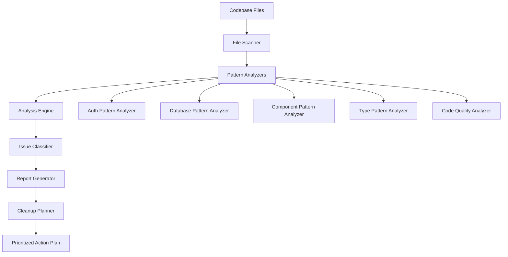

# Design Document: Codebase Cleanup and Refactoring

## Overview

This design outlines a systematic approach to analyzing and cleaning up a Next.js/Supabase codebase by identifying and eliminating technical debt patterns. The system will perform static code analysis to detect anti-patterns, generate comprehensive reports, and produce actionable cleanup plans.

The solution consists of three main phases:
1. **Analysis Phase**: Scan the codebase to identify patterns and anti-patterns
2. **Reporting Phase**: Generate structured reports with prioritized findings
3. **Planning Phase**: Create actionable cleanup tasks with dependency ordering

The design emphasizes automation, accuracy, and actionable insights to enable systematic refactoring with minimal risk.

## Architecture

### High-Level Architecture



### Component Responsibilities

1. **File Scanner**: Traverses directory structure and identifies files for analysis
2. **Pattern Analyzers**: Specialized analyzers for different code patterns (auth, database, components, etc.)
3. **Analysis Engine**: Coordinates pattern analyzers and aggregates findings
4. **Issue Classifier**: Categorizes and prioritizes identified issues
5. **Report Generator**: Produces structured analysis reports
6. **Cleanup Planner**: Generates ordered cleanup tasks with dependency management

### Technology Stack

- **Language**: TypeScript (for type safety and AST manipulation)
- **AST Parsing**: TypeScript Compiler API (`ts-morph` or `@typescript-eslint/parser`)
- **File System**: Node.js `fs` and `path` modules
- **Pattern Matching**: Regular expressions and AST traversal
- **Report Format**: Markdown with structured data (JSON for programmatic access)

## Components and Interfaces

### 1. File Scanner

**Purpose**: Discover and filter files for analysis

**Interface**:
```typescript
interface FileScanner {
  scanDirectory(rootPath: string, options: ScanOptions): Promise<FileInfo[]>
  filterByPattern(files: FileInfo[], patterns: string[]): FileInfo[]
  excludeByPattern(files: FileInfo[], patterns: string[]): FileInfo[]
}

interface ScanOptions {
  includePatterns: string[]  // e.g., ["**/*.ts", "**/*.tsx"]
  excludePatterns: string[]  // e.g., ["**/node_modules/**", "**/.next/**"]
  maxDepth?: number
}

interface FileInfo {
  path: string
  relativePath: string
  extension: string
  size: number
  category: FileCategory  // 'component' | 'api-route' | 'service' | 'type' | 'util'
}
```

**Key Behaviors**:
- Recursively traverse directories starting from project root
- Apply include/exclude patterns to filter files
- Categorize files based on path and naming conventions
- Handle symbolic links and circular references safely

### 2. Pattern Analyzer (Abstract Base)

**Purpose**: Define common interface for all pattern analyzers

**Interface**:
```typescript
interface PatternAnalyzer {
  name: string
  analyze(file: FileInfo, ast: SourceFile): Promise<Issue[]>
  getSupportedFileTypes(): FileCategory[]
}

interface Issue {
  id: string
  type: IssueType
  severity: Severity  // 'critical' | 'high' | 'medium' | 'low'
  category: IssueCategory
  file: string
  location: CodeLocation
  description: string
  codeSnippet: string
  recommendation: string
  estimatedEffort: EffortLevel  // 'trivial' | 'small' | 'medium' | 'large'
  tags: string[]
}

interface CodeLocation {
  startLine: number
  endLine: number
  startColumn: number
  endColumn: number
}

type IssueType = 
  | 'backward-compatibility'
  | 'legacy-code'
  | 'unnecessary-adapter'
  | 'confusing-logic'
  | 'code-duplication'
  | 'inconsistent-pattern'
  | 'poor-naming'
  | 'missing-error-handling'
  | 'type-safety'
  | 'architectural'

type IssueCategory =
  | 'authentication'
  | 'database'
  | 'api-routes'
  | 'components'
  | 'services'
  | 'types'
  | 'middleware'
  | 'error-handling'
  | 'general'
```

### 3. Specialized Pattern Analyzers

#### AuthPatternAnalyzer

**Purpose**: Analyze authentication and authorization patterns

**Key Detection Logic**:
- Identify multiple auth client instantiation patterns
- Detect inconsistent permission checking (e.g., some routes check roles, others check permissions)
- Find duplicate auth middleware implementations
- Identify legacy session handling code
- Detect unnecessary auth wrapper functions

**Patterns to Detect**:
```typescript
// Pattern: Inconsistent auth client usage
// Bad: Multiple ways to get auth client
const client1 = createClient()
const client2 = getSupabaseClient()
const client3 = await getAuthClient()

// Pattern: Unnecessary auth adapter
// Bad: Simple pass-through wrapper
function checkAuth(userId: string) {
  return supabase.auth.getUser(userId)  // Just wrapping, no value added
}

// Pattern: Duplicate middleware
// Bad: Same auth check logic in multiple files
```

#### DatabasePatternAnalyzer

**Purpose**: Analyze database access patterns and consistency

**Key Detection Logic**:
- Identify all Supabase client instantiation patterns
- Detect inconsistent error handling in database operations
- Find unnecessary database client wrappers
- Identify type mismatches between Supabase types and manual types
- Detect direct database access bypassing service layer

**Patterns to Detect**:
```typescript
// Pattern: Inconsistent client instantiation
// Bad: Different patterns across files
const supabase = createClient()  // File A
const db = getSupabaseClient()   // File B
const client = await initDB()    // File C

// Pattern: Inconsistent error handling
// Bad: Some catch errors, some don't
const { data, error } = await supabase.from('users').select()
if (error) throw error  // File A

const result = await supabase.from('users').select()  // File B - no error check

// Pattern: Unnecessary adapter
// Bad: Wrapper adds no value
async function getUser(id: string) {
  return supabase.from('users').select().eq('id', id).single()
}
```

#### ComponentPatternAnalyzer

**Purpose**: Analyze React component structure and patterns

**Key Detection Logic**:
- Identify components with business logic that should be in services
- Detect excessive prop drilling (more than 3 levels)
- Find duplicate component logic
- Identify inconsistent component composition patterns
- Detect components mixing concerns (UI + data fetching + business logic)

**Patterns to Detect**:
```typescript
// Pattern: Business logic in component
// Bad: Complex business rules in component
function UserProfile() {
  const calculateDiscount = (user) => {
    // 50 lines of business logic
  }
  // Should be in service layer
}

// Pattern: Prop drilling
// Bad: Props passed through multiple levels
<Parent data={data}>
  <Child data={data}>
    <GrandChild data={data}>
      <GreatGrandChild data={data} />  // 4 levels deep
    </GrandChild>
  </Child>
</Parent>

// Pattern: Duplicate logic
// Bad: Same validation in multiple components
```

#### TypePatternAnalyzer

**Purpose**: Analyze TypeScript type definitions and usage

**Key Detection Logic**:
- Identify duplicate type definitions
- Detect excessive use of `any` type
- Find type assertions that could be avoided
- Identify mismatches between Supabase generated types and manual types
- Detect inconsistent type naming conventions

**Patterns to Detect**:
```typescript
// Pattern: Duplicate types
// Bad: Same entity defined in multiple files
type User = { id: string; name: string }  // File A
interface User { id: string; name: string }  // File B

// Pattern: Excessive any usage
// Bad: Using any instead of proper types
function processData(data: any): any {
  return data.map((item: any) => item.value)
}

// Pattern: Type mismatch
// Bad: Manual type doesn't match Supabase generated type
type User = { id: string }  // Manual
type DbUser = Database['public']['Tables']['users']['Row']  // Generated, has more fields
```

#### CodeQualityAnalyzer

**Purpose**: Analyze general code quality issues

**Key Detection Logic**:
- Detect code duplication using AST similarity
- Identify confusing logic (deeply nested conditionals, complex boolean expressions)
- Find poor naming (single letter variables, unclear function names)
- Detect commented-out code
- Identify unused imports and exports

**Patterns to Detect**:
```typescript
// Pattern: Confusing logic
// Bad: Deeply nested and complex
if (user) {
  if (user.role) {
    if (user.role === 'admin' || user.role === 'moderator') {
      if (user.permissions) {
        if (user.permissions.includes('delete')) {
          // Action
        }
      }
    }
  }
}

// Pattern: Poor naming
// Bad: Unclear variable names
const d = new Date()
const x = users.filter(u => u.a)
function proc(d: any) { }

// Pattern: Commented code
// Bad: Old code left in comments
// function oldImplementation() {
//   // 50 lines of commented code
// }
```

### 4. Analysis Engine

**Purpose**: Coordinate analysis across all files and analyzers

**Interface**:
```typescript
interface AnalysisEngine {
  analyze(files: FileInfo[], analyzers: PatternAnalyzer[]): Promise<AnalysisResult>
  parseFile(file: FileInfo): Promise<SourceFile>
  aggregateIssues(issues: Issue[]): IssueCollection
}

interface AnalysisResult {
  totalFiles: number
  analyzedFiles: number
  totalIssues: number
  issuesByType: Map<IssueType, Issue[]>
  issuesByCategory: Map<IssueCategory, Issue[]>
  issuesBySeverity: Map<Severity, Issue[]>
  analysisTimestamp: Date
  analysisDuration: number
}

interface IssueCollection {
  issues: Issue[]
  groupedByFile: Map<string, Issue[]>
  groupedByType: Map<IssueType, Issue[]>
  groupedByCategory: Map<IssueCategory, Issue[]>
}
```

**Key Behaviors**:
- Parse each file into AST using TypeScript Compiler API
- Run applicable analyzers based on file category
- Aggregate issues from all analyzers
- Handle parsing errors gracefully
- Track analysis progress and performance

### 5. Issue Classifier

**Purpose**: Categorize, prioritize, and enrich issues

**Interface**:
```typescript
interface IssueClassifier {
  classify(issues: Issue[]): ClassifiedIssues
  prioritize(issues: Issue[]): Issue[]
  detectPatterns(issues: Issue[]): IssuePattern[]
}

interface ClassifiedIssues {
  critical: Issue[]
  high: Issue[]
  medium: Issue[]
  low: Issue[]
  patterns: IssuePattern[]
}

interface IssuePattern {
  patternId: string
  patternName: string
  description: string
  occurrences: number
  affectedFiles: string[]
  relatedIssues: Issue[]
  recommendedAction: string
}
```

**Classification Rules**:
- **Critical**: Security issues, data loss risks, broken functionality
- **High**: Architectural problems, major inconsistencies, significant technical debt
- **Medium**: Code quality issues, minor inconsistencies, maintainability concerns
- **Low**: Style issues, minor improvements, nice-to-have refactorings

**Pattern Detection**:
- Group similar issues across files (e.g., "Inconsistent auth client usage in 15 files")
- Identify systemic problems (e.g., "No error handling in 80% of API routes")
- Detect architectural anti-patterns (e.g., "Circular dependencies between services")

### 6. Report Generator

**Purpose**: Generate human-readable and machine-readable reports

**Interface**:
```typescript
interface ReportGenerator {
  generateMarkdownReport(result: AnalysisResult, classified: ClassifiedIssues): string
  generateJsonReport(result: AnalysisResult, classified: ClassifiedIssues): ReportData
  generateSummary(result: AnalysisResult): ReportSummary
}

interface ReportData {
  summary: ReportSummary
  issues: Issue[]
  patterns: IssuePattern[]
  recommendations: Recommendation[]
}

interface ReportSummary {
  totalIssues: number
  criticalIssues: number
  highIssues: number
  mediumIssues: number
  lowIssues: number
  topPatterns: IssuePattern[]
  mostAffectedFiles: string[]
  estimatedCleanupEffort: string
}

interface Recommendation {
  priority: number
  title: string
  description: string
  affectedIssues: string[]
  estimatedImpact: string
  estimatedEffort: string
}
```

**Report Structure** (Markdown):
```markdown
# Codebase Cleanup Analysis Report

## Executive Summary
- Total Issues: X
- Critical: X | High: X | Medium: X | Low: X
- Estimated Cleanup Effort: X days

## Top Patterns Detected
1. Pattern Name (X occurrences)
   - Description
   - Affected files
   - Recommended action

## Issues by Category

### Authentication (X issues)
#### Critical Issues
- Issue description
  - File: path/to/file.ts:123
  - Code snippet
  - Recommendation

### Database (X issues)
...

## Recommendations
1. High Priority: Action
   - Impact: ...
   - Effort: ...
   - Affected issues: ...
```

### 7. Cleanup Planner

**Purpose**: Generate actionable cleanup tasks with dependency ordering

**Interface**:
```typescript
interface CleanupPlanner {
  generatePlan(classified: ClassifiedIssues, patterns: IssuePattern[]): CleanupPlan
  orderTasks(tasks: CleanupTask[]): CleanupTask[]
  detectDependencies(tasks: CleanupTask[]): TaskDependency[]
}

interface CleanupPlan {
  tasks: CleanupTask[]
  phases: CleanupPhase[]
  estimatedDuration: string
  riskAssessment: RiskAssessment
}

interface CleanupTask {
  id: string
  title: string
  description: string
  category: IssueCategory
  relatedIssues: string[]
  dependencies: string[]  // Task IDs that must be completed first
  estimatedEffort: EffortLevel
  riskLevel: RiskLevel
  requiresTests: boolean
  actionSteps: string[]
}

interface CleanupPhase {
  phaseNumber: number
  phaseName: string
  tasks: CleanupTask[]
  description: string
}

interface TaskDependency {
  taskId: string
  dependsOn: string[]
  reason: string
}

type RiskLevel = 'low' | 'medium' | 'high' | 'critical'

interface RiskAssessment {
  overallRisk: RiskLevel
  highRiskTasks: CleanupTask[]
  mitigationStrategies: string[]
}
```

**Task Ordering Strategy**:
1. **Phase 1 - Foundation**: Type definitions, interfaces, core utilities
2. **Phase 2 - Infrastructure**: Database clients, auth setup, middleware
3. **Phase 3 - Services**: Service layer refactoring
4. **Phase 4 - API Routes**: API route cleanup
5. **Phase 5 - Components**: Component refactoring
6. **Phase 6 - Polish**: Naming, formatting, final cleanup

**Dependency Detection**:
- Tasks that modify shared utilities must come before tasks that use them
- Type definition changes must come before code using those types
- Service layer changes must come before API route changes
- Infrastructure changes must come before application code changes

## Data Models

### File Information Model

```typescript
interface FileInfo {
  path: string              // Absolute path
  relativePath: string      // Relative to project root
  extension: string         // '.ts', '.tsx', etc.
  size: number             // File size in bytes
  category: FileCategory   // Categorization for analysis
  lastModified: Date       // File modification timestamp
}

type FileCategory = 
  | 'component'      // React components
  | 'api-route'      // Next.js API routes
  | 'service'        // Backend services
  | 'type'           // Type definition files
  | 'util'           // Utility functions
  | 'middleware'     // Middleware files
  | 'config'         // Configuration files
  | 'test'           // Test files
  | 'other'          // Uncategorized
```

### Issue Model

```typescript
interface Issue {
  id: string                    // Unique identifier (UUID)
  type: IssueType              // Type of issue
  severity: Severity           // Severity level
  category: IssueCategory      // Category for grouping
  file: string                 // File path
  location: CodeLocation       // Precise location in file
  description: string          // Human-readable description
  codeSnippet: string         // Relevant code excerpt
  recommendation: string       // Suggested fix
  estimatedEffort: EffortLevel // Effort to fix
  tags: string[]              // Additional tags for filtering
  detectedBy: string          // Analyzer that detected it
  detectedAt: Date            // Detection timestamp
  relatedIssues: string[]     // IDs of related issues
}

interface CodeLocation {
  startLine: number
  endLine: number
  startColumn: number
  endColumn: number
}

type Severity = 'critical' | 'high' | 'medium' | 'low'
type EffortLevel = 'trivial' | 'small' | 'medium' | 'large'
```

### Pattern Model

```typescript
interface IssuePattern {
  patternId: string           // Unique pattern identifier
  patternName: string         // Human-readable name
  description: string         // Pattern description
  occurrences: number         // Number of times detected
  affectedFiles: string[]     // Files where pattern appears
  relatedIssues: Issue[]      // Issues that match this pattern
  recommendedAction: string   // How to address the pattern
  priority: number            // Priority for addressing (1-10)
  category: IssueCategory     // Category for grouping
}
```

### Cleanup Task Model

```typescript
interface CleanupTask {
  id: string                  // Unique task identifier
  title: string               // Short task title
  description: string         // Detailed description
  category: IssueCategory     // Category for grouping
  relatedIssues: string[]     // Issue IDs this task addresses
  dependencies: string[]      // Task IDs that must complete first
  estimatedEffort: EffortLevel // Effort estimate
  riskLevel: RiskLevel        // Risk of making this change
  requiresTests: boolean      // Whether tests needed before change
  actionSteps: string[]       // Step-by-step instructions
  affectedFiles: string[]     // Files that will be modified
  phase: number               // Which phase this belongs to
}
```

## Correctness Properties

*A property is a characteristic or behavior that should hold true across all valid executions of a system—essentially, a formal statement about what the system should do. Properties serve as the bridge between human-readable specifications and machine-verifiable correctness guarantees.*


### Property 1: Complete File Discovery

*For any* directory structure with TypeScript/JavaScript files, scanning should discover all files matching the specified patterns (components, API routes, services, types, middleware) without missing any files.

**Validates: Requirements 1.1, 2.1, 3.1, 4.1, 5.1, 6.1, 7.1, 9.1, 15.1**

### Property 2: Backward Compatibility Pattern Detection

*For any* codebase containing backward compatibility code (version checks, deprecated API usage, compatibility shims, polyfills, migration code, dual implementations), the analyzer should detect and flag all such patterns.

**Validates: Requirements 1.2, 13.1, 13.2, 13.3, 13.4**

### Property 3: Legacy Code Pattern Detection

*For any* codebase containing legacy code patterns (unused exports, commented-out code, outdated implementations), the analyzer should detect and flag all such patterns.

**Validates: Requirements 1.3**

### Property 4: Unnecessary Adapter Detection

*For any* codebase containing adapter patterns (single-method wrappers, pass-through functions, redundant abstraction layers), the analyzer should identify wrappers that provide no meaningful value beyond simple delegation.

**Validates: Requirements 1.4, 2.5, 3.3, 5.5, 14.1, 14.2, 14.4**

### Property 5: Confusing Logic Detection

*For any* code containing confusing logic patterns (deeply nested conditionals beyond 3 levels, complex boolean expressions, unclear control flow), the analyzer should detect and flag such patterns.

**Validates: Requirements 1.5**

### Property 6: Code Quality Issue Detection

*For any* code containing quality issues (code duplication, inconsistent naming, poor separation of concerns), the analyzer should detect and flag such issues.

**Validates: Requirements 1.6**

### Property 7: Authentication Pattern Inconsistency Detection

*For any* codebase with multiple authentication implementations, the analyzer should detect inconsistent permission checking approaches, redundant middleware, and conflicting session management patterns.

**Validates: Requirements 2.2, 2.3, 2.4**

### Property 8: Database Access Inconsistency Detection

*For any* codebase with database operations, the analyzer should detect inconsistent client instantiation patterns, inconsistent error handling in database operations, inconsistent type usage for database entities, and code bypassing established patterns.

**Validates: Requirements 3.2, 3.4, 3.5**

### Property 9: API Route Pattern Inconsistency Detection

*For any* codebase with API routes, the analyzer should detect inconsistent request validation patterns, missing or inconsistent error handling, inconsistent response formats, and duplicate middleware usage.

**Validates: Requirements 4.2, 4.3, 4.4, 4.5**

### Property 10: Circular Dependency Detection

*For any* service layer with import relationships, the analyzer should detect circular dependencies between services.

**Validates: Requirements 5.3**

### Property 11: Service Pattern Inconsistency Detection

*For any* codebase with service modules, the analyzer should detect inconsistent service initialization and configuration patterns.

**Validates: Requirements 5.4**

### Property 12: Component Prop Drilling Detection

*For any* React component tree, the analyzer should detect prop drilling exceeding 3 levels deep.

**Validates: Requirements 6.3**

### Property 13: Component Pattern Inconsistency Detection

*For any* codebase with React components, the analyzer should detect inconsistent component composition patterns.

**Validates: Requirements 6.4**

### Property 14: Code Duplication Detection

*For any* codebase, the analyzer should detect duplicate function implementations, similar code blocks differing only in minor details, duplicate constants, duplicate validation logic, and duplicate component logic across files.

**Validates: Requirements 6.5, 8.1, 8.2, 8.4, 8.5, 15.2**

### Property 15: Type Definition Inconsistency Detection

*For any* codebase with TypeScript types, the analyzer should detect inconsistent type definitions for the same entities, duplicate type definitions across files, and mismatches between Supabase generated types and manual definitions.

**Validates: Requirements 7.2, 7.4, 7.5**

### Property 16: Type Safety Issue Detection

*For any* TypeScript codebase, the analyzer should detect excessive use of 'any' type or type assertions.

**Validates: Requirements 7.3**

### Property 17: Error Handling Inconsistency Detection

*For any* codebase with error handling, the analyzer should detect inconsistent error response formats, missing or inconsistent error logging, missing error recovery mechanisms, and opportunities to use typed error classes.

**Validates: Requirements 9.2, 9.3, 9.4, 9.5**

### Property 18: Naming Convention Inconsistency Detection

*For any* codebase, the analyzer should detect inconsistent naming conventions for files, functions, and variables, inconsistent file organization patterns, inconsistent export patterns, and unclear or misleading names.

**Validates: Requirements 10.1, 10.2, 10.3, 10.4**

### Property 19: Report Completeness

*For any* set of detected issues, the generated report should include all issues categorized by type, with each issue containing file path, line numbers, code snippet, and actionable recommendation.

**Validates: Requirements 11.1, 11.2, 11.5**

### Property 20: Report Prioritization

*For any* set of detected issues, the generated report should order issues by severity (critical, high, medium, low) and group related issues by pattern type.

**Validates: Requirements 11.3, 11.4**

### Property 21: Cleanup Task Generation

*For any* set of detected issues, the cleanup planner should generate specific refactoring tasks with complexity estimates, risk levels, and test requirements.

**Validates: Requirements 12.1, 12.4, 12.5**

### Property 22: Task Dependency Detection

*For any* set of cleanup tasks, the planner should identify dependencies between tasks and recommend an execution order that respects those dependencies.

**Validates: Requirements 12.2, 12.3**

### Property 23: Middleware Pattern Inconsistency Detection

*For any* codebase with middleware, the analyzer should detect inconsistent middleware ordering or application patterns and identify opportunities to consolidate similar middleware.

**Validates: Requirements 15.3, 15.5**

## Error Handling

### Error Categories

1. **File System Errors**
   - File not found
   - Permission denied
   - Invalid path
   - **Handling**: Log error, skip file, continue analysis

2. **Parsing Errors**
   - Invalid TypeScript/JavaScript syntax
   - Corrupted files
   - Unsupported language features
   - **Handling**: Log error with file path, mark file as unparseable, continue analysis

3. **Analysis Errors**
   - Analyzer crashes on specific code pattern
   - Out of memory on large files
   - Timeout on complex analysis
   - **Handling**: Log error, skip problematic analyzer for that file, continue with other analyzers

4. **Configuration Errors**
   - Invalid scan options
   - Missing required configuration
   - Invalid analyzer configuration
   - **Handling**: Fail fast with clear error message, do not proceed with analysis

### Error Recovery Strategies

1. **Graceful Degradation**: If one analyzer fails, continue with others
2. **Partial Results**: Return partial analysis results even if some files fail
3. **Error Reporting**: Include error summary in analysis report
4. **Retry Logic**: Retry file operations with exponential backoff
5. **Resource Limits**: Set memory and time limits per file to prevent hangs

### Error Logging

All errors should be logged with:
- Timestamp
- Error type and message
- File path (if applicable)
- Stack trace (for debugging)
- Context (what operation was being performed)

## Testing Strategy

### Dual Testing Approach

This system requires both unit tests and property-based tests for comprehensive coverage:

**Unit Tests** focus on:
- Specific examples of each anti-pattern
- Edge cases (empty files, single-line files, very large files)
- Error conditions (invalid syntax, missing files)
- Integration between components
- Report formatting and structure

**Property-Based Tests** focus on:
- Universal properties that hold across all codebases
- Pattern detection accuracy across randomized code samples
- Completeness of file discovery across randomized directory structures
- Consistency of analysis results across multiple runs

### Property-Based Testing Configuration

**Library**: Use `fast-check` for TypeScript property-based testing

**Configuration**:
- Minimum 100 iterations per property test
- Each test tagged with: `Feature: codebase-cleanup, Property {N}: {property_text}`
- Seed-based randomization for reproducibility
- Shrinking enabled to find minimal failing cases

**Test Data Generation**:
- Generate random directory structures with known patterns
- Generate code samples with specific anti-patterns
- Generate valid and invalid TypeScript/JavaScript code
- Generate edge cases (empty files, very large files, deeply nested structures)

### Unit Testing Strategy

**Test Organization**:
```
tests/
  unit/
    file-scanner.test.ts
    pattern-analyzers/
      auth-pattern-analyzer.test.ts
      database-pattern-analyzer.test.ts
      component-pattern-analyzer.test.ts
      type-pattern-analyzer.test.ts
      code-quality-analyzer.test.ts
    analysis-engine.test.ts
    issue-classifier.test.ts
    report-generator.test.ts
    cleanup-planner.test.ts
  property/
    file-discovery.property.test.ts
    pattern-detection.property.test.ts
    report-generation.property.test.ts
    task-planning.property.test.ts
  integration/
    end-to-end.test.ts
```

**Key Test Scenarios**:

1. **File Scanner Tests**
   - Discovers all files in nested directories
   - Respects include/exclude patterns
   - Handles symbolic links safely
   - Categorizes files correctly

2. **Pattern Analyzer Tests**
   - Detects known anti-patterns accurately
   - Provides correct line numbers and code snippets
   - Generates actionable recommendations
   - Handles edge cases (empty files, comments, etc.)

3. **Analysis Engine Tests**
   - Coordinates multiple analyzers correctly
   - Aggregates issues from all analyzers
   - Handles parsing errors gracefully
   - Tracks progress accurately

4. **Issue Classifier Tests**
   - Prioritizes issues correctly by severity
   - Groups related issues into patterns
   - Detects systemic problems across files

5. **Report Generator Tests**
   - Generates well-formatted Markdown reports
   - Includes all required information
   - Orders issues by priority
   - Provides clear recommendations

6. **Cleanup Planner Tests**
   - Generates tasks for all issues
   - Detects dependencies correctly
   - Orders tasks to minimize risk
   - Estimates effort accurately

### Integration Testing

**End-to-End Test**:
1. Create a test codebase with known anti-patterns
2. Run full analysis
3. Verify all expected issues are detected
4. Verify report is generated correctly
5. Verify cleanup plan is generated correctly
6. Verify task dependencies are correct

**Test Codebase Structure**:
```
test-codebase/
  app/
    api/
      route-with-good-patterns.ts
      route-with-bad-patterns.ts
      route-with-missing-error-handling.ts
    components/
      good-component.tsx
      component-with-prop-drilling.tsx
      component-with-duplicate-logic.tsx
  backend/
    auth/
      inconsistent-auth-1.ts
      inconsistent-auth-2.ts
    services/
      service-with-circular-dep-1.ts
      service-with-circular-dep-2.ts
      service-with-unnecessary-adapter.ts
    database/
      inconsistent-db-access-1.ts
      inconsistent-db-access-2.ts
```

### Test Coverage Goals

- **Line Coverage**: Minimum 80%
- **Branch Coverage**: Minimum 75%
- **Function Coverage**: Minimum 85%
- **Pattern Detection Accuracy**: Minimum 95% (measured against known test cases)

### Continuous Testing

- Run unit tests on every commit
- Run property tests on every pull request
- Run integration tests before release
- Monitor test execution time and optimize slow tests
