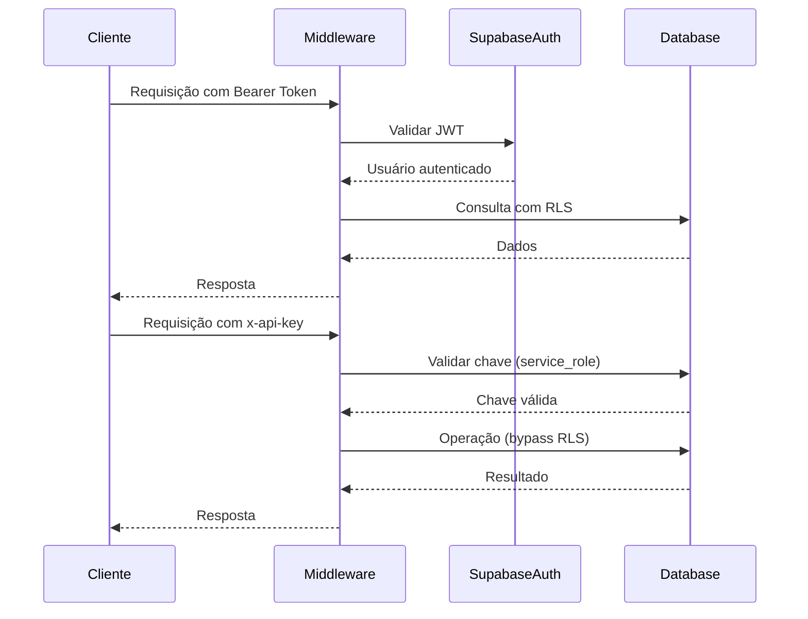
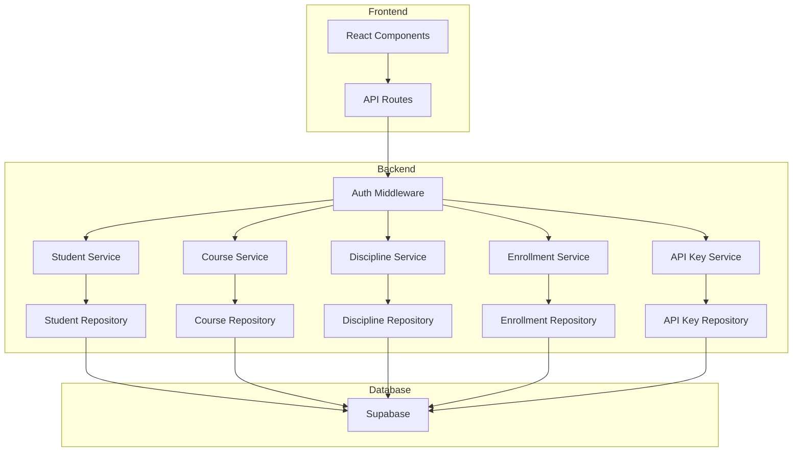
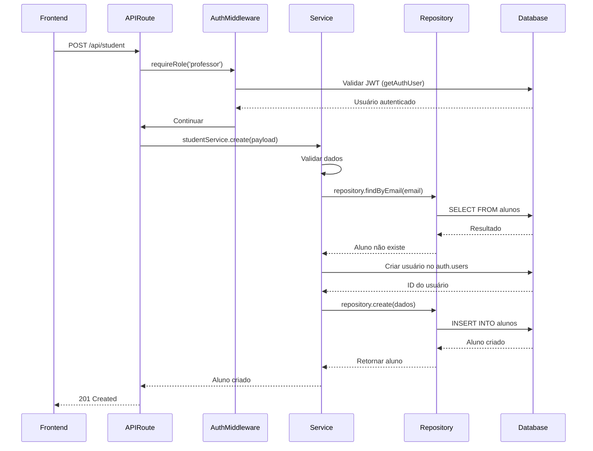

# Arquitetura Backend

<cite>
**Arquivos Referenciados neste Documento**  
- [auth.service.ts](file://backend/auth/auth.service.ts)
- [middleware.ts](file://backend/auth/middleware.ts)
- [types.ts](file://backend/auth/types.ts)
- [database.ts](file://backend/clients/database.ts)
- [database-auth.ts](file://backend/clients/database-auth.ts)
- [student.service.ts](file://backend/services/student/student.service.ts)
- [student.repository.ts](file://backend/services/student/student.repository.ts)
- [course.service.ts](file://backend/services/course/course.service.ts)
- [discipline.service.ts](file://backend/services/discipline/discipline.service.ts)
- [enrollment.service.ts](file://backend/services/enrollment/enrollment.service.ts)
- [api-key.service.ts](file://backend/services/api-key/api-key.service.ts)
- [api-key.repository.ts](file://backend/services/api-key/api-key.repository.ts)
- [api-key.types.ts](file://backend/services/api-key/api-key.types.ts)
- [route.ts](file://app/api/student/route.ts)
- [route.ts](file://app/api/course/route.ts)
- [route.ts](file://app/api/discipline/route.ts)
- [route.ts](file://app/api/enrollment/route.ts)
- [route.ts](file://app/api/auth/signin/route.ts)
- [route.ts](file://app/api/api-key/route.ts)
</cite>

## Sumário
1. [Introdução](#introdução)
2. [Estrutura Modular de Serviços](#estrutura-modular-de-serviços)
3. [Sistema de Autenticação com JWT e API Keys](#sistema-de-autenticação-com-jwt-e-api-keys)
4. [Clientes de Banco de Dados Supabase](#clientes-de-banco-de-dados-supabase)
5. [Integração com Frontend via API Routes](#integração-com-frontend-via-api-routes)
6. [Segurança com Row Level Security (RLS)](#segurança-com-row-level-security-rls)
7. [Padrões de Tratamento de Erros, Logging e Validação](#padrões-de-tratamento-de-erros-logging-e-validação)
8. [Exemplo de Chamada de Serviço Backend](#exemplo-de-chamada-de-serviço-backend)
9. [Diagramas de Componentes e Fluxo de Requisição](#diagramas-de-componentes-e-fluxo-de-requisição)
10. [Considerações de Segurança, Escalabilidade e Testes](#considerações-de-segurança-escalabilidade-e-testes)

## Introdução
O projeto Área do Aluno possui uma camada backend altamente modular, projetada para escalar e manter clareza na separação de responsabilidades. A arquitetura é baseada em serviços independentes como `student`, `course`, `discipline`, `enrollment`, entre outros, cada um seguindo um padrão consistente de organização com tipos, serviço, repositório e tratamento de erros. Este documento detalha a estrutura, segurança, integração e padrões de desenvolvimento utilizados, fornecendo uma visão completa da camada de backend.

## Estrutura Modular de Serviços
Cada serviço backend (por exemplo, `student`, `course`, `discipline`) é organizado em um diretório com a seguinte estrutura:
- `*.service.ts`: Contém a lógica de negócio e coordenação entre repositórios.
- `*.repository.ts`: Responsável pela interação direta com o banco de dados.
- `*.types.ts`: Define as interfaces e tipos TypeScript utilizados.
- `errors.ts`: Define erros personalizados para o domínio do serviço.
- `index.ts`: Exporta os componentes principais do serviço.

Essa modularização permite que cada serviço seja desenvolvido, testado e mantido de forma independente, facilitando a escalabilidade e a manutenção do sistema.

**Fontes da seção**
- [student.service.ts](file://backend/services/student/student.service.ts#L1-L433)
- [course.service.ts](file://backend/services/course/course.service.ts#L1-L299)
- [discipline.service.ts](file://backend/services/discipline/discipline.service.ts#L1-L111)
- [enrollment.service.ts](file://backend/services/enrollment/enrollment.service.ts#L1-L142)

## Sistema de Autenticação com JWT e API Keys
O sistema de autenticação é implementado no diretório `backend/auth/` e suporta dois métodos: JWT (para usuários) e API Keys (para integrações).

### JWT (JSON Web Tokens)
A autenticação baseada em JWT utiliza o Supabase Auth para gerenciar sessões de usuário. O fluxo inclui:
- Registro (`signup`): Cria um novo usuário no Supabase Auth.
- Login (`signin`): Valida credenciais e retorna um JWT.
- Refresh: Renova o token de acesso.
- Logout: Invalida a sessão.

O middleware de autenticação extrai o token do cabeçalho `Authorization` e valida o usuário no Supabase Auth.

### API Keys
API Keys são usadas para acesso programático à API. As chaves são armazenadas de forma segura com hash SHA-256 no banco de dados. O sistema valida:
- Se a chave está ativa.
- Se a chave não expirou.
- Atualiza o campo `last_used_at` em cada uso.

O middleware permite que requisições com API Key usem o `service_role` do Supabase, contornando o RLS para operações administrativas.



**Fontes do diagrama**
- [auth.service.ts](file://backend/auth/auth.service.ts#L4-L137)
- [middleware.ts](file://backend/auth/middleware.ts#L11-L85)
- [types.ts](file://backend/auth/types.ts#L1-L36)

**Fontes da seção**
- [auth.service.ts](file://backend/auth/auth.service.ts#L4-L137)
- [middleware.ts](file://backend/auth/middleware.ts#L11-L193)
- [types.ts](file://backend/auth/types.ts#L1-L36)

## Clientes de Banco de Dados Supabase
Os clientes de banco de dados estão localizados em `backend/clients/` e fornecem acesso ao Supabase com diferentes níveis de permissão:

### Cliente Normal (`database.ts`)
- Usa `SUPABASE_URL` e `SUPABASE_SECRET_KEY` ou `SUPABASE_ANON_KEY`.
- Respeita as políticas de Row Level Security (RLS).
- Utilizado para operações de usuário autenticado.

### Cliente com Service Role (`database-auth.ts`)
- Usa `SUPABASE_SERVICE_ROLE_KEY`.
- Contorna o RLS, permitindo operações administrativas.
- Utilizado para criar usuários via Admin API e operações com API Keys.

Ambos os clientes são implementados com cache para evitar múltiplas instâncias.

**Fontes da seção**
- [database.ts](file://backend/clients/database.ts#L1-L43)
- [database-auth.ts](file://backend/clients/database-auth.ts#L1-L68)

## Integração com Frontend via API Routes
As rotas da API estão definidas em `app/api/` e utilizam o Next.js App Router. Cada rota importa o serviço correspondente e aplica o middleware de autenticação.

Exemplo de rota para listar alunos:
```ts
// app/api/student/route.ts
import { NextRequest } from 'next/server';
import { requireRole } from '@/backend/auth/middleware';
import { studentService } from '@/backend/services/student';

export const GET = requireRole('professor')(async (req: NextRequest) => {
  const students = await studentService.list();
  return Response.json(students);
});
```

As rotas são protegidas por middleware que garante autenticação e autorização com base no papel do usuário.

**Fontes da seção**
- [route.ts](file://app/api/student/route.ts)
- [route.ts](file://app/api/course/route.ts)
- [route.ts](file://app/api/discipline/route.ts)
- [route.ts](file://app/api/enrollment/route.ts)

## Segurança com Row Level Security (RLS)
O Supabase implementa RLS em todas as tabelas, garantindo que usuários só acessem dados permitidos. As políticas são definidas no banco de dados e aplicadas automaticamente.

- Usuários com papel `aluno` só acessam seus próprios dados.
- Professores acessam dados de seus alunos e cursos.
- Superadmins têm acesso total.

O uso de API Keys permite contornar o RLS quando necessário, usando o `service_role` do Supabase.

**Fontes da seção**
- [middleware.ts](file://backend/auth/middleware.ts#L58-L65)
- [database-auth.ts](file://backend/clients/database-auth.ts#L58-L65)

## Padrões de Tratamento de Erros, Logging e Validação
Cada serviço implementa validação rigorosa de entrada e tratamento de erros personalizados.

### Validação
- Validação de campos (ex: CPF, email, comprimento).
- Verificação de unicidade (ex: email duplicado).
- Validação de relacionamentos (ex: curso existente).

### Tratamento de Erros
Erros personalizados são lançados com mensagens descritivas:
- `StudentConflictError`: Conflito de dados (email duplicado).
- `StudentNotFoundError`: Aluno não encontrado.
- `StudentValidationError`: Dados inválidos.

### Logging
O sistema utiliza `console.log` e `console.error` para registrar eventos de autenticação e erros, facilitando a depuração.

**Fontes da seção**
- [student.service.ts](file://backend/services/student/student.service.ts#L38-L225)
- [student.repository.ts](file://backend/services/student/student.repository.ts#L76-L188)
- [errors.ts](file://backend/services/student/errors.ts)

## Exemplo de Chamada de Serviço Backend
Abaixo está o fluxo de uma requisição HTTP para criar um aluno:

1. O frontend envia uma requisição POST para `/api/student`.
2. O middleware `requireRole('professor')` valida a autenticação.
3. O serviço `studentService.create()` é chamado.
4. O serviço valida os dados de entrada.
5. O repositório `studentRepository.create()` insere no banco.
6. A resposta é retornada em formato JSON.

```mermaid
flowchart TD
A[Frontend] --> B[API Route /api/student]
B --> C{Autenticado?}
C --> |Sim| D[Validar Papel]
D --> |Professor| E[Chamar studentService.create()]
E --> F[Validar Dados]
F --> G[Verificar Unicidade]
G --> H[Criar Usuário no Auth]
H --> I[Inserir no Banco]
I --> J[Retornar Aluno Criado]
J --> A
C --> |Não| K[401 Unauthorized]
D --> |Não| L[403 Forbidden]
F --> |Inválido| M[400 Bad Request]
```

**Fontes do diagrama**
- [route.ts](file://app/api/student/route.ts)
- [student.service.ts](file://backend/services/student/student.service.ts#L38-L132)
- [student.repository.ts](file://backend/services/student/student.repository.ts#L157-L193)

**Fontes da seção**
- [route.ts](file://app/api/student/route.ts)
- [student.service.ts](file://backend/services/student/student.service.ts#L38-L132)
- [student.repository.ts](file://backend/services/student/student.repository.ts#L157-L193)

## Diagramas de Componentes e Fluxo de Requisição
### Diagrama de Componentes


**Fontes do diagrama**
- [middleware.ts](file://backend/auth/middleware.ts)
- [student.service.ts](file://backend/services/student/student.service.ts)
- [course.service.ts](file://backend/services/course/course.service.ts)
- [discipline.service.ts](file://backend/services/discipline/discipline.service.ts)
- [enrollment.service.ts](file://backend/services/enrollment/enrollment.service.ts)
- [api-key.service.ts](file://backend/services/api-key/api-key.service.ts)

### Fluxo de Requisição com Autenticação


**Fontes do diagrama**
- [auth.service.ts](file://backend/auth/auth.service.ts)
- [middleware.ts](file://backend/auth/middleware.ts)
- [student.service.ts](file://backend/services/student/student.service.ts)
- [student.repository.ts](file://backend/services/student/student.repository.ts)

## Considerações de Segurança, Escalabilidade e Testes
### Segurança
- **JWT**: Tokens assinados e validados pelo Supabase.
- **API Keys**: Armazenadas com hash, expiração e controle de ativação.
- **RLS**: Políticas no banco garantem acesso baseado em papel.
- **Validação**: Todos os dados de entrada são validados.

### Escalabilidade
- **Cache**: Clientes de banco de dados são cacheados.
- **Modularidade**: Serviços independentes permitem escala horizontal.
- **Supabase**: Banco de dados escalável com suporte a real-time.

### Testes
Embora não cobertos diretamente no código analisado, a arquitetura modular facilita a criação de testes unitários e de integração para cada serviço, repositório e middleware.

**Fontes da seção**
- [auth.service.ts](file://backend/auth/auth.service.ts)
- [middleware.ts](file://backend/auth/middleware.ts)
- [database.ts](file://backend/clients/database.ts)
- [student.service.ts](file://backend/services/student/student.service.ts)
- [student.repository.ts](file://backend/services/student/student.repository.ts)