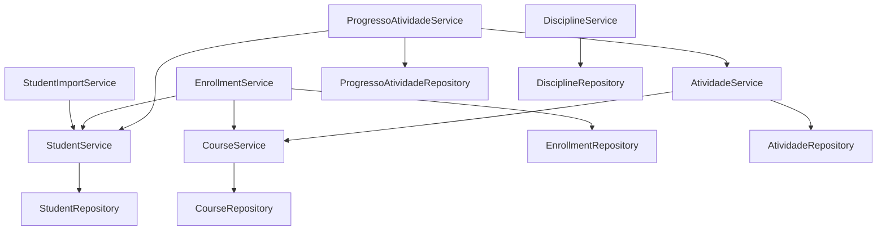
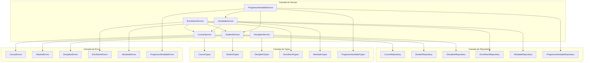

# Arquitetura Modular de Serviços

<cite>
**Arquivos Referenciados neste Documento**  
- [backend/services/course/course.service.ts](file://backend/services/course/course.service.ts)
- [backend/services/course/course.types.ts](file://backend/services/course/course.types.ts)
- [backend/services/course/course.repository.ts](file://backend/services/course/course.repository.ts)
- [backend/services/course/errors.ts](file://backend/services/course/errors.ts)
- [backend/services/student/student.service.ts](file://backend/services/student/student.service.ts)
- [backend/services/student/student.types.ts](file://backend/services/student/student.types.ts)
- [backend/services/student/student.repository.ts](file://backend/services/student/student.repository.ts)
- [backend/services/student/errors.ts](file://backend/services/student/errors.ts)
- [backend/services/discipline/discipline.service.ts](file://backend/services/discipline/discipline.service.ts)
- [backend/services/discipline/discipline.types.ts](file://backend/services/discipline/discipline.types.ts)
- [backend/services/discipline/discipline.repository.ts](file://backend/services/discipline/discipline.repository.ts)
- [backend/services/discipline/errors.ts](file://backend/services/discipline/errors.ts)
- [backend/services/enrollment/enrollment.service.ts](file://backend/services/enrollment/enrollment.service.ts)
- [backend/services/enrollment/enrollment.types.ts](file://backend/services/enrollment/enrollment.types.ts)
- [backend/services/enrollment/enrollment.repository.ts](file://backend/services/enrollment/enrollment.repository.ts)
- [backend/services/enrollment/errors.ts](file://backend/services/enrollment/errors.ts)
- [backend/services/atividade/atividade.service.ts](file://backend/services/atividade/atividade.service.ts)
- [backend/services/atividade/atividade.types.ts](file://backend/services/atividade/atividade.types.ts)
- [backend/services/atividade/atividade.repository.ts](file://backend/services/atividade/atividade.repository.ts)
- [backend/services/atividade/errors.ts](file://backend/services/atividade/errors.ts)
- [backend/services/progresso-atividade/progresso-atividade.service.ts](file://backend/services/progresso-atividade/progresso-atividade.service.ts)
- [backend/services/progresso-atividade/progresso-atividade.types.ts](file://backend/services/progresso-atividade/progresso-atividade.types.ts)
- [backend/services/progresso-atividade/progresso-atividade.repository.ts](file://backend/services/progresso-atividade/progresso-atividade.repository.ts)
- [backend/services/progresso-atividade/progresso-atividade.errors.ts](file://backend/services/progresso-atividade/progresso-atividade.errors.ts)
- [backend/services/course/index.ts](file://backend/services/course/index.ts)
- [backend/services/student/index.ts](file://backend/services/student/index.ts)
- [backend/services/discipline/index.ts](file://backend/services/discipline/index.ts)
- [backend/services/enrollment/index.ts](file://backend/services/enrollment/index.ts)
- [backend/services/atividade/index.ts](file://backend/services/atividade/index.ts)
- [backend/services/progresso-atividade/index.ts](file://backend/services/progresso-atividade/index.ts)
</cite>

## Sumário
1. [Introdução](#introdução)
2. [Estrutura Modular de Serviços](#estrutura-modular-de-serviços)
3. [Camadas de um Serviço](#camadas-de-um-serviço)
4. [Comunicação entre Serviços](#comunicação-entre-serviços)
5. [Comunicação com o Frontend](#comunicação-com-o-frontend)
6. [Exemplo Prático: Criação de um Novo Serviço](#exemplo-prático-criação-de-um-novo-serviço)
7. [Diagrama de Componentes](#diagrama-de-componentes)
8. [Decisões de Design](#decisões-de-design)
9. [Conclusão](#conclusão)

## Introdução

O projeto Área do Aluno adota uma arquitetura modular no backend, onde cada funcionalidade principal é encapsulada em um serviço autocontido. Essa abordagem promove baixo acoplamento, alta coesão e facilita a manutenção e escalabilidade do sistema. Este documento detalha a estrutura arquitetural, as responsabilidades de cada camada, os padrões de comunicação e as decisões de design que sustentam essa arquitetura.

**Arquivos Referenciados neste Documento**  
- [backend/services/course/index.ts](file://backend/services/course/index.ts)
- [backend/services/student/index.ts](file://backend/services/student/index.ts)

## Estrutura Modular de Serviços

Cada serviço no backend do projeto Área do Aluno é organizado em um diretório próprio dentro de `backend/services/`, contendo subdiretórios ou arquivos para `types`, `service`, `repository` e `errors`. Exemplos incluem `course`, `student`, `discipline`, `enrollment`, `atividade` e `progresso-atividade`.

Essa estrutura modular permite que cada serviço seja desenvolvido, testado e mantido independentemente, facilitando a evolução do sistema sem impactar outras partes. A modularidade também permite a reutilização de padrões e a aplicação consistente de boas práticas em todo o código.

**Arquivos Referenciados neste Documento**  
- [backend/services/course/index.ts](file://backend/services/course/index.ts)
- [backend/services/student/index.ts](file://backend/services/student/index.ts)
- [backend/services/discipline/index.ts](file://backend/services/discipline/index.ts)
- [backend/services/enrollment/index.ts](file://backend/services/enrollment/index.ts)
- [backend/services/atividade/index.ts](file://backend/services/atividade/index.ts)
- [backend/services/progresso-atividade/index.ts](file://backend/services/progresso-atividade/index.ts)

## Camadas de um Serviço

Cada serviço segue um padrão de camadas bem definido, garantindo separação de responsabilidades e facilitando a manutenção.

### Types

A camada de `types` define as interfaces e tipos de dados que representam os contratos entre as camadas e com o frontend. Esses tipos incluem entidades de domínio, entradas de criação e atualização, e saídas de listagem.

Por exemplo, no serviço `course`, a interface `Course` define a estrutura completa de um curso, enquanto `CreateCourseInput` e `UpdateCourseInput` definem os dados esperados para operações de criação e atualização.

**Arquivos Referenciados neste Documento**  
- [backend/services/course/course.types.ts](file://backend/services/course/course.types.ts)
- [backend/services/student/student.types.ts](file://backend/services/student/student.types.ts)
- [backend/services/discipline/discipline.types.ts](file://backend/services/discipline/discipline.types.ts)
- [backend/services/enrollment/enrollment.types.ts](file://backend/services/enrollment/enrollment.types.ts)
- [backend/services/atividade/atividade.types.ts](file://backend/services/atividade/atividade.types.ts)
- [backend/services/progresso-atividade/progresso-atividade.types.ts](file://backend/services/progresso-atividade/progresso-atividade.types.ts)

### Service

A camada de `service` contém a lógica de negócio do serviço. Ela valida entradas, coordena operações entre camadas, aplica regras de domínio e orquestra chamadas ao repositório. Os serviços são implementados como classes que recebem o repositório via injeção de dependência no construtor.

A lógica de negócio é encapsulada em métodos como `create`, `update`, `delete` e `list`, que garantem a integridade dos dados e a consistência das operações. A validação de dados é rigorosa, com mensagens de erro específicas para cada tipo de falha.

**Arquivos Referenciados neste Documento**  
- [backend/services/course/course.service.ts](file://backend/services/course/course.service.ts)
- [backend/services/student/student.service.ts](file://backend/services/student/student.service.ts)
- [backend/services/discipline/discipline.service.ts](file://backend/services/discipline/discipline.service.ts)
- [backend/services/enrollment/enrollment.service.ts](file://backend/services/enrollment/enrollment.service.ts)
- [backend/services/atividade/atividade.service.ts](file://backend/services/atividade/atividade.service.ts)
- [backend/services/progresso-atividade/progresso-atividade.service.ts](file://backend/services/progresso-atividade/progresso-atividade.service.ts)

### Repository

A camada de `repository` é responsável pelo acesso aos dados, abstraindo a interação com o banco de dados. Ela fornece métodos para operações CRUD e consultas específicas, utilizando o cliente de banco de dados injetado.

Os repositórios implementam interfaces que definem as operações disponíveis, permitindo a substituição de implementações para testes ou diferentes fontes de dados. A abstração do acesso a dados permite que a camada de serviço permaneça independente da tecnologia de persistência.

**Arquivos Referenciados neste Documento**  
- [backend/services/course/course.repository.ts](file://backend/services/course/course.repository.ts)
- [backend/services/student/student.repository.ts](file://backend/services/student/student.repository.ts)
- [backend/services/discipline/discipline.repository.ts](file://backend/services/discipline/discipline.repository.ts)
- [backend/services/enrollment/enrollment.repository.ts](file://backend/services/enrollment/enrollment.repository.ts)
- [backend/services/atividade/atividade.repository.ts](file://backend/services/atividade/atividade.repository.ts)
- [backend/services/progresso-atividade/progresso-atividade.repository.ts](file://backend/services/progresso-atividade/progresso-atividade.repository.ts)

### Errors

A camada de `errors` define classes de erro específicas para cada serviço, permitindo um tratamento de exceções granular e significativo. Esses erros são lançados pela camada de serviço quando validações falham ou operações não podem ser concluídas.

Os erros incluem `NotFoundError`, `ValidationError` e `ConflictError`, que são mapeados para códigos de status HTTP apropriados no frontend. A especialização dos erros facilita a depuração e a criação de mensagens de erro amigáveis para o usuário.

**Arquivos Referenciados neste Documento**  
- [backend/services/course/errors.ts](file://backend/services/course/errors.ts)
- [backend/services/student/errors.ts](file://backend/services/student/errors.ts)
- [backend/services/discipline/errors.ts](file://backend/services/discipline/errors.ts)
- [backend/services/enrollment/errors.ts](file://backend/services/enrollment/errors.ts)
- [backend/services/atividade/errors.ts](file://backend/services/atividade/errors.ts)
- [backend/services/progresso-atividade/progresso-atividade.errors.ts](file://backend/services/progresso-atividade/progresso-atividade.errors.ts)

## Comunicação entre Serviços

A comunicação entre serviços é realizada através da importação direta dos serviços necessários, quando há dependência funcional. Por exemplo, o `studentImportService` depende do `studentService` para realizar operações de importação de alunos.

Essa comunicação é mediada pelo padrão Proxy implementado no arquivo `index.ts` de cada serviço, que fornece uma instância singleton do serviço, garantindo que não haja múltiplas instâncias em memória e que a injeção de dependências seja consistente.

A comunicação entre serviços é sempre feita através das interfaces públicas dos serviços, respeitando o encapsulamento e evitando o acesso direto a camadas internas como o repositório.

**Fontes do Diagrama**  
- [backend/services/student/index.ts](file://backend/services/student/index.ts)
- [backend/services/course/index.ts](file://backend/services/course/index.ts)
- [backend/services/enrollment/index.ts](file://backend/services/enrollment/index.ts)
- [backend/services/atividade/index.ts](file://backend/services/atividade/index.ts)
- [backend/services/progresso-atividade/index.ts](file://backend/services/progresso-atividade/index.ts)
- [backend/services/discipline/index.ts](file://backend/services/discipline/index.ts)

**Fontes da Seção**  
- [backend/services/student/student.service.ts](file://backend/services/student/student.service.ts)
- [backend/services/student/index.ts](file://backend/services/student/index.ts)

## Comunicação com o Frontend

O frontend se comunica com o backend através de endpoints REST definidos em `app/api/`, que importam os serviços correspondentes e chamam seus métodos. Os dados são serializados em JSON e retornados com códigos de status HTTP apropriados.

O frontend utiliza os tipos definidos nos serviços para garantir consistência entre as camadas. Em caso de erro, o backend retorna um objeto de erro com mensagem descritiva, que é exibido ao usuário de forma amigável.

A comunicação é stateless, com autenticação baseada em tokens JWT gerenciados pelo Supabase. O frontend envia o token em cada requisição, e o backend valida a autenticação e autorização antes de executar qualquer operação.

**Fontes da Seção**  
- [app/api/course/route.ts](file://app/api/course/route.ts)
- [app/api/student/route.ts](file://app/api/student/route.ts)
- [app/api/discipline/route.ts](file://app/api/discipline/route.ts)
- [app/api/enrollment/route.ts](file://app/api/enrollment/route.ts)
- [app/api/atividade/route.ts](file://app/api/atividade/route.ts)
- [app/api/progresso-atividade/route.ts](file://app/api/progresso-atividade/route.ts)

## Exemplo Prático: Criação de um Novo Serviço

Para ilustrar a criação de um novo serviço, considere a implementação de um serviço `Professor`. O processo envolve a criação dos arquivos necessários e a definição das camadas.

### Definição de Interfaces

Primeiro, define-se as interfaces em `professor.types.ts`, incluindo `Professor`, `CreateProfessorInput` e `UpdateProfessorInput`, com validações de comprimento e formato.

### Implementação do Serviço

Em `professor.service.ts`, implementa-se a classe `ProfessorService` com métodos para `create`, `update`, `delete` e `list`. A validação de dados é realizada antes de chamar o repositório, e erros específicos são lançados quando necessário.

### Implementação do Repositório

Em `professor.repository.ts`, implementa-se a interface `ProfessorRepository` com métodos para operações no banco de dados, utilizando o cliente de banco injetado.

### Tratamento de Erros

Em `errors.ts`, definem-se classes como `ProfessorNotFoundError`, `ProfessorValidationError` e `ProfessorConflictError` para tratar exceções específicas do domínio.

### Exportação e Injeção de Dependência

No `index.ts`, configura-se o serviço como um singleton usando o padrão Proxy, garantindo que apenas uma instância seja criada e injetada nas dependências.

**Fontes da Seção**  
- [backend/services/course/course.types.ts](file://backend/services/course/course.types.ts)
- [backend/services/course/course.service.ts](file://backend/services/course/course.service.ts)
- [backend/services/course/course.repository.ts](file://backend/services/course/course.repository.ts)
- [backend/services/course/errors.ts](file://backend/services/course/errors.ts)
- [backend/services/course/index.ts](file://backend/services/course/index.ts)

## Diagrama de Componentes

O diagrama abaixo ilustra a arquitetura modular do backend, mostrando os principais serviços, suas camadas e as interações entre eles.

**Fontes do Diagrama**  
- [backend/services/course/index.ts](file://backend/services/course/index.ts)
- [backend/services/student/index.ts](file://backend/services/student/index.ts)
- [backend/services/discipline/index.ts](file://backend/services/discipline/index.ts)
- [backend/services/enrollment/index.ts](file://backend/services/enrollment/index.ts)
- [backend/services/atividade/index.ts](file://backend/services/atividade/index.ts)
- [backend/services/progresso-atividade/index.ts](file://backend/services/progresso-atividade/index.ts)

**Fontes da Seção**  
- [backend/services/course/course.service.ts](file://backend/services/course/course.service.ts)
- [backend/services/course/course.repository.ts](file://backend/services/course/course.repository.ts)
- [backend/services/course/course.types.ts](file://backend/services/course/course.types.ts)
- [backend/services/course/errors.ts](file://backend/services/course/errors.ts)

## Decisões de Design

As decisões de design adotadas no projeto Área do Aluno visam garantir baixo acoplamento e alta coesão entre os componentes.

### Baixo Acoplamento

Cada serviço é autocontido e depende apenas de interfaces bem definidas. A injeção de dependências é feita no construtor, permitindo a substituição de implementações para testes. O uso do padrão Proxy no `index.ts` centraliza a criação de instâncias, evitando dependências circulares.

### Alta Coesão

Cada serviço agrupa funcionalidades relacionadas ao seu domínio, como `course` para cursos e `student` para alunos. As camadas dentro de cada serviço têm responsabilidades bem definidas, com a lógica de negócio isolada no serviço e o acesso a dados no repositório.

### Escalabilidade

A estrutura modular permite que novos serviços sejam adicionados sem impactar os existentes. A padronização das camadas facilita a adoção por novos desenvolvedores e garante consistência no código.

### Manutenibilidade

A separação clara de responsabilidades e a documentação implícita nos tipos e interfaces tornam o código mais fácil de entender e modificar. Os testes podem ser escritos de forma isolada para cada camada.

**Fontes da Seção**  
- [backend/services/course/index.ts](file://backend/services/course/index.ts)
- [backend/services/course/course.service.ts](file://backend/services/course/course.service.ts)
- [backend/services/course/course.repository.ts](file://backend/services/course/course.repository.ts)

## Conclusão

A arquitetura modular de serviços adotada no backend do projeto Área do Aluno demonstra um compromisso com boas práticas de engenharia de software. A separação clara de responsabilidades, o baixo acoplamento e a alta coesão facilitam a manutenção, escalabilidade e evolução do sistema. A padronização das camadas e a comunicação bem definida entre serviços e com o frontend garantem um sistema robusto e sustentável.