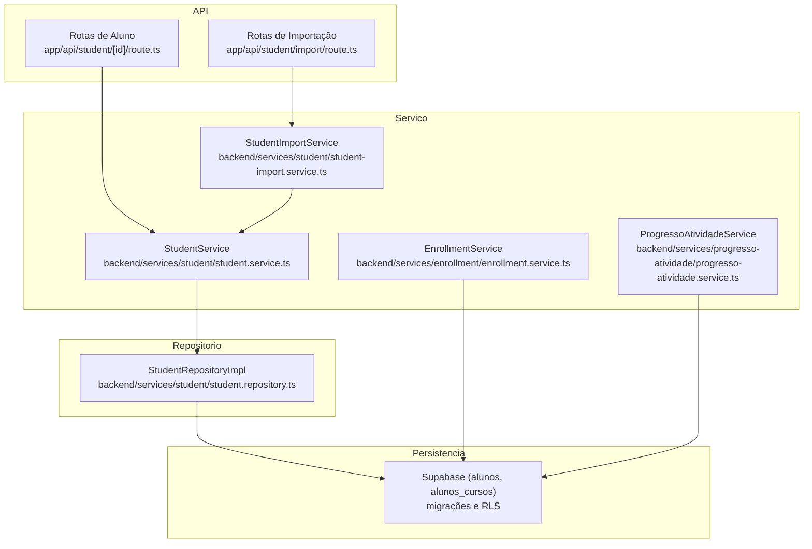
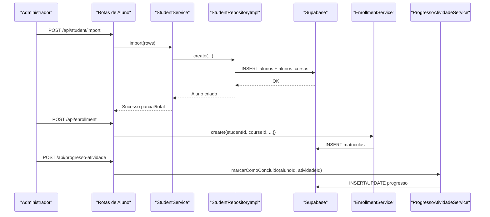

# Serviço de Aluno

<cite>
**Arquivo referenciados neste documento**
- [student.service.ts](file://backend/services/student/student.service.ts)
- [student-import.service.ts](file://backend/services/student/student-import.service.ts)
- [student.repository.ts](file://backend/services/student/student.repository.ts)
- [student.types.ts](file://backend/services/student/student.types.ts)
- [errors.ts](file://backend/services/student/errors.ts)
- [index.ts](file://backend/services/student/index.ts)
- [route.ts (import)](file://app/api/student/import/route.ts)
- [route.ts ([id])](file://app/api/student/[id]/route.ts)
- [enrollment.service.ts](file://backend/services/enrollment/enrollment.service.ts)
- [progresso-atividade.service.ts](file://backend/services/progresso-atividade/progresso-atividade.service.ts)
- [20250120_create_alunos.sql](file://supabase/migrations/20250120_create_alunos.sql)
- [20250129_add_alunos_cursos_rls_policies.sql](file://supabase/migrations/20250129_add_alunos_cursos_rls_policies.sql)
- [apply-rls-policies.js](file://scripts/apply-rls-policies.js)
</cite>

## Sumário
- Introdução
- Estrutura de camadas e arquitetura
- Funcionalidades principais
- Validações de dados
- Integração com Supabase RLS
- Tratamento de erros
- Comunicação com Matrícula e Progresso de Atividade
- Exemplos de chamadas
- Questões comuns e soluções
- Práticas de segurança e performance
- Conclusão

## Introdução
O serviço de Aluno é responsável pela gestão completa de perfis estudantis: cadastro, atualização, importação em massa e recuperação de dados. Ele implementa uma arquitetura de camadas bem definida, com validações rigorosas, integração com Supabase RLS e tratamento específico de erros. Um componente central é o StudentImportService, que processa lotes de alunos com validações parciais e relatórios de importação.

## Estrutura de camadas e arquitetura
O sistema segue um padrão de camadas bem separadas:
- Camada de API (Next.js): rotas expostas que recebem requisições e invocam serviços.
- Camada de Serviço: lógica de negócio central, validações e integrações externas.
- Camada de Repositório: acesso a dados com mapeamento de entidades.
- Camada de Tipagem e erros: definição de tipos e exceções específicas.
- Camada de Persistência: migrações e políticas RLS no Supabase.

**Diagrama fontes**
- [route.ts (import)](file://app/api/student/import/route.ts#L1-L94)
- [route.ts ([id])](file://app/api/student/[id]/route.ts#L1-L110)
- [student.service.ts](file://backend/services/student/student.service.ts#L1-L433)
- [student-import.service.ts](file://backend/services/student/student-import.service.ts#L1-L219)
- [student.repository.ts](file://backend/services/student/student.repository.ts#L1-L360)
- [20250120_create_alunos.sql](file://supabase/migrations/20250120_create_alunos.sql#L1-L55)
- [20250129_add_alunos_cursos_rls_policies.sql](file://supabase/migrations/20250129_add_alunos_cursos_rls_policies.sql#L1-L39)

**Seção fontes**
- [student.service.ts](file://backend/services/student/student.service.ts#L1-L433)
- [student-import.service.ts](file://backend/services/student/student-import.service.ts#L1-L219)
- [student.repository.ts](file://backend/services/student/student.repository.ts#L1-L360)
- [route.ts (import)](file://app/api/student/import/route.ts#L1-L94)
- [route.ts ([id])](file://app/api/student/[id]/route.ts#L1-L110)

## Funcionalidades principais
- Cadastro de aluno: criação de usuário no Supabase Auth e registro no banco de dados, incluindo geração automática de senha temporária baseada em CPF e curso.
- Atualização de aluno: validações de unicidade e campos, com atualização de metadados e senhas no Auth.
- Importação em massa: leitura de linhas com validações parciais, resolução de cursos e relatório de resultados (criados, ignorados, falhas).
- Recuperação de dados: listagem, busca por identificadores e carregamento de cursos associados.

**Seção fontes**
- [student.service.ts](file://backend/services/student/student.service.ts#L38-L132)
- [student.service.ts](file://backend/services/student/student.service.ts#L134-L226)
- [student-import.service.ts](file://backend/services/student/student-import.service.ts#L56-L129)
- [student.repository.ts](file://backend/services/student/student.repository.ts#L76-L118)

## Validações de dados
As validações ocorrem tanto nos endpoints quanto no serviço:
- Validação de campos obrigatórios e formatos (nome, email, CPF, telefone, CEP, número de matrícula, redes sociais).
- Unicidade de e-mail, CPF e número de matrícula.
- Validação de datas (não futuras).
- Validação de cursos (obrigatório pelo menos um, existência e normalização de nomes).
- Senha temporária mínima de 8 caracteres, com geração automática quando não informada.

**Seção fontes**
- [student.service.ts](file://backend/services/student/student.service.ts#L233-L356)
- [student.service.ts](file://backend/services/student/student.service.ts#L367-L402)
- [student.service.ts](file://backend/services/student/student.service.ts#L404-L431)
- [student-import.service.ts](file://backend/services/student/student-import.service.ts#L156-L215)

## Integração com Supabase RLS
- Tabela alunos: políticas permitem aos usuários ver e atualizar apenas seus próprios dados. Inserção com CHECK(auth.uid() = id).
- Tabela alunos_cursos: políticas permitem aos alunos visualizar suas próprias associações e a inserção/exclusão ser feita por usuários autenticados (normalmente administradores/professores).
- Scripts e migrações garantem a ativação de RLS e definição das políticas.

**Seção fontes**
- [20250120_create_alunos.sql](file://supabase/migrations/20250120_create_alunos.sql#L39-L55)
- [20250129_add_alunos_cursos_rls_policies.sql](file://supabase/migrations/20250129_add_alunos_cursos_rls_policies.sql#L1-L39)
- [apply-rls-policies.js](file://scripts/apply-rls-policies.js#L1-L119)

## Tratamento de erros
- StudentValidationError: erros de validação de entrada.
- StudentConflictError: tentativas de criar/atualizar registros duplicados.
- StudentNotFoundError: aluno não encontrado.
- Erros genéricos de acesso ao banco e ao Auth são lançados com mensagens informativas.

**Seção fontes**
- [errors.ts](file://backend/services/student/errors.ts#L1-L22)
- [student.service.ts](file://backend/services/student/student.service.ts#L358-L431)
- [student.repository.ts](file://backend/services/student/student.repository.ts#L76-L118)

## Comunicação com Matrícula e Progresso de Atividade
- Matrícula (EnrollmentService): permite criar, atualizar e excluir matrículas, validando datas e unicidade ativa por aluno-curso. Pode ser usada após a criação de alunos para vincular cursos.
- Progresso de Atividade (ProgressoAtividadeService): permite buscar e atualizar o progresso de um aluno em atividades, incluindo definição de datas de início e conclusão.

**Diagrama fontes**
- [route.ts (import)](file://app/api/student/import/route.ts#L49-L74)
- [student.service.ts](file://backend/services/student/student.service.ts#L157-L193)
- [student.repository.ts](file://backend/services/student/student.repository.ts#L157-L193)
- [enrollment.service.ts](file://backend/services/enrollment/enrollment.service.ts#L30-L61)
- [progresso-atividade.service.ts](file://backend/services/progresso-atividade/progresso-atividade.service.ts#L40-L74)

**Seção fontes**
- [enrollment.service.ts](file://backend/services/enrollment/enrollment.service.ts#L1-L142)
- [progresso-atividade.service.ts](file://backend/services/progresso-atividade/progresso-atividade.service.ts#L1-L166)

## Exemplos de chamadas
- Importação de múltiplos alunos:
  - Endpoint: POST /api/student/import
  - Payload: array de linhas com campos fullName, email, cpf, phone, enrollmentNumber, temporaryPassword e courses (array de nomes de cursos).
  - Resposta: objeto com total, created, skipped, failed e rows com status de cada linha.
  - Fonte: [route.ts (import)](file://app/api/student/import/route.ts#L49-L74), [student-import.service.ts](file://backend/services/student/student-import.service.ts#L56-L129)

- Recuperação de um aluno:
  - Endpoint: GET /api/student/[id]
  - Permite acesso restrito via RLS (próprio aluno ou superadmin).
  - Fonte: [route.ts ([id])](file://app/api/student/[id]/route.ts#L51-L59)

- Atualização de um aluno:
  - Endpoint: PUT /api/student/[id]
  - Validações de unicidade e campos antes de persistir.
  - Fonte: [route.ts ([id])](file://app/api/student/[id]/route.ts#L61-L83), [student.service.ts](file://backend/services/student/student.service.ts#L134-L226)

**Seção fontes**
- [route.ts (import)](file://app/api/student/import/route.ts#L49-L74)
- [route.ts ([id])](file://app/api/student/[id]/route.ts#L51-L83)
- [student-import.service.ts](file://backend/services/student/student-import.service.ts#L56-L129)
- [student.service.ts](file://backend/services/student/student.service.ts#L134-L226)

## Questões comuns e soluções
- Importação falha por campos faltantes:
  - Confirme que todos os campos obrigatórios estão presentes e preenchidos corretamente.
  - Verifique que pelo menos um curso foi informado e que os nomes correspondem a cursos válidos.
  - Fonte: [student-import.service.ts](file://backend/services/student/student-import.service.ts#L156-L215)

- Erro de conflito ao criar aluno:
  - E-mail, CPF ou número de matrícula já cadastrados.
  - Solução: corrija os dados ou remova duplicatas.
  - Fonte: [student.service.ts](file://backend/services/student/student.service.ts#L38-L68), [errors.ts](file://backend/services/student/errors.ts#L8-L13)

- Falha ao atualizar senha temporária:
  - A senha temporária deve ter pelo menos 8 caracteres.
  - Fonte: [student.service.ts](file://backend/services/student/student.service.ts#L211-L223)

- Problemas com RLS:
  - Certifique-se de que as políticas estão ativas e que o usuário está autenticado com papel apropriado.
  - Fonte: [20250120_create_alunos.sql](file://supabase/migrations/20250120_create_alunos.sql#L39-L55), [20250129_add_alunos_cursos_rls_policies.sql](file://supabase/migrations/20250129_add_alunos_cursos_rls_policies.sql#L1-L39)

**Seção fontes**
- [student-import.service.ts](file://backend/services/student/student-import.service.ts#L156-L215)
- [student.service.ts](file://backend/services/student/student.service.ts#L38-L68)
- [errors.ts](file://backend/services/student/errors.ts#L8-L13)
- [20250120_create_alunos.sql](file://supabase/migrations/20250120_create_alunos.sql#L39-L55)
- [20250129_add_alunos_cursos_rls_policies.sql](file://supabase/migrations/20250129_add_alunos_cursos_rls_policies.sql#L1-L39)

## Práticas de segurança e performance
- Segurança:
  - Uso de RLS para proteção de dados de alunos e associações.
  - Validação rigorosa de entradas e unicidade de dados críticos.
  - Geração de senhas temporárias com regras de tamanho e composição.
  - Fonte: [20250120_create_alunos.sql](file://supabase/migrations/20250120_create_alunos.sql#L39-L55), [20250129_add_alunos_cursos_rls_policies.sql](file://supabase/migrations/20250129_add_alunos_cursos_rls_policies.sql#L1-L39), [student.service.ts](file://backend/services/student/student.service.ts#L404-L431)

- Performance:
  - StudentImportService:
    - Carrega uma única vez os cursos disponíveis em memória e normaliza nomes para busca eficiente.
    - Processa linha a linha, mantendo um relatório detalhado com contagens e mensagens.
    - Fonte: [student-import.service.ts](file://backend/services/student/student-import.service.ts#L132-L150), [student-import.service.ts](file://backend/services/student/student-import.service.ts#L181-L215)
  - StudentRepositoryImpl:
    - Realiza consultas em lote (in) para obter vínculos e cursos associados, evitando N+1.
    - Fonte: [student.repository.ts](file://backend/services/student/student.repository.ts#L284-L332)

**Seção fontes**
- [student-import.service.ts](file://backend/services/student/student-import.service.ts#L132-L150)
- [student-import.service.ts](file://backend/services/student/student-import.service.ts#L181-L215)
- [student.repository.ts](file://backend/services/student/student.repository.ts#L284-L332)
- [20250120_create_alunos.sql](file://supabase/migrations/20250120_create_alunos.sql#L39-L55)
- [20250129_add_alunos_cursos_rls_policies.sql](file://supabase/migrations/20250129_add_alunos_cursos_rls_policies.sql#L1-L39)

## Conclusão
O serviço de Aluno oferece uma implementação robusta e segura, com validações completas, integração com Supabase RLS e um pipeline de importação eficiente. Ao seguir as práticas descritas e utilizar os endpoints e serviços mencionados, é possível gerenciar perfis estudantis de forma escalável e segura, integrando-se com os serviços de Matrícula e Progresso de Atividade conforme necessário.