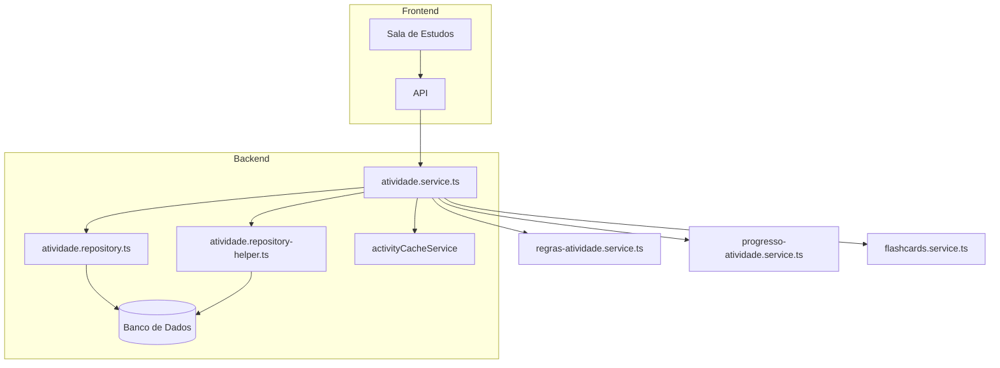
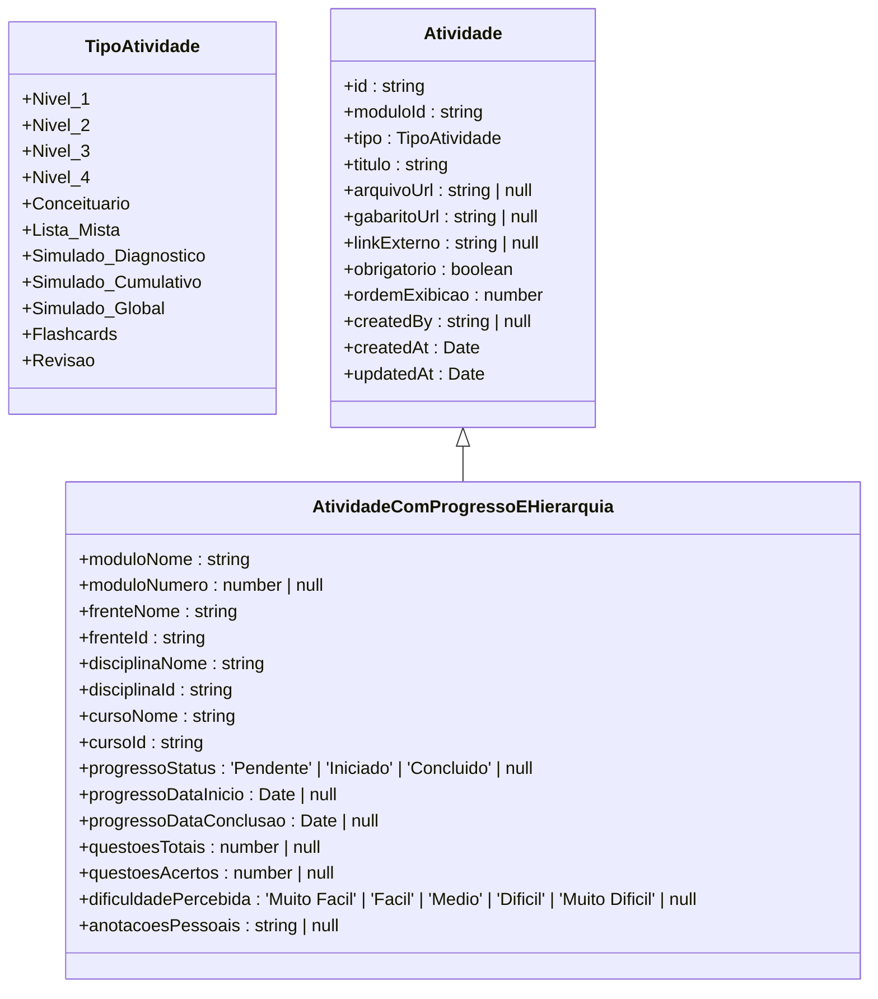
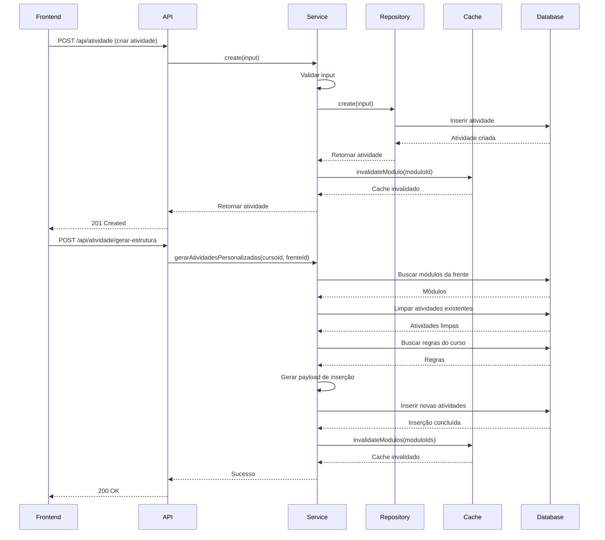
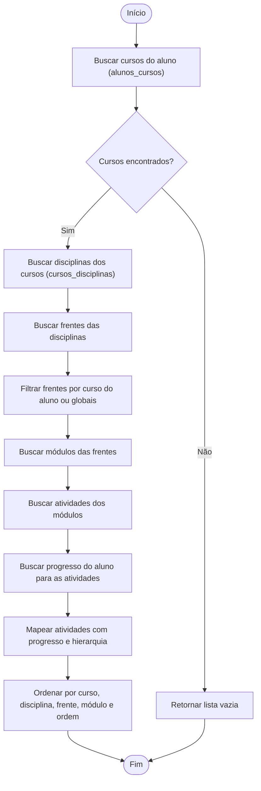
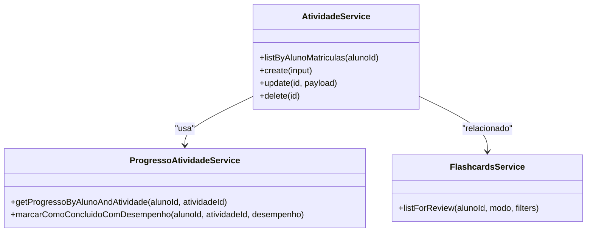
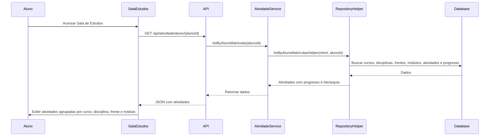

# Serviço de Atividade

<cite>
**Arquivos Referenciados neste Documento**  
- [atividade.service.ts](file://backend/services/atividade/atividade.service.ts)
- [atividade.repository-helper.ts](file://backend/services/atividade/atividade.repository-helper.ts)
- [atividade.types.ts](file://backend/services/atividade/atividade.types.ts)
- [atividade.repository.ts](file://backend/services/atividade/atividade.repository.ts)
- [regras-atividade.service.ts](file://backend/services/regras-atividade/regras-atividade.service.ts)
- [progresso-atividade.service.ts](file://backend/services/progresso-atividade/progresso-atividade.service.ts)
- [flashcards.service.ts](file://backend/services/flashcards/flashcards.service.ts)
- [route.ts](file://app/api/atividade/route.ts)
- [\[id\]/route.ts](file://app/api/atividade/[id]/route.ts)
- [aluno/\[alunoId\]/route.ts](file://app/api/atividade/aluno/[alunoId]/route.ts)
- [gerar-estrutura/route.ts](file://app/api/atividade/gerar-estrutura/route.ts)
</cite>

## Sumário
1. [Introdução](#introdução)
2. [Estrutura do Projeto e Organização](#estrutura-do-projeto-e-organização)
3. [Tipos de Atividades Suportados](#tipos-de-atividades-suportados)
4. [Criação e Gerenciamento de Atividades](#criação-e-gerenciamento-de-atividades)
5. [Regras de Negócio: Visibilidade e Pré-requisitos](#regras-de-negócio-visibilidade-e-pré-requisitos)
6. [Integração com Progresso-Atividade e Flashcards](#integração-com-progresso-atividade-e-flashcards)
7. [Exposição na Sala de Estudos](#exposição-na-sala-de-estudos)
8. [Desafios de Performance e Otimização](#desafios-de-performance-e-otimização)
9. [Diretrizes para Extensão do Modelo de Atividade](#diretrizes-para-extensão-do-modelo-de-atividade)
10. [Diagrama de Arquitetura](#diagrama-de-arquitetura)

## Introdução

O Serviço de Atividade é o componente central responsável pela criação, organização e gerenciamento de atividades educacionais dentro da plataforma. Ele opera dentro de uma estrutura hierárquica composta por cursos, disciplinas, frentes e módulos, permitindo a definição de atividades específicas para cada nível. O serviço fornece uma interface robusta para manipular atividades, incluindo operações de listagem, criação, atualização e exclusão, além de integrar-se com outros serviços como progresso do aluno e flashcards. Este documento detalha o funcionamento interno do serviço, suas interações com outros componentes e as melhores práticas para sua extensão e uso.

**Seção fontes**
- [atividade.service.ts](file://backend/services/atividade/atividade.service.ts#L1-L274)

## Estrutura do Projeto e Organização

O serviço de atividade está localizado no diretório `backend/services/atividade` e é composto por vários arquivos que seguem o padrão de separação de responsabilidades. O arquivo principal `atividade.service.ts` contém a lógica de negócios, enquanto `atividade.repository.ts` lida com as operações de banco de dados. O arquivo `atividade.repository-helper.ts` é utilizado para operações complexas de agregação de dados, especialmente na listagem de atividades por aluno. Os tipos de dados são definidos em `atividade.types.ts`, e os erros específicos do serviço são tratados em `errors.ts`. O serviço é exposto através de rotas API localizadas em `app/api/atividade`, que incluem endpoints para listagem, criação, atualização e exclusão de atividades, além de endpoints específicos para listagem por aluno e geração de estrutura de atividades.



**Fontes do diagrama**
- [atividade.service.ts](file://backend/services/atividade/atividade.service.ts#L1-L274)
- [atividade.repository-helper.ts](file://backend/services/atividade/atividade.repository-helper.ts#L1-L282)
- [atividade.repository.ts](file://backend/services/atividade/atividade.repository.ts#L1-L198)
- [atividade.types.ts](file://backend/services/atividade/atividade.types.ts#L1-L76)

**Seção fontes**
- [atividade.service.ts](file://backend/services/atividade/atividade.service.ts#L1-L274)
- [atividade.repository-helper.ts](file://backend/services/atividade/atividade.repository-helper.ts#L1-L282)
- [atividade.repository.ts](file://backend/services/atividade/atividade.repository.ts#L1-L198)
- [atividade.types.ts](file://backend/services/atividade/atividade.types.ts#L1-L76)

## Tipos de Atividades Suportados

O serviço suporta diversos tipos de atividades, cada um com um propósito específico dentro do processo educacional. Os tipos são definidos no arquivo `atividade.types.ts` e incluem: `Nivel_1`, `Nivel_2`, `Nivel_3`, `Nivel_4` para diferentes níveis de dificuldade, `Conceituario` para atividades teóricas, `Lista_Mista` para combinações de questões, `Simulado_Diagnostico`, `Simulado_Cumulativo` e `Simulado_Global` para avaliações, além de `Flashcards` e `Revisao` para revisão de conteúdo. A função `atividadeRequerDesempenho` determina se uma atividade exige um check qualificado (com avaliação de desempenho) ou simples (apenas conclusão). Atividades como `Revisao` e `Conceituario` utilizam check simples, enquanto os demais tipos exigem check qualificado, coletando informações como número de questões, acertos, dificuldade percebida e anotações pessoais.



**Fontes do diagrama**
- [atividade.types.ts](file://backend/services/atividade/atividade.types.ts#L1-L76)

**Seção fontes**
- [atividade.types.ts](file://backend/services/atividade/atividade.types.ts#L1-L76)

## Criação e Gerenciamento de Atividades

A criação e gerenciamento de atividades são realizadas através do `AtividadeService`, que valida os dados de entrada e realiza as operações necessárias no banco de dados. O método `create` valida campos obrigatórios como `moduloId`, `tipo` e `titulo`, cria a atividade e invalida o cache do módulo associado. Métodos como `update` e `delete` também invalidam o cache após a operação. A geração de estrutura de atividades personalizadas é feita pelo método `gerarAtividadesPersonalizadas`, que utiliza as regras definidas no serviço de regras de atividades para criar atividades automaticamente com base em frequência, módulo inicial e outros parâmetros. Este processo envolve a limpeza de atividades existentes, a geração de novas atividades conforme as regras e a atualização do cache.



**Fontes do diagrama**
- [atividade.service.ts](file://backend/services/atividade/atividade.service.ts#L50-L263)
- [atividade.repository.ts](file://backend/services/atividade/atividade.repository.ts#L1-L198)
- [gerar-estrutura/route.ts](file://app/api/atividade/gerar-estrutura/route.ts#L1-L57)

**Seção fontes**
- [atividade.service.ts](file://backend/services/atividade/atividade.service.ts#L50-L263)
- [atividade.repository.ts](file://backend/services/atividade/atividade.repository.ts#L1-L198)
- [gerar-estrutura/route.ts](file://app/api/atividade/gerar-estrutura/route.ts#L1-L57)

## Regras de Negócio: Visibilidade e Pré-requisitos

As regras de negócio para visibilidade e pré-requisitos são implementadas principalmente no método `listByAlunoMatriculas`, que utiliza o `atividade.repository-helper.ts` para construir uma lista completa de atividades acessíveis a um aluno. O processo começa buscando os cursos do aluno, depois as disciplinas associadas a esses cursos, seguido pelas frentes e módulos. As atividades são então recuperadas e combinadas com o progresso do aluno, incluindo status, datas e dados de desempenho. A visibilidade é controlada pela associação do aluno com os cursos e pela estrutura hierárquica das frentes e módulos. Atividades em módulos de frentes que pertencem a cursos do aluno ou são globais (curso_id nulo) são visíveis. O progresso é recuperado da tabela `progresso_atividades` e mapeado para cada atividade, permitindo uma visão completa do estado do aluno.



**Fontes do diagrama**
- [atividade.repository-helper.ts](file://backend/services/atividade/atividade.repository-helper.ts#L39-L282)
- [atividade.service.ts](file://backend/services/atividade/atividade.service.ts#L110-L118)

**Seção fontes**
- [atividade.repository-helper.ts](file://backend/services/atividade/atividade.repository-helper.ts#L39-L282)
- [atividade.service.ts](file://backend/services/atividade/atividade.service.ts#L110-L118)

## Integração com Progresso-Atividade e Flashcards

O serviço de atividade integra-se estreitamente com o serviço de progresso de atividade para rastrear o estado do aluno em cada atividade. Quando um aluno inicia ou conclui uma atividade, o serviço de progresso é atualizado com o status, datas e dados de desempenho. Para atividades que exigem check qualificado, o serviço de progresso armazena informações como número de questões, acertos, dificuldade percebida e anotações pessoais. A integração com flashcards é indireta, mas significativa: atividades do tipo `Flashcards` são listadas junto com outras atividades na Sala de Estudos, permitindo que o aluno acesse os flashcards como parte de sua rotina de estudo. O serviço de flashcards utiliza a estrutura de módulos e frentes para organizar os flashcards, alinhando-se com a hierarquia de atividades.



**Fontes do diagrama**
- [atividade.service.ts](file://backend/services/atividade/atividade.service.ts#L1-L274)
- [progresso-atividade.service.ts](file://backend/services/progresso-atividade/progresso-atividade.service.ts#L1-L166)
- [flashcards.service.ts](file://backend/services/flashcards/flashcards.service.ts#L1-L800)

**Seção fontes**
- [atividade.service.ts](file://backend/services/atividade/atividade.service.ts#L1-L274)
- [progresso-atividade.service.ts](file://backend/services/progresso-atividade/progresso-atividade.service.ts#L1-L166)
- [flashcards.service.ts](file://backend/services/flashcards/flashcards.service.ts#L1-L800)

## Exposição na Sala de Estudos

As atividades são expostas na Sala de Estudos através do endpoint `GET /api/atividade/aluno/[alunoId]`, que retorna uma lista de atividades com progresso e hierarquia. Este endpoint chama o método `listByAlunoMatriculas` do serviço de atividade, que utiliza o helper de repositório para construir a lista completa. A interface da Sala de Estudos agrupa as atividades por curso, disciplina, frente e módulo, exibindo o progresso do aluno em cada atividade. Atividades obrigatórias são destacadas, e o aluno pode iniciar, continuar ou concluir atividades diretamente da interface. Após a conclusão de uma atividade, a interface atualiza o progresso e, se aplicável, coleta os dados de desempenho no modal de check qualificado.



**Fontes do diagrama**
- [aluno/\[alunoId\]/route.ts](file://app/api/atividade/aluno/[alunoId]/route.ts#L1-L82)
- [atividade.service.ts](file://backend/services/atividade/atividade.service.ts#L110-L118)
- [atividade.repository-helper.ts](file://backend/services/atividade/atividade.repository-helper.ts#L39-L282)

**Seção fontes**
- [aluno/\[alunoId\]/route.ts](file://app/api/atividade/aluno/[alunoId]/route.ts#L1-L82)
- [atividade.service.ts](file://backend/services/atividade/atividade.service.ts#L110-L118)
- [atividade.repository-helper.ts](file://backend/services/atividade/atividade.repository-helper.ts#L39-L282)

## Desafios de Performance e Otimização

O principal desafio de performance está na listagem de atividades para um aluno, que envolve múltiplas consultas ao banco de dados e a agregação de dados de diferentes tabelas. Para mitigar isso, o serviço utiliza um sistema de cache baseado em Redis, implementado no `activityCacheService`. O cache armazena a estrutura de atividades por módulo, permitindo que a listagem por módulo seja feita rapidamente sem acessar o banco de dados. O cache é invalidado sempre que uma atividade é criada, atualizada ou excluída, garantindo a consistência dos dados. Além disso, o uso de consultas otimizadas com `select` específico e `order` adequado ajuda a reduzir o tempo de resposta. Para listagens grandes, a paginação e a limitação de resultados são estratégias importantes, embora não sejam explicitamente implementadas no serviço atual.

**Seção fontes**
- [atividade.service.ts](file://backend/services/atividade/atividade.service.ts#L21-L39)
- [atividade.service.ts](file://backend/services/atividade/atividade.service.ts#L66-L67)
- [atividade.service.ts](file://backend/services/atividade/atividade.service.ts#L81-L82)
- [atividade.service.ts](file://backend/services/atividade/atividade.service.ts#L106-L107)

## Diretrizes para Extensão do Modelo de Atividade

Para estender o modelo de atividade, é recomendado seguir as práticas de separação de responsabilidades já estabelecidas. Novos tipos de atividade devem ser adicionados ao tipo `TipoAtividade` em `atividade.types.ts`, e a lógica específica de cada tipo deve ser implementada no serviço apropriado. Para operações complexas de agregação de dados, novos helpers devem ser criados no diretório de serviços, seguindo o padrão do `atividade.repository-helper.ts`. A integração com outros serviços deve ser feita através de interfaces bem definidas, evitando dependências circulares. O cache deve ser considerado em qualquer operação de leitura frequente, e a invalidação do cache deve ser implementada em todas as operações de escrita. Testes unitários e de integração devem ser escritos para garantir a funcionalidade e a performance das novas extensões.

**Seção fontes**
- [atividade.types.ts](file://backend/services/atividade/atividade.types.ts#L1-L76)
- [atividade.service.ts](file://backend/services/atividade/atividade.service.ts#L1-L274)
- [atividade.repository-helper.ts](file://backend/services/atividade/atividade.repository-helper.ts#L1-L282)

## Diagrama de Arquitetura

```mermaid
graph TD
subgraph "Frontend"
A[Sala de Estudos] --> B[API]
C[Admin] --> B
end
subgraph "API"
B --> D[atividade.service.ts]
B --> E[regras-atividade.service.ts]
B --> F[progresso-atividade.service.ts]
B --> G[flashcards.service.ts]
end
subgraph "Backend Services"
D --> H[atividade.repository.ts]
D --> I[atividade.repository-helper.ts]
D --> J[activityCacheService]
E --> K[regras-atividade.repository.ts]
F --> L[progresso-atividade.repository.ts]
G --> M[flashcards.repository.ts]
end
subgraph "Data Layer"
H --> N[(Banco de Dados)]
I --> N
K --> N
L --> N
M --> N
J --> O[Redis Cache]
end
D --> E : "usa regras"
D --> F : "gerencia progresso"
D --> G : "relacionado a flashcards"
```

**Fontes do diagrama**
- [atividade.service.ts](file://backend/services/atividade/atividade.service.ts#L1-L274)
- [regras-atividade.service.ts](file://backend/services/regras-atividade/regras-atividade.service.ts#L1-L148)
- [progresso-atividade.service.ts](file://backend/services/progresso-atividade/progresso-atividade.service.ts#L1-L166)
- [flashcards.service.ts](file://backend/services/flashcards/flashcards.service.ts#L1-L800)
- [atividade.repository-helper.ts](file://backend/services/atividade/atividade.repository-helper.ts#L1-L282)
- [activity-cache.service.ts](file://backend/services/cache/activity-cache.service.ts)

**Seção fontes**
- [atividade.service.ts](file://backend/services/atividade/atividade.service.ts#L1-L274)
- [regras-atividade.service.ts](file://backend/services/regras-atividade/regras-atividade.service.ts#L1-L148)
- [progresso-atividade.service.ts](file://backend/services/progresso-atividade/progresso-atividade.service.ts#L1-L166)
- [flashcards.service.ts](file://backend/services/flashcards/flashcards.service.ts#L1-L800)
- [atividade.repository-helper.ts](file://backend/services/atividade/atividade.repository-helper.ts#L1-L282)