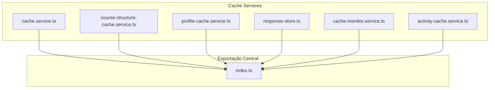
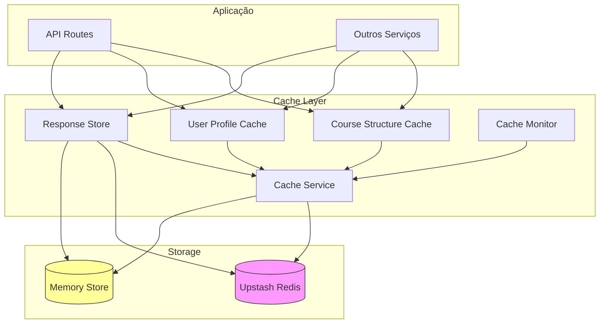
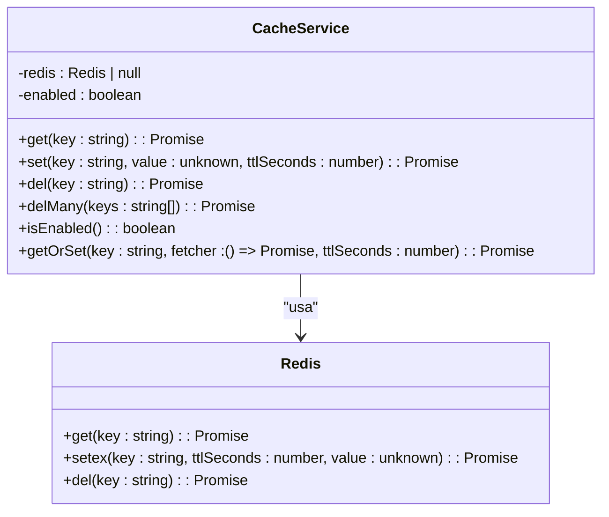
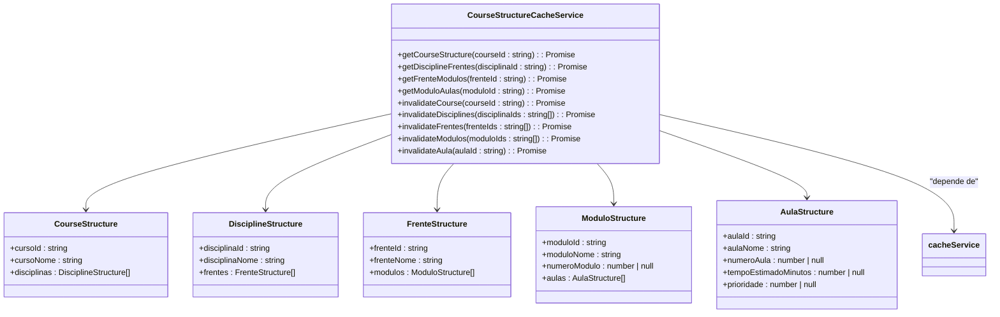
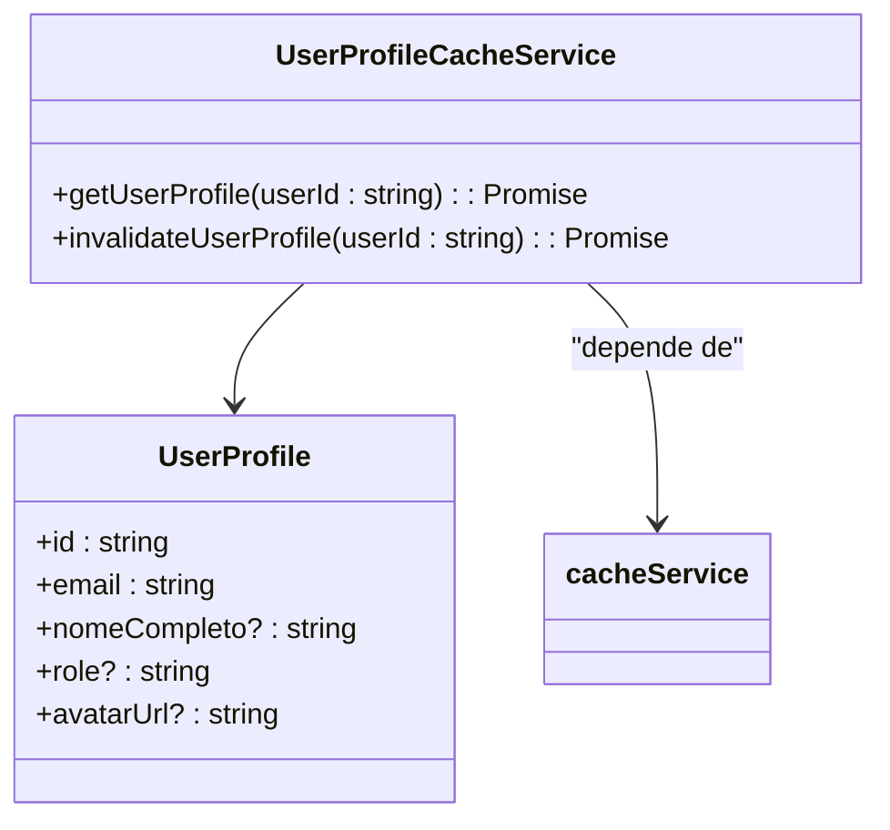
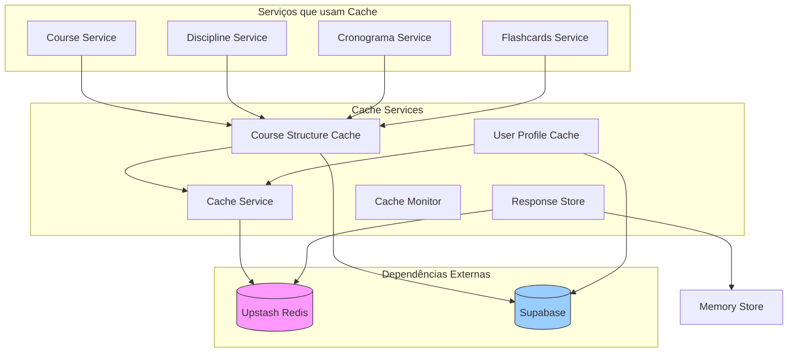

# Serviço de Cache

<cite>
**Arquivos Referenciados neste Documento**  
- [cache.service.ts](file://backend/services/cache/cache.service.ts)
- [course-structure-cache.service.ts](file://backend/services/cache/course-structure-cache.service.ts)
- [user-profile-cache.service.ts](file://backend/services/cache/user-profile-cache.service.ts)
- [response-store.ts](file://backend/services/cache/response-store.ts)
- [cache-monitor.service.ts](file://backend/services/cache/cache-monitor.service.ts)
- [course.service.ts](file://backend/services/course/course.service.ts)
- [discipline.service.ts](file://backend/services/discipline/discipline.service.ts)
- [route.ts](file://app/api/cache/stats/route.ts)
- [IMPLEMENTACAO_CACHE_COMPLETA.md](file://docs/IMPLEMENTACAO_CACHE_COMPLETA.md)
- [OPORTUNIDADES_CACHE_REDIS.md](file://docs/OPORTUNIDADES_CACHE_REDIS.md)
- [UPSTASH_REDIS_SETUP.md](file://docs/UPSTASH_REDIS_SETUP.md)
</cite>

## Sumário
1. [Introdução](#introdução)
2. [Estrutura do Projeto](#estrutura-do-projeto)
3. [Componentes Principais](#componentes-principais)
4. [Visão Geral da Arquitetura](#visão-geral-da-arquitetura)
5. [Análise Detalhada dos Componentes](#análise-detalhada-dos-componentes)
6. [Análise de Dependências](#análise-de-dependências)
7. [Considerações de Desempenho](#considerações-de-desempenho)
8. [Guia de Solução de Problemas](#guia-de-solução-de-problemas)
9. [Conclusão](#conclusão)

## Introdução

O serviço de cache é um componente essencial para o desempenho do sistema, projetado para otimizar o acesso a dados frequentemente utilizados e reduzir a latência em operações críticas. Ele utiliza o Upstash Redis como backend de armazenamento, garantindo baixa latência e alta disponibilidade mesmo em ambientes serverless. O sistema implementa um mecanismo de fallback gracioso, permitindo que o aplicativo funcione corretamente mesmo na ausência do Redis, embora sem os benefícios de cache.

O cache armazena estruturas hierárquicas de cursos, perfis de usuários, respostas de API e outros dados estáticos ou semi-estáticos. Cada componente de cache é especializado em um tipo específico de dado, permitindo políticas de expiração, invalidação e recuperação personalizadas. O sistema também inclui monitoramento integrado para rastrear métricas como hit rate, miss rate e erros, fornecendo visibilidade sobre a eficácia do cache.

**Section sources**
- [cache.service.ts](file://backend/services/cache/cache.service.ts#L1-L191)
- [IMPLEMENTACAO_CACHE_COMPLETA.md](file://docs/IMPLEMENTACAO_CACHE_COMPLETA.md#L1-L189)

## Estrutura do Projeto

O serviço de cache está localizado no diretório `backend/services/cache/` e é composto por vários arquivos especializados que seguem o padrão de responsabilidade única. A estrutura do diretório reflete claramente a divisão funcional dos componentes:

```
backend/services/cache/
├── activity-cache.service.ts
├── cache-monitor.service.ts
├── cache.service.ts
├── course-structure-cache.service.ts
├── index.ts
├── response-store.ts
└── user-profile-cache.service.ts
```

Cada arquivo implementa um serviço específico:
- `cache.service.ts`: Serviço genérico baseado em Redis
- `course-structure-cache.service.ts`: Cache hierárquico para estruturas de cursos
- `user-profile-cache.service.ts`: Cache para dados de perfil de usuário
- `response-store.ts`: Armazenamento temporário de respostas HTTP
- `cache-monitor.service.ts`: Monitoramento de estatísticas de cache
- `activity-cache.service.ts`: Cache para atividades
- `index.ts`: Exportação centralizada dos serviços

O arquivo `index.ts` atua como um barrel, exportando todos os serviços e tipos relacionados, facilitando a importação em outros módulos do sistema.



**Diagram sources**
- [cache.service.ts](file://backend/services/cache/cache.service.ts#L1-L191)
- [course-structure-cache.service.ts](file://backend/services/cache/course-structure-cache.service.ts#L1-L312)
- [user-profile-cache.service.ts](file://backend/services/cache/user-profile-cache.service.ts#L1-L86)
- [response-store.ts](file://backend/services/cache/response-store.ts#L1-L233)
- [cache-monitor.service.ts](file://backend/services/cache/cache-monitor.service.ts#L1-L116)

**Section sources**
- [cache.service.ts](file://backend/services/cache/cache.service.ts#L1-L191)
- [index.ts](file://backend/services/cache/index.ts#L1-L11)

## Componentes Principais

Os componentes principais do serviço de cache são projetados para atender a diferentes necessidades de armazenamento temporário no sistema. O `cache.service.ts` fornece a interface genérica para operações de cache, enquanto os serviços especializados como `course-structure-cache.service.ts` e `user-profile-cache.service.ts` implementam lógica específica para tipos de dados particulares. O `response-store.ts` é otimizado para armazenar respostas de chat, suportando tanto Redis quanto armazenamento em memória como fallback.

O sistema de monitoramento, implementado em `cache-monitor.service.ts`, coleta estatísticas sobre operações de cache, permitindo a análise de desempenho e a identificação de problemas. Todos os serviços seguem o padrão singleton, garantindo que haja uma única instância ativa durante o ciclo de vida da aplicação.

**Section sources**
- [cache.service.ts](file://backend/services/cache/cache.service.ts#L1-L191)
- [course-structure-cache.service.ts](file://backend/services/cache/course-structure-cache.service.ts#L1-L312)
- [user-profile-cache.service.ts](file://backend/services/cache/user-profile-cache.service.ts#L1-L86)
- [response-store.ts](file://backend/services/cache/response-store.ts#L1-L233)
- [cache-monitor.service.ts](file://backend/services/cache/cache-monitor.service.ts#L1-L116)

## Visão Geral da Arquitetura

A arquitetura do serviço de cache é baseada em um padrão de camadas, onde o serviço genérico de cache (`cache.service.ts`) fornece a interface de baixo nível para operações com o Redis, enquanto os serviços especializados adicionam lógica de domínio e políticas específicas. O sistema é projetado para ser resiliente, com fallback para operações sem cache quando o Redis não está disponível.



**Diagram sources**
- [cache.service.ts](file://backend/services/cache/cache.service.ts#L1-L191)
- [response-store.ts](file://backend/services/cache/response-store.ts#L1-L233)

## Análise Detalhada dos Componentes

### Análise do Serviço de Cache Genérico

O serviço de cache genérico é a base sobre a qual todos os outros serviços de cache são construídos. Ele encapsula a lógica de conexão com o Redis e fornece métodos simples para operações comuns de cache.



**Diagram sources**
- [cache.service.ts](file://backend/services/cache/cache.service.ts#L1-L191)

**Section sources**
- [cache.service.ts](file://backend/services/cache/cache.service.ts#L1-L191)

### Análise do Cache de Estrutura de Cursos

O serviço de cache de estrutura de cursos gerencia o armazenamento hierárquico de dados educacionais, desde cursos até aulas individuais. Ele implementa uma política de invalidação em cascata para garantir a consistência dos dados.



**Diagram sources**
- [course-structure-cache.service.ts](file://backend/services/cache/course-structure-cache.service.ts#L1-L312)

**Section sources**
- [course-structure-cache.service.ts](file://backend/services/cache/course-structure-cache.service.ts#L1-L312)
- [course.service.ts](file://backend/services/course/course.service.ts#L74-L76)
- [discipline.service.ts](file://backend/services/discipline/discipline.service.ts#L36-L37)

### Análise do Cache de Perfil de Usuário

O serviço de cache de perfil de usuário gerencia dados estáticos de usuários, como nome, papel e URL do avatar, com um TTL curto para garantir atualizações razoavelmente frescas.



**Diagram sources**
- [user-profile-cache.service.ts](file://backend/services/cache/user-profile-cache.service.ts#L1-L86)

**Section sources**
- [user-profile-cache.service.ts](file://backend/services/cache/user-profile-cache.service.ts#L1-L86)

### Análise do Armazenamento de Respostas

O armazenamento de respostas é projetado especificamente para gerenciar respostas de chat, suportando chunks de streaming e fallback para armazenamento em memória.

```mermaid
classDiagram
class ResponseStore {
-redis : Redis | null
-memoryStore : Map<string, ChatResponseData>
-useRedis : boolean
+set(sessionId : string, data : ChatResponseData) : Promise<void>
+get(sessionId : string) : Promise<ChatResponseData | null>
+addChunk(sessionId : string, chunk : string, isComplete : boolean) : Promise<void>
+markComplete(sessionId : string) : Promise<void>
+delete(sessionId : string) : Promise<void>
+has(sessionId : string) : Promise<boolean>
+getStats() : { type : 'redis' | 'memory'; itemCount : number }
}
class ChatResponseData {
+chunks : string[]
+isComplete : boolean
+timestamp : number
}
ResponseStore --> ChatResponseData
ResponseStore --> Redis : "usa opcionalmente"
```

**Diagram sources**
- [response-store.ts](file://backend/services/cache/response-store.ts#L1-L233)

**Section sources**
- [response-store.ts](file://backend/services/cache/response-store.ts#L1-L233)
- [UPSTASH_REDIS_SETUP.md](file://docs/UPSTASH_REDIS_SETUP.md#L1-L178)

### Análise do Monitor de Cache

O monitor de cache coleta estatísticas sobre o uso do cache, permitindo a análise de desempenho e a identificação de problemas.

```mermaid
classDiagram
class CacheMonitorService {
-stats : CacheStats
+recordHit() : void
+recordMiss() : void
+recordSet() : void
+recordDel() : void
+recordError() : void
+getStats() : CacheStats & { hitRate : number; totalOperations : number }
+reset() : void
+logStats() : void
}
class CacheStats {
+hits : number
+misses : number
+sets : number
+dels : number
+errors : number
+hitRate : number
+totalOperations : number
}
CacheMonitorService --> CacheStats
```

**Diagram sources**
- [cache-monitor.service.ts](file://backend/services/cache/cache-monitor.service.ts#L1-L116)

**Section sources**
- [cache-monitor.service.ts](file://backend/services/cache/cache-monitor.service.ts#L1-L116)
- [route.ts](file://app/api/cache/stats/route.ts#L1-L43)

## Análise de Dependências

O serviço de cache tem dependências claras e bem definidas com outros componentes do sistema. Ele depende do cliente de banco de dados para buscar dados quando ocorre um cache miss, e é dependido por vários serviços de negócio que utilizam o cache para melhorar o desempenho.



**Diagram sources**
- [cache.service.ts](file://backend/services/cache/cache.service.ts#L1-L191)
- [course-structure-cache.service.ts](file://backend/services/cache/course-structure-cache.service.ts#L1-L312)
- [user-profile-cache.service.ts](file://backend/services/cache/user-profile-cache.service.ts#L1-L86)
- [response-store.ts](file://backend/services/cache/response-store.ts#L1-L233)

**Section sources**
- [cache.service.ts](file://backend/services/cache/cache.service.ts#L1-L191)
- [course-structure-cache.service.ts](file://backend/services/cache/course-structure-cache.service.ts#L1-L312)
- [user-profile-cache.service.ts](file://backend/services/cache/user-profile-cache.service.ts#L1-L86)
- [response-store.ts](file://backend/services/cache/response-store.ts#L1-L233)

## Considerações de Desempenho

O serviço de cache foi projetado para maximizar o desempenho do sistema, com foco em reduzir a latência e o número de consultas ao banco de dados. As políticas de TTL são ajustadas de acordo com a frequência de atualização dos dados, variando de 5 minutos para perfis de usuário até 1 hora para estruturas de cursos.

A implementação do padrão cache-aside no método `getOrSet` permite que o sistema busque dados do cache primeiro, evitando consultas ao banco quando possível. A invalidação automática nas operações de criação, atualização e exclusão garante que os dados em cache permaneçam consistentes com o banco de dados.

O monitoramento integrado permite acompanhar métricas cruciais como hit rate, que indica a eficácia do cache. Um hit rate alto indica que a maioria das requisições está sendo atendida pelo cache, resultando em melhor desempenho geral do sistema.

**Section sources**
- [IMPLEMENTACAO_CACHE_COMPLETA.md](file://docs/IMPLEMENTACAO_CACHE_COMPLETA.md#L1-L189)
- [OPORTUNIDADES_CACHE_REDIS.md](file://docs/OPORTUNIDADES_CACHE_REDIS.md#L1-L473)

## Guia de Solução de Problemas

### Problemas Comuns e Soluções

#### Redis não configurado
Quando o Redis não está configurado, o sistema exibe um aviso no console e opera sem cache:
```
[Cache Service] ⚠️ Redis não configurado - cache desabilitado
[Cache Service] ⚠️ Configure UPSTASH_REDIS_REST_URL e UPSTASH_REDIS_REST_TOKEN para habilitar cache
```

**Solução:** Configure as variáveis de ambiente `UPSTASH_REDIS_REST_URL` e `UPSTASH_REDIS_REST_TOKEN` com os valores obtidos no console do Upstash.

#### Erros de conexão com Redis
Erros de conexão são registrados no console:
```
[Cache Service] ❌ Erro ao configurar Redis: [detalhes do erro]
```

**Solução:** Verifique as credenciais do Redis, a conectividade de rede e se o plano do Upstash não atingiu o limite.

#### Baixo hit rate
Um hit rate baixo pode indicar problemas de configuração ou padrões de acesso inesperados.

**Solução:** Verifique as estatísticas de cache acessando a rota `/api/cache/stats` (apenas superadmin) e analise os padrões de acesso.

### Monitoramento
O sistema de monitoramento coleta estatísticas sobre operações de cache, incluindo hits, misses, sets, deletes e erros. Essas estatísticas podem ser acessadas via API por usuários superadmin, permitindo a análise de desempenho e a identificação de problemas.

**Section sources**
- [cache.service.ts](file://backend/services/cache/cache.service.ts#L1-L191)
- [cache-monitor.service.ts](file://backend/services/cache/cache-monitor.service.ts#L1-L116)
- [route.ts](file://app/api/cache/stats/route.ts#L1-L43)
- [UPSTASH_REDIS_SETUP.md](file://docs/UPSTASH_REDIS_SETUP.md#L1-L178)

## Conclusão

O serviço de cache é um componente fundamental para o desempenho do sistema, utilizando o Upstash Redis para armazenar eficientemente estruturas de cursos, perfis de usuário e respostas de API. Sua arquitetura modular permite que diferentes tipos de dados sejam gerenciados com políticas específicas de expiração e invalidação.

A implementação inclui mecanismos robustos de fallback, garantindo que o sistema continue funcionando mesmo na ausência do Redis, além de um sistema de monitoramento completo para acompanhar a eficácia do cache. A integração com outros serviços é transparente, com invalidação automática quando os dados subjacentes são modificados.

O uso do cache resulta em melhorias significativas de desempenho, com redução de latência de centenas de milissegundos para menos de 10ms em operações críticas, e uma redução substancial no número de consultas ao banco de dados, melhorando a escalabilidade e reduzindo custos.