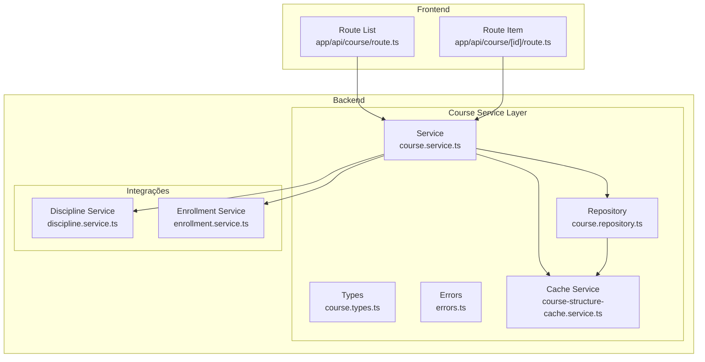
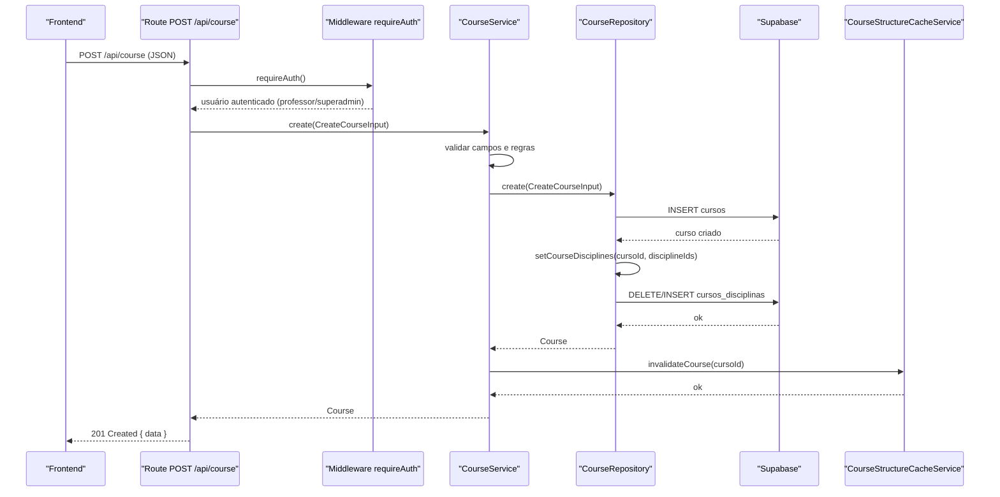
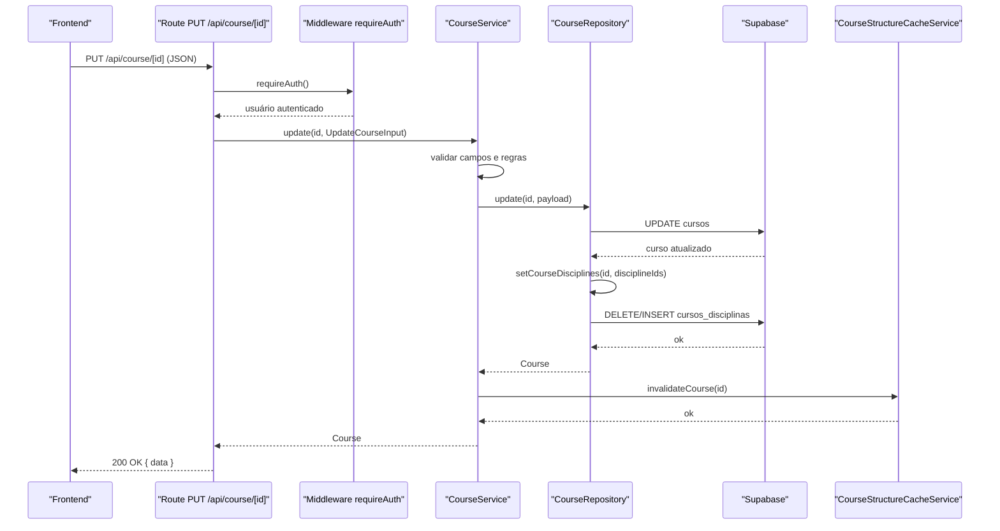
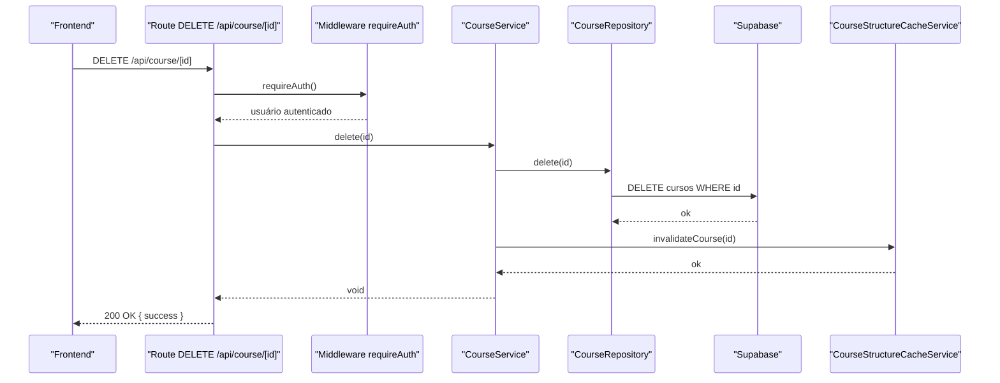
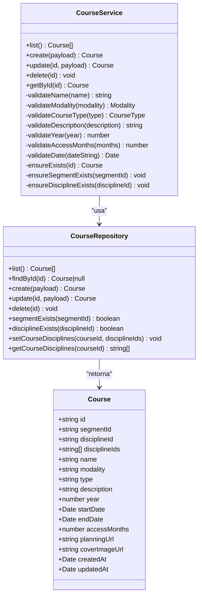

# Serviço de Curso

<cite>
**Arquivos Referenciados Neste Documento**
- [index.ts](file://backend/services/course/index.ts)
- [course.types.ts](file://backend/services/course/course.types.ts)
- [course.service.ts](file://backend/services/course/course.service.ts)
- [course.repository.ts](file://backend/services/course/course.repository.ts)
- [errors.ts](file://backend/services/course/errors.ts)
- [route.ts](file://app/api/course/route.ts)
- [route.ts](file://app/api/course/[id]/route.ts)
- [index.ts](file://backend/services/discipline/index.ts)
- [discipline.service.ts](file://backend/services/discipline/discipline.service.ts)
- [index.ts](file://backend/services/enrollment/index.ts)
- [enrollment.service.ts](file://backend/services/enrollment/enrollment.service.ts)
- [course-structure-cache.service.ts](file://backend/services/cache/course-structure-cache.service.ts)
</cite>

## Sumário
Este documento apresenta uma documentação abrangente do serviço de Curso no backend da Área do Aluno. Ele explica a responsabilidade do serviço na gestão de cursos (criação, atualização, exclusão e recuperação), descreve a interação entre as camadas types, service, repository e errors, e detalha como o serviço se integra com os serviços de disciplina e matrícula, bem como com o frontend via rotas API. Também inclui diagramas de sequência para operações críticas, decisões de design para escalabilidade e manutenibilidade, e um guia prático com exemplos de uso.

## Introdução
O serviço de Curso é responsável por gerenciar todas as operações relacionadas aos cursos oferecidos no sistema. Ele define os tipos de dados, aplica regras de validação, interage com o repositório para operações CRUD no Supabase e mantém a integridade dos dados através de erros específicos. Além disso, o serviço se integra com outros serviços do backend (disciplina e matrícula) e com o frontend via rotas API, garantindo que as operações sejam seguras, consistentes e eficientes.

## Estrutura do Projeto
O serviço de Curso está localizado em backend/services/course e é composto pelas seguintes partes principais:
- Types: definição de interfaces e enums usados pelo serviço.
- Service: lógica de validação e regras de negócio.
- Repository: operações CRUD no Supabase.
- Errors: tipos de exceções personalizados.
- API Routes: integração com o frontend via rotas Next.js.

**Diagrama fonte**
- [course.types.ts](file://backend/services/course/course.types.ts#L1-L55)
- [course.service.ts](file://backend/services/course/course.service.ts#L1-L299)
- [course.repository.ts](file://backend/services/course/course.repository.ts#L1-L282)
- [errors.ts](file://backend/services/course/errors.ts#L1-L22)
- [course-structure-cache.service.ts](file://backend/services/cache/course-structure-cache.service.ts#L1-L310)
- [discipline.service.ts](file://backend/services/discipline/discipline.service.ts#L1-L111)
- [enrollment.service.ts](file://backend/services/enrollment/enrollment.service.ts#L1-L142)
- [route.ts](file://app/api/course/route.ts#L1-L82)
- [route.ts](file://app/api/course/[id]/route.ts#L1-L128)

**Seção fonte**
- [index.ts](file://backend/services/course/index.ts#L1-L27)
- [course.types.ts](file://backend/services/course/course.types.ts#L1-L55)
- [course.service.ts](file://backend/services/course/course.service.ts#L1-L299)
- [course.repository.ts](file://backend/services/course/course.repository.ts#L1-L282)
- [errors.ts](file://backend/services/course/errors.ts#L1-L22)
- [route.ts](file://app/api/course/route.ts#L1-L82)
- [route.ts](file://app/api/course/[id]/route.ts#L1-L128)

## Componentes-Chave

### Tipos e Interfaces (types)
- Modality e CourseType: enumerados que restringem valores válidos para modalidade e tipo de curso.
- Course: representação completa de um curso com campos como identificador, segmento, disciplinas, nome, modalidade, tipo, descrição, ano, datas de início e fim, meses de acesso, URLs e timestamps.
- CreateCourseInput e UpdateCourseInput: DTOs para criação e atualização, com suporte a múltiplas disciplinas (disciplineIds) e compatibilidade com disciplina única (disciplineId).

Essas definições garantem tipagem forte e previsibilidade nas operações de criação e atualização.

**Seção fonte**
- [course.types.ts](file://backend/services/course/course.types.ts#L1-L55)

### Serviço (service)
Responsabilidades:
- Validação de dados: tamanho mínimo/máximo de nome, descrição, ano, meses de acesso, datas e enumerações.
- Regras de negócio: validação de intervalo de datas, verificação de existência de segmento e disciplinas, tratamento de disciplinas múltiplas.
- Operações CRUD: listagem, criação, atualização e exclusão.
- Integração com cache: invalidação automática da estrutura hierárquica de cursos ao criar, atualizar ou excluir.

Decisões de design:
- Centralização de validações em métodos privados para reutilização e clareza.
- Uso de exceptions específicas (CourseValidationError, CourseConflictError, CourseNotFoundError) para tratar erros de negócio.
- Separação de lógica de negócio da persistência, facilitando testes e manutenção.

**Seção fonte**
- [course.service.ts](file://backend/services/course/course.service.ts#L1-L299)

### Repositório (repository)
Responsabilidades:
- CRUD completo no Supabase com base na tabela cursos.
- Trabalho com relacionamento N-N entre cursos e disciplinas (tabela cursos_disciplinas).
- Validação de existência de segmento e disciplina antes de operações.
- Mapeamento de linhas do banco para objetos Course, incluindo carregamento das disciplinas associadas.

Decisões de design:
- Mapeamento explícito de rows para entidades com tratamento de datas e arrays.
- Persistência de disciplinas em tabela separada com remoção e recriação de relacionamentos ao atualizar.

**Seção fonte**
- [course.repository.ts](file://backend/services/course/course.repository.ts#L1-L282)

### Erros (errors)
Tipos de exceção:
- CourseValidationError: erros de validação de dados.
- CourseConflictError: conflitos de negócio (não utilizado diretamente no serviço de curso, mas exportado).
- CourseNotFoundError: tentativa de operar com curso inexistente.

**Seção fonte**
- [errors.ts](file://backend/services/course/errors.ts#L1-L22)

## Integração com Outros Componentes

### Com o serviço de Disciplina
- O serviço de Curso valida a existência de disciplinas antes de criar ou atualizar cursos.
- Ao atualizar, permite atualizar múltiplas disciplinas e sincroniza o relacionamento N-N.
- A atualização de disciplinas invalida o cache de estrutura hierárquica, mantendo a consistência.

**Seção fonte**
- [course.service.ts](file://backend/services/course/course.service.ts#L129-L144)
- [course.repository.ts](file://backend/services/course/course.repository.ts#L140-L157)
- [discipline.service.ts](file://backend/services/discipline/discipline.service.ts#L1-L111)

### Com o serviço de Matrícula
- O serviço de Curso não faz chamadas diretas ao serviço de matrícula, mas os dois compartilham o mesmo modelo de cache de estrutura hierárquica.
- Isso garante que alterações em cursos ou disciplinas refletem em consultas subsequentes de estrutura de conteúdo.

**Seção fonte**
- [enrollment.service.ts](file://backend/services/enrollment/enrollment.service.ts#L1-L142)
- [course-structure-cache.service.ts](file://backend/services/cache/course-structure-cache.service.ts#L1-L310)

### Com o Frontend via Rotas API
- Rota GET /api/course: retorna todos os cursos (catálogo público).
- Rota POST /api/course: criação de curso com autenticação obrigatória (professor ou superadmin).
- Rota GET /api/course/[id]: recupera um curso específico (catálogo público).
- Rota PUT /api/course/[id]: atualização de curso com autenticação e permissões.
- Rota DELETE /api/course/[id]: exclusão de curso com autenticação e permissões.

As rotas tratam erros específicos e retornam respostas padronizadas.

**Seção fonte**
- [route.ts](file://app/api/course/route.ts#L1-L82)
- [route.ts](file://app/api/course/[id]/route.ts#L1-L128)

## Fluxos de Operações Críticas

### Sequência de Criação de Curso com Validação de Autorização

**Diagrama fonte**
- [route.ts](file://app/api/course/route.ts#L51-L81)
- [course.service.ts](file://backend/services/course/course.service.ts#L34-L79)
- [course.repository.ts](file://backend/services/course/course.repository.ts#L103-L138)
- [course-structure-cache.service.ts](file://backend/services/cache/course-structure-cache.service.ts#L97-L114)

### Sequência de Atualização de Curso

**Diagrama fonte**
- [route.ts](file://app/api/course/[id]/route.ts#L68-L97)
- [course.service.ts](file://backend/services/course/course.service.ts#L81-L161)
- [course.repository.ts](file://backend/services/course/course.repository.ts#L140-L209)
- [course-structure-cache.service.ts](file://backend/services/cache/course-structure-cache.service.ts#L97-L114)

### Sequência de Exclusão de Curso

**Diagrama fonte**
- [route.ts](file://app/api/course/[id]/route.ts#L99-L127)
- [course.service.ts](file://backend/services/course/course.service.ts#L163-L170)
- [course.repository.ts](file://backend/services/course/course.repository.ts#L213-L219)
- [course-structure-cache.service.ts](file://backend/services/cache/course-structure-cache.service.ts#L97-L114)

## Decisões de Design e Boas Práticas

- Tipagem Forte: os DTOs e interfaces garantem que as operações recebam e retornem dados coerentes.
- Validação Centralizada: todas as regras de validação estão no service, evitando duplicidade e facilitando manutenção.
- Cache de Estrutura Hierárquica: invalidação explícita após operações de criação/atualização/exclusão garante que o frontend sempre veja dados atualizados.
- Relacionamento N-N com Disciplinas: persistência em tabela separada permite múltiplas disciplinas por curso e fácil atualização.
- Tratamento de Erros Específico: exceptions personalizadas permitem ao frontend distinguir erros de validação, conflito e não encontrado.
- Autenticação e Permissões: as rotas exigem autenticação e validam papéis (professor/superadmin) para operações de escrita.

## Exemplos de Uso

- Criação de Curso com Validação de Autorização:
  - O endpoint POST /api/course recebe um JSON com os campos necessários, passa pelo middleware requireAuth e chama courseService.create, que aplica todas as validações e persiste no Supabase.
  - Fonte: [route.ts](file://app/api/course/route.ts#L51-L81), [course.service.ts](file://backend/services/course/course.service.ts#L34-L79), [course.repository.ts](file://backend/services/course/course.repository.ts#L103-L138)

- Recuperação de Curso:
  - O endpoint GET /api/course/[id] chama courseService.getById e serializa a resposta.
  - Fonte: [route.ts](file://app/api/course/[id]/route.ts#L57-L66), [course.service.ts](file://backend/services/course/course.service.ts#L172-L174)

- Atualização de Curso:
  - O endpoint PUT /api/course/[id] chama courseService.update, que valida e atualiza o curso e seus relacionamentos.
  - Fonte: [route.ts](file://app/api/course/[id]/route.ts#L68-L97), [course.service.ts](file://backend/services/course/course.service.ts#L81-L161), [course.repository.ts](file://backend/services/course/course.repository.ts#L140-L209)

- Exclusão de Curso:
  - O endpoint DELETE /api/course/[id] chama courseService.delete e invalida o cache.
  - Fonte: [route.ts](file://app/api/course/[id]/route.ts#L99-L127), [course.service.ts](file://backend/services/course/course.service.ts#L163-L170), [course-structure-cache.service.ts](file://backend/services/cache/course-structure-cache.service.ts#L97-L114)

## Diagramas de Classe

### Classes do Serviço de Curso

**Diagrama fonte**
- [course.service.ts](file://backend/services/course/course.service.ts#L1-L299)
- [course.repository.ts](file://backend/services/course/course.repository.ts#L1-L282)
- [course.types.ts](file://backend/services/course/course.types.ts#L1-L55)

## Considerações de Desempenho e Escalabilidade

- Cache de Estrutura Hierárquica:
  - O cache de estrutura de cursos (e suas dependências) melhora significativamente o desempenho de consultas de catálogo e navegação.
  - A invalidação explícita após operações de escrita garante consistência sem sobrecarga de leitura contínua.

- Persistência de Disciplinas:
  - O relacionamento N-N é persistido em uma tabela separada, permitindo atualizações eficientes e consultas escaláveis.

- Validações no Backend:
  - Todas as validações são feitas no backend, reduzindo a chance de inconsistências e evitando requisições desnecessárias ao frontend.

## Guia de Troubleshooting

- Erros de Validação:
  - Mensagens de erro específicas indicam campos inválidos (ex: nome muito curto, ano fora do intervalo, datas inválidas). Corrija os dados e tente novamente.

- Erro de Não Encontrado:
  - Ao tentar atualizar ou excluir um curso inexistente, o serviço lança um erro de não encontrado. Verifique o ID informado.

- Erro de Conflito:
  - Embora não seja usado diretamente no serviço de curso, em outras partes do sistema conflitos podem ocorrer. Confira se há restrições de unicidade ou regras de negócio.

- Problemas de Permissão:
  - As rotas de escrita exigem autenticação e papel de professor ou superadmin. Certifique-se de que o token está presente e válido.

**Seção fonte**
- [errors.ts](file://backend/services/course/errors.ts#L1-L22)
- [route.ts](file://app/api/course/route.ts#L28-L49)
- [route.ts](file://app/api/course/[id]/route.ts#L29-L51)

## Conclusão
O serviço de Curso implementa uma arquitetura limpa e escalável, com validações rigorosas, persistência robusta e cache estratégico. Ele se integra harmoniosamente com os serviços de disciplina e matrícula e com o frontend via rotas API, proporcionando uma experiência consistente e eficiente tanto para administradores quanto para usuários finais.