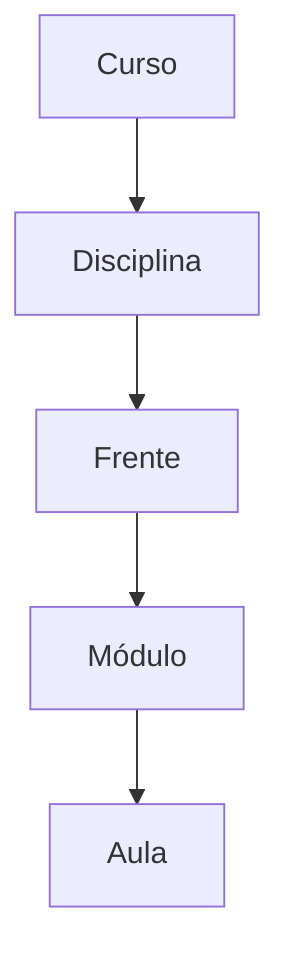
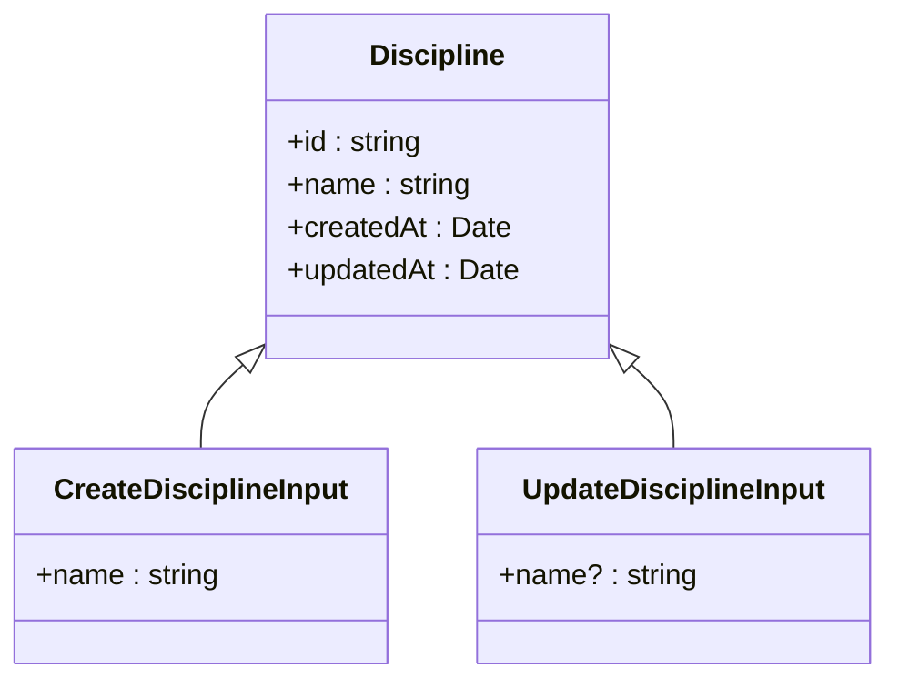
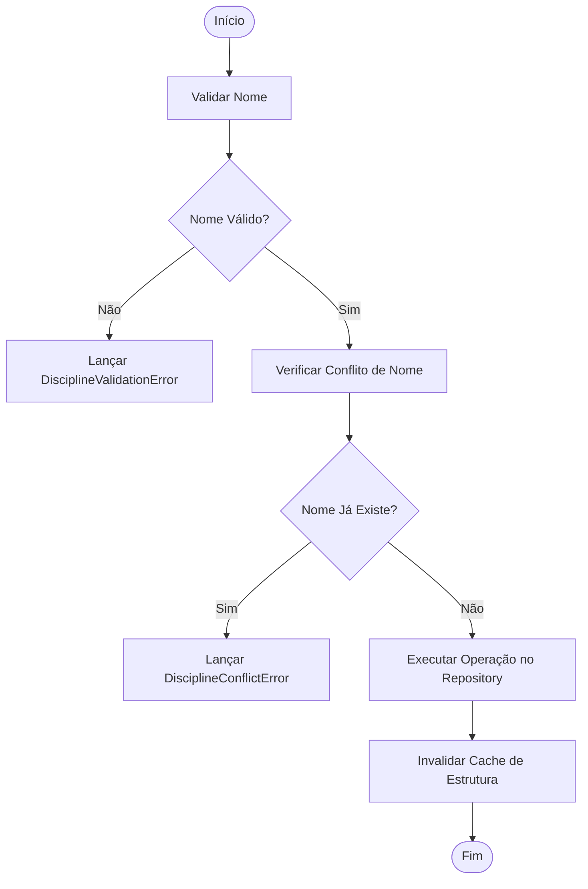
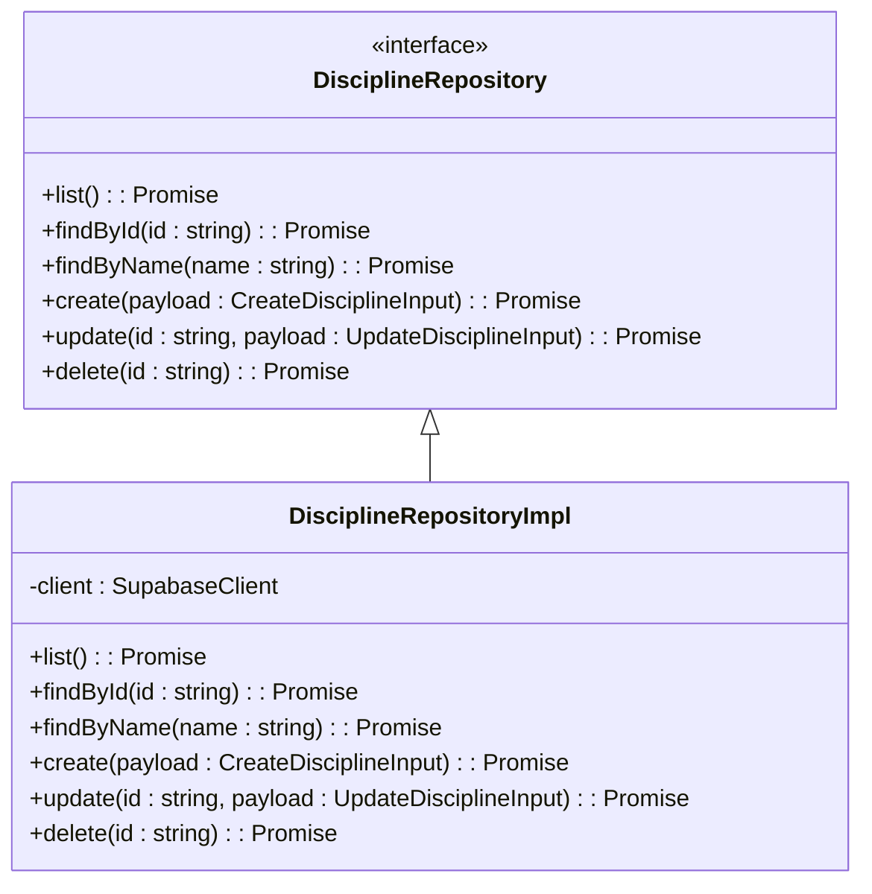
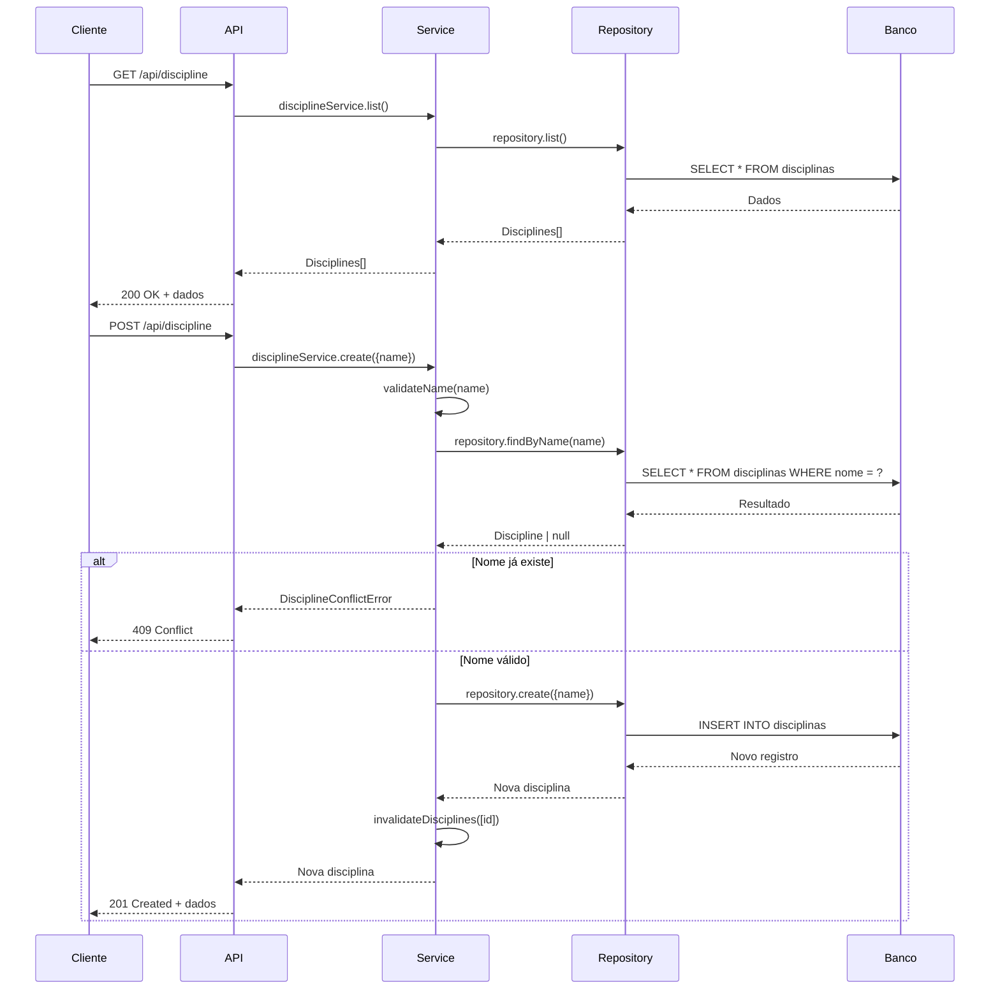

# Serviço de Disciplina

<cite>
**Arquivos Referenciados neste Documento**  
- [discipline.service.ts](file://backend/services/discipline/discipline.service.ts)
- [discipline.repository.ts](file://backend/services/discipline/discipline.repository.ts)
- [discipline.types.ts](file://backend/services/discipline/discipline.types.ts)
- [errors.ts](file://backend/services/discipline/errors.ts)
- [route.ts](file://app/api/discipline/route.ts)
- [\[id\]/route.ts](file://app/api/discipline/[id]/route.ts)
- [course-structure-cache.service.ts](file://backend/services/cache/course-structure-cache.service.ts)
- [index.ts](file://backend/services/discipline/index.ts)
</cite>

## Sumário
1. [Introdução](#introdução)
2. [Estrutura Hierárquica do Sistema](#estrutura-hierárquica-do-sistema)
3. [Operações do Serviço de Disciplina](#operações-do-serviço-de-disciplina)
4. [Estrutura de Tipos](#estrutura-de-tipos)
5. [Lógica de Negócio no Service](#lógica-de-negócio-no-service)
6. [Acesso ao Banco via Repository](#acesso-ao-banco-via-repository)
7. [Integração com Outros Serviços](#integração-com-outros-serviços)
8. [Rotas da API](#rotas-da-api)
9. [Exemplos de Requisições](#exemplos-de-requisições)
10. [Diretrizes para Extensão](#diretrizes-para-extensão)

## Introdução

O serviço de Disciplina é responsável por gerenciar as disciplinas associadas a cursos no sistema. Ele atua como um componente central na hierarquia Curso > Disciplina > Frente, fornecendo operações para criação, listagem, atualização e exclusão de disciplinas. O serviço garante a integridade dos dados por meio de validações rigorosas e interage com outros serviços como course e segment. A documentação a seguir detalha a arquitetura, funcionalidades e padrões de uso do serviço.

**Seção fontes**  
- [discipline.service.ts](file://backend/services/discipline/discipline.service.ts#L1-L110)
- [index.ts](file://backend/services/discipline/index.ts#L1-L27)

## Estrutura Hierárquica do Sistema

O sistema organiza o conteúdo educacional em uma estrutura hierárquica clara:

```
Curso
└── Disciplina
    └── Frente
        └── Módulo
            └── Aula
```

Cada disciplina pertence a um curso e pode conter múltiplas frentes. Essa hierarquia permite uma organização lógica do conteúdo, facilitando a navegação e o planejamento de estudos. O serviço de Disciplina atua diretamente nesse fluxo, garantindo que as disciplinas sejam corretamente vinculadas aos cursos e que as frentes sejam associadas às disciplinas apropriadas.



**Fontes do diagrama**  
- [course-structure-cache.service.ts](file://backend/services/cache/course-structure-cache.service.ts#L11-L42)

## Operações do Serviço de Disciplina

O serviço de Disciplina oferece as seguintes operações principais:

- **Listagem**: Recupera todas as disciplinas disponíveis.
- **Criação**: Cria uma nova disciplina com validação de nome único.
- **Atualização**: Atualiza o nome de uma disciplina existente.
- **Exclusão**: Remove uma disciplina do sistema.
- **Consulta por ID**: Recupera uma disciplina específica.

Todas as operações são protegidas por autenticação, exigindo que o usuário seja professor ou superadmin. A criação e atualização incluem validações para garantir a qualidade dos dados.

**Seção fontes**  
- [discipline.service.ts](file://backend/services/discipline/discipline.service.ts#L21-L77)
- [route.ts](file://app/api/discipline/route.ts#L46-L90)

## Estrutura de Tipos

Os tipos principais definidos no serviço de Disciplina são:



**Fontes do diagrama**  
- [discipline.types.ts](file://backend/services/discipline/discipline.types.ts#L1-L16)

## Lógica de Negócio no Service

A lógica de negócio é implementada na classe `DisciplineService`, que encapsula todas as regras de validação e operações. Os principais aspectos incluem:

- **Validação de Nome**: O nome deve ter entre 3 e 120 caracteres e não pode estar em branco.
- **Conflito de Nome**: Impede a criação de disciplinas com nomes duplicados.
- **Cache de Estrutura**: Após operações de criação, atualização ou exclusão, o cache da estrutura hierárquica é invalidado para manter a consistência.

A validação é realizada no método privado `validateName`, que garante que os dados atendam aos critérios definidos.



**Fontes do diagrama**  
- [discipline.service.ts](file://backend/services/discipline/discipline.service.ts#L79-L98)
- [discipline.service.ts](file://backend/services/discipline/discipline.service.ts#L25-L39)

## Acesso ao Banco via Repository

O acesso ao banco de dados é abstraído pela interface `DisciplineRepository`, implementada pela classe `DisciplineRepositoryImpl`. Essa camada utiliza o cliente Supabase para executar operações CRUD na tabela `disciplinas`. A separação entre service e repository permite manter a lógica de negócio independente da implementação de persistência.



**Fontes do diagrama**  
- [discipline.repository.ts](file://backend/services/discipline/discipline.repository.ts#L4-L10)

## Integração com Outros Serviços

O serviço de Disciplina integra-se com outros serviços do sistema:

- **Course Service**: Para verificar a existência de cursos e manter a integridade do vínculo curso-disciplina.
- **Segment Service**: Para acessar segmentos associados às disciplinas.
- **Cache Service**: Para invalidar caches de estrutura hierárquica após alterações.

A integração com o `courseStructureCacheService` é particularmente importante, pois garante que a estrutura hierárquica do curso seja atualizada quando disciplinas são modificadas.

**Seção fontes**  
- [discipline.service.ts](file://backend/services/discipline/discipline.service.ts#L36-L37)
- [discipline.service.ts](file://backend/services/discipline/discipline.service.ts#L56-L57)

## Rotas da API

As rotas da API para o serviço de Disciplina estão definidas em dois arquivos:

- `app/api/discipline/route.ts`: Para operações de listagem e criação.
- `app/api/discipline/[id]/route.ts`: Para operações de consulta, atualização e exclusão por ID.

As rotas seguem os padrões REST e incluem tratamento de erros detalhado, retornando códigos de status HTTP apropriados.



**Fontes do diagrama**  
- [route.ts](file://app/api/discipline/route.ts#L46-L88)
- [discipline.service.ts](file://backend/services/discipline/discipline.service.ts#L25-L39)

## Exemplos de Requisições

### Requisição Bem-Sucedida

**Criação de Disciplina**
```http
POST /api/discipline
Content-Type: application/json

{
  "name": "Matemática Avançada"
}
```

**Resposta**
```http
HTTP/1.1 201 Created
Content-Type: application/json

{
  "data": {
    "id": "abc123",
    "name": "Matemática Avançada",
    "createdAt": "2025-01-01T00:00:00.000Z",
    "updatedAt": "2025-01-01T00:00:00.000Z"
  }
}
```

### Erros Comuns

**Disciplina Não Encontrada**
```http
GET /api/discipline/invalid-id
```

**Resposta**
```http
HTTP/1.1 404 Not Found
Content-Type: application/json

{
  "error": "Discipline with id \"invalid-id\" was not found"
}
```

**Conflito de Nome**
```http
POST /api/discipline
Content-Type: application/json

{
  "name": "Matemática Avançada"
}
```

**Resposta**
```http
HTTP/1.1 409 Conflict
Content-Type: application/json

{
  "error": "Discipline \"Matemática Avançada\" already exists"
}
```

**Seção fontes**  
- [errors.ts](file://backend/services/discipline/errors.ts#L1-L22)
- [\[id\]/route.ts](file://app/api/discipline/[id]/route.ts#L17-L31)

## Diretrizes para Extensão

Para estender o serviço de Disciplina com novos casos de uso, siga estas diretrizes:

1. **Mantenha Baixo Acoplamento**: Adicione novas funcionalidades através de interfaces e injeção de dependências.
2. **Valide Entradas**: Sempre valide os dados de entrada no service, antes de acessar o repository.
3. **Atualize o Cache**: Quando alterar dados que afetam a estrutura hierárquica, invalide os caches apropriados.
4. **Trate Erros Adequadamente**: Utilize classes de erro específicas para facilitar o tratamento no frontend.
5. **Documente Novas Rotas**: Atualize a documentação da API com exemplos e códigos de status.

A arquitetura modular do serviço permite adicionar novas operações sem impactar o código existente, promovendo manutenibilidade e escalabilidade.

**Seção fontes**  
- [index.ts](file://backend/services/discipline/index.ts#L1-L27)
- [discipline.service.ts](file://backend/services/discipline/discipline.service.ts#L18-L108)