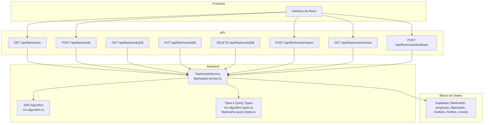
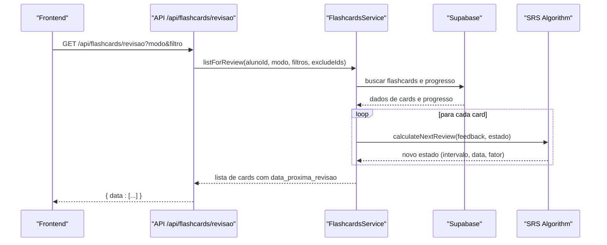
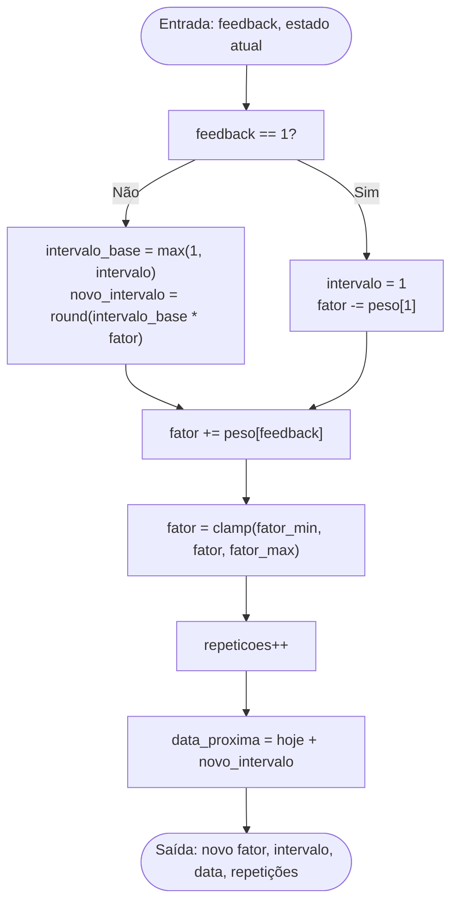
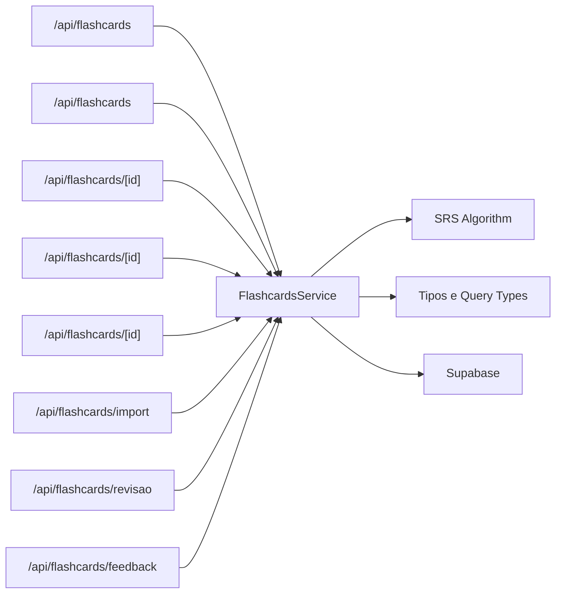

# Serviço de Flashcards

<cite>
**Arquivo referenciados neste documento**
- [flashcards.service.ts](file://backend/services/flashcards/flashcards.service.ts)
- [srs-algorithm.ts](file://backend/services/flashcards/srs-algorithm.ts)
- [srs-algorithm.types.ts](file://backend/services/flashcards/srs-algorithm.types.ts)
- [flashcards.query-types.ts](file://backend/services/flashcards/flashcards.query-types.ts)
- [route.ts](file://app/api/flashcards/route.ts)
- [route.ts](file://app/api/flashcards/feedback/route.ts)
- [route.ts](file://app/api/flashcards/import/route.ts)
- [route.ts](file://app/api/flashcards/revisao/route.ts)
- [route.ts](file://app/api/flashcards/[id]/route.ts)
</cite>

## Sumário
1. [Introdução](#introdução)
2. [Estrutura do Projeto](#estrutura-do-projeto)
3. [Componentes Principais](#componentes-principais)
4. [Visão Geral da Arquitetura](#visão-geral-da-arquitetura)
5. [Análise Detalhada dos Componentes](#análise-detalhada-dos-componentes)
6. [Análise de Dependências](#análise-de-dependências)
7. [Considerações de Desempenho](#considerações-de-desempenho)
8. [Guia de Solução de Problemas](#guia-de-solução-de-problemas)
9. [Conclusão](#conclusão)
10. [Apêndices](#apêndices)

## Introdução
Este documento apresenta a documentação completa do serviço de Flashcards, responsável por oferecer revisão inteligente com algoritmo SRS (Spaced Repetition System). O sistema permite ao aluno estudar flashcards de forma eficiente, com agendamento automático baseado no desempenho dele. O serviço centraliza a lógica de criação, importação, listagem, revisão e feedback, integrando-se ao algoritmo SRS para calcular os próximos momentos de revisão com base no feedback do usuário.

## Estrutura do Projeto
O serviço de Flashcards é composto por camadas bem definidas:
- Camada de API (Next.js App Router): expõe endpoints REST para operações de listagem, criação, importação, revisão e envio de feedback.
- Camada de Serviço (backend/services/flashcards): contém a lógica de negócios, consultas ao banco de dados e integração com o algoritmo SRS.
- Algoritmo SRS: implementação do SM-2 adaptada com configurações personalizáveis.
- Tipos e query-types: definições de dados e estruturas de retorno do banco.

**Fontes do diagrama**
- [route.ts](file://app/api/flashcards/route.ts#L1-L162)
- [route.ts](file://app/api/flashcards/[id]/route.ts#L1-L91)
- [route.ts](file://app/api/flashcards/import/route.ts#L1-L46)
- [route.ts](file://app/api/flashcards/revisao/route.ts#L1-L36)
- [route.ts](file://app/api/flashcards/feedback/route.ts#L1-L40)
- [flashcards.service.ts](file://backend/services/flashcards/flashcards.service.ts#L1-L1580)
- [srs-algorithm.ts](file://backend/services/flashcards/srs-algorithm.ts#L1-L113)
- [srs-algorithm.types.ts](file://backend/services/flashcards/srs-algorithm.types.ts#L1-L53)
- [flashcards.query-types.ts](file://backend/services/flashcards/flashcards.query-types.ts#L1-L59)

**Seção fontes**
- [route.ts](file://app/api/flashcards/route.ts#L1-L162)
- [route.ts](file://app/api/flashcards/[id]/route.ts#L1-L91)
- [route.ts](file://app/api/flashcards/import/route.ts#L1-L46)
- [route.ts](file://app/api/flashcards/revisao/route.ts#L1-L36)
- [route.ts](file://app/api/flashcards/feedback/route.ts#L1-L40)
- [flashcards.service.ts](file://backend/services/flashcards/flashcards.service.ts#L1-L1580)
- [srs-algorithm.ts](file://backend/services/flashcards/srs-algorithm.ts#L1-L113)
- [srs-algorithm.types.ts](file://backend/services/flashcards/srs-algorithm.types.ts#L1-L53)
- [flashcards.query-types.ts](file://backend/services/flashcards/flashcards.query-types.ts#L1-L59)

## Componentes Principais
- FlashcardsService: principal classe de negócio, com métodos para importar, criar, atualizar, deletar, listar e gerar sessões de revisão. Também registra feedback e calcula novos intervalos com o algoritmo SRS.
- SRS Algorithm: implementação do SM-2 com configurações de pesos de feedback, limites de fator de facilidade e cálculo de próxima revisão.
- Tipos e Query Types: definições de dados usados pelo serviço e respostas do banco.

**Seção fontes**
- [flashcards.service.ts](file://backend/services/flashcards/flashcards.service.ts#L1-L1580)
- [srs-algorithm.ts](file://backend/services/flashcards/srs-algorithm.ts#L1-L113)
- [srs-algorithm.types.ts](file://backend/services/flashcards/srs-algorithm.types.ts#L1-L53)
- [flashcards.query-types.ts](file://backend/services/flashcards/flashcards.query-types.ts#L1-L59)

## Visão Geral da Arquitetura
O fluxo típico de uma sessão de revisão:
1. O frontend solicita uma lista de flashcards para revisão com critérios de modo e filtros.
2. O endpoint de revisão chama o serviço de flashcards.
3. O serviço consulta o banco de dados, filtra os cards devidos e embaralha.
4. Para cada card, o serviço recupera o progresso do aluno e aplica o algoritmo SRS com base no feedback mais recente.
5. O serviço retorna os cards com informações de próxima revisão.

**Fontes do diagrama**
- [route.ts](file://app/api/flashcards/revisao/route.ts#L1-L36)
- [flashcards.service.ts](file://backend/services/flashcards/flashcards.service.ts#L361-L902)
- [srs-algorithm.ts](file://backend/services/flashcards/srs-algorithm.ts#L37-L97)

**Seção fontes**
- [route.ts](file://app/api/flashcards/revisao/route.ts#L1-L36)
- [flashcards.service.ts](file://backend/services/flashcards/flashcards.service.ts#L361-L902)
- [srs-algorithm.ts](file://backend/services/flashcards/srs-algorithm.ts#L37-L97)

## Análise Detalhada dos Componentes

### Algoritmo SRS (SM-2)
- Estados e entradas:
  - Fator de facilidade (ease factor)
  - Intervalo em dias
  - Número de repetições
  - Último feedback (1 a 4)
- Configurações:
  - Limites mínimos e máximos do fator de facilidade
  - Valores iniciais
  - Pesos de ajuste por feedback
- Cálculo:
  - Se o feedback for 1 (Errei), reinicia o intervalo e reduz o fator de facilidade.
  - Para feedbacks 2, 3 e 4, multiplica o intervalo pelo fator de facilidade e ajusta o fator com base nos pesos.
  - Garante limites mínimos e máximos.
  - Incrementa o número de repetições e calcula a data da próxima revisão.

**Fontes do diagrama**
- [srs-algorithm.ts](file://backend/services/flashcards/srs-algorithm.ts#L37-L97)
- [srs-algorithm.types.ts](file://backend/services/flashcards/srs-algorithm.types.ts#L1-L53)

**Seção fontes**
- [srs-algorithm.ts](file://backend/services/flashcards/srs-algorithm.ts#L1-L113)
- [srs-algorithm.types.ts](file://backend/services/flashcards/srs-algorithm.types.ts#L1-L53)

### Modelo de Dados do Flashcard
- Entidades principais:
  - flashcards: armazena pergunta, resposta e modulo_id.
  - progresso_flashcards: armazena o histórico de revisões do aluno com relação a um flashcard.
  - modulos, frentes, cursos: relacionamentos hierárquicos usados para filtragem e exibição.
- Estados de aprendizado:
  - Novo: card sem progresso registrado (data_proxima_revisao nula ou no passado).
  - Em revisão: card com data_proxima_revisao no presente ou no passado.
  - Dominado: card com data_proxima_revisao futura e fator de facilidade elevado (definido pela lógica do algoritmo).
- Feedback do usuário:
  - 1 = Errei
  - 2 = Acertei parcialmente
  - 3 = Acertei com dificuldade
  - 4 = Acertei com facilidade

**Seção fontes**
- [flashcards.service.ts](file://backend/services/flashcards/flashcards.service.ts#L904-L966)
- [flashcards.query-types.ts](file://backend/services/flashcards/flashcards.query-types.ts#L1-L59)
- [srs-algorithm.types.ts](file://backend/services/flashcards/srs-algorithm.types.ts#L1-L53)

### Operações do Serviço

#### Importação de Flashcards
- Suporte a dois formatos:
  - Novo formato: recebe moduloId diretamente.
  - Antigo formato: resolve disciplina, frente e módulo a partir de nomes e número do módulo.
- Validações:
  - Módulo deve existir.
  - Pergunta e resposta são obrigatórias.
- Resultado:
  - Contagem de linhas processadas, inseridas e erros com localização.

**Seção fontes**
- [flashcards.service.ts](file://backend/services/flashcards/flashcards.service.ts#L158-L336)
- [route.ts](file://app/api/flashcards/import/route.ts#L1-L46)

#### Criação de Flashcards
- Requer moduloId, pergunta e resposta.
- Valida existência do módulo.
- Retorna o flashcard criado com informações hierárquicas.

**Seção fontes**
- [flashcards.service.ts](file://backend/services/flashcards/flashcards.service.ts#L1332-L1418)
- [route.ts](file://app/api/flashcards/route.ts#L132-L159)

#### Atualização e Exclusão
- Atualização: aceita módulo, pergunta e resposta, com validações.
- Exclusão: remove o flashcard e o progresso associado, se houver.

**Seção fontes**
- [flashcards.service.ts](file://backend/services/flashcards/flashcards.service.ts#L1420-L1576)
- [route.ts](file://app/api/flashcards/[id]/route.ts#L1-L91)

#### Listagem Administrativa
- Filtros: disciplinaId, frenteId, moduloId, busca textual, paginação, ordenação.
- Cache: chave composta com filtros (exceto busca textual), TTL de 15 minutos.
- Hierarquia: retorna informações de módulo, frente e disciplina.

**Seção fontes**
- [flashcards.service.ts](file://backend/services/flashcards/flashcards.service.ts#L968-L1266)
- [route.ts](file://app/api/flashcards/route.ts#L1-L162)

#### Geração de Lote de Revisão
- Modos:
  - revisao_geral: inclui módulos com atividades concluídas e/ou flashcards já vistos.
  - mais_cobrados: filtra módulos com importância “Alta”.
  - mais_errados (UTI): prioriza cards com feedback ruim (1, 2, 3), com distribuição ponderada (5, 3, 2).
  - personalizado: requer moduloId e valida acesso ao curso/frente/módulo.
- Critérios de due:
  - Cards sem progresso são considerados “due”.
  - Cards com data_proxima_revisao no passado ou nula são considerados “due”.
- Embaralhamento e limitação:
  - Embaralha os cards “due” e limita a 10 por sessão.

**Seção fontes**
- [flashcards.service.ts](file://backend/services/flashcards/flashcards.service.ts#L361-L902)

#### Envio de Feedback
- Valida feedback (1 a 4).
- Recupera progresso existente e aplica o algoritmo SRS.
- Persiste o novo estado (fator de facilidade, intervalo, data_proxima_revisao, número de repetições, último feedback).
- Invalida cache de flashcards relacionados.

**Seção fontes**
- [flashcards.service.ts](file://backend/services/flashcards/flashcards.service.ts#L904-L966)
- [srs-algorithm.ts](file://backend/services/flashcards/srs-algorithm.ts#L37-L97)
- [srs-algorithm.types.ts](file://backend/services/flashcards/srs-algorithm.types.ts#L1-L53)

## Análise de Dependências
- FlashcardsService depende de:
  - Cliente de banco de dados (Supabase).
  - CacheService (para listagem administrativa).
  - Algoritmo SRS (cálculo de próxima revisão).
  - Tipos de query e SRS.
- API depende do FlashcardsService e do middleware de autenticação.
- O algoritmo SRS é um módulo isolado com tipos bem definidos.

**Fontes do diagrama**
- [route.ts](file://app/api/flashcards/route.ts#L1-L162)
- [route.ts](file://app/api/flashcards/[id]/route.ts#L1-L91)
- [route.ts](file://app/api/flashcards/import/route.ts#L1-L46)
- [route.ts](file://app/api/flashcards/revisao/route.ts#L1-L36)
- [route.ts](file://app/api/flashcards/feedback/route.ts#L1-L40)
- [flashcards.service.ts](file://backend/services/flashcards/flashcards.service.ts#L1-L1580)
- [srs-algorithm.ts](file://backend/services/flashcards/srs-algorithm.ts#L1-L113)
- [srs-algorithm.types.ts](file://backend/services/flashcards/srs-algorithm.types.ts#L1-L53)
- [flashcards.query-types.ts](file://backend/services/flashcards/flashcards.query-types.ts#L1-L59)

**Seção fontes**
- [flashcards.service.ts](file://backend/services/flashcards/flashcards.service.ts#L1-L1580)
- [srs-algorithm.ts](file://backend/services/flashcards/srs-algorithm.ts#L1-L113)
- [srs-algorithm.types.ts](file://backend/services/flashcards/srs-algorithm.types.ts#L1-L53)
- [flashcards.query-types.ts](file://backend/services/flashcards/flashcards.query-types.ts#L1-L59)
- [route.ts](file://app/api/flashcards/route.ts#L1-L162)

## Considerações de Desempenho
- Cache:
  - Listagem administrativa usa cache com chave baseada em filtros (sem busca textual). TTL de 15 minutos.
  - Invalidação de cache ocorre ao criar/atualizar/deletar flashcards, levando em conta a hierarquia (disciplina, frente, módulo).
- Consultas:
  - Limitação de resultados em sessões de revisão (ex: 50 cards carregados, 10 selecionados).
  - Busca de progresso em lote com in() para múltiplos ids.
- Embaralhamento:
  - Shuffle é aplicado apenas nos conjuntos finais, minimizando custos com grandes volumes.
- Recomendações:
  - Para grandes volumes, considerar paginar os lotes de revisão e manter o número de cards por sessão ajustável.
  - Utilizar índices no banco para campos frequentemente filtrados (modulo_id, aluno_id, data_proxima_revisao).
  - Monitorar o tempo de resposta das queries e adicionar profiling conforme necessário.

**Seção fontes**
- [flashcards.service.ts](file://backend/services/flashcards/flashcards.service.ts#L133-L156)
- [flashcards.service.ts](file://backend/services/flashcards/flashcards.service.ts#L968-L1266)
- [flashcards.service.ts](file://backend/services/flashcards/flashcards.service.ts#L361-L902)

## Guia de Solução de Problemas
- Feedback inválido:
  - O serviço lança erro quando o feedback não está entre 1 e 4.
- Acesso a módulos:
  - Para modo personalizado, o serviço verifica se o aluno tem acesso ao curso/frente/módulo (aluno matriculado ou professor com permissão).
- Erros de banco:
  - A função de formatação de erro converte objetos de erro em mensagens legíveis.
- Relacionamentos faltando:
  - Ao buscar módulos com relacionamentos, o serviço detecta erros de integridade e retorna mensagens específicas.

**Seção fontes**
- [flashcards.service.ts](file://backend/services/flashcards/flashcards.service.ts#L904-L966)
- [flashcards.service.ts](file://backend/services/flashcards/flashcards.service.ts#L361-L520)
- [flashcards.service.ts](file://backend/services/flashcards/flashcards.service.ts#L1123-L1190)

## Conclusão
O serviço de Flashcards implementa uma solução robusta de revisão inteligente com base no algoritmo SRS. Ele oferece operações completas de criação, importação, listagem e revisão, além de um mecanismo de feedback que recalcula automaticamente os intervalos de revisão. A integração entre a API, o serviço e o algoritmo SRS garante um fluxo previsível e escalável, com cache estratégico e validações rigorosas.

## Apêndices

### Exemplos de Cálculo do Próximo Intervalo
- Feedback 1 (Errei):
  - Reinicia intervalo para 1 dia e reduz o fator de facilidade com base no peso configurado.
- Feedback 2 (Acertei parcialmente):
  - Multiplica o intervalo pelo fator de facilidade e ajusta o fator com o peso de parcial.
- Feedback 3 (Acertei com dificuldade):
  - Multiplica o intervalo pelo fator de facilidade e ajusta o fator com o peso de difícil.
- Feedback 4 (Acertei com facilidade):
  - Multiplica o intervalo pelo fator de facilidade e ajusta o fator com o peso de fácil.

**Seção fontes**
- [srs-algorithm.ts](file://backend/services/flashcards/srs-algorithm.ts#L37-L97)
- [srs-algorithm.types.ts](file://backend/services/flashcards/srs-algorithm.types.ts#L1-L53)

### Diretrizes para Personalização do Algoritmo SRS
- Ajuste de pesos:
  - Personalize os deltas do fator de facilidade para cada feedback.
- Limites:
  - Defina valores mínimos e máximos do fator de facilidade.
- Configurações iniciais:
  - Ajuste o fator de facilidade inicial para novos cards.

**Seção fontes**
- [srs-algorithm.ts](file://backend/services/flashcards/srs-algorithm.ts#L17-L36)
- [srs-algorithm.types.ts](file://backend/services/flashcards/srs-algorithm.types.ts#L1-L53)