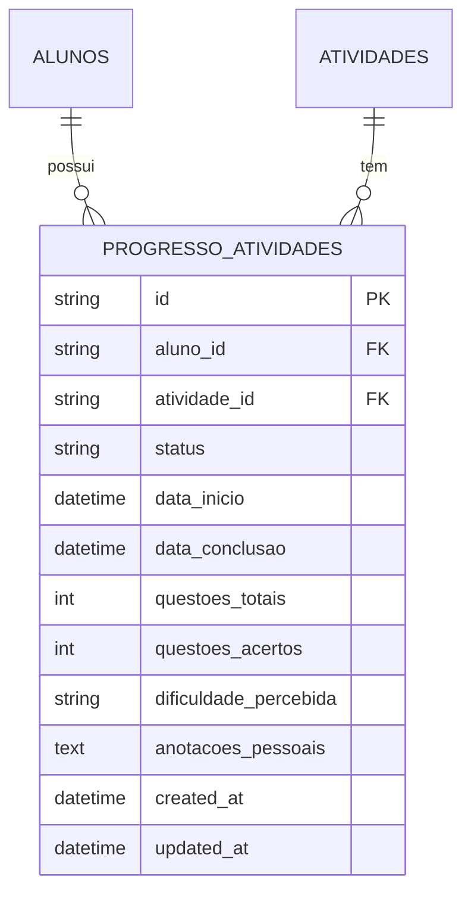
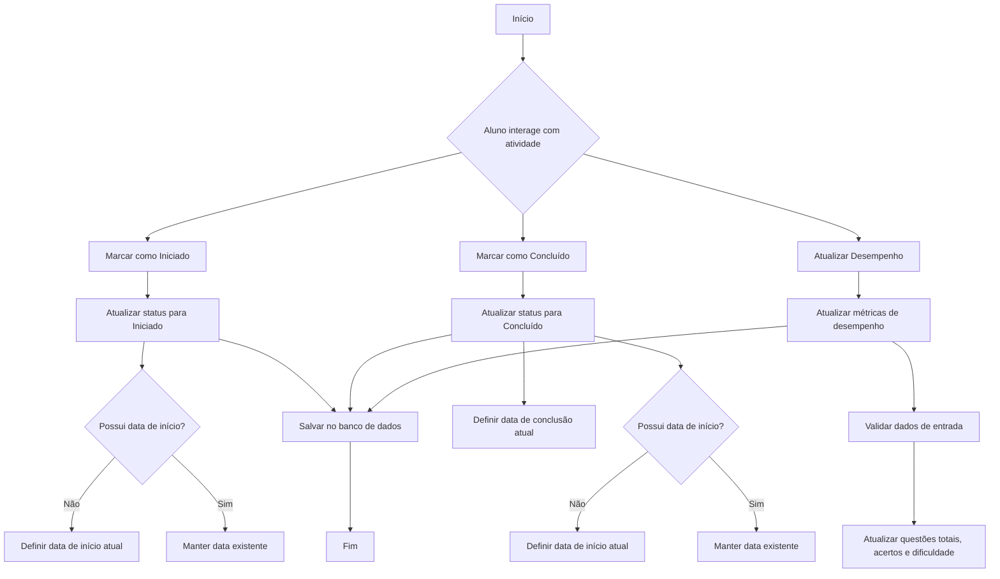
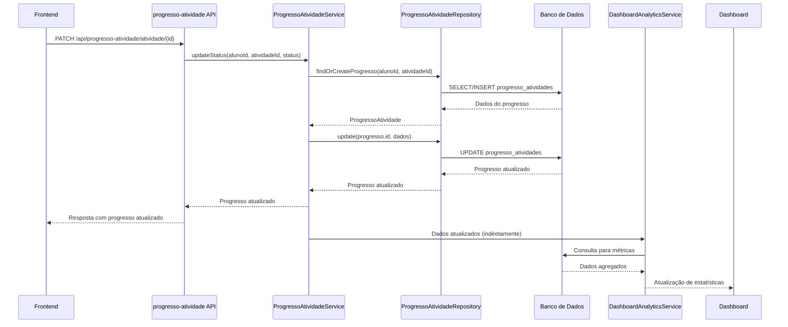
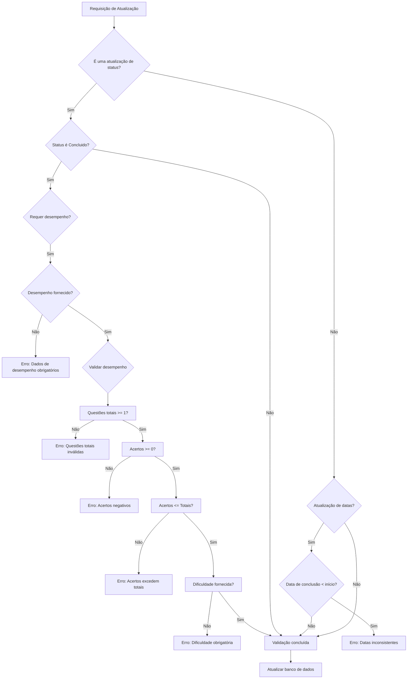
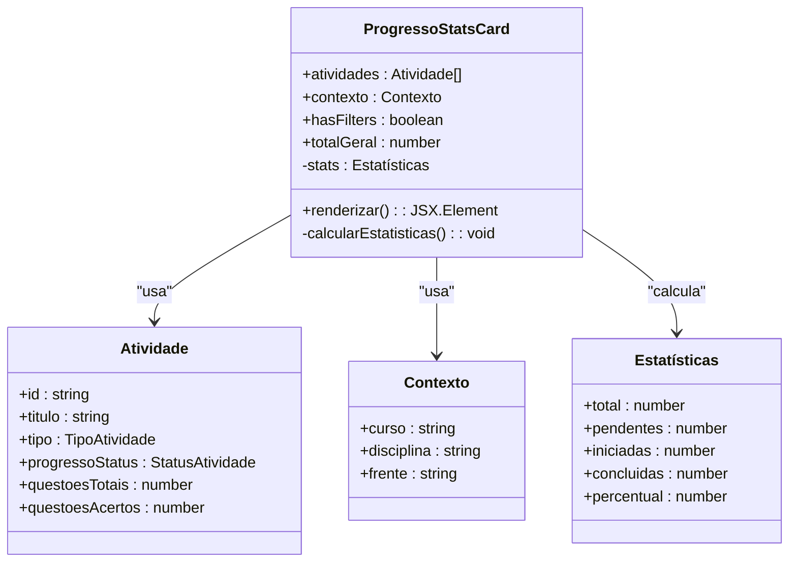
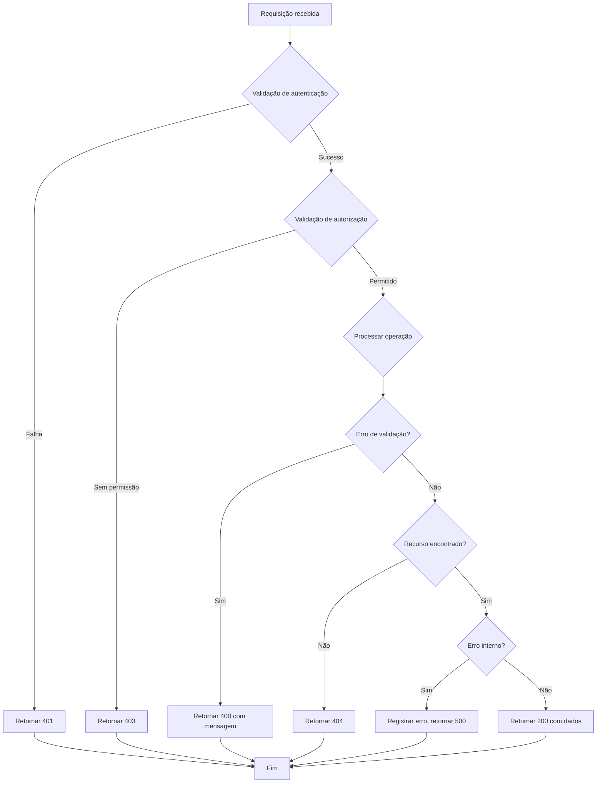

# Serviço de Progresso de Atividade

<cite>
**Arquivos Referenciados neste Documento**   
- [20250131_create_atividades_tables.sql](file://supabase/migrations/20250131_create_atividades_tables.sql)
- [API.md](file://docs/API.md)
- [progresso-atividade.types.ts](file://backend/services/progresso-atividade/progresso-atividade.types.ts)
- [progresso-atividade.service.ts](file://backend/services/progresso-atividade/progresso-atividade.service.ts)
- [progresso-atividade.repository.ts](file://backend/services/progresso-atividade/progresso-atividade.repository.ts)
- [route.ts](file://app/api/progresso-atividade/route.ts)
- [\[id\]\route.ts](file://app/api/progresso-atividade/[id]/route.ts)
- [atividade\[\atividadeId\]\route.ts](file://app/api/progresso-atividade/atividade/[atividadeId]/route.ts)
- [dashboard-analytics.service.ts](file://backend/services/dashboard-analytics/dashboard-analytics.service.ts)
- [progresso-stats-card.tsx](file://components/progresso-stats-card.tsx)
- [GUIA_VISUAL_SALA_ESTUDOS.md](file://docs/GUIA_VISUAL_SALA_ESTUDOS.md)
</cite>

## Sumário
1. [Introdução](#introdução)
2. [Modelo de Dados](#modelo-de-dados)
3. [Operações do Serviço](#operações-do-serviço)
4. [Integrações com Outros Serviços](#integrações-com-outros-serviços)
5. [Validações e Segurança](#validações-e-segurança)
6. [Exemplos de API](#exemplos-de-api)
7. [Consumo no Frontend](#consumo-no-frontend)
8. [Tratamento de Concorrência e Erros](#tratamento-de-concorrência-e-erros)
9. [Considerações Finais](#considerações-finais)

## Introdução

O Serviço de Progresso de Atividade é responsável por rastrear o andamento dos alunos nas atividades do sistema. Ele gerencia o estado de conclusão, o desempenho e o histórico de interação dos alunos com diferentes tipos de atividades acadêmicas. O serviço garante que apenas o aluno proprietário possa modificar seu progresso, mantendo a integridade dos dados e fornecendo informações atualizadas para outros componentes do sistema, como o dashboard de estatísticas.

**Seção fontes**
- [API.md](file://docs/API.md#autenticação)

## Modelo de Dados

O modelo de dados do serviço é composto por uma tabela principal `progresso_atividades` que armazena o estado de cada atividade para cada aluno. A tabela inclui campos para status, timestamps de início e conclusão, métricas de desempenho e anotações pessoais.

### Estrutura da Tabela

A tabela `progresso_atividades` possui os seguintes campos:

- **id**: Identificador único do registro de progresso
- **aluno_id**: Referência ao aluno que realizou a atividade
- **atividade_id**: Referência à atividade específica
- **status**: Estado atual da atividade (Pendente, Iniciado, Concluido)
- **data_inicio**: Timestamp quando o aluno começou a atividade
- **data_conclusao**: Timestamp quando o aluno concluiu a atividade
- **questoes_totais**: Número total de questões na atividade
- **questoes_acertos**: Número de questões respondidas corretamente
- **dificuldade_percebida**: Avaliação subjetiva do aluno sobre a dificuldade
- **anotacoes_pessoais**: Notas ou observações adicionais do aluno
- **created_at**: Data de criação do registro
- **updated_at**: Data da última atualização do registro

### Tipos de Status

O campo `status` utiliza um tipo ENUM com três valores possíveis:
- **Pendente**: A atividade foi atribuída mas ainda não foi iniciada
- **Iniciado**: O aluno começou a trabalhar na atividade
- **Concluido**: A atividade foi finalizada pelo aluno

### Checklists e Métricas

O serviço suporta diferentes tipos de atividades que podem exigir diferentes métricas de acompanhamento. Para atividades que envolvem questões (como listas de exercícios ou simulados), o sistema rastreia o número total de questões e acertos. Para atividades mais qualitativas, como flashcards ou revisões, o foco está no status de conclusão e na dificuldade percebida.



**Fontes do diagrama**
- [20250131_create_atividades_tables.sql](file://supabase/migrations/20250131_create_atividades_tables.sql#L75-L103)
- [progresso-atividade.types.ts](file://backend/services/progresso-atividade/progresso-atividade.types.ts#L10-L23)

**Seção fontes**
- [20250131_create_atividades_tables.sql](file://supabase/migrations/20250131_create_atividades_tables.sql#L75-L103)
- [progresso-atividade.types.ts](file://backend/services/progresso-atividade/progresso-atividade.types.ts#L1-L49)

## Operações do Serviço

O serviço oferece uma variedade de operações para gerenciar o progresso dos alunos, desde a marcação simples de conclusão até atualizações detalhadas de desempenho.

### Marcação de Conclusão

A operação mais comum é a marcação de uma atividade como concluída. Quando um aluno finaliza uma atividade, o serviço atualiza o status para "Concluido" e define automaticamente o timestamp de conclusão. Se a atividade ainda não tiver um timestamp de início, ele também é definido como o momento atual.

### Atualização de Progresso Parcial

Alunos podem atualizar seu progresso parcial em atividades, marcando-as como "Iniciado" antes da conclusão final. Isso permite que o sistema rastreie o engajamento contínuo e forneça insights sobre o tempo médio de conclusão das atividades.

### Recuperação de Histórico

O serviço permite recuperar todo o histórico de progresso de um aluno, fornecendo uma visão completa de todas as atividades realizadas, seus status e métricas de desempenho. Esta funcionalidade é essencial para análises de desempenho ao longo do tempo e para a geração de relatórios.



**Fontes do diagrama**
- [progresso-atividade.service.ts](file://backend/services/progresso-atividade/progresso-atividade.service.ts#L40-L82)
- [progresso-atividade.repository.ts](file://backend/services/progresso-atividade/progresso-atividade.repository.ts#L124-L162)

**Seção fontes**
- [progresso-atividade.service.ts](file://backend/services/progresso-atividade/progresso-atividade.service.ts#L16-L166)
- [progresso-atividade.repository.ts](file://backend/services/progresso-atividade/progresso-atividade.repository.ts#L56-L184)

## Integrações com Outros Serviços

O Serviço de Progresso de Atividade está profundamente integrado com outros componentes do sistema, especialmente com os serviços de Atividade e Aluno, e fornece dados essenciais para o dashboard de estatísticas.

### Integração com Atividade

O serviço valida o tipo de atividade antes de permitir certas operações. Alguns tipos de atividades exigem o registro de desempenho (questões totais, acertos e dificuldade percebida) quando são marcadas como concluídas. Esta validação é feita consultando o serviço de Atividade para determinar os requisitos específicos de cada tipo.

### Integração com Aluno

A integração com o serviço de Aluno é fundamental para garantir que apenas o aluno proprietário possa modificar seu progresso. O sistema verifica a identidade do usuário autenticado contra o ID do aluno no registro de progresso, aplicando políticas de segurança rigorosas.

### Disparo de Eventos para o Dashboard

Quando o progresso de uma atividade é atualizado, especialmente quando marcado como concluído, o sistema dispara atualizações nas estatísticas do dashboard. O serviço de Analytics do Dashboard consulta os dados de progresso para calcular métricas como percentual de conclusão geral, aproveitamento médio e progresso no cronograma.



**Fontes do diagrama**
- [atividade\[\atividadeId\]\route.ts](file://app/api/progresso-atividade/atividade/[atividadeId]/route.ts#L52-L125)
- [progresso-atividade.service.ts](file://backend/services/progresso-atividade/progresso-atividade.service.ts#L40-L82)
- [dashboard-analytics.service.ts](file://backend/services/dashboard-analytics/dashboard-analytics.service.ts#L11-L46)

**Seção fontes**
- [atividade\[\atividadeId\]\route.ts](file://app/api/progresso-atividade/atividade/[atividadeId]/route.ts#L52-L125)
- [dashboard-analytics.service.ts](file://backend/services/dashboard-analytics/dashboard-analytics.service.ts#L11-L800)

## Validções e Segurança

O serviço implementa várias camadas de validação e segurança para garantir a integridade dos dados e a autorização adequada.

### Validação de Autorização

A regra de segurança mais importante é que apenas o aluno pode modificar seu próprio progresso. O sistema verifica isso comparando o ID do usuário autenticado com o ID do aluno no registro de progresso. Professores e superadministradores têm permissões especiais para visualizar e modificar o progresso de qualquer aluno.

As políticas de segurança no nível de linha (RLS) no banco de dados reforçam esta regra:
- **Aluno vê seu progresso**: SELECT apenas quando auth.uid() = aluno_id
- **Aluno atualiza seu progresso**: INSERT apenas quando auth.uid() = aluno_id
- **Aluno edita seu progresso**: UPDATE apenas quando auth.uid() = aluno_id

### Consistência de Dados

O serviço valida rigorosamente os dados de entrada para garantir a consistência:
- A data de conclusão não pode ser anterior à data de início
- O número de acertos não pode exceder o número total de questões
- O número de acertos não pode ser negativo
- Para atividades que exigem desempenho, todos os campos relevantes devem ser fornecidos



**Fontes do diagrama**
- [progresso-atividade.service.ts](file://backend/services/progresso-atividade/progresso-atividade.service.ts#L131-L150)
- [atividade\[\atividadeId\]\route.ts](file://app/api/progresso-atividade/atividade/[atividadeId]/route.ts#L71-L110)

**Seção fontes**
- [progresso-atividade.service.ts](file://backend/services/progresso-atividade/progresso-atividade.service.ts#L131-L150)
- [20250131_create_atividades_tables.sql](file://supabase/migrations/20250131_create_atividades_tables.sql#L135-L140)

## Exemplos de API

A seguir estão exemplos de chamadas API para interagir com o Serviço de Progresso de Atividade.

### Marcar Atividade como Concluída

Para marcar uma atividade como concluída, envie uma requisição PATCH para o endpoint específico da atividade:

```http
PATCH /api/progresso-atividade/atividade/{atividadeId}
Authorization: Bearer <jwt_token>
Content-Type: application/json

{
  "status": "Concluido"
}
```

Se a atividade exigir registro de desempenho, inclua os dados relevantes:

```http
PATCH /api/progresso-atividade/atividade/{atividadeId}
Authorization: Bearer <jwt_token>
Content-Type: application/json

{
  "status": "Concluido",
  "desempenho": {
    "questoesTotais": 20,
    "questoesAcertos": 15,
    "dificuldadePercebida": "Medio",
    "anotacoesPessoais": "Tive dificuldade nas questões de geometria"
  }
}
```

**Seção fontes**
- [atividade\[\atividadeId\]\route.ts](file://app/api/progresso-atividade/atividade/[atividadeId]/route.ts#L52-L125)

## Consumo no Frontend

O frontend consome os dados do serviço de progresso de atividade para exibir informações relevantes aos alunos e professores.

### Componente de Estatísticas de Progresso

O componente `progresso-stats-card.tsx` exibe um resumo visual do progresso do aluno, incluindo contagens de atividades pendentes, iniciadas e concluídas, além de um percentual geral de conclusão. Este componente consulta os dados de progresso para calcular essas métricas e atualizá-las em tempo real.



**Fontes do diagrama**
- [progresso-stats-card.tsx](file://components/progresso-stats-card.tsx#L39-L126)
- [GUIA_VISUAL_SALA_ESTUDOS.md](file://docs/GUIA_VISUAL_SALA_ESTUDOS.md#L302-L320)

**Seção fontes**
- [progresso-stats-card.tsx](file://components/progresso-stats-card.tsx#L39-L126)

## Tratamento de Concorrência e Erros

O serviço implementa estratégias robustas para lidar com cenários de concorrência e tratamento de erros.

### Cenários de Concorrência

Em cenários onde múltiplas requisições tentam atualizar o mesmo registro de progresso simultaneamente, o banco de dados garante a consistência através de transações e bloqueios de linha. O uso de triggers para atualizar automaticamente o campo `updated_at` também ajuda a manter a integridade temporal dos dados.

### Estratégias de Tratamento de Erros

O serviço implementa um sistema de tratamento de erros em camadas:
- **Validação de entrada**: Erros de validação são capturados e retornados com status 400
- **Erros de recurso não encontrado**: Quando um progresso não existe, retorna status 404
- **Erros de autorização**: Quando um usuário tenta acessar dados que não pertencem a ele, retorna status 403
- **Erros internos**: Erros inesperados são registrados e retornam status 500, com detalhes expostos apenas em ambiente de desenvolvimento

As classes de erro personalizadas `ProgressoNotFoundError`, `ProgressoValidationError` e `ProgressoConflictError` permitem um tratamento diferenciado dos diferentes tipos de falhas.



**Fontes do diagrama**
- [route.ts](file://app/api/progresso-atividade/route.ts#L20-L43)
- [progresso-atividade.errors.ts](file://backend/services/progresso-atividade/progresso-atividade.errors.ts#L1-L24)

**Seção fontes**
- [route.ts](file://app/api/progresso-atividade/route.ts#L20-L43)
- [progresso-atividade.errors.ts](file://backend/services/progresso-atividade/progresso-atividade.errors.ts#L1-L24)

## Considerações Finais

O Serviço de Progresso de Atividade é um componente central no ecossistema de aprendizado, fornecendo um sistema robusto e seguro para rastrear o andamento dos alunos. Sua integração com outros serviços permite uma visão holística do desempenho acadêmico, enquanto suas políticas de segurança garantem a integridade dos dados. A arquitetura modular, com separação clara entre service, repository e API routes, facilita a manutenção e a evolução futura do sistema.