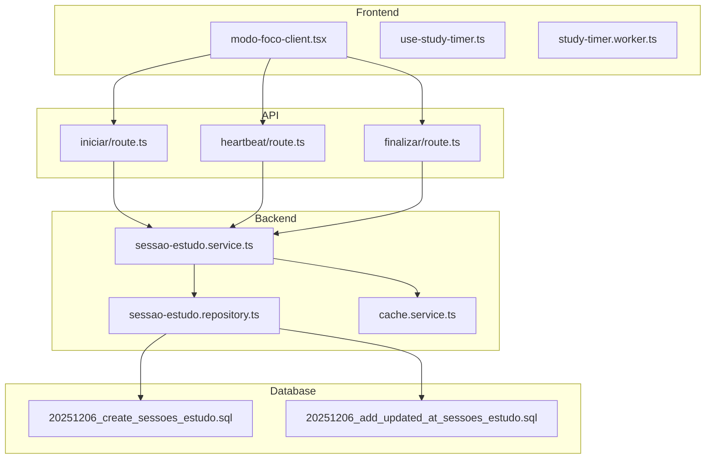
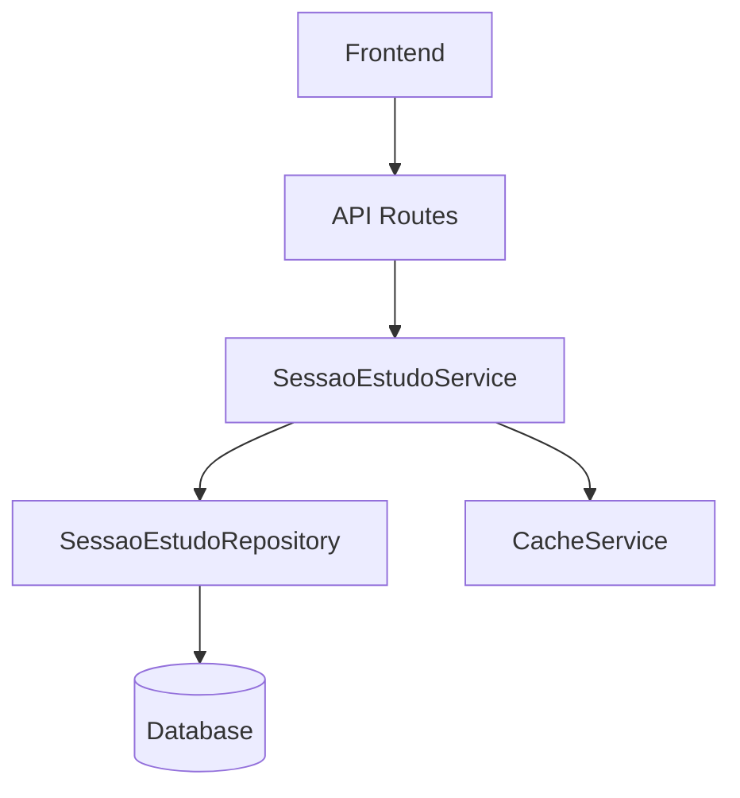
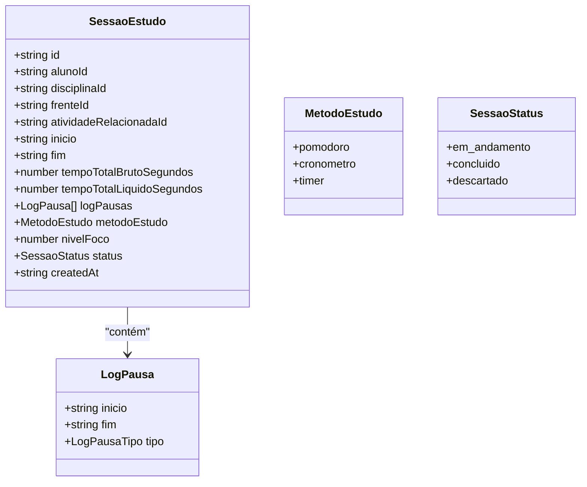
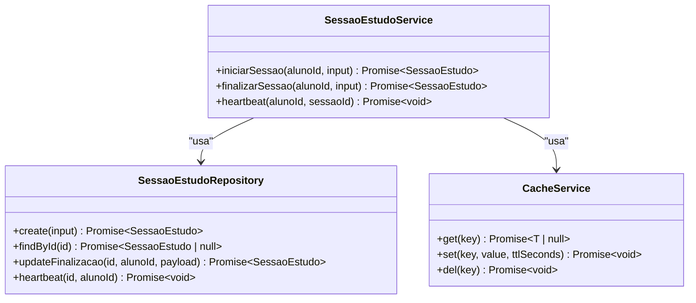
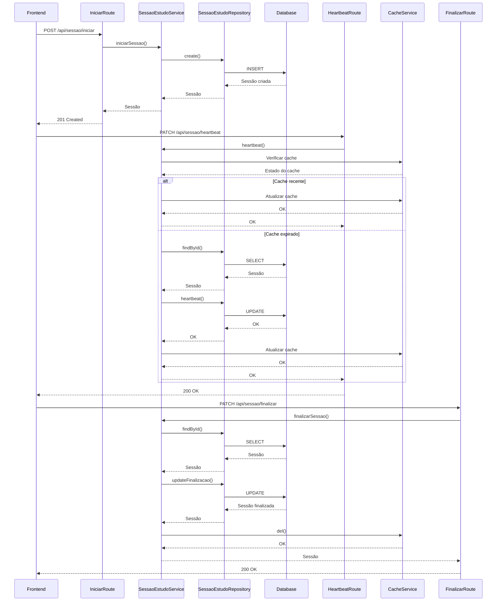
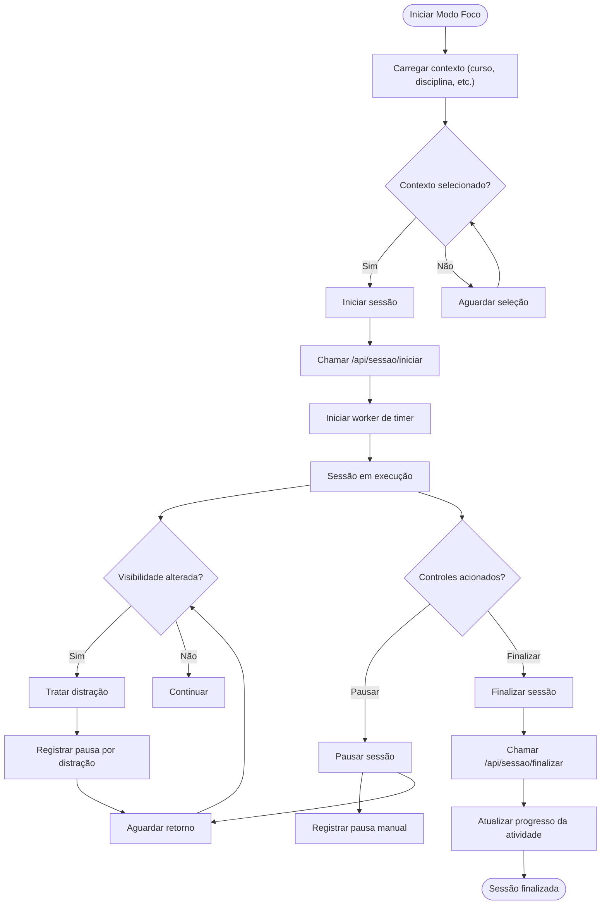
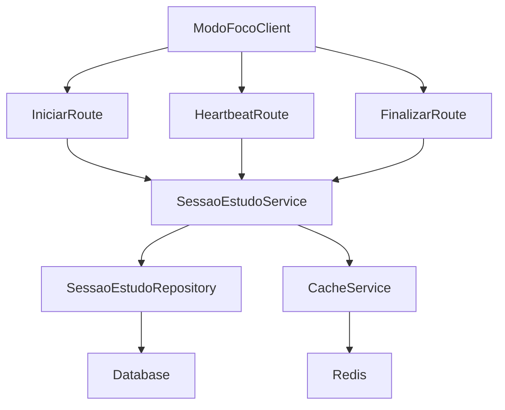

# Serviço de Sessão de Estudo

<cite>
**Arquivos Referenciados neste Documento**   
- [sessao-estudo.ts](file://types/sessao-estudo.ts)
- [sessao-estudo.service.ts](file://backend/services/sessao-estudo/sessao-estudo.service.ts)
- [sessao-estudo.repository.ts](file://backend/services/sessao-estudo/sessao-estudo.repository.ts)
- [20251206_create_sessoes_estudo.sql](file://supabase/migrations/20251206_create_sessoes_estudo.sql)
- [20251206_add_updated_at_sessoes_estudo.sql](file://supabase/migrations/20251206_add_updated_at_sessoes_estudo.sql)
- [use-study-timer.ts](file://hooks/use-study-timer.ts)
- [study-timer.worker.ts](file://workers/study-timer.worker.ts)
- [modo-foco-client.tsx](file://app/(dashboard)/aluno/modo-foco/modo-foco-client.tsx)
- [iniciar/route.ts](file://app/api/sessao/iniciar/route.ts)
- [heartbeat/route.ts](file://app/api/sessao/heartbeat/route.ts)
- [finalizar/route.ts](file://app/api/sessao/finalizar/route.ts)
- [cache.service.ts](file://backend/services/cache/cache.service.ts)
</cite>

## Sumário
1. [Introdução](#introdução)
2. [Estrutura do Projeto](#estrutura-do-projeto)
3. [Componentes Principais](#componentes-principais)
4. [Visão Geral da Arquitetura](#visão-geral-da-arquitetura)
5. [Análise Detalhada dos Componentes](#análise-detalhada-dos-componentes)
6. [Análise de Dependência](#análise-de-dependência)
7. [Considerações de Desempenho](#considerações-de-desempenho)
8. [Guia de Solução de Problemas](#guia-de-solução-de-problemas)
9. [Conclusão](#conclusão)

## Introdução
O Serviço de Sessão de Estudo é um componente central do sistema que rastreia períodos ativos de estudo dos alunos, especialmente no modo foco. Ele permite registrar o início, heartbeats e finalização de sessões, fornecendo dados cruciais para métricas de produtividade. Este documento detalha o funcionamento do serviço, seu modelo de dados, operações de criação, atualização e encerramento, além da integração com o frontend e estratégias para garantir a integridade dos dados.

## Estrutura do Projeto
O serviço de sessão de estudo está organizado em várias camadas, incluindo definições de tipos, serviços, repositórios, rotas de API e componentes frontend. A estrutura reflete um padrão de arquitetura clara, separando responsabilidades entre camadas de domínio, persistência e apresentação.

**Fontes do Diagrama**
- [modo-foco-client.tsx](file://app/(dashboard)/aluno/modo-foco/modo-foco-client.tsx)
- [iniciar/route.ts](file://app/api/sessao/iniciar/route.ts)
- [heartbeat/route.ts](file://app/api/sessao/heartbeat/route.ts)
- [finalizar/route.ts](file://app/api/sessao/finalizar/route.ts)
- [sessao-estudo.service.ts](file://backend/services/sessao-estudo/sessao-estudo.service.ts)
- [sessao-estudo.repository.ts](file://backend/services/sessao-estudo/sessao-estudo.repository.ts)
- [cache.service.ts](file://backend/services/cache/cache.service.ts)
- [20251206_create_sessoes_estudo.sql](file://supabase/migrations/20251206_create_sessoes_estudo.sql)
- [20251206_add_updated_at_sessoes_estudo.sql](file://supabase/migrations/20251206_add_updated_at_sessoes_estudo.sql)

**Fontes da Seção**
- [modo-foco-client.tsx](file://app/(dashboard)/aluno/modo-foco/modo-foco-client.tsx)
- [iniciar/route.ts](file://app/api/sessao/iniciar/route.ts)
- [heartbeat/route.ts](file://app/api/sessao/heartbeat/route.ts)
- [finalizar/route.ts](file://app/api/sessao/finalizar/route.ts)
- [sessao-estudo.service.ts](file://backend/services/sessao-estudo/sessao-estudo.service.ts)
- [sessao-estudo.repository.ts](file://backend/services/sessao-estudo/sessao-estudo.repository.ts)
- [cache.service.ts](file://backend/services/cache/cache.service.ts)
- [20251206_create_sessoes_estudo.sql](file://supabase/migrations/20251206_create_sessoes_estudo.sql)
- [20251206_add_updated_at_sessoes_estudo.sql](file://supabase/migrations/20251206_add_updated_at_sessoes_estudo.sql)

## Componentes Principais
Os componentes principais do serviço de sessão de estudo incluem o modelo de dados, o serviço de domínio, o repositório de persistência, as rotas de API e os componentes frontend que interagem com o usuário. Cada componente tem uma responsabilidade bem definida, facilitando a manutenção e a escalabilidade do sistema.

**Fontes da Seção**
- [sessao-estudo.ts](file://types/sessao-estudo.ts)
- [sessao-estudo.service.ts](file://backend/services/sessao-estudo/sessao-estudo.service.ts)
- [sessao-estudo.repository.ts](file://backend/services/sessao-estudo/sessao-estudo.repository.ts)
- [iniciar/route.ts](file://app/api/sessao/iniciar/route.ts)
- [heartbeat/route.ts](file://app/api/sessao/heartbeat/route.ts)
- [finalizar/route.ts](file://app/api/sessao/finalizar/route.ts)
- [modo-foco-client.tsx](file://app/(dashboard)/aluno/modo-foco/modo-foco-client.tsx)

## Visão Geral da Arquitetura
A arquitetura do serviço de sessão de estudo é baseada em um padrão de camadas, onde cada camada tem uma responsabilidade específica. O frontend interage com o backend através de rotas de API, que por sua vez utilizam serviços de domínio para executar lógica de negócios e repositórios para persistir dados no banco de dados.

**Fontes do Diagrama**
- [sessao-estudo.service.ts](file://backend/services/sessao-estudo/sessao-estudo.service.ts)
- [sessao-estudo.repository.ts](file://backend/services/sessao-estudo/sessao-estudo.repository.ts)
- [iniciar/route.ts](file://app/api/sessao/iniciar/route.ts)
- [heartbeat/route.ts](file://app/api/sessao/heartbeat/route.ts)
- [finalizar/route.ts](file://app/api/sessao/finalizar/route.ts)
- [cache.service.ts](file://backend/services/cache/cache.service.ts)

## Análise Detalhada dos Componentes

### Análise do Modelo de Dados
O modelo de dados para sessões de estudo é definido na interface `SessaoEstudo`, que inclui campos para identificação, contexto do estudo, tempos, logs de pausas, qualidade e metadados.

**Fontes do Diagrama**
- [sessao-estudo.ts](file://types/sessao-estudo.ts)

**Fontes da Seção**
- [sessao-estudo.ts](file://types/sessao-estudo.ts)

### Análise do Serviço de Sessão de Estudo
O serviço `SessaoEstudoService` é responsável por encapsular a lógica de negócios relacionada às sessões de estudo. Ele fornece métodos para iniciar, finalizar e registrar heartbeats de sessões, garantindo a validação dos dados e a integridade das operações.

**Fontes do Diagrama**
- [sessao-estudo.service.ts](file://backend/services/sessao-estudo/sessao-estudo.service.ts)
- [sessao-estudo.repository.ts](file://backend/services/sessao-estudo/sessao-estudo.repository.ts)
- [cache.service.ts](file://backend/services/cache/cache.service.ts)

**Fontes da Seção**
- [sessao-estudo.service.ts](file://backend/services/sessao-estudo/sessao-estudo.service.ts)
- [sessao-estudo.repository.ts](file://backend/services/sessao-estudo/sessao-estudo.repository.ts)
- [cache.service.ts](file://backend/services/cache/cache.service.ts)

### Análise das Rotas de API
As rotas de API fornecem a interface entre o frontend e o backend, permitindo que o frontend inicie, finalize e registre heartbeats de sessões de estudo.

**Fontes do Diagrama**
- [iniciar/route.ts](file://app/api/sessao/iniciar/route.ts)
- [heartbeat/route.ts](file://app/api/sessao/heartbeat/route.ts)
- [finalizar/route.ts](file://app/api/sessao/finalizar/route.ts)
- [sessao-estudo.service.ts](file://backend/services/sessao-estudo/sessao-estudo.service.ts)
- [sessao-estudo.repository.ts](file://backend/services/sessao-estudo/sessao-estudo.repository.ts)
- [cache.service.ts](file://backend/services/cache/cache.service.ts)

**Fontes da Seção**
- [iniciar/route.ts](file://app/api/sessao/iniciar/route.ts)
- [heartbeat/route.ts](file://app/api/sessao/heartbeat/route.ts)
- [finalizar/route.ts](file://app/api/sessao/finalizar/route.ts)
- [sessao-estudo.service.ts](file://backend/services/sessao-estudo/sessao-estudo.service.ts)
- [sessao-estudo.repository.ts](file://backend/services/sessao-estudo/sessao-estudo.repository.ts)
- [cache.service.ts](file://backend/services/cache/cache.service.ts)

### Análise do Frontend
O componente frontend `modo-foco-client.tsx` é responsável por fornecer a interface de usuário para o modo foco, permitindo que o aluno inicie, pause, resuma e finalize sessões de estudo.

**Fontes do Diagrama**
- [modo-foco-client.tsx](file://app/(dashboard)/aluno/modo-foco/modo-foco-client.tsx)
- [use-study-timer.ts](file://hooks/use-study-timer.ts)
- [study-timer.worker.ts](file://workers/study-timer.worker.ts)

**Fontes da Seção**
- [modo-foco-client.tsx](file://app/(dashboard)/aluno/modo-foco/modo-foco-client.tsx)
- [use-study-timer.ts](file://hooks/use-study-timer.ts)
- [study-timer.worker.ts](file://workers/study-timer.worker.ts)

## Análise de Dependência
O serviço de sessão de estudo depende de vários componentes do sistema, incluindo o banco de dados, o serviço de cache e as rotas de API. Essas dependências são gerenciadas através de injeção de dependência no construtor do serviço.

**Fontes do Diagrama**
- [sessao-estudo.service.ts](file://backend/services/sessao-estudo/sessao-estudo.service.ts)
- [sessao-estudo.repository.ts](file://backend/services/sessao-estudo/sessao-estudo.repository.ts)
- [cache.service.ts](file://backend/services/cache/cache.service.ts)
- [iniciar/route.ts](file://app/api/sessao/iniciar/route.ts)
- [heartbeat/route.ts](file://app/api/sessao/heartbeat/route.ts)
- [finalizar/route.ts](file://app/api/sessao/finalizar/route.ts)
- [modo-foco-client.tsx](file://app/(dashboard)/aluno/modo-foco/modo-foco-client.tsx)

**Fontes da Seção**
- [sessao-estudo.service.ts](file://backend/services/sessao-estudo/sessao-estudo.service.ts)
- [sessao-estudo.repository.ts](file://backend/services/sessao-estudo/sessao-estudo.repository.ts)
- [cache.service.ts](file://backend/services/cache/cache.service.ts)
- [iniciar/route.ts](file://app/api/sessao/iniciar/route.ts)
- [heartbeat/route.ts](file://app/api/sessao/heartbeat/route.ts)
- [finalizar/route.ts](file://app/api/sessao/finalizar/route.ts)
- [modo-foco-client.tsx](file://app/(dashboard)/aluno/modo-foco/modo-foco-client.tsx)

## Considerações de Desempenho
O serviço de sessão de estudo utiliza um serviço de cache para melhorar o desempenho, especialmente no registro de heartbeats. O cache é usado para evitar atualizações frequentes no banco de dados, reduzindo a carga no sistema.

**Fontes da Seção**
- [sessao-estudo.service.ts](file://backend/services/sessao-estudo/sessao-estudo.service.ts)
- [cache.service.ts](file://backend/services/cache/cache.service.ts)

## Guia de Solução de Problemas
O serviço de sessão de estudo inclui tratamento de erros para garantir a integridade dos dados e fornecer feedback adequado ao usuário. Erros comuns incluem validação de entrada, sessão não encontrada e erros internos.

**Fontes da Seção**
- [sessao-estudo.service.ts](file://backend/services/sessao-estudo/sessao-estudo.service.ts)
- [iniciar/route.ts](file://app/api/sessao/iniciar/route.ts)
- [heartbeat/route.ts](file://app/api/sessao/heartbeat/route.ts)
- [finalizar/route.ts](file://app/api/sessao/finalizar/route.ts)

## Conclusão
O Serviço de Sessão de Estudo é um componente robusto e bem projetado que rastreia períodos ativos de estudo dos alunos, fornecendo dados valiosos para métricas de produtividade. Sua arquitetura modular e uso de cache garantem desempenho e escalabilidade, enquanto o tratamento de erros e a integração com o frontend proporcionam uma experiência de usuário fluida.