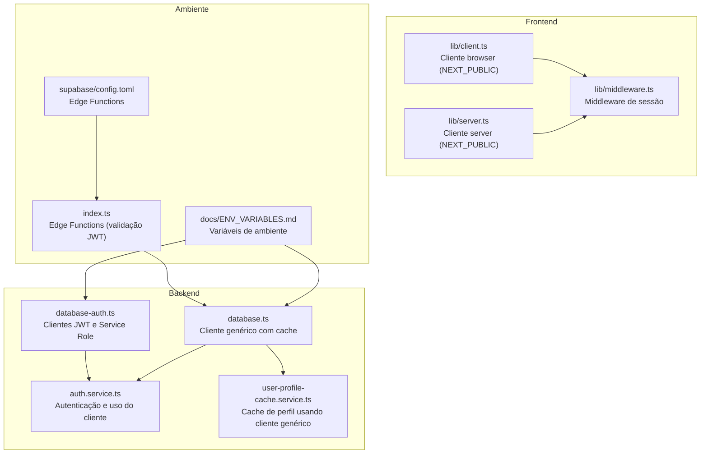
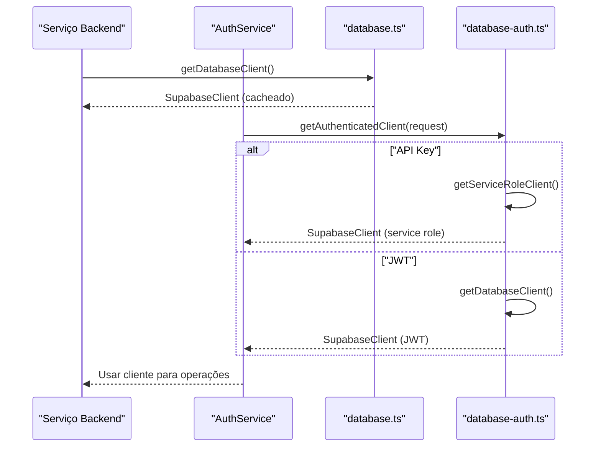
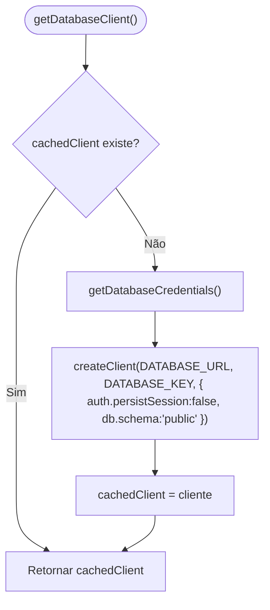
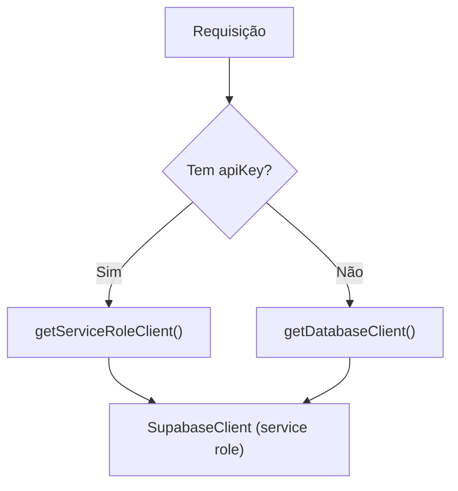
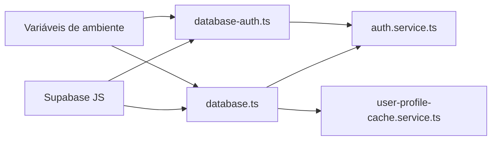

# Clientes de Banco de Dados e Conexão

<cite>
**Arquivo referenciados nesta documentação**
- [backend/clients/database.ts](file://backend/clients/database.ts)
- [backend/clients/database-auth.ts](file://backend/clients/database-auth.ts)
- [backend/auth/auth.service.ts](file://backend/auth/auth.service.ts)
- [backend/services/cache/user-profile-cache.service.ts](file://backend/services/cache/user-profile-cache.service.ts)
- [lib/client.ts](file://lib/client.ts)
- [lib/server.ts](file://lib/server.ts)
- [lib/middleware.ts](file://lib/middleware.ts)
- [docs/ENV_VARIABLES.md](file://docs/ENV_VARIABLES.md)
- [supabase/config.toml](file://supabase/config.toml)
- [index.ts](file://index.ts)
</cite>

## Sumário
1. [Introdução](#introdução)
2. [Estrutura do Projeto](#estrutura-do-projeto)
3. [Componentes Principais](#componentes-principais)
4. [Visão Geral da Arquitetura](#visão-geral-da-arquitetura)
5. [Análise Detalhada dos Componentes](#análise-detalhada-dos-componentes)
6. [Análise de Dependências](#análise-de-dependências)
7. [Considerações de Segurança](#considerações-de-segurança)
8. [Guia de Configuração em Ambientes](#guia-de-configuração-em-ambientes)
9. [Considerações de Desempenho](#considerações-de-desempenho)
10. [Guia de Solução de Problemas](#guia-de-solução-de-problemas)
11. [Conclusão](#conclusão)

## Introdução
Esta documentação explica como o backend obtém e utiliza clientes de banco de dados Supabase com cache de conexão, suporte a múltiplas chaves de autenticação e configurações específicas como schema público e persistência de sessão desativada. Também aborda o uso de funções de invalidação de cache, exemplos práticos de obtenção e utilização do cliente em serviços, além de orientações de segurança e configuração em diferentes ambientes.

## Estrutura do Projeto
O backend organiza os clientes Supabase em dois módulos:
- Um cliente genérico com cache e configurações padrão (schema público, sem persistência de sessão).
- Um cliente especializado com suporte a autenticação via JWT (RLS respeitada) e via API Key (service role, bypass RLS).

**Diagrama fontes**
- [backend/clients/database.ts](file://backend/clients/database.ts#L1-L42)
- [backend/clients/database-auth.ts](file://backend/clients/database-auth.ts#L1-L67)
- [backend/auth/auth.service.ts](file://backend/auth/auth.service.ts#L40-L140)
- [backend/services/cache/user-profile-cache.service.ts](file://backend/services/cache/user-profile-cache.service.ts#L1-L53)
- [lib/client.ts](file://lib/client.ts#L1-L8)
- [lib/server.ts](file://lib/server.ts#L1-L33)
- [lib/middleware.ts](file://lib/middleware.ts#L1-L39)
- [docs/ENV_VARIABLES.md](file://docs/ENV_VARIABLES.md#L1-L138)
- [supabase/config.toml](file://supabase/config.toml#L1-L15)
- [index.ts](file://index.ts#L77-L147)

**Fontes da seção**
- [backend/clients/database.ts](file://backend/clients/database.ts#L1-L42)
- [backend/clients/database-auth.ts](file://backend/clients/database-auth.ts#L1-L67)
- [docs/ENV_VARIABLES.md](file://docs/ENV_VARIABLES.md#L1-L138)

## Componentes Principais
- Cliente genérico com cache e configurações:
  - Cache de conexão único.
  - Escolha de chave com prioridade entre SUPABASE_SECRET_KEY, SUPABASE_PUBLISHABLE_KEY, SUPABASE_SERVICE_ROLE_KEY e SUPABASE_ANON_KEY.
  - Schema definido como “public”.
  - Persistência de sessão desativada.
  - Função de invalidação de cache.

- Clientes autenticados:
  - Cliente JWT (RLS respeitada).
  - Cliente Service Role (bypass RLS).
  - Seleção automática baseada no tipo de autenticação (JWT vs API Key).

**Fontes da seção**
- [backend/clients/database.ts](file://backend/clients/database.ts#L1-L42)
- [backend/clients/database-auth.ts](file://backend/clients/database-auth.ts#L1-L67)

## Visão Geral da Arquitetura
O fluxo típico de uso envolve:
- Serviços no backend obtendo o cliente apropriado.
- Autenticação de usuários usando o cliente JWT.
- Operações administrativas com o cliente Service Role.
- Cache de perfis e outras consultas usando o cliente genérico com cache.

**Diagrama fontes**
- [backend/clients/database.ts](file://backend/clients/database.ts#L23-L41)
- [backend/clients/database-auth.ts](file://backend/clients/database-auth.ts#L24-L66)
- [backend/auth/auth.service.ts](file://backend/auth/auth.service.ts#L40-L140)

## Análise Detalhada dos Componentes

### Cliente Genérico com Cache e Configurações
- Cache de conexão:
  - Variável global armazena o cliente criado.
  - Primeira chamada cria o cliente com as opções configuradas.
  - Chamadas subsequentes retornam o mesmo cliente.

- Escolha de credenciais:
  - Prioridade de SUPABASE_SECRET_KEY, SUPABASE_PUBLISHABLE_KEY, SUPABASE_SERVICE_ROLE_KEY e SUPABASE_ANON_KEY.
  - Validação de presença de SUPABASE_URL e uma das chaves.

- Configurações:
  - auth.persistSession: false
  - db.schema: "public"

- Função de invalidação:
  - clearDatabaseClientCache redefine o cache, forçando recriação do cliente.

**Diagrama fontes**
- [backend/clients/database.ts](file://backend/clients/database.ts#L5-L41)

**Fontes da seção**
- [backend/clients/database.ts](file://backend/clients/database.ts#L1-L42)

### Clientes JWT e Service Role
- Cliente JWT:
  - Usado para operações normais com RLS respeitada.
  - Persistência de sessão desativada.

- Cliente Service Role:
  - Usado para operações administrativas (bypass RLS).
  - Requer SUPABASE_SERVICE_ROLE_KEY ou SUPABASE_SECRET_KEY.
  - Cache separado.

- Seleção automática:
  - Se a requisição contém apiKey, usa o service role client.
  - Caso contrário, usa o cliente JWT.

**Diagrama fontes**
- [backend/clients/database-auth.ts](file://backend/clients/database-auth.ts#L24-L66)

**Fontes da seção**
- [backend/clients/database-auth.ts](file://backend/clients/database-auth.ts#L1-L67)

### Exemplos de Uso em Serviços
- Autenticação de usuários:
  - AuthService utiliza o cliente JWT para login, logout, refresh e obtenção do usuário atual.

- Cache de perfil:
  - UserProfileCacheService obtém o cliente genérico e consulta dados de autenticação e perfis.

**Fontes da seção**
- [backend/auth/auth.service.ts](file://backend/auth/auth.service.ts#L40-L140)
- [backend/services/cache/user-profile-cache.service.ts](file://backend/services/cache/user-profile-cache.service.ts#L1-L53)

### Configuração do Cliente Supabase
- Schema público:
  - Definido em database.ts com db.schema: "public".

- Persistência de sessão desativada:
  - Definido em database.ts com auth.persistSession: false.

- Edge Functions:
  - Supabase config desativa verify_jwt para funções e desativa Storage temporariamente.

**Fontes da seção**
- [backend/clients/database.ts](file://backend/clients/database.ts#L23-L36)
- [supabase/config.toml](file://supabase/config.toml#L1-L15)

## Análise de Dependências
- database.ts depende de:
  - @supabase/supabase-js
  - Variáveis de ambiente SUPABASE_URL e SUPABASE_SECRET_KEY/SUPABASE_SERVICE_ROLE_KEY/SUPABASE_PUBLISHABLE_KEY/SUPABASE_ANON_KEY

- database-auth.ts depende de:
  - @supabase/supabase-js
  - Middleware de autenticação (AuthenticatedRequest)
  - Mesma lógica de credenciais, mas com cache separado e service role

- Uso em serviços:
  - AuthService e UserProfileCacheService dependem de database.ts
  - database-auth.ts é usado indiretamente via getAuthenticatedClient()

**Diagrama fontes**
- [backend/clients/database.ts](file://backend/clients/database.ts#L1-L42)
- [backend/clients/database-auth.ts](file://backend/clients/database-auth.ts#L1-L67)
- [backend/auth/auth.service.ts](file://backend/auth/auth.service.ts#L40-L140)
- [backend/services/cache/user-profile-cache.service.ts](file://backend/services/cache/user-profile-cache.service.ts#L1-L53)

**Fontes da seção**
- [backend/clients/database.ts](file://backend/clients/database.ts#L1-L42)
- [backend/clients/database-auth.ts](file://backend/clients/database-auth.ts#L1-L67)
- [backend/auth/auth.service.ts](file://backend/auth/auth.service.ts#L40-L140)
- [backend/services/cache/user-profile-cache.service.ts](file://backend/services/cache/user-profile-cache.service.ts#L1-L53)

## Considerações de Segurança
- Variáveis de ambiente:
  - SUPABASE_URL e SUPABASE_SECRET_KEY devem ser privadas (não NEXT_PUBLIC).
  - NEXT_PUBLIC_SUPABASE_URL e NEXT_PUBLIC_SUPABASE_PUBLISHABLE_OR_ANON_KEY são públicas e usadas no frontend.

- Proteção contra vazamento de chaves:
  - Nunca expor SUPABASE_SECRET_KEY no frontend.
  - Evitar commit de arquivos .env ou .env.local.
  - Em ambientes serverless, evite caches em memória compartilhada; utilize Redis Upstash.

- Validação manual de JWT em Edge Functions:
  - verify_jwt desativado; validação feita via getUser() com Authorization header.

**Fontes da seção**
- [docs/ENV_VARIABLES.md](file://docs/ENV_VARIABLES.md#L1-L138)
- [index.ts](file://index.ts#L77-L147)
- [supabase/config.toml](file://supabase/config.toml#L1-L15)

## Guia de Configuração em Ambientes
- Desenvolvimento local:
  - Crie .env.local com NEXT_PUBLIC_SUPABASE_URL, NEXT_PUBLIC_SUPABASE_PUBLISHABLE_OR_ANON_KEY, SUPABASE_URL, SUPABASE_SECRET_KEY e, opcionalmente, UPSTASH_REDIS_*.
  - O arquivo .env.local está no .gitignore e NUNCA deve ser commitado.

- Produção (Vercel):
  - Configure as mesmas variáveis em Settings > Environment Variables.
  - Diferencie valores para Production, Preview e Development.

- Edge Functions:
  - SUPABASE_ANON_KEY disponível em runtime Deno.
  - verify_jwt desativado em config.toml.

**Fontes da seção**
- [docs/ENV_VARIABLES.md](file://docs/ENV_VARIABLES.md#L67-L107)
- [supabase/config.toml](file://supabase/config.toml#L1-L15)
- [index.ts](file://index.ts#L106-L147)

## Considerações de Desempenho
- Cache de conexão:
  - Evita criar múltiplos clientes Supabase no mesmo processo.
  - Reduz overhead de inicialização e configuração.

- Persistência de sessão desativada:
  - Menos sobrecarga com cookies de sessão e menos risco de inconsistência em funções serverless.

- Recomendação de cache adicional:
  - Para consultas frequentes, utilize cache Redis (UPSTASH_REDIS_REST_URL e UPSTASH_REDIS_REST_TOKEN).
  - Evite cache em memória compartilhada em ambientes serverless.

**Fontes da seção**
- [backend/clients/database.ts](file://backend/clients/database.ts#L23-L41)
- [docs/ENV_VARIABLES.md](file://docs/ENV_VARIABLES.md#L32-L46)

## Guia de Solução de Problemas
- Erro de credenciais ausentes:
  - Confirme que SUPABASE_URL e pelo menos uma das chaves (SUPABASE_SECRET_KEY, SUPABASE_SERVICE_ROLE_KEY, SUPABASE_PUBLISHABLE_KEY, SUPABASE_ANON_KEY) estejam configuradas.

- Falha na autenticação em Edge Functions:
  - Verifique que Authorization header esteja presente e válido.
  - Confirme que SUPABASE_ANON_KEY esteja configurada no runtime.

- Problemas com RLS:
  - Para operações administrativas, utilize o cliente Service Role (database-auth.ts).
  - Para operações normais, utilize o cliente JWT.

- Invalidação de cache:
  - Use clearDatabaseClientCache quando houver alterações no schema ou configurações que exigem recriação do cliente.

**Fontes da seção**
- [backend/clients/database.ts](file://backend/clients/database.ts#L5-L21)
- [backend/clients/database-auth.ts](file://backend/clients/database-auth.ts#L19-L41)
- [index.ts](file://index.ts#L106-L147)

## Conclusão
O backend utiliza clientes Supabase com cache de conexão e configurações específicas (schema público, sem persistência de sessão) para otimizar desempenho e manter segurança. A escolha entre clientes JWT e Service Role é feita automaticamente com base no tipo de autenticação, permitindo operações normais com RLS respeitada e operações administrativas com bypass. Para ambientes serverless, recomenda-se o uso de Redis para cache e rigoroso controle de variáveis de ambiente.