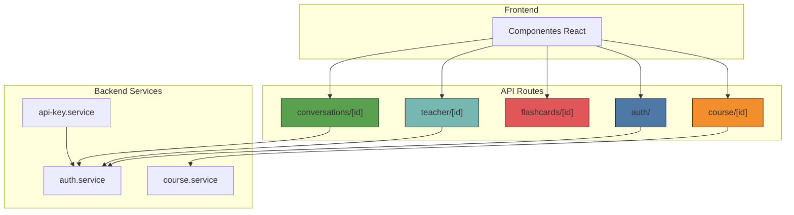
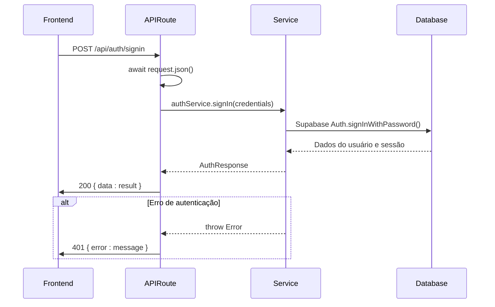
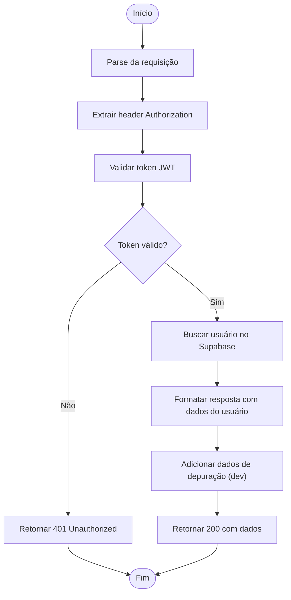
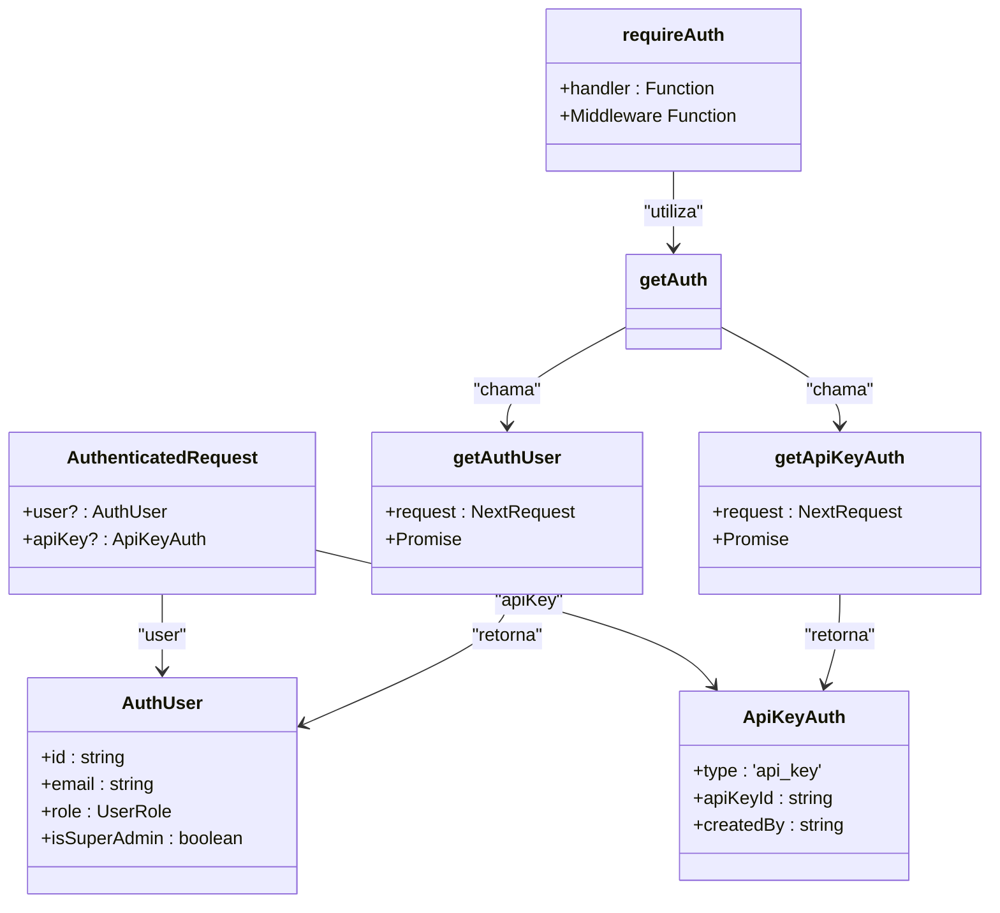
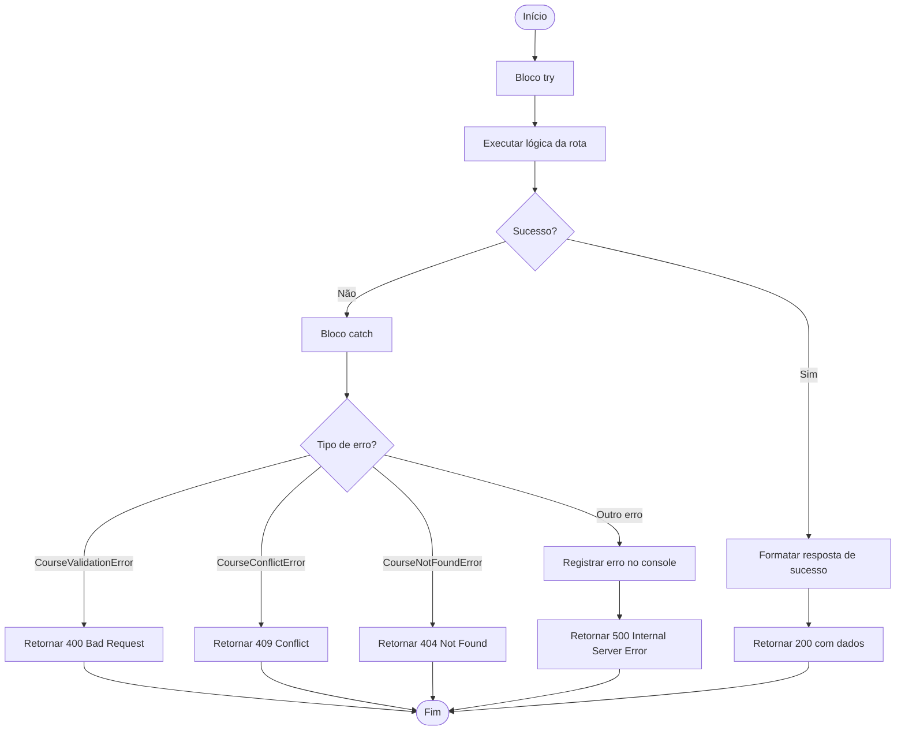
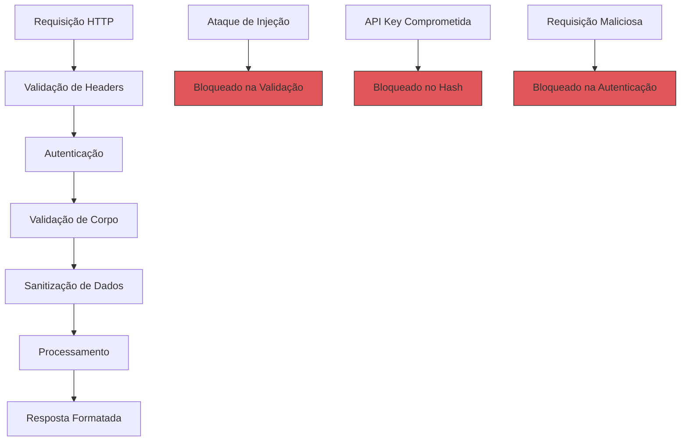
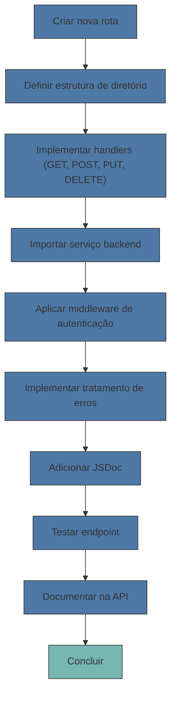
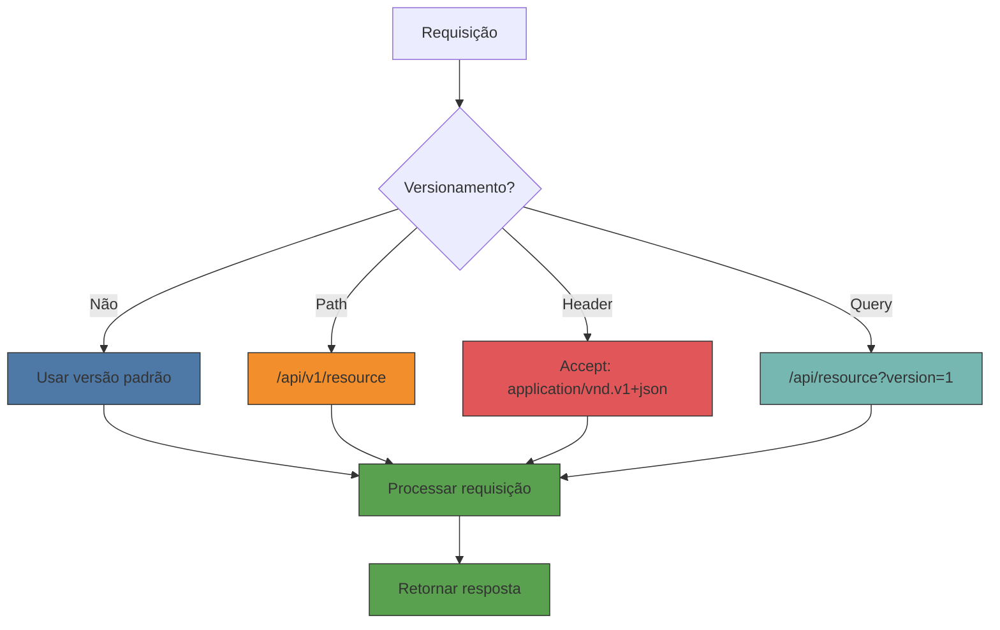

# Integração Frontend-Backend via API Routes

<cite>
**Arquivos Referenciados neste Documento**  
- [app/api/auth/signin/route.ts](file://app/api/auth/signin/route.ts)
- [app/api/course/[id]/route.ts](file://app/api/course/[id]/route.ts)
- [app/api/auth/me/route.ts](file://app/api/auth/me/route.ts)
- [app/api/auth/refresh/route.ts](file://app/api/auth/refresh/route.ts)
- [app/api/auth/signup/route.ts](file://app/api/auth/signup/route.ts)
- [app/api/flashcards/[id]/route.ts](file://app/api/flashcards/[id]/route.ts)
- [app/api/teacher/[id]/route.ts](file://app/api/teacher/[id]/route.ts)
- [app/api/conversations/[id]/route.ts](file://app/api/conversations/[id]/route.ts)
- [app/api/api-key/[id]/route.ts](file://app/api/api-key/[id]/route.ts)
- [app/api/cache/stats/route.ts](file://app/api/cache/stats/route.ts)
- [backend/auth/auth.service.ts](file://backend/auth/auth.service.ts)
- [backend/auth/middleware.ts](file://backend/auth/middleware.ts)
- [backend/services/api-key/api-key.service.ts](file://backend/services/api-key/api-key.service.ts)
- [backend/services/api-key/errors.ts](file://backend/services/api-key/errors.ts)
- [backend/swagger/auth.spec.ts](file://backend/swagger/auth.spec.ts)
- [docs/CORRECOES_ROTAS_AUTENTICACAO.md](file://docs/CORRECOES_ROTAS_AUTENTICACAO.md)
</cite>

## Sumário
1. [Introdução](#introdução)
2. [Estrutura de Rotas API](#estrutura-de-rotas-api)
3. [Padrão de Chamada de Serviços](#padrão-de-chamada-de-serviços)
4. [Tratamento de Requisições e Respostas](#tratamento-de-requisições-e-respostas)
5. [Autenticação e Autorização](#autenticação-e-autorização)
6. [Tratamento de Erros](#tratamento-de-erros)
7. [Práticas de Segurança](#práticas-de-segurança)
8. [Criação de Novas Rotas API](#criação-de-novas-rotas-api)
9. [Versionamento de API](#versionamento-de-api)
10. [Conclusão](#conclusão)

## Introdução

As API Routes do Next.js atuam como gateway entre o frontend e os serviços backend nesta aplicação, fornecendo uma camada intermediária que processa requisições HTTP, valida dados, executa lógica de negócios e retorna respostas formatadas. Este documento detalha a integração entre frontend e backend, focando nos padrões de implementação, segurança e boas práticas utilizadas no projeto.

**Arquivos Referenciados neste Documento**  
- [app/api/auth/signin/route.ts](file://app/api/auth/signin/route.ts)
- [app/api/course/[id]/route.ts](file://app/api/course/[id]/route.ts)
- [backend/auth/auth.service.ts](file://backend/auth/auth.service.ts)

## Estrutura de Rotas API

O diretório `app/api/` contém todas as rotas API da aplicação, organizadas por domínio funcional. Cada rota é implementada como um arquivo `route.ts` seguindo a convenção do Next.js 13+ App Router. A estrutura utiliza rotas dinâmicas com colchetes `[id]` para parâmetros variáveis, permitindo endpoints RESTful como `course/[id]` para operações em cursos específicos.

As rotas são categorizadas por funcionalidade:
- `auth/`: Autenticação e autorização (signin, signup, me, refresh)
- `course/`: Gerenciamento de cursos
- `flashcards/`: Sistema de flashcards
- `teacher/`: Gestão de professores
- `conversations/`: Conversas do chat
- `api-key/`: Gestão de chaves API



**Fontes do Diagrama**
- [app/api/auth/signin/route.ts](file://app/api/auth/signin/route.ts)
- [app/api/course/[id]/route.ts](file://app/api/course/[id]/route.ts)
- [app/api/flashcards/[id]/route.ts](file://app/api/flashcards/[id]/route.ts)
- [app/api/teacher/[id]/route.ts](file://app/api/teacher/[id]/route.ts)
- [app/api/conversations/[id]/route.ts](file://app/api/conversations/[id]/route.ts)

**Fontes da Seção**
- [app/api/auth/signin/route.ts](file://app/api/auth/signin/route.ts)
- [app/api/course/[id]/route.ts](file://app/api/course/[id]/route.ts)

## Padrão de Chamada de Serviços

As rotas API seguem um padrão consistente de chamada aos serviços backend, importando instâncias de serviços do diretório `backend/services/` e invocando seus métodos. O serviço de autenticação (`authService`) é um exemplo central, utilizado por múltiplas rotas para operações de login, cadastro e gerenciamento de sessão.

O padrão de chamada envolve:
1. Importação do serviço necessário
2. Extração de dados da requisição
3. Chamada ao método do serviço com os dados processados
4. Tratamento da resposta do serviço
5. Retorno de resposta HTTP formatada



**Fontes do Diagrama**
- [app/api/auth/signin/route.ts](file://app/api/auth/signin/route.ts)
- [backend/auth/auth.service.ts](file://backend/auth/auth.service.ts)

**Fontes da Seção**
- [app/api/auth/signin/route.ts](file://app/api/auth/signin/route.ts)
- [backend/auth/auth.service.ts](file://backend/auth/auth.service.ts)

## Tratamento de Requisições e Respostas

As rotas API utilizam a API padrão do Next.js com `NextRequest` e `NextResponse` para processar requisições HTTP e gerar respostas. O tratamento inclui parsing de JSON, validação de métodos HTTP e formatação de respostas consistentes.

### Métodos HTTP Suportados
- **GET**: Recuperação de dados (ex: `GET /api/course/[id]`)
- **POST**: Criação de recursos ou operações de escrita (ex: `POST /api/auth/signin`)
- **PUT**: Atualização de recursos (ex: `PUT /api/course/[id]`)
- **DELETE**: Remoção de recursos (ex: `DELETE /api/teacher/[id]`)

### Parsing de JSON
O parsing de corpo de requisição é feito com `await request.json()`, tratado dentro de blocos try/catch para capturar erros de parsing:

```typescript
const body = await request.json();
```

### Formato de Respostas
As respostas seguem um padrão consistente:
- Sucesso: `NextResponse.json({ data: result }, { status: 200 })`
- Erro: `NextResponse.json({ error: message }, { status: 4xx })`

O endpoint `auth/me` demonstra um caso avançado com dados de depuração em ambiente de desenvolvimento:



**Fontes do Diagrama**
- [app/api/auth/me/route.ts](file://app/api/auth/me/route.ts)
- [app/api/auth/signin/route.ts](file://app/api/auth/signin/route.ts)

**Fontes da Seção**
- [app/api/auth/me/route.ts](file://app/api/auth/me/route.ts)
- [app/api/auth/signin/route.ts](file://app/api/auth/signin/route.ts)

## Autenticação e Autorização

O sistema implementa múltiplos mecanismos de autenticação e autorização através de middlewares reutilizáveis definidos em `backend/auth/middleware.ts`. Os principais mecanismos são:

### JWT (Bearer Token)
Autenticação baseada em tokens JWT fornecidos no header `Authorization: Bearer <token>`. O token é validado contra o serviço de autenticação do Supabase.

### API Keys
Autenticação alternativa usando chaves API no header `x-api-key`, útil para integrações programáticas e sistemas externos.

### Middlewares de Autenticação
- `requireAuth`: Exige autenticação via JWT ou API Key
- `requireUserAuth`: Exige autenticação via JWT apenas
- `requireRole`: Exige papel específico (aluno, professor)
- `requireSuperAdmin`: Exige papel de superadmin



**Fontes do Diagrama**
- [backend/auth/middleware.ts](file://backend/auth/middleware.ts)

**Fontes da Seção**
- [backend/auth/middleware.ts](file://backend/auth/middleware.ts)
- [app/api/flashcards/[id]/route.ts](file://app/api/flashcards/[id]/route.ts)
- [app/api/teacher/[id]/route.ts](file://app/api/teacher/[id]/route.ts)
- [app/api/conversations/[id]/route.ts](file://app/api/conversations/[id]/route.ts)

## Tratamento de Erros

O tratamento de erros é padronizado através de funções de manipulação de erro específicas para cada domínio, garantindo respostas consistentes e seguras. O padrão envolve captura de erros com try/catch, mapeamento de exceções para códigos HTTP apropriados e retorno de mensagens de erro formatadas.

### Estratégia de Tratamento
1. **Captura Global**: Bloco try/catch envolvendo a lógica principal
2. **Mapeamento de Erros**: Funções `handleError` específicas por domínio
3. **Logging**: Registro de erros inesperados para depuração
4. **Respostas Seguras**: Mensagens de erro genéricas em produção

O endpoint `course/[id]` demonstra um tratamento de erros robusto com diferentes tipos de exceções:



**Fontes do Diagrama**
- [app/api/course/[id]/route.ts](file://app/api/course/[id]/route.ts)

**Fontes da Seção**
- [app/api/course/[id]/route.ts](file://app/api/course/[id]/route.ts)
- [app/api/auth/signin/route.ts](file://app/api/auth/signin/route.ts)
- [app/api/auth/signup/route.ts](file://app/api/auth/signup/route.ts)

## Práticas de Segurança

O sistema implementa múltiplas camadas de segurança para proteger os endpoints API contra ameaças comuns.

### Validação de Entrada
Todos os dados recebidos são validados antes do processamento. O serviço de API Keys inclui validação rigorosa de nomes e datas:

```typescript
private validateName(name?: string): string {
  const trimmed = name?.trim();
  if (!trimmed) {
    throw new ApiKeyValidationError('Name is required');
  }
  
  if (trimmed.length < NAME_MIN_LENGTH) {
    throw new ApiKeyValidationError(`Name must have at least ${NAME_MIN_LENGTH} characters`);
  }
  
  if (trimmed.length > NAME_MAX_LENGTH) {
    throw new ApiKeyValidationError(`Name must have at most ${NAME_MAX_LENGTH} characters`);
  }
  
  return trimmed;
}
```

### Rate Limiting
Embora não implementado diretamente nas rotas mostradas, o package `express-rate-limit` está presente nas dependências, indicando a possibilidade de implementação futura:

```json
"express-rate-limit": {
  "version": "7.5.1",
  "dev": true,
  "license": "MIT"
}
```

### Proteção contra Injeção
- **API Keys**: Armazenadas em hash SHA-256 no banco de dados
- **Validação de Tipos**: Uso de TypeScript para garantir tipos corretos
- **Sanitização**: Dados do usuário são validados e sanitizados nos serviços



**Fontes do Diagrama**
- [backend/services/api-key/api-key.service.ts](file://backend/services/api-key/api-key.service.ts)
- [backend/services/api-key/errors.ts](file://backend/services/api-key/errors.ts)

**Fontes da Seção**
- [backend/services/api-key/api-key.service.ts](file://backend/services/api-key/api-key.service.ts)
- [backend/services/api-key/errors.ts](file://backend/services/api-key/errors.ts)
- [package-lock.json](file://package-lock.json)

## Criação de Novas Rotas API

Para criar novas rotas API, siga o padrão estabelecido no projeto:

### Estrutura Básica
```typescript
import { NextRequest, NextResponse } from 'next/server';
import { service } from '@/backend/services/service-name';

export async function GET(request: NextRequest, context: RouteContext) {
  try {
    const params = await context.params;
    const data = await service.getById(params.id);
    return NextResponse.json({ data });
  } catch (error) {
    return handleError(error);
  }
}

export async function POST(request: NextRequest) {
  try {
    const body = await request.json();
    const result = await service.create(body);
    return NextResponse.json({ data: result }, { status: 201 });
  } catch (error) {
    return handleError(error);
  }
}
```

### Diretrizes
1. **Organização**: Coloque a rota no diretório apropriado em `app/api/`
2. **Tipagem**: Use TypeScript para tipar parâmetros e retornos
3. **Autenticação**: Aplique o middleware apropriado (`requireAuth`, `requireUserAuth`, etc.)
4. **Tratamento de Erros**: Implemente função `handleError` específica para o domínio
5. **Documentação**: Adicione JSDoc com detalhes de uso, formatos de requisição/resposta e códigos de status

### Exemplo de Implementação
A rota `api-key/[id]` demonstra uma implementação completa com serialização, tratamento de erros e autenticação:



**Fontes do Diagrama**
- [app/api/api-key/[id]/route.ts](file://app/api/api-key/[id]/route.ts)

**Fontes da Seção**
- [app/api/api-key/[id]/route.ts](file://app/api/api-key/[id]/route.ts)
- [app/api/cache/stats/route.ts](file://app/api/cache/stats/route.ts)

## Versionamento de API

O sistema atualmente não implementa versionamento explícito de API, mas segue práticas que facilitam a evolução futura:

### Estratégias Atuais
- **Backward Compatibility**: Manutenção de campos legados (ex: `disciplineId` mantido por compatibilidade)
- **Campos Opcionais**: Adição de novos campos sem quebrar clientes existentes (ex: `disciplineIds`)
- **Ambiente de Desenvolvimento**: Detalhes de erro expostos apenas em desenvolvimento

### Recomendações para Versionamento
1. **URL Path**: `/api/v1/course/[id]`, `/api/v2/course/[id]`
2. **Header HTTP**: `Accept: application/vnd.areadoaluno.v1+json`
3. **Query Parameter**: `/api/course/[id]?version=1`

A documentação OpenAPI em `backend/swagger/` já está configurada para suportar múltiplas versões, com definições de schemas e paths separados por domínio.



**Fontes do Diagrama**
- [backend/swagger/index.ts](file://backend/swagger/index.ts)
- [backend/swagger/auth.spec.ts](file://backend/swagger/auth.spec.ts)

**Fontes da Seção**
- [backend/swagger/index.ts](file://backend/swagger/index.ts)
- [backend/swagger/auth.spec.ts](file://backend/swagger/auth.spec.ts)
- [app/api/course/[id]/route.ts](file://app/api/course/[id]/route.ts)

## Conclusão

As API Routes do Next.js neste projeto fornecem uma camada robusta e segura de integração entre frontend e backend, seguindo padrões consistentes de arquitetura, tratamento de erros e segurança. O uso de serviços backend encapsulados, middlewares de autenticação reutilizáveis e tratamento de erros padronizado garante uma base sólida para a evolução da aplicação.

A separação clara de responsabilidades entre rotas API e serviços backend permite escalabilidade e manutenibilidade, enquanto as práticas de segurança implementadas protegem o sistema contra ameaças comuns. Para novos desenvolvedores, seguir os padrões estabelecidos garantirá consistência e qualidade no código.

A futura implementação de versionamento explícito de API permitirá evolução contínua sem quebrar clientes existentes, mantendo a compatibilidade enquanto novas funcionalidades são adicionadas ao sistema.