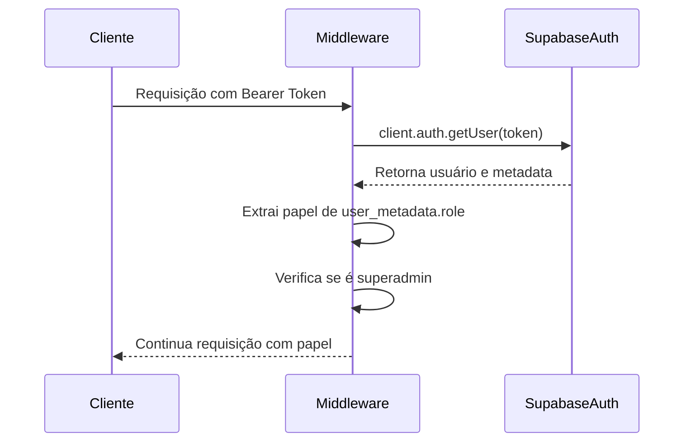

# Segurança com Row Level Security (RLS)

<cite>
**Arquivos Referenciados neste Documento**   
- [20250120_create_alunos.sql](file://supabase/migrations/20250120_create_alunos.sql)
- [20251208_create_agendamentos.sql](file://supabase/migrations/20251208_create_agendamentos.sql)
- [20250128_fix_professor_rls_insert_policy.sql](file://supabase/migrations/20250128_fix_professor_rls_insert_policy.sql)
- [20250129_add_alunos_cursos_rls_policies.sql](file://supabase/migrations/20250129_add_alunos_cursos_rls_policies.sql)
- [20250129_fix_alunos_rls_update_policy.sql](file://supabase/migrations/20250129_fix_alunos_rls_update_policy.sql)
- [20250131_verify_progresso_flashcards_constraints.sql](file://supabase/migrations/20250131_verify_progresso_flashcards_constraints.sql)
- [middleware.ts](file://backend/auth/middleware.ts)
- [types.ts](file://backend/auth/types.ts)
</cite>

## Sumário
1. [Introdução](#introdução)
2. [Implementação do RLS nas Migrations SQL](#implementação-do-rls-nas-migrations-sql)
3. [Controle de Acesso Baseado em Papéis](#controle-de-acesso-baseado-em-papéis)
4. [Políticas RLS por Tabela](#políticas-rls-por-tabela)
5. [Extração do Papel do Usuário no Middleware](#extração-do-papel-do-usuário-no-middleware)
6. [Casos de Uso Comuns e Soluções para Problemas](#casos-de-uso-comuns-e-soluções-para-problemas)
7. [Teste de Políticas RLS e Auditoria de Segurança](#teste-de-políticas-rls-e-auditoria-de-segurança)
8. [Conclusão](#conclusão)

## Introdução
O Row Level Security (RLS) no Supabase é um mecanismo fundamental para garantir que os usuários acessem apenas os dados aos quais têm permissão, com base em seu papel (role) e identidade. Este documento detalha a implementação do RLS no sistema, abrangendo tabelas como alunos, professores, matrículas e agendamentos. O controle de acesso é implementado através de políticas SQL definidas nas migrations, combinadas com um middleware de autenticação que extrai o papel do usuário do token JWT. O objetivo é garantir que operações de SELECT, INSERT, UPDATE e DELETE sejam executadas apenas quando permitidas, prevenindo acessos não autorizados.

## Implementação do RLS nas Migrations SQL
As políticas RLS são definidas diretamente nas migrations SQL do Supabase, garantindo que a segurança esteja integrada ao esquema do banco de dados desde o início. O RLS é habilitado com o comando `ALTER TABLE ... ENABLE ROW LEVEL SECURITY`, seguido pela criação de políticas específicas para cada operação (SELECT, INSERT, UPDATE, DELETE). Essas políticas utilizam funções do Supabase como `auth.uid()` para obter o ID do usuário autenticado e aplicar regras de acesso baseadas na identidade do usuário ou em seu papel.

**Fontes da Seção**
- [20250120_create_alunos.sql](file://supabase/migrations/20250120_create_alunos.sql#L40-L53)
- [20251208_create_agendamentos.sql](file://supabase/migrations/20251208_create_agendamentos.sql#L37-L38)

## Controle de Acesso Baseado em Papéis
O sistema implementa um modelo de controle de acesso baseado em papéis (RBAC) com três papéis principais: `aluno`, `professor` e `superadmin`. O papel do usuário é armazenado no `user_metadata` do Supabase Auth e é extraído pelo middleware de autenticação. O papel `superadmin` possui privilégios elevados, podendo acessar e modificar dados além das restrições normais de RLS. As políticas RLS são projetadas para permitir que cada papel execute operações específicas em tabelas relevantes, garantindo a segregação adequada de responsabilidades.

### Hierarquia de Papéis
- **Aluno**: Acesso limitado aos próprios dados.
- **Professor**: Acesso aos dados dos próprios alunos e agendamentos.
- **Superadmin**: Acesso irrestrito a todos os dados do sistema.

**Fontes da Seção**
- [types.ts](file://backend/auth/types.ts#L1)
- [middleware.ts](file://backend/auth/middleware.ts#L30-L31)

## Políticas RLS por Tabela
As políticas RLS são definidas para cada tabela do banco de dados, especificando permissões granulares para operações CRUD. Abaixo estão exemplos detalhados para as principais tabelas do sistema.

### Tabela Alunos
A tabela `alunos` armazena informações dos usuários com papel de aluno. As políticas garantem que cada aluno só possa acessar e modificar seus próprios dados.

```mermaid
flowchart TD
A[Operação no Banco de Dados] --> B{Tipo de Operação?}
B --> |SELECT| C[Verificar se auth.uid() = id]
B --> |UPDATE| D[Verificar se auth.uid() = id]
B --> |INSERT| E[Verificar se auth.uid() = id]
C --> F[Permitir Acesso]
D --> F
E --> F
C --> G[Negar Acesso]
D --> G
E --> G
```

**Fontes do Diagrama**
- [20250120_create_alunos.sql](file://supabase/migrations/20250120_create_alunos.sql#L43-L53)

**Fontes da Seção**
- [20250120_create_alunos.sql](file://supabase/migrations/20250120_create_alunos.sql#L43-L53)

### Tabela Agendamentos
A tabela `agendamentos` gerencia as sessões entre alunos e professores. As políticas diferenciam o acesso entre alunos e professores, permitindo que cada um visualize e modifique apenas seus próprios agendamentos.

```mermaid
flowchart TD
H[Operação no Agendamento] --> I{Usuário é Aluno?}
I --> |Sim| J[Verificar se auth.uid() = aluno_id]
I --> |Não| K[Verificar se auth.uid() = professor_id]
J --> L{Status = Pendente?}
L --> |Sim| M[Permitir UPDATE]
L --> |Não| N[Negar UPDATE]
J --> O[Permitir SELECT]
K --> P[Permitir SELECT e UPDATE]
```

**Fontes do Diagrama**
- [20251208_create_agendamentos.sql](file://supabase/migrations/20251208_create_agendamentos.sql#L43-L65)

**Fontes da Seção**
- [20251208_create_agendamentos.sql](file://supabase/migrations/20251208_create_agendamentos.sql#L43-L65)

### Tabela Professores
A tabela `professores` permite que professores criem seu próprio registro ao fazer login pela primeira vez. Uma política específica de INSERT foi corrigida para resolver um erro comum de inserção.

```mermaid
flowchart TD
Q[Tentativa de Inserir Professor] --> R[Verificar se auth.uid() = id]
R --> S[Permitir INSERT]
R --> T[Negar INSERT]
```

**Fontes do Diagrama**
- [20250128_fix_professor_rls_insert_policy.sql](file://supabase/migrations/20250128_fix_professor_rls_insert_policy.sql#L13-L15)

**Fontes da Seção**
- [20250128_fix_professor_rls_insert_policy.sql](file://supabase/migrations/20250128_fix_professor_rls_insert_policy.sql#L13-L15)

### Tabela Progresso Flashcards
A tabela `progresso_flashcards` rastreia o progresso dos alunos nos flashcards. A política RLS garante que alunos só possam ver e modificar seu próprio progresso.

```mermaid
flowchart TD
U[Operação no Progresso] --> V{auth.uid() = aluno_id?}
V --> |Sim| W[Permitir Acesso]
V --> |Não| X[Negar Acesso]
```

**Fontes do Diagrama**
- [20250131_verify_progresso_flashcards_constraints.sql](file://supabase/migrations/20250131_verify_progresso_flashcards_constraints.sql#L84-L86)

**Fontes da Seção**
- [20250131_verify_progresso_flashcards_constraints.sql](file://supabase/migrations/20250131_verify_progresso_flashcards_constraints.sql#L84-L86)

## Extração do Papel do Usuário no Middleware
O middleware de autenticação, localizado em `backend/auth/middleware.ts`, é responsável por extrair o papel do usuário do token JWT fornecido no cabeçalho de autorização. O papel é obtido do campo `user_metadata.role` do usuário autenticado. O middleware também verifica se o usuário é um superadmin, concedendo privilégios elevados. Esse papel é então usado nas rotas protegidas para aplicar lógica de negócios adicional além do RLS.



**Fontes do Diagrama**
- [middleware.ts](file://backend/auth/middleware.ts#L11-L50)
- [types.ts](file://backend/auth/types.ts#L3-L8)

**Fontes da Seção**
- [middleware.ts](file://backend/auth/middleware.ts#L11-L50)
- [types.ts](file://backend/auth/types.ts#L3-L8)

## Casos de Uso Comuns e Soluções para Problemas
### Erro de Inserção de Professores
Um problema comum ocorreu quando professores tentavam criar seu registro na tabela `professores`. A política RLS de INSERT estava faltando ou incorreta, resultando em erros de permissão. A solução foi implementada na migration `20250128_fix_professor_rls_insert_policy.sql`, que adiciona uma política de INSERT com `WITH CHECK (auth.uid() = id)`, permitindo que o usuário insira seu próprio registro.

**Fontes da Seção**
- [20250128_fix_professor_rls_insert_policy.sql](file://supabase/migrations/20250128_fix_professor_rls_insert_policy.sql#L13-L15)

### Atualização de Dados de Alunos
A política de UPDATE na tabela `alunos` inicialmente não incluía a cláusula `WITH CHECK`, o que poderia causar comportamentos inesperados. A migration `20250129_fix_alunos_rls_update_policy.sql` corrigiu isso, adicionando `WITH CHECK (auth.uid() = id)` para garantir que a condição seja verificada durante a operação de atualização.

**Fontes da Seção**
- [20250129_fix_alunos_rls_update_policy.sql](file://supabase/migrations/20250129_fix_alunos_rls_update_policy.sql#L10-L13)

## Teste de Políticas RLS e Auditoria de Segurança
Para garantir a integridade das políticas RLS, é essencial testá-las rigorosamente. Isso pode ser feito usando o cliente Supabase com diferentes papéis de usuário para verificar se as operações são permitidas ou negadas conforme esperado. A auditoria de segurança envolve revisar todas as políticas RLS no painel do Supabase, garantindo que nenhuma tabela com dados sensíveis tenha o RLS desabilitado. Além disso, logs de auditoria devem ser monitorados para detectar acessos não autorizados.

**Fontes da Seção**
- [20250131_verify_progresso_flashcards_constraints.sql](file://supabase/migrations/20250131_verify_progresso_flashcards_constraints.sql#L53-L67)

## Conclusão
A implementação do Row Level Security no Supabase é um componente crítico para a segurança do sistema, garantindo que o acesso aos dados seja estritamente controlado com base na identidade e no papel do usuário. As políticas RLS, definidas nas migrations SQL, fornecem uma camada robusta de segurança no nível do banco de dados. O middleware de autenticação complementa isso ao extrair e validar o papel do usuário, permitindo uma lógica de acesso sofisticada. Com testes adequados e auditorias regulares, o sistema mantém um alto nível de segurança e integridade dos dados.