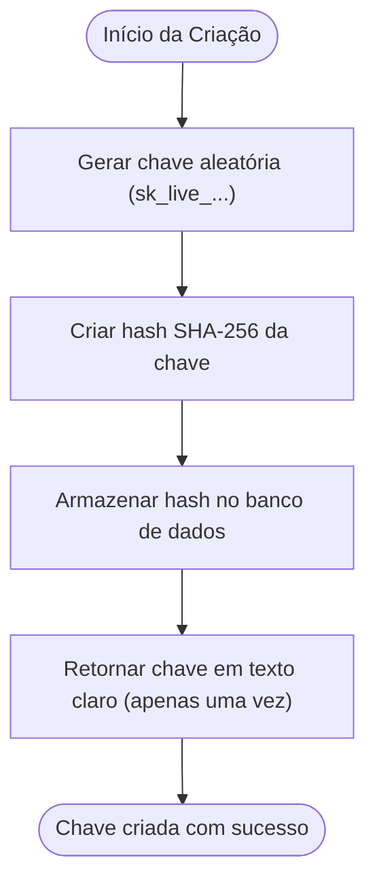
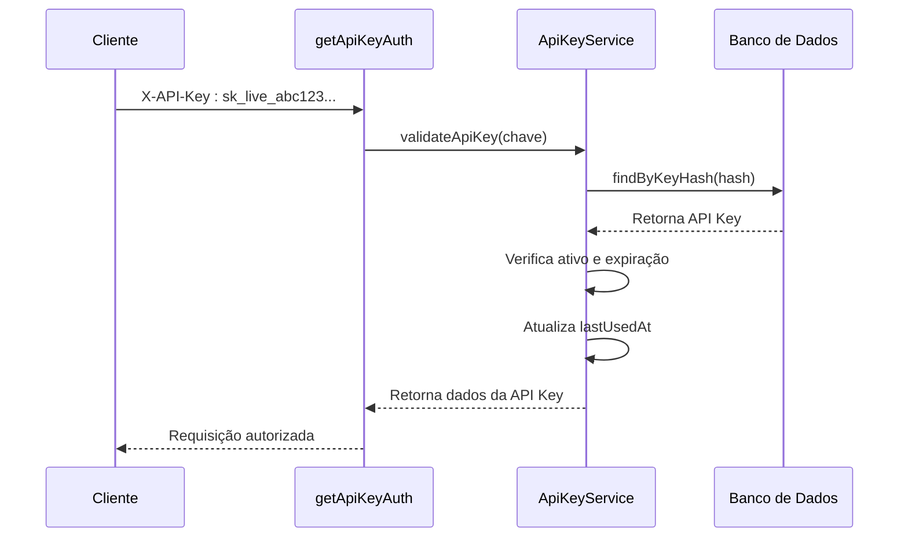

# Autenticação via API Key

<cite>
**Arquivos Referenciados neste Documento**  
- [api-key.service.ts](file://backend/services/api-key/api-key.service.ts)
- [api-key.repository.ts](file://backend/services/api-key/api-key.repository.ts)
- [middleware.ts](file://backend/auth/middleware.ts)
- [route.ts](file://app/api/api-key/route.ts)
- [\[id\]/route.ts](file://app/api/api-key/[id]/route.ts)
- [authentication.md](file://docs/authentication.md)
- [API.md](file://docs/API.md)
</cite>

## Sumário
1. [Visão Geral do Sistema de Autenticação via API Key](#visão-geral-do-sistema-de-autenticação-via-api-key)
2. [Criação e Armazenamento de API Keys](#criação-e-armazenamento-de-api-keys)
3. [Endpoints de Gerenciamento de API Keys](#endpoints-de-gerenciamento-de-api-keys)
4. [Validação de API Keys](#validação-de-api-keys)
5. [Uso do Header X-API-Key](#uso-do-header-x-api-key)
6. [Controle de Expiração, Status e Rastreamento](#controle-de-expiração-status-e-rastreamento)
7. [Diferenças de Permissões: JWT vs API Key](#diferenças-de-permissões-jwt-vs-api-key)
8. [Exemplos de Requisições](#exemplos-de-requisições)

## Visão Geral do Sistema de Autenticação via API Key

O sistema de autenticação via API Key permite que aplicações externas realizem requisições diretas ao backend do sistema Área do Aluno, utilizando uma chave de acesso segura. Esse mecanismo é especialmente útil para integrações automatizadas, onde a autenticação baseada em interface de usuário (JWT) não é viável.

A API Key é gerada por professores e pode ser usada com a **Service Role Key do Supabase**, o que permite contornar as políticas de segurança no nível de linha (RLS - Row Level Security) quando necessário. Isso garante acesso completo ao banco de dados, diferentemente da autenticação JWT, que está sujeita às políticas RLS.

**Seção fontes**
- [authentication.md](file://docs/authentication.md#L32-L67)
- [API.md](file://docs/API.md#L30-L42)

## Criação e Armazenamento de API Keys

As API Keys são criadas exclusivamente por usuários com perfil de professor ou superadmin. Durante a criação, a chave é gerada no formato `sk_live_<32 caracteres hexadecimais>` e armazenada no banco de dados como um hash SHA-256, garantindo que a chave original nunca seja armazenada em texto claro.

O processo de criação envolve:
1. Geração de uma chave aleatória usando `crypto.randomBytes`.
2. Hash da chave usando SHA-256 antes do armazenamento.
3. Armazenamento do hash no campo `key` da tabela `api_keys`.
4. Retorno da chave em texto claro apenas uma vez, durante a criação.

Essa abordagem assegura que, mesmo em caso de vazamento do banco de dados, as chaves não possam ser recuperadas.



**Fontes do diagrama**
- [api-key.service.ts](file://backend/services/api-key/api-key.service.ts#L139-L147)
- [api-key.repository.ts](file://backend/services/api-key/api-key.repository.ts#L97-L117)

**Seção fontes**
- [api-key.service.ts](file://backend/services/api-key/api-key.service.ts#L30-L50)
- [authentication.md](file://docs/authentication.md#L43-L47)

## Endpoints de Gerenciamento de API Keys

O sistema fornece endpoints RESTful para gerenciar API Keys, permitindo criação, listagem, atualização e exclusão. Todos os endpoints requerem autenticação JWT do professor que criou a chave ou de um superadmin.

### Endpoints Disponíveis

| Método | Endpoint | Descrição | Autenticação |
|--------|---------|-----------|-------------|
| `GET` | `/api/api-key` | Lista todas as API Keys do professor | JWT (professor) |
| `POST` | `/api/api-key` | Cria uma nova API Key | JWT (professor) |
| `GET` | `/api/api-key/{id}` | Obtém detalhes de uma API Key específica | JWT (professor ou superadmin) |
| `PUT` | `/api/api-key/{id}` | Atualiza nome, status ou expiração | JWT (professor ou superadmin) |
| `DELETE` | `/api/api-key/{id}` | Deleta uma API Key | JWT (professor ou superadmin) |

O endpoint de criação retorna a chave em texto claro apenas na resposta inicial, reforçando a necessidade de armazenamento seguro pelo cliente.

**Seção fontes**
- [route.ts](file://app/api/api-key/route.ts)
- [\[id\]/route.ts](file://app/api/api-key/[id]/route.ts)

## Validação de API Keys

O método `validateApiKey` no `ApiKeyService` é responsável por validar a autenticidade e o estado da chave em cada requisição. O processo de validação inclui:

1. **Verificação de existência**: A chave fornecida é convertida em hash SHA-256 e comparada com os registros no banco.
2. **Status ativo**: Verifica se a chave está ativa (`active: true`).
3. **Expiração**: Confere se a chave ainda está dentro do período de validade.
4. **Atualização de uso**: Atualiza o campo `lastUsedAt` para rastrear o último uso.

Se qualquer uma dessas verificações falhar, uma exceção específica é lançada (por exemplo, `ApiKeyExpiredError`), resultando em uma resposta HTTP 401 ou 403.



**Fontes do diagrama**
- [middleware.ts](file://backend/auth/middleware.ts#L53-L69)
- [api-key.service.ts](file://backend/services/api-key/api-key.service.ts#L81-L98)

**Seção fontes**
- [api-key.service.ts](file://backend/services/api-key/api-key.service.ts#L81-L98)
- [middleware.ts](file://backend/auth/middleware.ts#L53-L69)

## Uso do Header X-API-Key

Para autenticar requisições com API Key, o cliente deve incluir o header `X-API-Key` com o valor da chave gerada. O middleware `getApiKeyAuth` intercepta a requisição, valida a chave e, se válida, permite o acesso ao recurso.

Este mecanismo é transparente para os endpoints que utilizam o middleware `requireAuth`, que aceita tanto JWT quanto API Key, facilitando a integração de diferentes tipos de clientes.

**Seção fontes**
- [API.md](file://docs/API.md#L34-L36)
- [authentication.md](file://docs/authentication.md#L37-L39)

## Controle de Expiração, Status e Rastreamento

Cada API Key pode ter:
- **Data de expiração opcional**: Define quando a chave se torna inválida.
- **Status ativo/inativo**: Permite desativar uma chave sem excluí-la.
- **Rastreamento de último uso**: O campo `lastUsedAt` é atualizado em cada requisição bem-sucedida.

Esses controles permitem uma gestão segura e flexível das chaves, possibilitando a desativação imediata de chaves comprometidas e o monitoramento de uso.

**Seção fontes**
- [api-key.types.ts](file://backend/services/api-key/api-key.types.ts)
- [api-key.service.ts](file://backend/services/api-key/api-key.service.ts#L92-L97)

## Diferenças de Permissões: JWT vs API Key

| Característica | Autenticação JWT | Autenticação API Key |
|----------------|------------------|-----------------------|
| **Origem** | Interface de usuário | Integrações externas |
| **Escopo de acesso** | Sujeito a RLS | Bypass completo de RLS via Service Role |
| **Permissões** | Limitadas por papel (aluno, professor) | Acesso completo ao banco |
| **Uso típico** | Frontend e usuários | Backends e serviços automatizados |

A API Key, ao usar a Service Role Key do Supabase, tem permissões elevadas que permitem operações em qualquer tabela, independentemente das políticas RLS, tornando-a ideal para tarefas administrativas automatizadas.

**Seção fontes**
- [authentication.md](file://docs/authentication.md#L50-L52)
- [API.md](file://docs/API.md#L41-L42)

## Exemplos de Requisições

### Criar uma API Key
```bash
POST /api/api-key
Authorization: Bearer <jwt_token>
Content-Type: application/json

{
  "name": "Integração de Produção",
  "expiresAt": "2026-12-31T23:59:59Z"
}
```

### Usar uma API Key em uma requisição
```bash
GET /api/discipline
X-API-Key: sk_live_abc123...
```

Estes exemplos demonstram o fluxo completo de criação e uso de uma API Key para acessar recursos da API.

**Seção fontes**
- [API.md](file://docs/API.md#L119-L139)
- [authentication.md](file://docs/authentication.md#L104-L128)