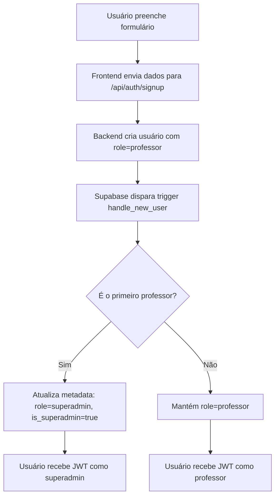
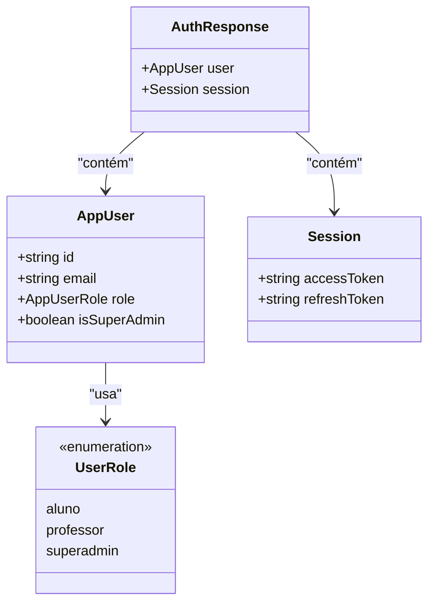

# Autenticação via JWT

<cite>
**Arquivos Referenciados neste Documento**  
- [auth.service.ts](file://backend/auth/auth.service.ts)
- [signup/route.ts](file://app/api/auth/signup/route.ts)
- [signin/route.ts](file://app/api/auth/signin/route.ts)
- [signout/route.ts](file://app/api/auth/signout/route.ts)
- [refresh/route.ts](file://app/api/auth/refresh/route.ts)
- [authentication.md](file://docs/authentication.md)
- [first-professor-superadmin.md](file://docs/first-professor-superadmin.md)
- [middleware.ts](file://backend/auth/middleware.ts)
- [types.ts](file://backend/auth/types.ts)
- [user.ts](file://types/user.ts)
- [lib/roles.ts](file://lib/roles.ts)
</cite>

## Sumário
1. [Introdução](#introdução)
2. [Fluxo de Registro de Professor via Frontend](#fluxo-de-registro-de-professor-via-frontend)
3. [Métodos da AuthService](#métodos-da-authservice)
   - [signUp](#signup)
   - [signIn](#signin)
   - [signOut](#signout)
   - [refreshSession](#refreshsession)
4. [Extração de Metadados de Usuário](#extração-de-metadados-de-usuário)
5. [Geração e Validação de JWT](#geração-e-validação-de-jwt)
6. [Rotas Protegidas e Uso do Token](#rotas-protegidas-e-uso-do-token)
7. [Exemplos de Requisições HTTP](#exemplos-de-requisições-http)
8. [Tratamento de Erros Comuns](#tratamento-de-erros-comuns)
9. [Promoção Automática do Primeiro Professor a Superadmin](#promoção-automática-do-primeiro-professor-a-superadmin)
10. [Considerações de Segurança](#considerações-de-segurança)

## Introdução

O sistema de autenticação baseado em JWT utiliza o Supabase Auth para gerenciar a identidade e as permissões dos usuários. A autenticação é implementada através de tokens JWT que contêm informações sobre o usuário, seu papel (*role*) e status de superadministrador (*is_superadmin*). O sistema distingue três tipos principais de usuários: **aluno**, **professor** e **superadmin**, cada um com diferentes níveis de acesso e permissões.

A autenticação via JWT é usada principalmente pela interface de usuário, onde os tokens são enviados no cabeçalho `Authorization: Bearer <token>`. O backend fornece endpoints para registro, login, logout e renovação de sessão, todos integrados ao Supabase Auth e com lógica adicional para gerenciamento de papéis e promoção automática.

**Seção fontes**
- [authentication.md](file://docs/authentication.md#L1-L137)

## Fluxo de Registro de Professor via Frontend

Quando um novo usuário se registra pela interface de cadastro, o sistema sempre cria o usuário com o papel de **professor**. Isso é garantido tanto no frontend quanto no backend, impedindo a criação direta de alunos via interface pública.

O fluxo completo é:

1. O usuário preenche o formulário de cadastro com email, senha e nome completo.
2. O frontend envia os dados para o endpoint `/api/auth/signup`.
3. O backend força o papel `professor` na criação do usuário no Supabase.
4. Um *trigger* no banco de dados verifica se este é o primeiro professor cadastrado.
5. Se for o primeiro, o *trigger* atualiza os metadados do usuário para `role: 'superadmin'` e `is_superadmin: true`.
6. O usuário recebe um JWT com as permissões apropriadas.

Este mecanismo garante que o primeiro usuário do sistema tenha acesso completo como superadministrador, facilitando a configuração inicial.



**Fontes do diagrama**
- [signup/route.ts](file://app/api/auth/signup/route.ts#L39-L59)
- [first-professor-superadmin.md](file://docs/first-professor-superadmin.md#L1-L107)

**Seção fontes**
- [signup/route.ts](file://app/api/auth/signup/route.ts#L39-L59)
- [first-professor-superadmin.md](file://docs/first-professor-superadmin.md#L1-L107)

## Métodos da AuthService

A classe `AuthService` encapsula todas as operações de autenticação, fornecendo uma interface clara e reutilizável para os endpoints da API.

### signUp

O método `signUp` registra um novo usuário no sistema. Ele recebe um objeto com `email`, `password`, `fullName` e opcionalmente `role`. Por padrão, todos os novos usuários criados via frontend são definidos como `professor`.

Após o registro bem-sucedido, o método extrai os metadados do usuário do Supabase para determinar o papel real e se é superadministrador, retornando um objeto com os dados do usuário e a sessão (accessToken e refreshToken).

**Seção fontes**
- [auth.service.ts](file://backend/auth/auth.service.ts#L5-L42)

### signIn

O método `signIn` autentica um usuário existente com email e senha. Ele utiliza o método `signInWithPassword` do Supabase para validar as credenciais. Em caso de sucesso, retorna os dados do usuário e a sessão com os tokens JWT.

Este método não valida o papel do usuário — essa verificação é feita nos *middlewares* das rotas protegidas.

**Seção fontes**
- [auth.service.ts](file://backend/auth/auth.service.ts#L44-L75)

### signOut

O método `signOut` encerra a sessão do usuário atual. Ele chama o método `signOut` do Supabase Auth para invalidar a sessão no lado do servidor.

Este método é protegido por um *middleware* de autenticação, garantindo que apenas usuários autenticados possam encerrar suas sessões.

**Seção fontes**
- [auth.service.ts](file://backend/auth/auth.service.ts#L77-L84)
- [signout/route.ts](file://app/api/auth/signout/route.ts#L5-L17)

### refreshSession

O método `refreshSession` renova a sessão do usuário usando o refreshToken. Isso é útil quando o accessToken expira, permitindo que o usuário continue autenticado sem precisar fazer login novamente.

O método valida o refreshToken com o Supabase e, se válido, retorna um novo par de accessToken e refreshToken.

**Seção fontes**
- [auth.service.ts](file://backend/auth/auth.service.ts#L106-L136)
- [refresh/route.ts](file://app/api/auth/refresh/route.ts#L1-L20)

## Extração de Metadados de Usuário

Os metadados do usuário são armazenados no campo `user_metadata` do Supabase Auth. Os campos principais utilizados são:

- `role`: define o papel do usuário (`aluno`, `professor`, `superadmin`)
- `is_superadmin`: booleano que indica se o usuário tem privilégios de superadministrador

Durante cada operação de autenticação (signUp, signIn, refreshSession), o sistema extrai esses metadados para construir o objeto `AppUser` com as permissões corretas. O papel retornado na resposta é sempre `superadmin` se `is_superadmin` for verdadeiro, garantindo consistência.



**Fontes do diagrama**
- [auth.service.ts](file://backend/auth/auth.service.ts#L2-L141)
- [types/user.ts](file://types/user.ts#L1-L12)

**Seção fontes**
- [auth.service.ts](file://backend/auth/auth.service.ts#L27-L36)
- [types/user.ts](file://types/user.ts#L1-L12)

## Geração e Validação de JWT

O token JWT é gerado automaticamente pelo Supabase Auth durante o login ou registro bem-sucedido. O token contém:

- Identificador do usuário
- Email
- Metadados personalizados (role, is_superadmin)
- Data de expiração

A validação do token é feita automaticamente pelo Supabase nas rotas protegidas. O *middleware* `requireAuth` extrai o usuário do token e o disponibiliza na requisição. Para rotas que exigem papéis específicos, são usados *middlewares* como `requireRole` ou `requireSuperAdmin`.

**Seção fontes**
- [middleware.ts](file://backend/auth/middleware.ts#L1-L78)
- [authentication.md](file://docs/authentication.md#L68-L99)

## Rotas Protegidas e Uso do Token

Todas as rotas protegidas exigem o envio do token JWT no cabeçalho:

```
Authorization: Bearer <jwt_token>
```

O sistema fornece *middlewares* para diferentes níveis de proteção:

- `requireAuth`: aceita qualquer usuário autenticado
- `requireUserAuth`: exige autenticação via JWT (não aceita API Key)
- `requireRole('professor')`: exige papel de professor ou superadmin
- `requireSuperAdmin`: exige papel de superadmin

Esses *middlewares* são aplicados nos endpoints da API para controlar o acesso com base nas permissões do usuário.

**Seção fontes**
- [authentication.md](file://docs/authentication.md#L68-L99)
- [lib/roles.ts](file://lib/roles.ts#L1-L47)

## Exemplos de Requisições HTTP

### Registro de Professor (sucesso)

```bash
POST /api/auth/signup
{
  "email": "professor@escola.com",
  "password": "senha123",
  "fullName": "Professor Silva"
}

Resposta (201):
{
  "data": {
    "user": {
      "id": "uuid",
      "email": "professor@escola.com",
      "role": "professor",
      "isSuperAdmin": false
    },
    "session": {
      "accessToken": "jwt_token",
      "refreshToken": "refresh_token"
    }
  }
}
```

### Login com Credenciais Inválidas

```bash
POST /api/auth/signin
{
  "email": "invalido@escola.com",
  "password": "errada"
}

Resposta (401):
{
  "error": "Invalid login credentials"
}
```

**Seção fontes**
- [signup/route.ts](file://app/api/auth/signup/route.ts#L52)
- [signin/route.ts](file://app/api/auth/signin/route.ts#L35)

## Tratamento de Erros Comuns

O sistema trata os seguintes erros de autenticação:

- **Credenciais inválidas (401)**: ocorre no login com email/senha incorretos
- **Sessão expirada (401)**: quando o accessToken expira e o refreshToken também é inválido
- **Falha na criação da sessão (400)**: quando o Supabase não consegue criar a sessão
- **Refresh token ausente (400)**: quando o endpoint de refresh é chamado sem token

Todos os erros são capturados e retornados com mensagens claras e códigos de status apropriados.

**Seção fontes**
- [auth.service.ts](file://backend/auth/auth.service.ts#L19-L21)
- [signin/route.ts](file://app/api/auth/signin/route.ts#L34-L35)

## Promoção Automática do Primeiro Professor a Superadmin

A promoção automática é implementada através de um *trigger* no banco de dados Supabase chamado `handle_new_user`. Quando um novo professor é criado:

1. O *trigger* conta o número total de professores na tabela `professores`
2. Se o contador for 1 (ou seja, é o primeiro), atualiza os metadados do usuário no `auth.users`
3. Define `role: 'superadmin'` e `is_superadmin: true`

Essa lógica garante que o primeiro usuário do sistema tenha acesso completo, enquanto os demais professores são criados com permissões normais.

**Seção fontes**
- [first-professor-superadmin.md](file://docs/first-professor-superadmin.md#L1-L107)

## Considerações de Segurança

- Todos os tokens JWT são assinados e validados pelo Supabase
- O papel do usuário é sempre verificado nos metadados, não confiando apenas no valor fornecido
- A promoção a superadmin é feita exclusivamente pelo *trigger* do banco, não pela aplicação
- O endpoint de signup sempre força o papel `professor`, prevenindo criação acidental de alunos
- O uso de *middlewares* padronizados garante consistência na verificação de permissões

**Seção fontes**
- [authentication.md](file://docs/authentication.md#L100-L107)
- [first-professor-superadmin.md](file://docs/first-professor-superadmin.md#L100-L107)