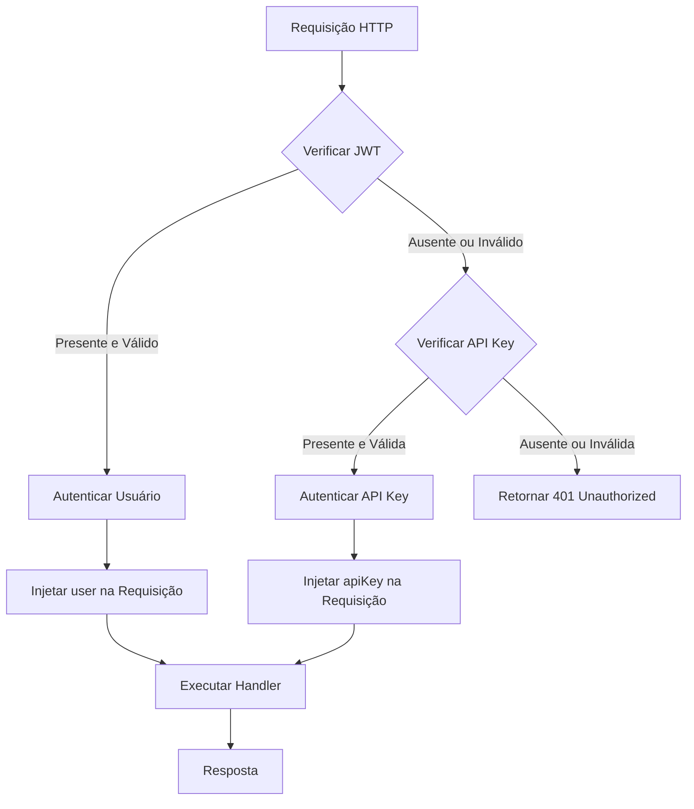
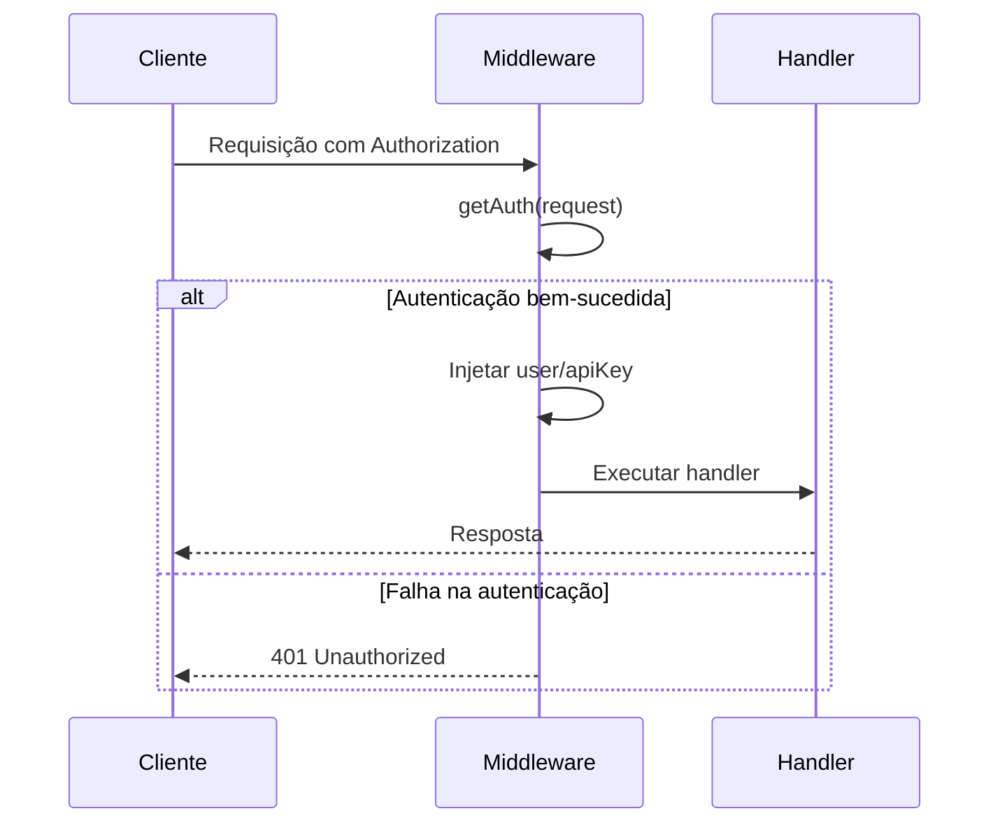

# Middleware de Autenticação

<cite>
**Arquivos Referenciados neste Documento**  
- [middleware.ts](file://backend/auth/middleware.ts)
- [types.ts](file://backend/auth/types.ts)
- [api-key.service.ts](file://backend/services/api-key/api-key.service.ts)
- [api-key.repository.ts](file://backend/services/api-key/api-key.repository.ts)
- [agendamentos/[id]/ical/route.ts](file://app/api/agendamentos/[id]/ical/route.ts)
- [api-key/[id]/route.ts](file://app/api/api-key/[id]/route.ts)
- [atividade/[id]/route.ts](file://app/api/atividade/[id]/route.ts)
- [auth/signout/route.ts](file://app/api/auth/signout/route.ts)
- [lib/middleware.ts](file://lib/middleware.ts)
</cite>

## Sumário
1. [Introdução](#introdução)
2. [Estrutura do Middleware de Autenticação](#estrutura-do-middleware-de-autenticação)
3. [Funções de Autenticação](#funções-de-autenticação)
4. [Interface AuthenticatedRequest](#interface-authenticatedrequest)
5. [Wrappers de Autorização](#wrappers-de-autorização)
6. [Exemplos de Implementação em Rotas](#exemplos-de-implementação-em-rotas)
7. [Práticas de Logging e Tratamento de Erros](#práticas-de-logging-e-tratamento-de-erros)
8. [Conclusão](#conclusão)

## Introdução

O middleware de autenticação da aplicação é responsável por proteger as rotas da API, garantindo que apenas usuários autenticados ou requisições com credenciais válidas possam acessar os recursos. O sistema suporta dois métodos de autenticação: JWT (JSON Web Token) via cabeçalho `Authorization` e chaves de API (API Key) via cabeçalho `x-api-key`. Este documento detalha a implementação, funcionamento e uso do middleware, incluindo as funções principais, interfaces, wrappers de autorização e práticas de segurança.

**Seção fontes**  
- [middleware.ts](file://backend/auth/middleware.ts#L1-L193)
- [types.ts](file://backend/auth/types.ts#L1-L36)

## Estrutura do Middleware de Autenticação

O middleware de autenticação está localizado em `backend/auth/middleware.ts` e exporta funções essenciais para a autenticação dual. Ele utiliza o cliente de banco de dados Supabase para validar tokens JWT e integra-se ao serviço de API Key para validar chaves de API. A estrutura é modular, permitindo reutilização e composição de funções de autorização.



**Fontes do Diagrama**  
- [middleware.ts](file://backend/auth/middleware.ts#L11-L85)

**Seção fontes**  
- [middleware.ts](file://backend/auth/middleware.ts#L1-L193)

## Funções de Autenticação

### getAuthUser

A função `getAuthUser` extrai o token JWT do cabeçalho `Authorization`, valida-o com o Supabase Auth e retorna um objeto `AuthUser` com informações essenciais do usuário, incluindo ID, email, papel (role) e se é superadmin. O papel é determinado a partir dos metadados do usuário, com fallback para 'aluno'. O superadmin é identificado tanto pelo papel 'superadmin' quanto pela flag `is_superadmin` nos metadados.

**Seção fontes**  
- [middleware.ts](file://backend/auth/middleware.ts#L11-L51)

### getApiKeyAuth

A função `getApiKeyAuth` valida uma chave de API fornecida no cabeçalho `x-api-key`. Ela utiliza o `apiKeyService` para verificar a chave, garantindo que esteja ativa, não expirada e que o hash corresponda ao armazenado. Em caso de sucesso, retorna um objeto `ApiKeyAuth` com o ID da chave e o ID do criador.

**Seção fontes**  
- [middleware.ts](file://backend/auth/middleware.ts#L53-L69)
- [api-key.service.ts](file://backend/services/api-key/api-key.service.ts#L81-L100)

### getAuth

A função `getAuth` implementa a autenticação dual, tentando primeiro autenticar com JWT via `getAuthUser`. Se falhar, tenta autenticar com API Key via `getApiKeyAuth`. Retorna um objeto com `user` ou `apiKey` se bem-sucedido, ou `null` se ambos falharem. Esta função é a base para os wrappers de autorização.

**Seção fontes**  
- [middleware.ts](file://backend/auth/middleware.ts#L72-L84)

## Interface AuthenticatedRequest

A interface `AuthenticatedRequest` estende `NextRequest` do Next.js, adicionando propriedades opcionais `user` e `apiKey`. Isso permite que handlers de rotas acessem as informações de autenticação diretamente da requisição, sem necessidade de passar parâmetros adicionais. Após a autenticação bem-sucedida, o middleware injeta o objeto `AuthUser` ou `ApiKeyAuth` na requisição, que é então passada ao handler.

```typescript
export interface AuthenticatedRequest extends NextRequest {
  user?: AuthUser;
  apiKey?: ApiKeyAuth;
}
```

**Seção fontes**  
- [middleware.ts](file://backend/auth/middleware.ts#L6-L9)
- [types.ts](file://backend/auth/types.ts#L3-L8)

## Wrappers de Autorização

Os wrappers são funções de ordem superior que encapsulam handlers de rotas, adicionando camadas de autorização. Eles retornam novos handlers que executam a lógica de autenticação antes de chamar o handler original.

### requireAuth

O wrapper `requireAuth` exige que a requisição seja autenticada por qualquer método (JWT ou API Key). Ele chama `getAuth` e, se a autenticação falhar, retorna 401 Unauthorized. Se bem-sucedido, injeta as credenciais na requisição e executa o handler.



**Fontes do Diagrama**  
- [middleware.ts](file://backend/auth/middleware.ts#L115-L134)

**Seção fontes**  
- [middleware.ts](file://backend/auth/middleware.ts#L115-L134)

### requireUserAuth

O wrapper `requireUserAuth` exige autenticação por JWT (usuário). Ele usa `getAuthUser` exclusivamente, ignorando API Keys. É usado em rotas que precisam do contexto de usuário completo, como acesso a dados pessoais.

**Seção fontes**  
- [middleware.ts](file://backend/auth/middleware.ts#L136-L151)

### requireRole

O wrapper `requireRole` exige que o usuário autenticado tenha um papel específico (role). Ele aceita um parâmetro `role` e verifica se o usuário possui esse papel ou é superadmin (que tem acesso a tudo). Se não atender aos requisitos, retorna 403 Forbidden.

**Seção fontes**  
- [middleware.ts](file://backend/auth/middleware.ts#L153-L173)

### requireSuperAdmin

O wrapper `requireSuperAdmin` exige que o usuário seja um superadmin, verificando tanto o papel quanto a flag `isSuperadmin`. É usado em rotas sensíveis de administração.

**Seção fontes**  
- [middleware.ts](file://backend/auth/middleware.ts#L176-L190)

## Exemplos de Implementação em Rotas

### Rota com requireUserAuth

A rota `api/agendamentos/[id]/ical/route.ts` usa `requireUserAuth` para proteger o download de arquivos ICS. O handler verifica se o usuário autenticado é o aluno ou professor do agendamento antes de gerar o calendário.

```mermaid
flowchart TD
A[GET /api/agendamentos/{id}/ical] --> B[requireUserAuth]
B --> C{Usuário Autenticado?}
C --> |Sim| D[Verificar Acesso ao Agendamento]
C --> |Não| E[401 Unauthorized]
D --> F{Tem Acesso?}
F --> |Sim| G[Gerar ICS]
F --> |Não| H[403 Forbidden]
G --> I[Retornar Arquivo]
```

**Fontes do Diagrama**  
- [agendamentos/[id]/ical/route.ts](file://app/api/agendamentos/[id]/ical/route.ts#L8-L128)

**Seção fontes**  
- [agendamentos/[id]/ical/route.ts](file://app/api/agendamentos/[id]/ical/route.ts#L1-L129)

### Rota com requireAuth

A rota `api/atividade/[id]/route.ts` usa `requireAuth` para operações de atualização e exclusão de atividades. O handler verifica se o usuário é professor ou superadmin antes de permitir a modificação.

**Seção fontes**  
- [atividade/[id]/route.ts](file://app/api/atividade/[id]/route.ts#L52-L99)

## Práticas de Logging e Tratamento de Erros

O middleware utiliza `console.log` e `console.error` para registrar eventos de autenticação, facilitando a auditoria e depuração. Mensagens detalhadas são registradas em cada etapa, incluindo tentativas de autenticação, erros de validação e sucesso na autenticação.

### Logging

- `[Auth] No authorization header found`: Quando não há cabeçalho de autorização.
- `[Auth] Error getting user`: Quando ocorre erro ao validar o JWT.
- `[Auth] User authenticated`: Informações do usuário autenticado (sem senha).

### Tratamento de Erros

Erros são tratados silenciosamente em muitos casos para não expor informações sensíveis. Por exemplo, `getApiKeyAuth` retorna `null` em vez de lançar erros, evitando vazamento de informações sobre a existência de chaves. Erros internos são registrados com `console.error` mas respondem com mensagens genéricas ao cliente.

**Seção fontes**  
- [middleware.ts](file://backend/auth/middleware.ts#L15-L49)
- [api-key.service.ts](file://backend/services/api-key/api-key.service.ts#L82-L98)

## Conclusão

O middleware de autenticação implementa um sistema robusto e flexível de proteção de rotas, suportando autenticação dual com JWT e API Keys. A arquitetura modular permite fácil extensão e reutilização, enquanto os wrappers fornecem uma interface clara para aplicar políticas de autorização. As práticas de logging e tratamento de erros garantem segurança e facilitam a manutenção. Este sistema é fundamental para a integridade e segurança da aplicação.