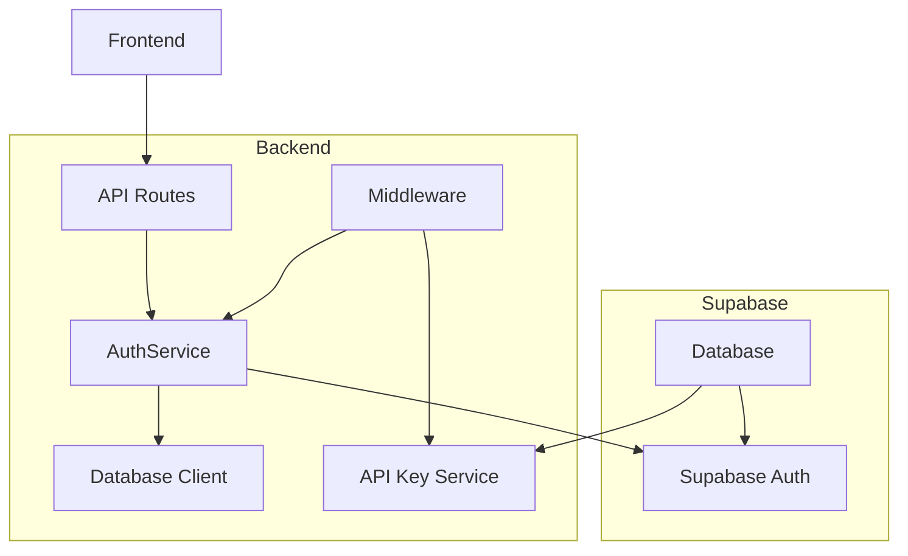
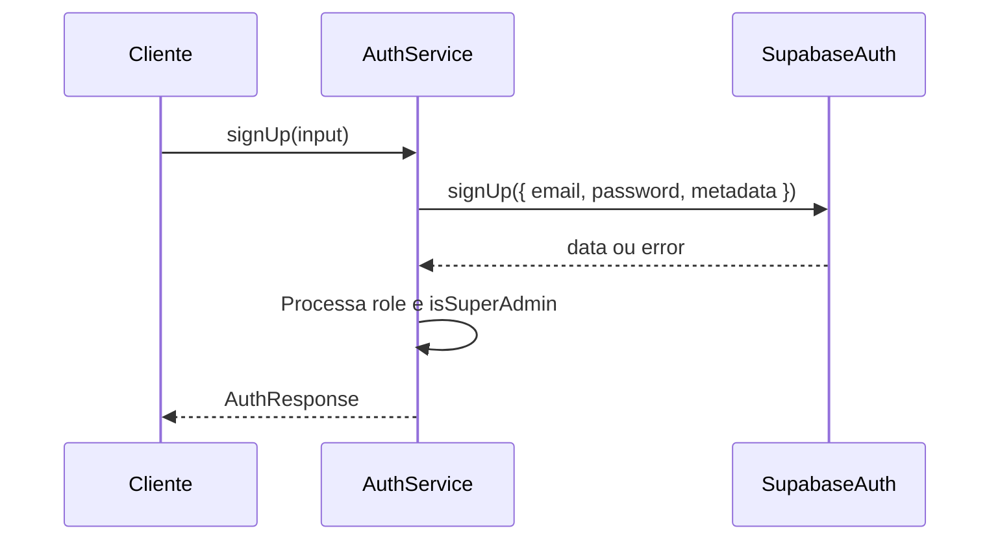
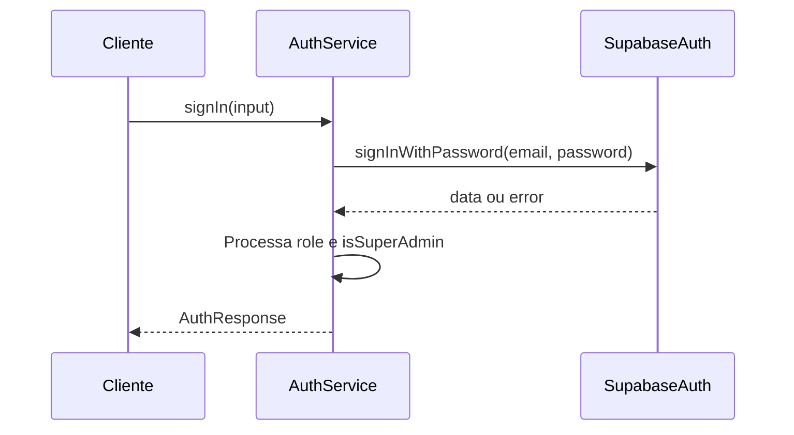
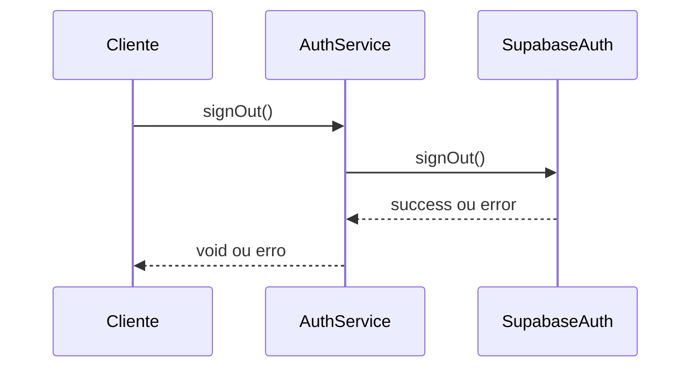
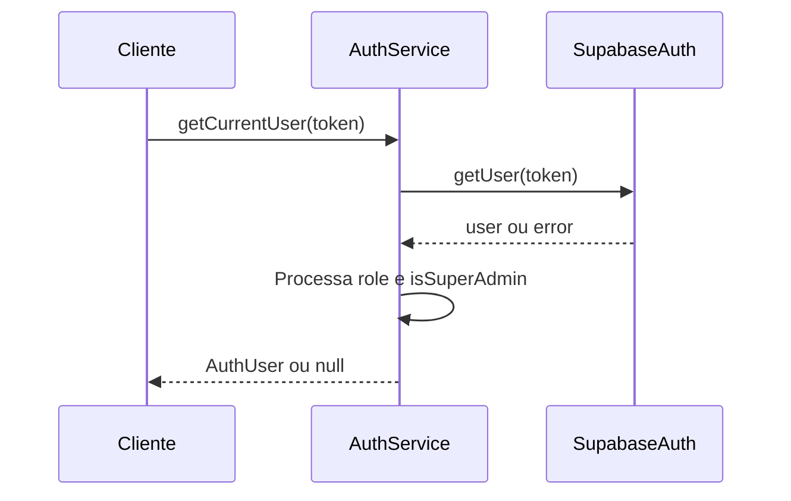
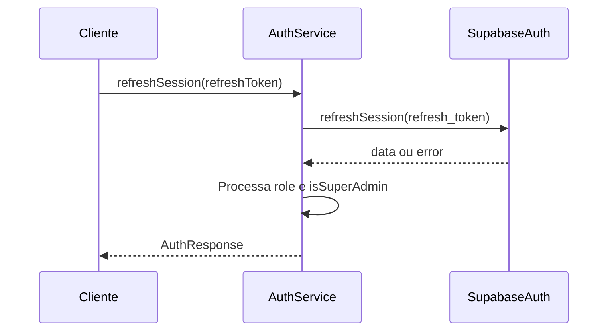
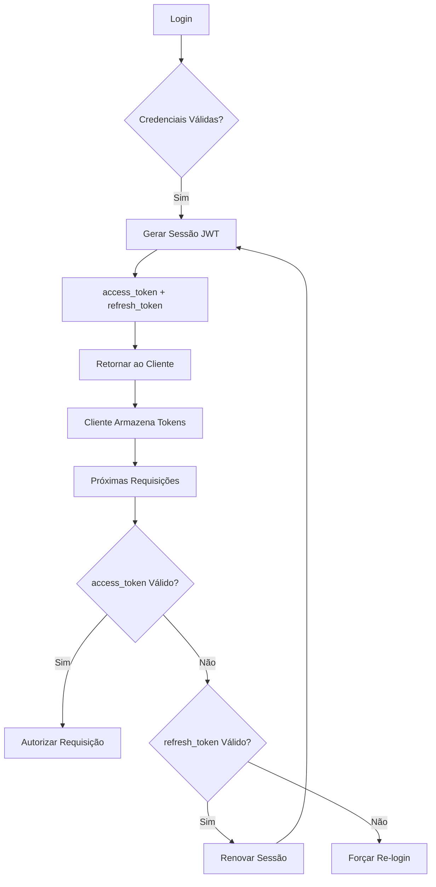
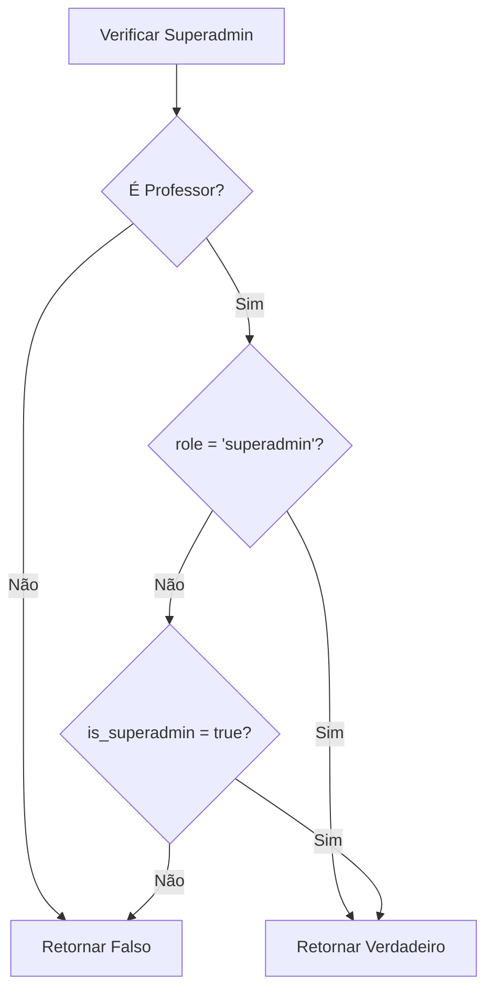
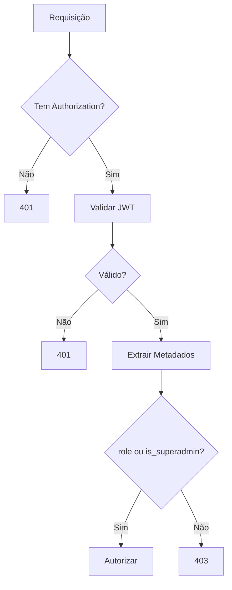

# Sistema de Autenticação e Autorização

<cite>
**Arquivos Referenciados neste Documento**  
- [auth.service.ts](file://backend/auth/auth.service.ts)
- [types.ts](file://backend/auth/types.ts)
- [middleware.ts](file://backend/auth/middleware.ts)
- [database-auth.ts](file://backend/clients/database-auth.ts)
- [database.ts](file://backend/clients/database.ts)
- [signin/route.ts](file://app/api/auth/signin/route.ts)
- [signup/route.ts](file://app/api/auth/signup/route.ts)
- [me/route.ts](file://app/api/auth/me/route.ts)
- [refresh/route.ts](file://app/api/auth/refresh/route.ts)
- [signout/route.ts](file://app/api/auth/signout/route.ts)
</cite>

## Sumário
1. [Introdução](#introdução)
2. [Arquitetura do Sistema de Autenticação](#arquitetura-do-sistema-de-autenticação)
3. [Classe AuthService e Métodos Principais](#classe-authservice-e-métodos-principais)
4. [Gerenciamento de Sessões com JWT via Supabase Auth](#gerenciamento-de-sessões-com-jwt-via-supabase-auth)
5. [Tratamento de Papéis (Roles) e Promoção a Superadmin](#tratamento-de-papéis-roles-e-promoção-a-superadmin)
6. [Fluxos de Requisições HTTP e Exemplos de Respostas](#fluxos-de-requisições-http-e-exemplos-de-respostas)
7. [Tratamento de Erros Comuns](#tratamento-de-erros-comuns)
8. [Boas Práticas de Segurança](#boas-práticas-de-segurança)
9. [Conclusão](#conclusão)

## Introdução

O sistema de autenticação e autorização do backend é baseado no Supabase Auth, utilizando tokens JWT para gerenciamento de sessões. Ele implementa uma arquitetura modular com a classe `AuthService`, que encapsula operações como cadastro, login, logout, obtenção do usuário atual e renovação de sessão. O sistema suporta três papéis principais: **aluno**, **professor** e **superadmin**, com lógica específica para promoção automática do primeiro professor a superadmin. A autenticação é integrada com políticas de segurança (RLS) no banco de dados e suporta tanto autenticação por JWT quanto por chaves de API.

**Seções de origem**  
- [auth.service.ts](file://backend/auth/auth.service.ts#L1-L141)
- [middleware.ts](file://backend/auth/middleware.ts#L1-L193)

## Arquitetura do Sistema de Autenticação

O sistema de autenticação é composto por vários componentes interconectados:



**Fontes do diagrama**  
- [auth.service.ts](file://backend/auth/auth.service.ts#L4-L140)
- [middleware.ts](file://backend/auth/middleware.ts#L6-L193)
- [database-auth.ts](file://backend/clients/database-auth.ts#L1-L68)

**Seções de origem**  
- [auth.service.ts](file://backend/auth/auth.service.ts#L1-L141)
- [middleware.ts](file://backend/auth/middleware.ts#L1-L193)
- [database-auth.ts](file://backend/clients/database-auth.ts#L1-L68)

## Classe AuthService e Métodos Principais

A classe `AuthService` centraliza todas as operações de autenticação, fornecendo uma interface clara e reutilizável para os endpoints da API.

### Método signUp

Registra um novo usuário no sistema. O papel padrão é `aluno`, mas pode ser sobrescrito. Os metadados do usuário são armazenados no Supabase Auth.



**Fontes do diagrama**  
- [auth.service.ts](file://backend/auth/auth.service.ts#L5-L42)

### Método signIn

Autentica um usuário existente com email e senha, retornando um objeto com os dados do usuário e a sessão JWT.



**Fontes do diagrama**  
- [auth.service.ts](file://backend/auth/auth.service.ts#L44-L75)

### Método signOut

Encerra a sessão do usuário atual no Supabase Auth.



**Fontes do diagrama**  
- [auth.service.ts](file://backend/auth/auth.service.ts#L77-L84)

### Método getCurrentUser

Obtém os dados do usuário a partir de um token JWT fornecido.



**Fontes do diagrama**  
- [auth.service.ts](file://backend/auth/auth.service.ts#L86-L104)

### Método refreshSession

Renova a sessão do usuário usando o refresh token, obtendo um novo access token.



**Fontes do diagrama**  
- [auth.service.ts](file://backend/auth/auth.service.ts#L106-L136)

**Seções de origem**  
- [auth.service.ts](file://backend/auth/auth.service.ts#L4-L139)

## Gerenciamento de Sessões com JWT via Supabase Auth

O sistema utiliza o Supabase Auth para gerenciamento de sessões com JWT. Cada sessão contém um **access token** (curta duração) e um **refresh token** (longa duração). O access token é usado para autenticar requisições subsequentes, enquanto o refresh token permite obter um novo access token sem exigir login novamente.

Os metadados do usuário, como `role` e `is_superadmin`, são armazenados no `user_metadata` do Supabase e extraídos durante cada operação de autenticação para determinar o nível de acesso.



**Fontes do diagrama**  
- [auth.service.ts](file://backend/auth/auth.service.ts#L5-L136)
- [middleware.ts](file://backend/auth/middleware.ts#L11-L51)

**Seções de origem**  
- [auth.service.ts](file://backend/auth/auth.service.ts#L5-L136)
- [middleware.ts](file://backend/auth/middleware.ts#L11-L51)

## Tratamento de Papéis (Roles) e Promoção a Superadmin

O sistema define três papéis principais:

- **aluno**: Acesso limitado ao próprio conteúdo.
- **professor**: Pode gerenciar cursos, disciplinas e alunos.
- **superadmin**: Acesso total ao sistema, incluindo bypass de políticas RLS.

A promoção a superadmin ocorre automaticamente para o **primeiro professor criado**, através de um trigger no banco de dados. Além disso, um usuário pode ser promovido manualmente atualizando os metadados no Supabase (`role: 'superadmin'` ou `is_superadmin: true`).

A lógica de verificação de superadmin é implementada no middleware:



**Fontes do diagrama**  
- [middleware.ts](file://backend/auth/middleware.ts#L87-L113)
- [auth.service.ts](file://backend/auth/auth.service.ts#L27-L28)

**Seções de origem**  
- [middleware.ts](file://backend/auth/middleware.ts#L87-L113)
- [auth.service.ts](file://backend/auth/auth.service.ts#L27-L28)
- [types.ts](file://backend/auth/types.ts#L1-L36)

## Fluxos de Requisições HTTP e Exemplos de Respostas

### Exemplo de Requisição de Cadastro (POST /api/auth/signup)

```http
POST /api/auth/signup HTTP/1.1
Content-Type: application/json

{
  "email": "professor@example.com",
  "password": "senha_segura",
  "fullName": "João Silva"
}
```

**Resposta de Sucesso (201):**
```json
{
  "data": {
    "user": {
      "id": "uuid",
      "email": "professor@example.com",
      "role": "professor",
      "isSuperAdmin": true
    },
    "session": {
      "accessToken": "jwt_token",
      "refreshToken": "refresh_token"
    }
  }
}
```

### Exemplo de Requisição de Login (POST /api/auth/signin)

```http
POST /api/auth/signin HTTP/1.1
Content-Type: application/json

{
  "email": "aluno@example.com",
  "password": "senha_aluno"
}
```

**Resposta de Sucesso (200):**
```json
{
  "data": {
    "user": {
      "id": "uuid",
      "email": "aluno@example.com",
      "role": "aluno",
      "isSuperAdmin": false
    },
    "session": {
      "accessToken": "jwt_token",
      "refreshToken": "refresh_token"
    }
  }
}
```

**Seções de origem**  
- [signup/route.ts](file://app/api/auth/signup/route.ts#L1-L59)
- [signin/route.ts](file://app/api/auth/signin/route.ts#L1-L39)
- [auth.service.ts](file://backend/auth/auth.service.ts#L5-L75)

## Tratamento de Erros Comuns

### Credenciais Inválidas

- **Código HTTP**: 401
- **Mensagem**: `"Failed to sign in: Invalid login credentials"`
- **Solução**: Verificar email e senha, garantir que o usuário esteja cadastrado.

### Sessão Expirada

- **Código HTTP**: 401
- **Mensagem**: `"Failed to refresh session: Token has expired"`
- **Solução**: Usar o refresh token para renovar a sessão ou forçar re-login.

### Refresh Token Inválido

- **Código HTTP**: 401
- **Mensagem**: `"Refresh token is required"`
- **Solução**: Solicitar novo login ao usuário.

### Erro Interno

- **Código HTTP**: 500
- **Mensagem**: `"Internal server error"`
- **Solução**: Verificar logs do servidor e estado do Supabase.

```mermaid
flowchart TD
A[Erro] --> B{Tipo de Erro?}
B --> |Credenciais| C[401 - Unauthorized]
B --> |Sessão Expirada| D[401 - Renovar com Refresh Token]
B --> |Refresh Token Inválido| E[401 - Re-login]
B --> |Erro Interno| F[500 - Verificar Logs]
C --> G[Mostrar Mensagem ao Usuário]
D --> H[Tentar refreshSession()]
E --> I[Forçar Login]
F --> J[Notificar Administrador]
```

**Fontes do diagrama**  
- [signin/route.ts](file://app/api/auth/signin/route.ts#L33-L36)
- [refresh/route.ts](file://app/api/auth/refresh/route.ts#L8-L10)
- [auth.service.ts](file://backend/auth/auth.service.ts#L20-L21)

**Seções de origem**  
- [signin/route.ts](file://app/api/auth/signin/route.ts#L33-L36)
- [refresh/route.ts](file://app/api/auth/refresh/route.ts#L8-L17)
- [auth.service.ts](file://backend/auth/auth.service.ts#L20-L21)

## Boas Práticas de Segurança

### Armazenamento Seguro de Tokens

- **Frontend**: Tokens devem ser armazenados em memória (não em localStorage) para evitar XSS.
- **HTTP Only Cookies**: Alternativamente, usar cookies com `HttpOnly` e `Secure` para proteção contra XSS.

### Proteção contra Ataques de Força Bruta

- **Rate Limiting**: Implementado no nível da API para limitar tentativas de login.
- **Bloqueio Temporário**: Após múltiplas falhas, bloquear temporariamente o IP ou email.
- **Captcha**: Para tentativas suspeitas, exigir verificação CAPTCHA.

### Validação de Metadados

O sistema valida os metadados do usuário (`role`, `is_superadmin`) em cada requisição autenticada, garantindo que apenas usuários autorizados tenham acesso elevado.



**Fontes do diagrama**  
- [middleware.ts](file://backend/auth/middleware.ts#L11-L51)
- [auth.service.ts](file://backend/auth/auth.service.ts#L86-L104)

**Seções de origem**  
- [middleware.ts](file://backend/auth/middleware.ts#L11-L51)
- [auth.service.ts](file://backend/auth/auth.service.ts#L86-L104)

## Conclusão

O sistema de autenticação e autorização é robusto, seguro e bem estruturado, utilizando o Supabase Auth para gerenciamento de sessões JWT. A classe `AuthService` fornece uma interface clara para operações de autenticação, enquanto o middleware garante autorização adequada com base em papéis e metadados. A promoção automática a superadmin e o tratamento de erros bem definido tornam o sistema resiliente e fácil de manter. As boas práticas de segurança, como armazenamento seguro de tokens e proteção contra força bruta, garantem a integridade do sistema.