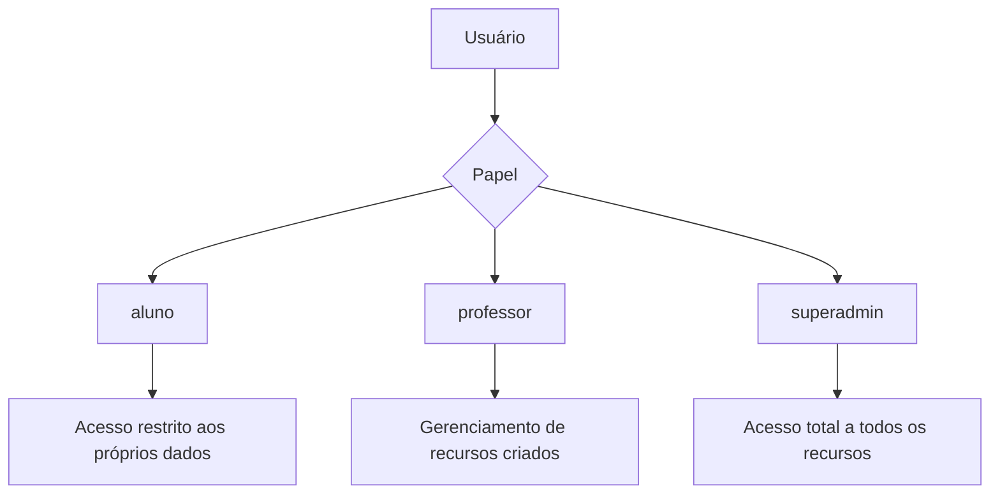
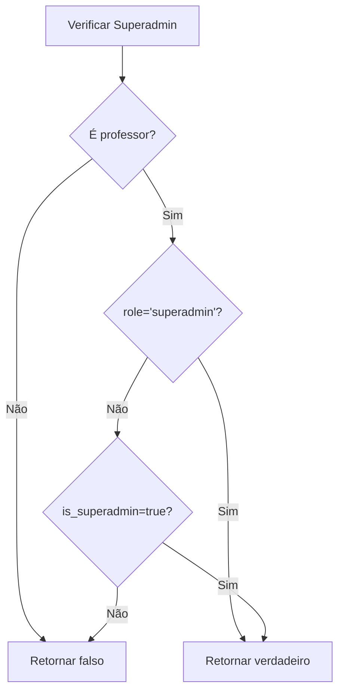
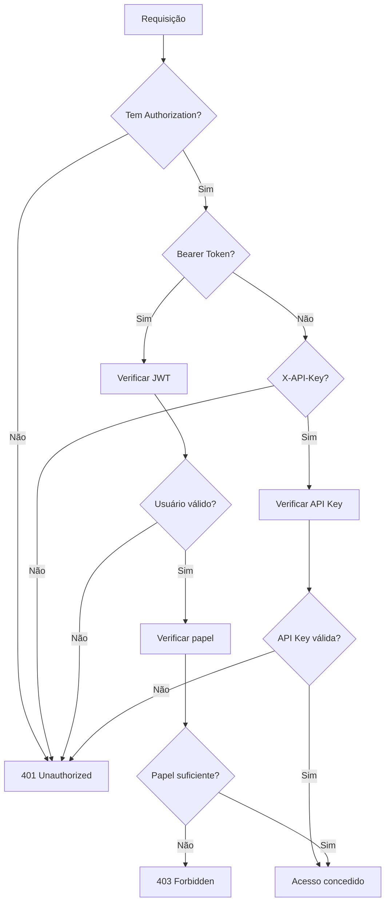
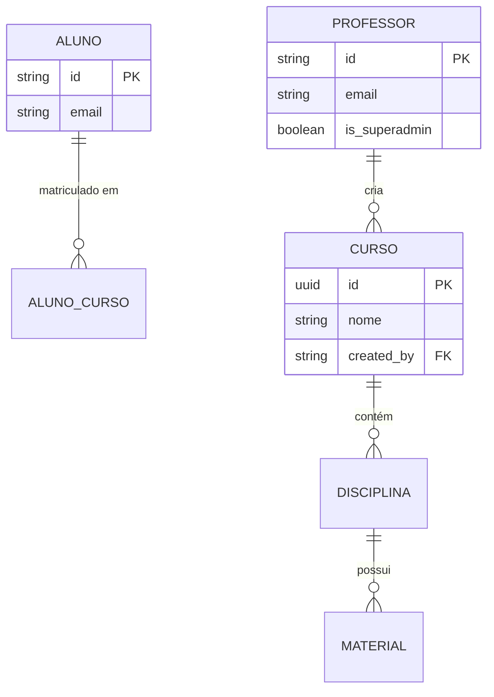

# Sistema de Autorização e Papéis

<cite>
**Arquivos Referenciados neste Documento**   
- [middleware.ts](file://backend/auth/middleware.ts)
- [roles.ts](file://lib/roles.ts)
- [user.ts](file://types/user.ts)
- [authentication.md](file://docs/authentication.md)
- [me/route.ts](file://app/api/auth/me/route.ts)
- [apply-rls-policies.js](file://scripts/apply-rls-policies.js)
</cite>

## Sumário
1. [Introdução](#introdução)
2. [Papéis do Sistema](#papéis-do-sistema)
3. [Verificação de Superadmin](#verificação-de-superadmin)
4. [Middlewares de Autorização](#middlewares-de-autorização)
5. [Políticas RLS no Supabase](#políticas-rls-no-supabase)
6. [Exemplos de Uso em Rotas](#exemplos-de-uso-em-rotas)

## Introdução
O sistema de autorização do projeto implementa um modelo baseado em papéis (roles) e políticas de segurança de linha (RLS) no Supabase, garantindo que usuários tenham acesso apenas aos recursos apropriados. Este documento detalha os papéis principais (aluno, professor e superadmin), os mecanismos de autorização e como as políticas RLS são aplicadas para proteger os dados.

**Seção fontes**
- [authentication.md](file://docs/authentication.md#L1-L137)

## Papéis do Sistema
O sistema define três papéis principais que determinam as permissões dos usuários:

- **Aluno**: Acesso limitado ao próprio perfil, matrículas e materiais dos cursos em que está inscrito.
- **Professor**: Pode criar e gerenciar cursos, disciplinas, segmentos e materiais didáticos.
- **Superadmin**: Possui acesso total a todos os recursos, podendo gerenciar qualquer dado do sistema.

O tipo `AppUserRole` define os papéis possíveis no sistema.

**Fontes do diagrama**
- [user.ts](file://types/user.ts#L1-L11)
- [authentication.md](file://docs/authentication.md#L14-L30)

**Seção fontes**
- [user.ts](file://types/user.ts#L1-L11)
- [roles.ts](file://lib/roles.ts#L1-L9)

## Verificação de Superadmin
Um usuário é considerado superadmin se atender a uma das seguintes condições:
- O papel no metadata do usuário for `'superadmin'`
- A propriedade `is_superadmin` no metadata do usuário for `true`

A verificação é realizada pela função `isSuperAdmin`, que consulta a tabela `professores` para confirmar que o usuário é um professor e verifica o metadata do usuário no Supabase Auth.

**Fontes do diagrama**
- [middleware.ts](file://backend/auth/middleware.ts#L87-L112)

**Seção fontes**
- [middleware.ts](file://backend/auth/middleware.ts#L87-L112)
- [me/route.ts](file://app/api/auth/me/route.ts#L1-L40)

## Middlewares de Autorização
O sistema oferece vários middlewares para proteger rotas da API com base nas permissões do usuário:

### requireAuth
Permite acesso com JWT válido ou API Key. Preenche `request.user` ou `request.apiKey`.

### requireUserAuth
Requer autenticação via JWT (usuário autenticado). Preenche `request.user`.

### requireRole(role)
Requer que o usuário tenha o papel especificado ou seja superadmin.

### requireSuperAdmin
Requer que o usuário seja superadmin.

**Fontes do diagrama**
- [middleware.ts](file://backend/auth/middleware.ts#L115-L192)

**Seção fontes**
- [middleware.ts](file://backend/auth/middleware.ts#L115-L192)
- [authentication.md](file://docs/authentication.md#L68-L99)

## Políticas RLS no Supabase
As políticas RLS (Row Level Security) no Supabase garantem que:

- **Alunos**: Veem apenas seus próprios dados
- **Professores**: Podem criar e gerenciar seus próprios recursos
- **Superadmin**: Tem acesso total a tudo (bypass RLS quando usando JWT)
- **API Keys**: Usam Service Role Key (bypass RLS completo)

O script `apply-rls-policies.js` é usado para aplicar políticas RLS na tabela `alunos_cursos`, demonstrando como as políticas são gerenciadas no sistema.

**Fontes do diagrama**
- [authentication.md](file://docs/authentication.md#L130-L136)
- [apply-rls-policies.js](file://scripts/apply-rls-policies.js#L36-L58)

**Seção fontes**
- [authentication.md](file://docs/authentication.md#L130-L136)
- [apply-rls-policies.js](file://scripts/apply-rls-policies.js#L1-L119)

## Exemplos de Uso em Rotas
Os middlewares de autorização são aplicados em rotas específicas para proteger recursos:

- Rotas de conversas usam `requireAuth` para permitir acesso com JWT ou API Key
- Rotas de flashcards usam `requireUserAuth` para garantir autenticação de usuário
- Rotas administrativas usam `requireRole('professor')` ou `requireSuperAdmin`

Esses decoradores são aplicados como funções de ordem superior, envolvendo os handlers de rota e garantindo que as verificações de autorização sejam realizadas antes da execução da lógica principal.

**Seção fontes**
- [conversations/[id]/route.ts](file://app/api/conversations/[id]/route.ts#L129-L142)
- [flashcards/[id]/route.ts](file://app/api/flashcards/[id]/route.ts#L78-L90)
- [teacher/[id]/route.ts](file://app/api/teacher/[id]/route.ts#L147-L163)