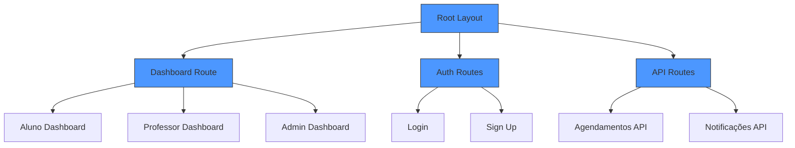
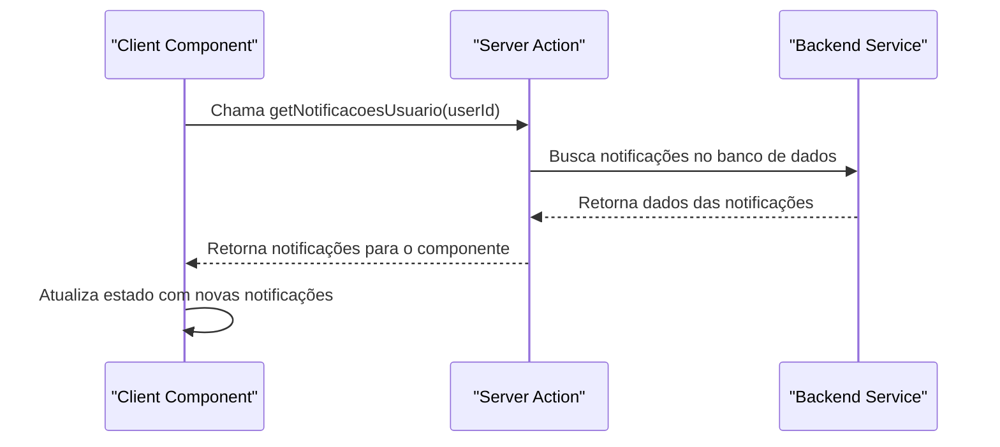
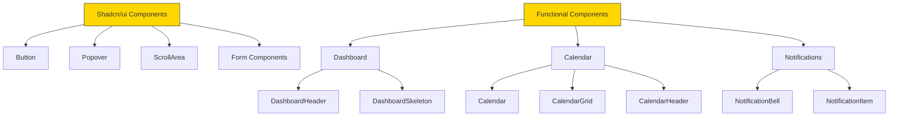
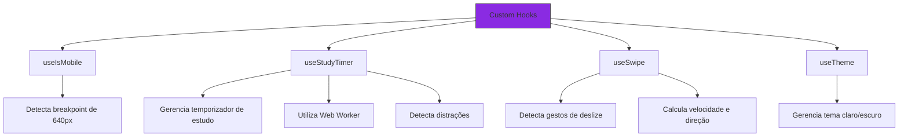
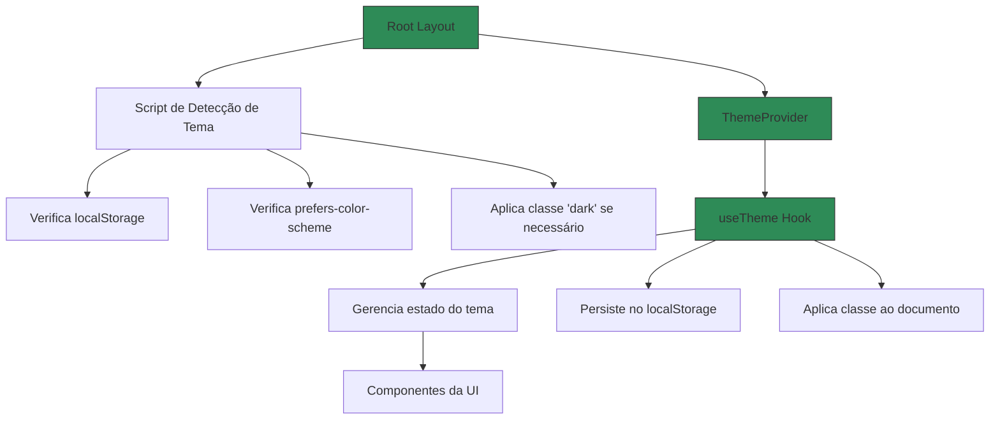
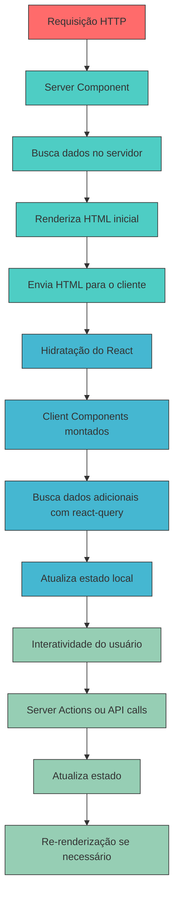

# Arquitetura Frontend

<cite>
**Arquivos Referenciados neste Documento**  
- [app/layout.tsx](file://app/layout.tsx)
- [app/page.tsx](file://app/page.tsx)
- [components/providers/theme-provider.tsx](file://components/providers/theme-provider.tsx)
- [hooks/use-theme.ts](file://hooks/use-theme.ts)
- [hooks/use-mobile.ts](file://hooks/use-mobile.ts)
- [hooks/use-study-timer.ts](file://hooks/use-study-timer.ts)
- [hooks/use-swipe.ts](file://hooks/use-swipe.ts)
- [components/dashboard/dashboard-header.tsx](file://components/dashboard/dashboard-header.tsx)
- [components/calendar/index.tsx](file://components/calendar/index.tsx)
- [components/notifications/notification-bell.tsx](file://components/notifications/notification-bell.tsx)
- [components/ui/button.tsx](file://components/ui/button.tsx)
- [package.json](file://package.json)
- [next.config.ts](file://next.config.ts)
</cite>

## Sumário
1. [Introdução](#introdução)
2. [Estrutura do Projeto](#estrutura-do-projeto)
3. [Arquitetura Baseada em Next.js 16 com App Router](#arquitetura-baseada-em-nextjs-16-com-app-router)
4. [Componentes do Servidor e do Cliente](#componentes-do-servidor-e-do-cliente)
5. [Ações do Servidor](#ações-do-servidor)
6. [Estrutura de Componentes com Shadcn/ui](#estrutura-de-componentes-com-shadcnui)
7. [Hooks Personalizados](#hooks-personalizados)
8. [Gerenciamento de Estado e Formulários](#gerenciamento-de-estado-e-formulários)
9. [Padrões de UI/UX, Acessibilidade e Responsividade](#padrões-de-uiux-acessibilidade-e-responsividade)
10. [Tematização com Theme Provider](#tematização-com-theme-provider)
11. [Fluxo de Dados e Renderização](#fluxo-de-dados-e-renderização)
12. [Considerações de Desempenho, SEO e Otimização](#considerações-de-desempenho-seo-e-otimização)

## Introdução

O frontend do projeto Área do Aluno é construído com Next.js 16 utilizando o App Router, aproveitando ao máximo os recursos modernos do React, como React Server Components (RSC), Client Components e Server Actions. Esta documentação detalha a arquitetura do frontend, destacando a organização de componentes, uso de hooks personalizados, gerenciamento de estado, padrões de UI/UX e estratégias de otimização. O sistema é projetado para ser responsivo, acessível e escalável, com foco em experiência do usuário e desempenho.

## Estrutura do Projeto

A estrutura do projeto segue a organização recomendada pelo Next.js com App Router, separando claramente rotas, componentes, hooks e utilitários. O diretório `app` contém todas as rotas da aplicação, incluindo páginas dinâmicas e layouts específicos. O diretório `components` organiza os componentes por funcionalidade (dashboard, calendar, notifications) e inclui a biblioteca Shadcn/ui para componentes UI padronizados. O diretório `hooks` contém hooks personalizados reutilizáveis, enquanto `lib` armazena serviços, validações e utilitários.

**Section sources**
- [app](file://app)
- [components](file://components)
- [hooks](file://hooks)
- [lib](file://lib)

## Arquitetura Baseada em Next.js 16 com App Router

A arquitetura frontend é baseada no App Router do Next.js 16, que permite uma estrutura hierárquica de rotas com suporte a layouts aninhados, rotas dinâmicas e renderização híbrida. O layout global é definido em `app/layout.tsx`, que envolve toda a aplicação com provedores essenciais como o ThemeProvider. O arquivo `app/page.tsx` serve como página inicial, redirecionando usuários autenticados para suas rotas padrão com base em seus papéis.

O uso de grupos de rotas (ex: `(dashboard)`) permite organizar rotas logicamente sem afetar a URL. Rotas dinâmicas são implementadas com a sintaxe de colchetes (ex: `[id]`), permitindo páginas personalizadas para diferentes entidades. O sistema de rotas é complementado por Server Actions em `app/actions`, que permitem chamadas diretas a funções do servidor sem APIs REST tradicionais.

**Diagram sources**
- [app/layout.tsx](file://app/layout.tsx#L43-L75)
- [app/page.tsx](file://app/page.tsx#L8-L19)
- [app/actions](file://app/actions)

## Componentes do Servidor e do Cliente

A arquitetura utiliza uma combinação estratégica de Server Components e Client Components. Server Components são usados para renderização inicial, busca de dados e lógica que não requer interatividade no cliente. Client Components são usados para elementos interativos, hooks do React e funcionalidades que dependem do DOM.

Componentes Server são identificados pela ausência da diretiva `'use client'` e são usados extensivamente em páginas e layouts para carregar dados de forma eficiente. Client Components são marcados com `'use client'` no topo do arquivo e são usados para componentes interativos como o NotificationBell, DashboardHeader e calendários. A separação clara entre componentes do servidor e do cliente permite otimizar o desempenho, reduzindo o tamanho do bundle do cliente e melhorando o tempo de interatividade.

**Section sources**
- [app/page.tsx](file://app/page.tsx)
- [components/notifications/notification-bell.tsx](file://components/notifications/notification-bell.tsx#L1)
- [components/dashboard/dashboard-header.tsx](file://components/dashboard/dashboard-header.tsx#L1)

## Ações do Servidor

O projeto utiliza Server Actions para operações que requerem acesso ao servidor, como busca de notificações e manipulação de agendamentos. As ações estão localizadas em `app/actions` e são importadas diretamente em Client Components quando necessário. Isso elimina a necessidade de criar APIs REST separadas para operações simples, simplificando a arquitetura e reduzindo a latência.

As ações do servidor são definidas como funções assíncronas que podem ser chamadas diretamente de componentes do cliente, com o Next.js cuidando da serialização e comunicação entre cliente e servidor. Este padrão é usado para operações como `getNotificacoesUsuario` no componente NotificationBell, permitindo atualizações em tempo real com polling periódico.

**Diagram sources**
- [app/actions/notificacoes.ts](file://app/actions/notificacoes.ts)
- [components/notifications/notification-bell.tsx](file://components/notifications/notification-bell.tsx#L24-L34)

## Estrutura de Componentes com Shadcn/ui

Os componentes são organizados no diretório `components/` com uma estrutura baseada em funcionalidade. O projeto utiliza Shadcn/ui para componentes UI padronizados, localizados em `components/ui/`. Esta biblioteca fornece componentes acessíveis, estilizados com Tailwind CSS e facilmente personalizáveis.

A organização por funcionalidade inclui diretórios como `dashboard/`, `calendar/` e `notifications/`, cada um contendo componentes específicos para suas respectivas áreas. Os componentes são projetados para serem reutilizáveis e compostos, seguindo princípios de design modular. Por exemplo, o componente Calendar é composto por CalendarHeader e CalendarGrid, permitindo personalização e reutilização em diferentes contextos.

**Diagram sources**
- [components/ui](file://components/ui)
- [components/dashboard](file://components/dashboard)
- [components/calendar](file://components/calendar)
- [components/notifications](file://components/notifications)

## Hooks Personalizados

O projeto implementa vários hooks personalizados no diretório `hooks/` para encapsular lógica reutilizável e estado compartilhado. Estes hooks seguem as convenções do React e são projetados para serem simples, eficientes e fáceis de testar.

### use-mobile
O hook `useIsMobile` detecta se o dispositivo do usuário é móvel com base no breakpoint de 640px (Tailwind's sm). Ele utiliza `window.matchMedia` para monitorar mudanças no tamanho da tela e retorna um valor booleano que pode ser usado para renderização condicional de componentes.

### use-study-timer
O hook `useStudyTimer` gerencia o estado de um temporizador de estudo com suporte a diferentes métodos (cronômetro, pomodoro). Ele utiliza um Web Worker (`study-timer.worker.ts`) para manter o temporizador preciso mesmo quando a aba está em segundo plano. O hook fornece funções para iniciar, pausar, retomar e finalizar o temporizador, além de detectar distrações através do `visibilitychange`.

### use-swipe
O hook `useSwipe` detecta gestos de deslize em dispositivos móveis, permitindo interações naturais com a interface. Ele calcula a distância, velocidade e direção do deslize, acionando callbacks apropriados (`onSwipeLeft`, `onSwipeRight`) quando um gesto válido é detectado. O hook previne o scroll padrão durante o deslize para melhorar a experiência do usuário.

**Diagram sources**
- [hooks/use-mobile.ts](file://hooks/use-mobile.ts)
- [hooks/use-study-timer.ts](file://hooks/use-study-timer.ts)
- [hooks/use-swipe.ts](file://hooks/use-swipe.ts)

**Section sources**
- [hooks/use-mobile.ts](file://hooks/use-mobile.ts#L6-L20)
- [hooks/use-study-timer.ts](file://hooks/use-study-timer.ts#L74-L136)
- [hooks/use-swipe.ts](file://hooks/use-swipe.ts#L10-L83)

## Gerenciamento de Estado e Formulários

O projeto utiliza `@tanstack/react-query` para gerenciamento de estado assíncrono e cache de dados do servidor. Este approach permite buscar, sincronizar e atualizar dados de forma eficiente, com recursos como stale-while-revalidate, retry automático e cache inteligente. As consultas são usadas extensivamente para carregar dados de usuário, notificações, agendamentos e outras entidades.

Para formulários, o projeto combina `react-hook-form` com `zod` para validação de esquema. Esta combinação oferece uma experiência de desenvolvimento eficiente com tipagem completa, validação em tempo real e integração perfeita com componentes UI. O `zod` define esquemas de validação que são usados tanto no frontend quanto no backend, garantindo consistência.

A integração entre essas bibliotecas é feita através do `@hookform/resolvers`, que conecta os esquemas `zod` ao `react-hook-form`. Isso permite uma validação robusta com feedback imediato ao usuário, enquanto mantém um bom desempenho ao minimizar renderizações desnecessárias.

**Section sources**
- [package.json](file://package.json#L53-L54)
- [package.json](file://package.json#L76)
- [package.json](file://package.json#L89)

## Padrões de UI/UX, Acessibilidade e Responsividade

O projeto segue padrões rigorosos de UI/UX, acessibilidade e responsividade para garantir uma experiência consistente em todos os dispositivos e para todos os usuários.

### Acessibilidade
Todos os componentes são construídos com acessibilidade em mente, utilizando atributos ARIA apropriados, semântica HTML correta e suporte a navegação por teclado. Componentes como Button, Popover e Calendar são implementados com base nos padrões WAI-ARIA, garantindo compatibilidade com leitores de tela e outras tecnologias assistivas.

### Responsividade
A interface é totalmente responsiva, utilizando uma combinação de Tailwind CSS e hooks personalizados como `useIsMobile`. O design adapta-se a diferentes tamanhos de tela, com layouts otimizados para dispositivos móveis, tablets e desktops. Componentes como o sidebar são ocultos em telas menores e substituídos por navegação inferior.

### Padrões de UI/UX
O projeto segue princípios de design consistente com:
- Tipografia clara usando a fonte Geist
- Espaçamento generoso e hierarquia visual
- Feedback visual imediato para interações
- Carregamento de estado para operações assíncronas
- Notificações não intrusivas com o componente NotificationBell

**Section sources**
- [app/layout.tsx](file://app/layout.tsx#L2-L3)
- [components/ui](file://components/ui)
- [hooks/use-mobile.ts](file://hooks/use-mobile.ts)

## Tematização com Theme Provider

O sistema de tematização é implementado com um ThemeProvider personalizado que gerencia o tema claro/escuro da aplicação. O provedor está localizado em `components/providers/theme-provider.tsx` e utiliza o hook `useTheme` do diretório `hooks/` para persistir a preferência do usuário no localStorage.

O tema é aplicado no nível raiz através do `RootLayout`, que inclui um script inline para evitar flicker de tema durante a hidratação. O script verifica o localStorage e as preferências do sistema antes da renderização inicial, aplicando a classe `dark` ao elemento html conforme necessário.

O hook `useTheme` fornece uma API simples para componentes consumidores:
- `theme`: o tema atual ('light' ou 'dark')
- `setTheme`: função para definir um novo tema
- `toggleTheme`: função para alternar entre temas
- `mounted`: indicador de que o hook foi montado (útil para SSR)

**Diagram sources**
- [app/layout.tsx](file://app/layout.tsx#L51-L64)
- [components/providers/theme-provider.tsx](file://components/providers/theme-provider.tsx)
- [hooks/use-theme.ts](file://hooks/use-theme.ts)

## Fluxo de Dados e Renderização

O fluxo de dados na aplicação segue um padrão híbrido que combina Server Components para renderização inicial e Client Components para interatividade. O diagrama abaixo ilustra o fluxo completo desde a requisição HTTP até a interação do usuário.

**Diagram sources**
- [app/layout.tsx](file://app/layout.tsx)
- [app/page.tsx](file://app/page.tsx)
- [components/notifications/notification-bell.tsx](file://components/notifications/notification-bell.tsx)

## Considerações de Desempenho, SEO e Otimização

O projeto implementa várias estratégias de otimização para garantir desempenho elevado, boa indexação por motores de busca e experiência do usuário fluida.

### Desempenho
- **Server Components**: Reduzem o tamanho do bundle do cliente ao mover lógica para o servidor
- **React Query**: Cache inteligente e deduplicação de consultas evitam buscas desnecessárias
- **Web Workers**: O temporizador de estudo roda em um worker separado para não bloquear a thread principal
- **Code Splitting**: O Next.js automaticamente divide o código por rotas
- **Imagens Otimizadas**: Embora não mostrado aqui, o Next.js otimiza imagens automaticamente

### SEO
- **Metadata Completa**: O `RootLayout` define metadados Open Graph e Twitter para compartilhamento
- **SSR/SSG**: A maioria das páginas é renderizada no servidor, garantindo conteúdo imediatamente disponível para crawlers
- **Estrutura Semântica**: Uso apropriado de cabeçalhos e elementos HTML semânticos
- **Carregamento Rápido**: Menor quantidade de JavaScript no cliente melhora o tempo de interatividade

### Otimizações Adicionais
- **Hydration Delay**: O atributo `suppressHydrationWarning` evita falsos positivos de warning
- **Fontes Personalizadas**: Fontes pré-carregadas com `next/font` para evitar layout shift
- **Prefetching**: O Next.js prefetches links na viewport para navegação instantânea
- **Caching Estratégico**: Uso de `dynamic` e `revalidate` para controlar o cache de páginas

**Section sources**
- [app/layout.tsx](file://app/layout.tsx#L16-L41)
- [app/page.tsx](file://app/page.tsx#L6)
- [next.config.ts](file://next.config.ts)
- [package.json](file://package.json)