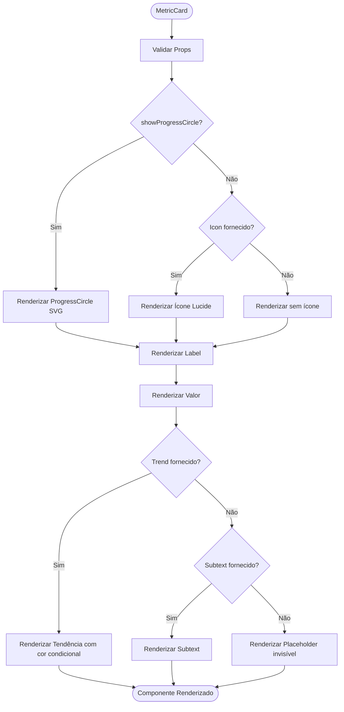
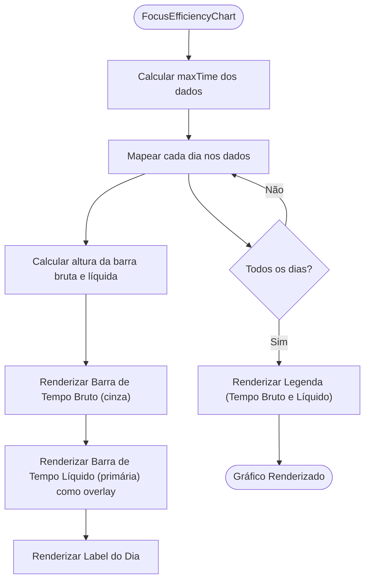
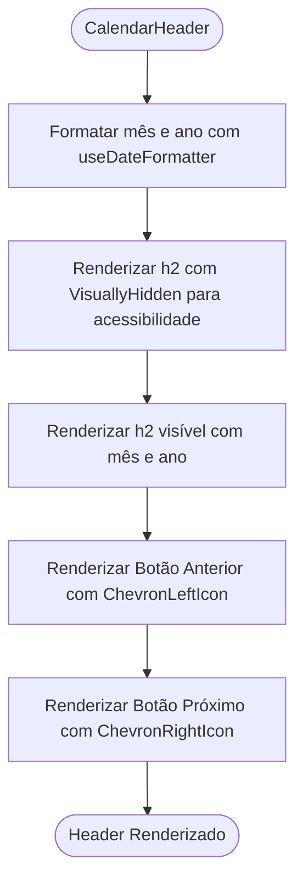
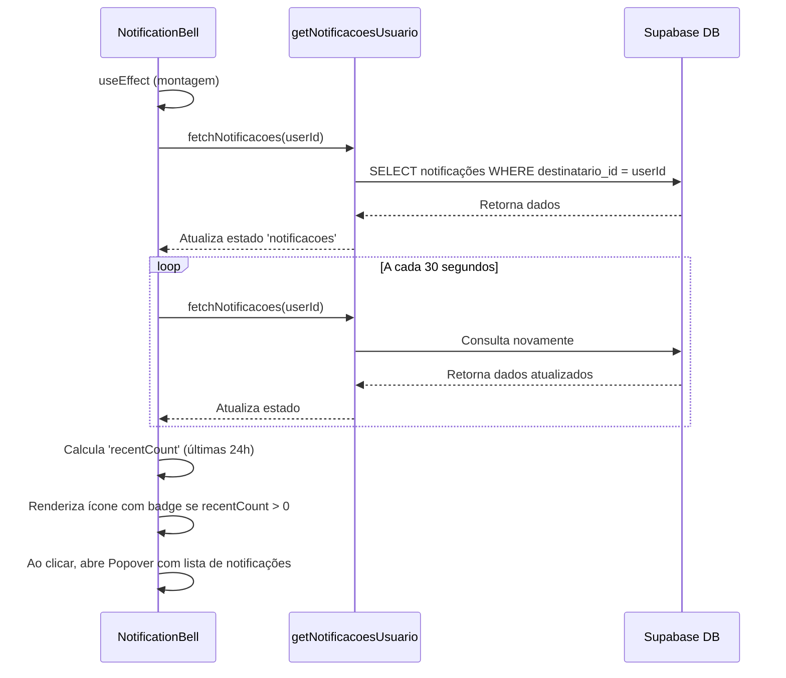
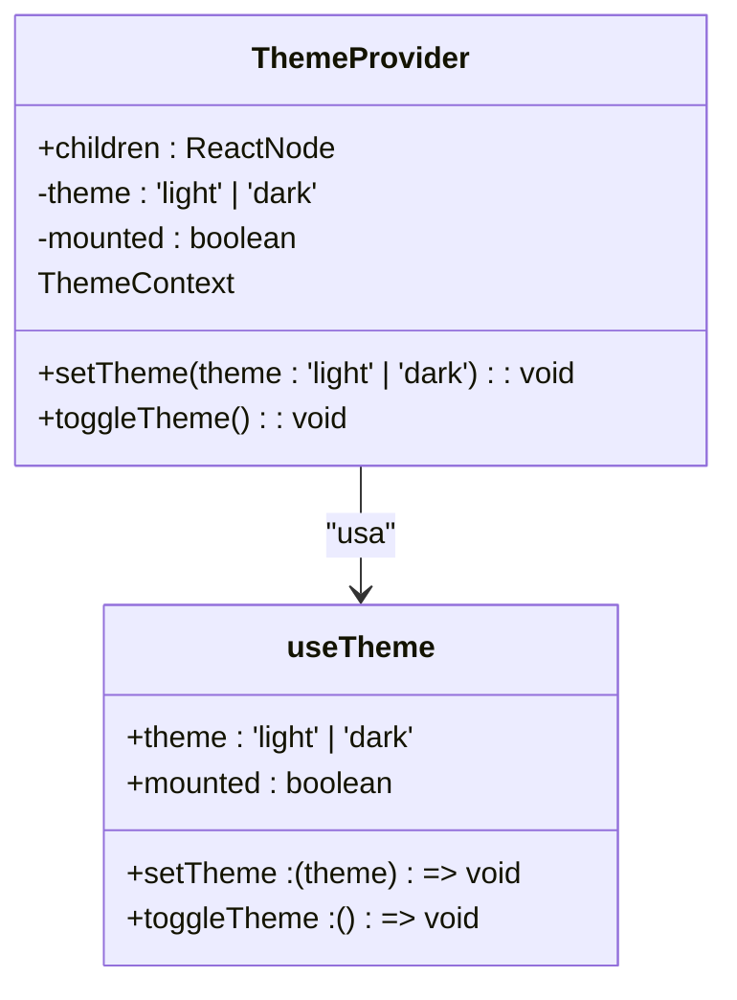
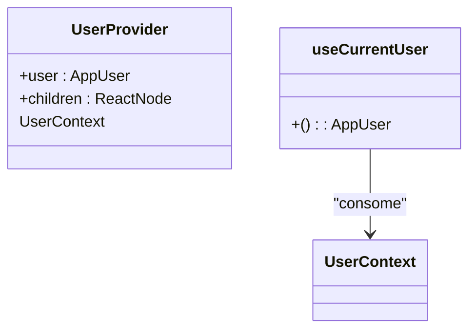

# Componentes Principais

<cite>
**Arquivos Referenciados neste Documento**  
- [metric-card.tsx](file://components/dashboard/metric-card.tsx)
- [focus-efficiency-chart.tsx](file://components/dashboard/focus-efficiency-chart.tsx)
- [calendar-grid.tsx](file://components/calendar/calendar-grid.tsx)
- [calendar-header.tsx](file://components/calendar/calendar-header.tsx)
- [notification-bell.tsx](file://components/notifications/notification-bell.tsx)
- [theme-provider.tsx](file://components/providers/theme-provider.tsx)
- [user-provider.tsx](file://components/providers/user-provider.tsx)
- [card.tsx](file://components/ui/card.tsx)
- [button.tsx](file://components/ui/button.tsx)
- [popover.tsx](file://components/ui/popover.tsx)
- [scroll-area.tsx](file://components/ui/scroll-area.tsx)
- [use-theme.ts](file://hooks/use-theme.ts)
- [user.ts](file://types/user.ts)
- [dashboard.ts](file://types/dashboard.ts)
- [notificacoes.ts](file://app/actions/notificacoes.ts)
</cite>

## Sumário
1. [Introdução](#introdução)
2. [Estrutura e Organização dos Componentes](#estrutura-e-organização-dos-componentes)
3. [Componentes Reutilizáveis do Dashboard](#componentes-reutilizáveis-do-dashboard)
4. [Componentes de Calendário](#componentes-de-calendário)
5. [Componentes de Notificações](#componentes-de-notificações)
6. [Provedores de Contexto](#provedores-de-contexto)
7. [Padrões de Acessibilidade, Responsividade e Temas](#padrões-de-acessibilidade-responsividade-e-temas)
8. [Integração com Estado Global e Rotas](#integração-com-estado-global-e-rotas)

## Introdução

Este documento detalha os componentes principais da aplicação, com foco nos componentes reutilizáveis localizados na pasta `/components`. A aplicação utiliza React com o framework Next.js e o App Router, integrando a biblioteca Shadcn/ui para construção de interfaces acessíveis e estilizadas com Tailwind CSS. Os componentes são organizados por domínio funcional, promovendo reutilização, acessibilidade e consistência visual.

## Estrutura e Organização dos Componentes

Os componentes estão organizados em diretórios temáticos dentro de `components/`:
- `dashboard/`: Componentes específicos para a visualização de métricas e análise.
- `calendar/`: Componentes para exibição e interação com calendários.
- `notifications/`: Componentes para gerenciamento de notificações do usuário.
- `providers/`: Provedores de contexto para gerenciamento de estado global.
- `ui/`: Biblioteca de componentes baseados em Shadcn/ui, estilizados com Tailwind CSS.
- Outros diretórios (`agendamento`, `professor`, etc.) contêm componentes específicos de domínio.

A biblioteca Shadcn/ui é utilizada como base para os componentes UI, garantindo acessibilidade, responsividade e uma estética moderna e consistente. Esses componentes são personalizados através de Tailwind CSS e integram-se com o sistema de temas da aplicação.

**Section sources**
- [card.tsx](file://components/ui/card.tsx#L1-L93)
- [button.tsx](file://components/ui/button.tsx#L1-L58)

## Componentes Reutilizáveis do Dashboard

### MetricCard

O componente `MetricCard` é um bloco reutilizável para exibir métricas numéricas com rótulos, ícones e indicadores de tendência. Ele é utilizado em várias partes do dashboard para apresentar dados de forma clara e visualmente atraente.

**Props disponíveis:**
- `label`: Rótulo descritivo da métrica (string)
- `value`: Valor principal a ser exibido (string | number)
- `subtext`: Texto secundário opcional (string)
- `icon`: Ícone Lucide a ser exibido (LucideIcon)
- `trend`: Objeto com `value` (string) e `isPositive` (boolean) para indicar tendência
- `showProgressCircle`: Flag para exibir um círculo de progresso em vez do ícone
- `progressValue`: Valor numérico (0-100) para o círculo de progresso

O componente utiliza o `Card` da Shadcn/ui como contêiner e aplica estilos com Tailwind CSS para garantir consistência visual. O círculo de progresso é implementado com SVG para o caso especial de métricas de aproveitamento.

**Diagram sources**
- [metric-card.tsx](file://components/dashboard/metric-card.tsx#L7-L116)

**Section sources**
- [metric-card.tsx](file://components/dashboard/metric-card.tsx#L1-L116)
- [card.tsx](file://components/ui/card.tsx#L5-L15)

### FocusEfficiencyChart

O componente `FocusEfficiencyChart` exibe um gráfico de barras comparando o tempo bruto e o tempo líquido de estudo ao longo de vários dias. Ele destaca a eficiência de foco do usuário.

**Props disponíveis:**
- `data`: Array de objetos `FocusEfficiencyDay` contendo `day`, `grossTime` e `netTime`.

O componente normaliza os valores de tempo para calcular a altura relativa das barras. Ele utiliza um esquema de cores com cinza para o tempo bruto e a cor primária da aplicação para o tempo líquido. Uma legenda clara explica os dados representados.

**Diagram sources**
- [focus-efficiency-chart.tsx](file://components/dashboard/focus-efficiency-chart.tsx#L7-L98)
- [dashboard.ts](file://types/dashboard.ts#L35-L39)

**Section sources**
- [focus-efficiency-chart.tsx](file://components/dashboard/focus-efficiency-chart.tsx#L1-L98)
- [card.tsx](file://components/ui/card.tsx#L5-L15)

## Componentes de Calendário

### CalendarGrid

O componente `CalendarGrid` renderiza uma grade mensal de dias, utilizando as bibliotecas `@react-aria/calendar` e `@react-stately/calendar` para acessibilidade e lógica de calendário. Ele é responsável pela estrutura tabular do calendário.

**Props disponíveis:**
- `state`: Objeto de estado do calendário fornecido pelo `useCalendarState`.
- `offset`: Objeto de duração de data para ajustar o mês visível.

O componente utiliza `useCalendarGrid` para obter propriedades ARIA e dados da semana. Ele renderiza um elemento `<table>` com cabeçalho (`<thead>`) contendo os dias da semana e um corpo (`<tbody>`) com as células do calendário (`CalendarCell`).

**Section sources**
- [calendar-grid.tsx](file://components/calendar/calendar-grid.tsx#L1-L67)

### CalendarHeader

O componente `CalendarHeader` exibe o mês e ano atual e fornece botões para navegação entre meses.

**Props disponíveis:**
- `state`: Objeto de estado do calendário.
- `calendarProps`: Propriedades ARIA para o calendário.
- `prevButtonProps`, `nextButtonProps`: Propriedades ARIA para os botões de navegação.

Ele utiliza `useDateFormatter` para formatar o nome do mês e o ano. Os botões de navegação são implementados com `Button` da Shadcn/ui e ícones `ChevronLeftIcon` e `ChevronRightIcon` da Lucide. A acessibilidade é garantida com `VisuallyHidden` para o rótulo do calendário.

**Diagram sources**
- [calendar-header.tsx](file://components/calendar/calendar-header.tsx#L9-L51)
- [button.tsx](file://components/ui/button.tsx#L7-L58)

**Section sources**
- [calendar-header.tsx](file://components/calendar/calendar-header.tsx#L1-L51)
- [button.tsx](file://components/ui/button.tsx#L1-L58)

## Componentes de Notificações

### NotificationBell

O componente `NotificationBell` é um ícone de sino que, ao ser clicado, exibe um popover com a lista de notificações do usuário. Ele mostra um indicador numérico para notificações recentes.

**Props disponíveis:**
- `userId`: ID do usuário para buscar notificações.

O componente é cliente-side e utiliza `useState` e `useEffect` para gerenciar o estado de carregamento, as notificações e a abertura do popover. Ele busca notificações do servidor usando a ação `getNotificacoesUsuario` e atualiza a lista a cada 30 segundos. O popover é implementado com `Popover` da Shadcn/ui, e a lista é rolável com `ScrollArea`. Cada notificação é renderizada por `NotificationItem`.

**Diagram sources**
- [notification-bell.tsx](file://components/notifications/notification-bell.tsx#L19-L94)
- [notificacoes.ts](file://app/actions/notificacoes.ts#L31-L59)

**Section sources**
- [notification-bell.tsx](file://components/notifications/notification-bell.tsx#L1-L94)
- [popover.tsx](file://components/ui/popover.tsx#L8-L34)
- [scroll-area.tsx](file://components/ui/scroll-area.tsx#L8-L49)
- [notificacoes.ts](file://app/actions/notificacoes.ts#L31-L59)

## Provedores de Contexto

### ThemeProvider

O `ThemeProvider` gerencia o tema da aplicação (claro/escuro) utilizando um contexto do React. Ele depende do hook `useTheme`.

**Props disponíveis:**
- `children`: Componentes filhos que terão acesso ao contexto.

O contexto expõe o tema atual, uma função `setTheme` para alterá-lo e uma função `toggleTheme` para alternar entre os modos. O estado inicial é determinado pelo `localStorage` ou pela preferência do sistema. A mudança de tema é aplicada adicionando ou removendo a classe `dark` no elemento `html`.

**Diagram sources**
- [theme-provider.tsx](file://components/providers/theme-provider.tsx#L1-L38)
- [use-theme.ts](file://hooks/use-theme.ts#L28-L73)

**Section sources**
- [theme-provider.tsx](file://components/providers/theme-provider.tsx#L1-L38)
- [use-theme.ts](file://hooks/use-theme.ts#L1-L73)

### UserProvider

O `UserProvider` fornece informações do usuário autenticado para toda a aplicação através do contexto do React.

**Props disponíveis:**
- `user`: Objeto `AppUser` contendo informações do usuário.
- `children`: Componentes filhos.

O componente utiliza `useMemo` para evitar renderizações desnecessárias quando o objeto `user` não muda. O hook `useCurrentUser` permite que qualquer componente consuma o contexto, lançando um erro se usado fora do provedor.

**Diagram sources**
- [user-provider.tsx](file://components/providers/user-provider.tsx#L1-L50)
- [user.ts](file://types/user.ts#L3-L12)

**Section sources**
- [user-provider.tsx](file://components/providers/user-provider.tsx#L1-L50)
- [user.ts](file://types/user.ts#L1-L12)

## Padrões de Acessibilidade, Responsividade e Temas

A aplicação adota padrões rigorosos de acessibilidade, responsividade e theming.

**Acessibilidade:** Os componentes utilizam atributos ARIA, rótulos visuais ocultos (`VisuallyHidden`) e garantem navegação por teclado. Bibliotecas como `@react-aria` e `@radix-ui` são fundamentais para isso.

**Responsividade:** O design é responsivo por padrão, utilizando classes do Tailwind CSS como `flex`, `grid`, `md:px-6` e `@container`. Os componentes se adaptam a diferentes tamanhos de tela.

**Theming:** O sistema de temas é controlado pelo `ThemeProvider` e `useTheme`. O tema é persistido no `localStorage` e aplicado ao DOM. As cores são definidas em variáveis CSS e referenciadas no Tailwind.

**Section sources**
- [use-theme.ts](file://hooks/use-theme.ts#L1-L73)
- [theme-provider.tsx](file://components/providers/theme-provider.tsx#L1-L38)
- [card.tsx](file://components/ui/card.tsx#L1-L93)

## Integração com Estado Global e Rotas

Os componentes se integram com o estado global principalmente através dos provedores de contexto (`UserProvider`, `ThemeProvider`). O estado do usuário é tipado com `AppUser` e acessado via `useCurrentUser`.

Com relação às rotas do App Router, os componentes são renderizados em páginas específicas dentro do diretório `app/`. Por exemplo, o `NotificationBell` é usado em páginas do dashboard, e os componentes de calendário são usados em `app/(dashboard)/aluno/cronograma/calendario/page.tsx`. As ações do servidor (`actions/`) são chamadas por componentes cliente para buscar dados, como as notificações.

**Section sources**
- [user-provider.tsx](file://components/providers/user-provider.tsx#L1-L50)
- [theme-provider.tsx](file://components/providers/theme-provider.tsx#L1-L38)
- [notificacoes.ts](file://app/actions/notificacoes.ts#L1-L142)
- [app/(dashboard)/aluno/cronograma/calendario/page.tsx](file://app/(dashboard)/aluno/cronograma/calendario/page.tsx)