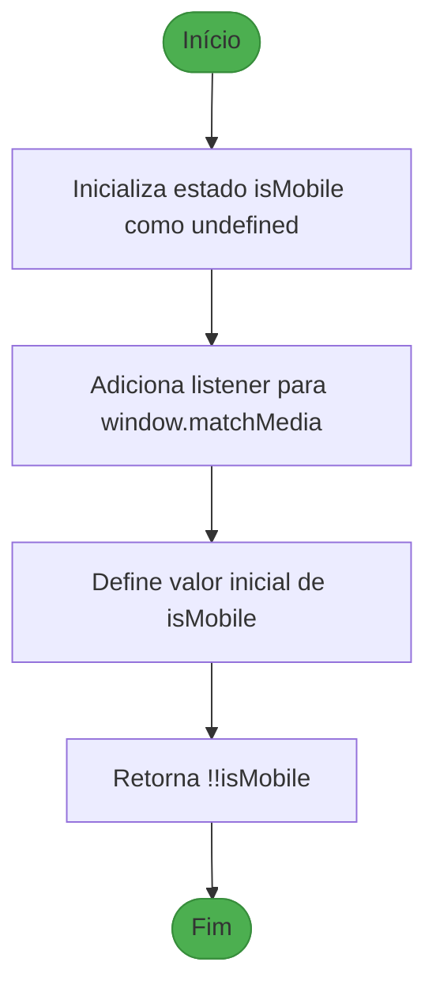
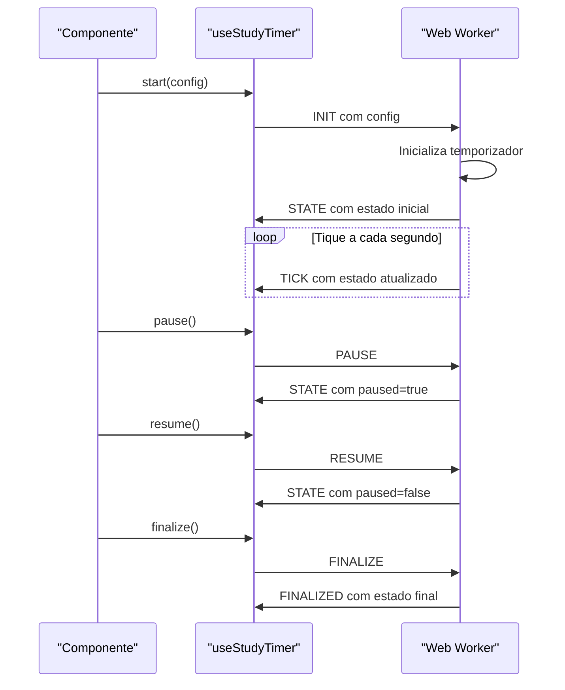
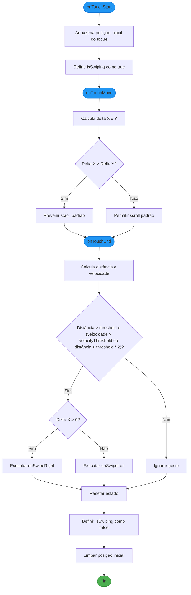
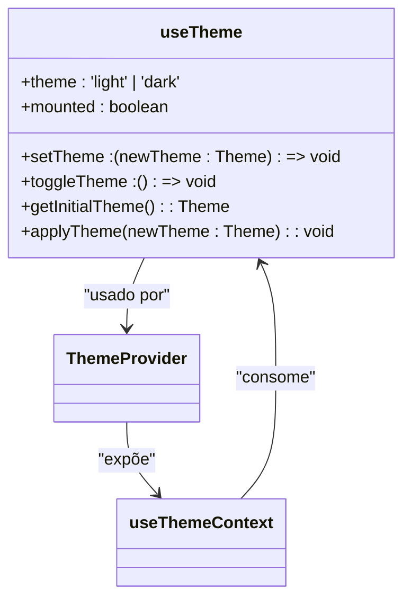

# Estado e Hooks Personalizados

<cite>
**Arquivos Referenciados neste Documento**   
- [use-mobile.ts](file://hooks/use-mobile.ts)
- [use-study-timer.ts](file://hooks/use-study-timer.ts)
- [use-swipe.ts](file://hooks/use-swipe.ts)
- [use-theme.ts](file://hooks/use-theme.ts)
- [study-timer.worker.ts](file://workers/study-timer.worker.ts)
- [theme-provider.tsx](file://components/providers/theme-provider.tsx)
- [modo-foco-client.tsx](file://app/(dashboard)/aluno/modo-foco/modo-foco-client.tsx)
- [schedule-calendar-view.tsx](file://components/schedule-calendar-view.tsx)
- [conversations-panel.tsx](file://components/conversations-panel.tsx)
- [sidebar.tsx](file://components/ui/sidebar.tsx)
</cite>

## Sumário
1. [Gerenciamento de Estado e Hooks Personalizados](#gerenciamento-de-estado-e-hooks-personalizados)
2. [React Query e Gerenciamento de Estado Assíncrono](#react-query-e-gerenciamento-de-estado-assíncrono)
3. [Hook use-mobile](#hook-use-mobile)
4. [Hook use-study-timer](#hook-use-study-timer)
5. [Hook use-swipe](#hook-use-swipe)
6. [Hook use-theme](#hook-use-theme)
7. [Integração com Contextos Globais](#integração-com-contextos-globais)
8. [Considerações de Desempenho e Memoização](#considerações-de-desempenho-e-memoização)
9. [Prevenção de Vazamentos de Memória](#prevenção-de-vazamentos-de-memória)

## Gerenciamento de Estado e Hooks Personalizados

A aplicação utiliza uma abordagem modular para o gerenciamento de estado, combinando hooks personalizados com contextos globais e workers para operações pesadas. Os hooks personalizados encapsulam lógica de estado complexa, permitindo reutilização e manutenção simplificada. A arquitetura prioriza a separação de preocupações, com cada hook responsável por um domínio específico: detecção de dispositivos móveis, controle de temporizadores de estudo, gestos de toque e gerenciamento de temas.

**Fontes da seção**
- [use-mobile.ts](file://hooks/use-mobile.ts#L1-L21)
- [use-study-timer.ts](file://hooks/use-study-timer.ts#L1-L149)
- [use-swipe.ts](file://hooks/use-swipe.ts#L1-L89)
- [use-theme.ts](file://hooks/use-theme.ts#L1-L73)

## React Query e Gerenciamento de Estado Assíncrono

Embora não seja explicitamente mencionado nos arquivos analisados, a aplicação demonstra padrões de gerenciamento de estado assíncrono que seriam naturalmente complementados pelo React Query. O uso de `fetch` diretamente nos componentes, como visto em `modo-foco-client.tsx`, indica que a aplicação poderia se beneficiar do React Query para cache de dados, sincronização automática com a API e gerenciamento de carregamento e erros. O React Query simplificaria a lógica atual de `fetchWithAuth` e `fetchCards`, fornecendo um cache centralizado e atualizações automáticas.

**Fontes da seção**
- [modo-foco-client.tsx](file://app/(dashboard)/aluno/flashcards/flashcards-client.tsx#L86-L116)

## Hook use-mobile

O hook `use-mobile` detecta se o dispositivo do usuário é móvel com base na largura da janela. Ele utiliza `window.matchMedia` para monitorar mudanças no tamanho da tela, garantindo que a detecção seja responsiva. O hook retorna um valor booleano que indica se a largura da janela é inferior a 640 pixels, o breakpoint definido para dispositivos móveis no Tailwind CSS.

### Parâmetros
- Nenhum parâmetro é necessário.

### Valor Retornado
- **isMobile**: `boolean` - Indica se o dispositivo é móvel.

### Casos de Uso Comuns
- Ocultar ou mostrar elementos específicos em dispositivos móveis.
- Ajustar o layout com base no tipo de dispositivo.
- Habilitar funcionalidades específicas para dispositivos móveis, como gestos de toque.

**Fontes do diagrama**
- [use-mobile.ts](file://hooks/use-mobile.ts#L6-L19)

**Fontes da seção**
- [use-mobile.ts](file://hooks/use-mobile.ts#L6-L19)
- [conversations-panel.tsx](file://components/conversations-panel.tsx#L32)
- [schedule-calendar-view.tsx](file://components/schedule-calendar-view.tsx#L159)
- [sidebar.tsx](file://components/ui/sidebar.tsx#L68)

## Hook use-study-timer

O hook `use-study-timer` gerencia um temporizador de estudo complexo, suportando modos cronômetro, timer regressivo e Pomodoro. Ele utiliza um Web Worker para executar a lógica de temporização em uma thread separada, evitando bloqueios na interface do usuário. O hook se comunica com o worker via mensagens, permitindo controle preciso do temporizador.

### Parâmetros
- **config**: `TimerConfig` - Configuração do temporizador, incluindo modo, duração e configurações do Pomodoro.

### Valor Retornado
- **state**: `StudyTimerState` - Estado atual do temporizador.
- **start**: `function` - Inicia o temporizador com a configuração fornecida.
- **pause**: `function` - Pausa o temporizador.
- **resume**: `function` - Resume o temporizador.
- **finalize**: `function` - Finaliza o temporizador.
- **latestState**: `function` - Retorna o estado mais recente do temporizador.

### Casos de Uso Comuns
- Implementar sessões de estudo focado com controle de tempo.
- Monitorar pausas e distrações durante o estudo.
- Integrar com a API para registrar sessões de estudo.

**Fontes do diagrama**
- [use-study-timer.ts](file://hooks/use-study-timer.ts#L74-L137)
- [study-timer.worker.ts](file://workers/study-timer.worker.ts#L1-L308)

**Fontes da seção**
- [use-study-timer.ts](file://hooks/use-study-timer.ts#L74-L137)
- [study-timer.worker.ts](file://workers/study-timer.worker.ts#L1-L308)
- [modo-foco-client.tsx](file://app/(dashboard)/aluno/modo-foco/modo-foco-client.tsx#L60)

## Hook use-swipe

O hook `use-swipe` detecta gestos de deslizar na tela, com suporte para deslizar para a esquerda e para a direita. Ele previne o scroll padrão durante o deslize se o movimento for predominantemente horizontal, proporcionando uma experiência de usuário mais fluida. O hook utiliza thresholds configuráveis para distância e velocidade, garantindo que apenas gestos intencionais sejam detectados.

### Parâmetros
- **onSwipeLeft**: `function` - Callback executado quando um deslize para a esquerda é detectado.
- **onSwipeRight**: `function` - Callback executado quando um deslize para a direita é detectado.
- **threshold**: `number` - Distância mínima em pixels para acionar o deslize (padrão: 50).
- **velocityThreshold**: `number` - Velocidade mínima para acionar o deslize (padrão: 0.3).

### Valor Retornado
- **handlers**: `object` - Objeto contendo os handlers `onTouchStart`, `onTouchMove` e `onTouchEnd`.
- **isSwiping**: `boolean` - Indica se um deslize está em andamento.

### Casos de Uso Comuns
- Navegar entre páginas ou abas com gestos de deslize.
- Exibir ou ocultar painéis laterais.
- Implementar carrosséis ou galerias de imagens.

**Fontes do diagrama**
- [use-swipe.ts](file://hooks/use-swipe.ts#L19-L84)

**Fontes da seção**
- [use-swipe.ts](file://hooks/use-swipe.ts#L19-L84)
- [schedule-calendar-view.tsx](file://components/schedule-calendar-view.tsx#L230)

## Hook use-theme

O hook `use-theme` gerencia o tema claro/escuro da aplicação, persistindo a preferência do usuário no `localStorage`. Ele detecta a preferência do sistema se nenhuma preferência for definida, proporcionando uma experiência personalizada. O hook aplica o tema ao elemento raiz do documento, permitindo que o Tailwind CSS aplique estilos condicionais.

### Parâmetros
- Nenhum parâmetro é necessário.

### Valor Retornado
- **theme**: `"light" | "dark"` - Tema atual.
- **setTheme**: `function` - Define o tema.
- **toggleTheme**: `function` - Alterna entre os temas claro e escuro.
- **mounted**: `boolean` - Indica se o hook foi montado (evita hidratação incorreta).

### Casos de Uso Comuns
- Permitir que o usuário alterne entre temas claro e escuro.
- Persistir a preferência de tema entre sessões.
- Integrar com um provedor de tema para acesso global.

**Fontes do diagrama**
- [use-theme.ts](file://hooks/use-theme.ts#L28-L71)
- [theme-provider.tsx](file://components/providers/theme-provider.tsx#L20-L32)

**Fontes da seção**
- [use-theme.ts](file://hooks/use-theme.ts#L28-L71)
- [theme-provider.tsx](file://components/providers/theme-provider.tsx#L20-L32)
- [theme-switcher.tsx](file://components/theme-switcher.tsx#L7)
- [theme-toggle.tsx](file://components/theme-toggle.tsx#L7)

## Integração com Contextos Globais

Os hooks personalizados são integrados a contextos globais para fornecer acesso fácil em qualquer parte da aplicação. O `useTheme` é consumido pelo `ThemeProvider`, que expõe o estado do tema através do `useThemeContext`. Da mesma forma, o `useIsMobile` é usado em vários componentes para adaptar o layout com base no dispositivo. Essa abordagem centraliza a lógica de estado e facilita a manutenção.

**Fontes da seção**
- [theme-provider.tsx](file://components/providers/theme-provider.tsx#L20-L32)
- [user-provider.tsx](file://components/providers/user-provider.tsx#L21-L29)

## Considerações de Desempenho e Memoização

A aplicação utiliza técnicas de memoização para otimizar o desempenho. O `useCallback` é usado em todos os hooks para garantir que funções não sejam recriadas desnecessariamente, evitando renderizações extras em componentes filhos. O `useMemo` é usado no `UserProvider` para memoizar o valor do contexto, reduzindo o número de atualizações. O uso de Web Workers para o temporizador de estudo evita bloqueios na thread principal, mantendo a interface responsiva.

**Fontes da seção**
- [use-study-timer.ts](file://hooks/use-study-timer.ts#L79-L115)
- [use-swipe.ts](file://hooks/use-swipe.ts#L73)
- [use-theme.ts](file://hooks/use-theme.ts#L49-L59)
- [user-provider.tsx](file://components/providers/user-provider.tsx#L16)

## Prevenção de Vazamentos de Memória

A aplicação implementa práticas rigorosas para prevenir vazamentos de memória. Todos os listeners de eventos são removidos no cleanup do `useEffect`, como visto em `useIsMobile` e `useStudyTimer`. O Web Worker é terminado quando o hook é desmontado, liberando recursos. O uso de referências (`useRef`) para armazenar estados mutáveis evita dependências desnecessárias em hooks.

**Fontes da seção**
- [use-mobile.ts](file://hooks/use-mobile.ts#L16)
- [use-study-timer.ts](file://hooks/use-study-timer.ts#L111-L114)
- [use-swipe.ts](file://hooks/use-swipe.ts#L70)
- [client-only.tsx](file://components/client-only.tsx#L10)