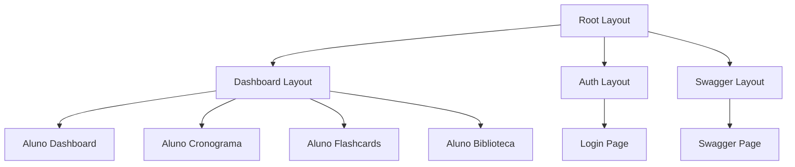
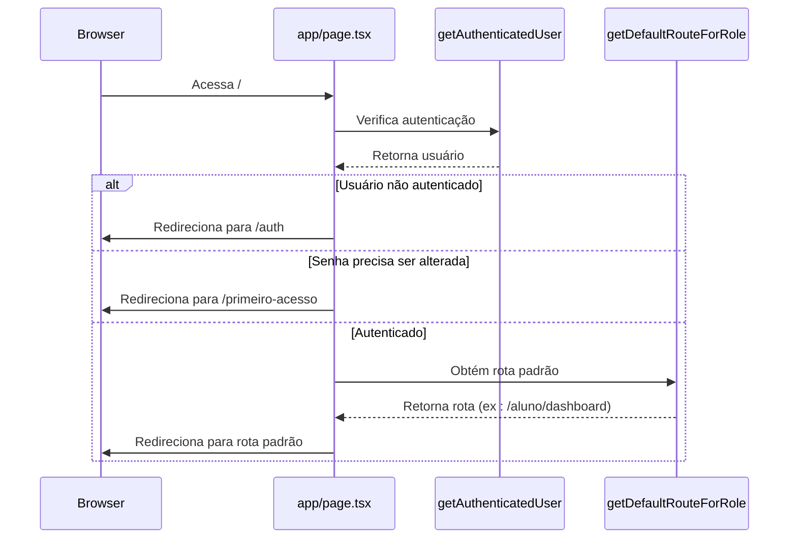
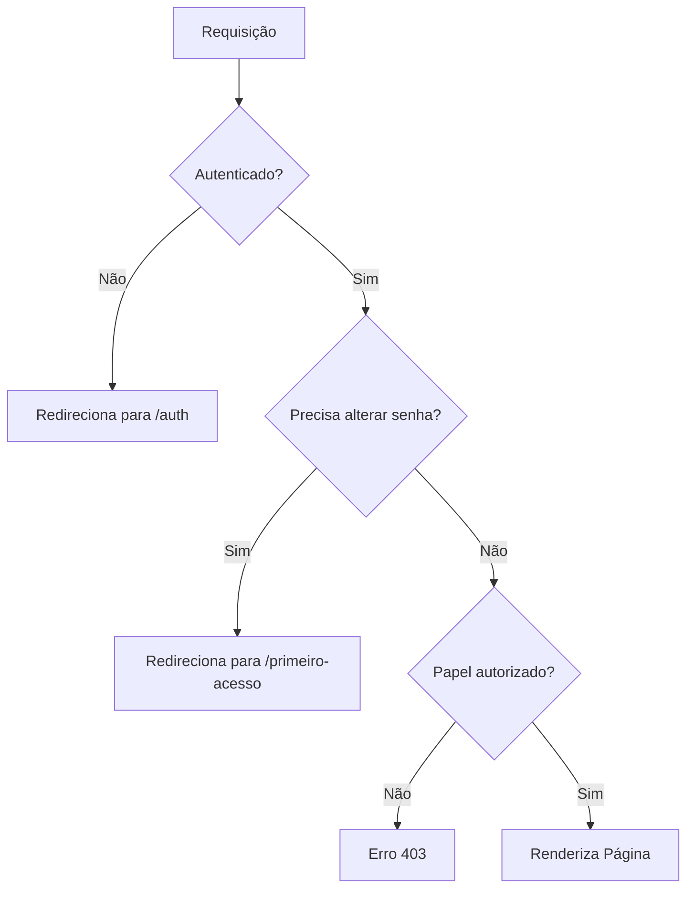

# Rotas e Navegação

<cite>
**Arquivos Referenciados neste Documento**   
- [app/layout.tsx](file://app/layout.tsx)
- [app/dashboard/layout.tsx](file://app/dashboard/layout.tsx)
- [app/(dashboard)/layout.tsx](file://app/(dashboard)/layout.tsx)
- [app/page.tsx](file://app/page.tsx)
- [app/dashboard/page.tsx](file://app/dashboard/page.tsx)
- [app/auth/login/page.tsx](file://app/auth/login/page.tsx)
- [app/swagger/page.tsx](file://app/swagger/page.tsx)
- [app/primeiro-acesso/page.tsx](file://app/primeiro-acesso/page.tsx)
- [app/protected/page.tsx](file://app/protected/page.tsx)
- [app/(dashboard)/aluno/page.tsx](file://app/(dashboard)/aluno/page.tsx)
- [app/(dashboard)/aluno/dashboard/page.tsx](file://app/(dashboard)/aluno/dashboard/page.tsx)
- [app/(dashboard)/aluno/cronograma/page.tsx](file://app/(dashboard)/aluno/cronograma/page.tsx)
- [app/(dashboard)/aluno/biblioteca/page.tsx](file://app/(dashboard)/aluno/biblioteca/page.tsx)
- [app/(dashboard)/aluno/flashcards/page.tsx](file://app/(dashboard)/aluno/flashcards/page.tsx)
</cite>

## Sumário
1. [Introdução](#introdução)
2. [Estrutura de Diretórios do App Router](#estrutura-de-diretórios-do-app-router)
3. [Layouts Aninhados](#layouts-aninhados)
4. [Rotas Dinâmicas e Grupos de Rotas](#rotas-dinâmicas-e-grupos-de-rotas)
5. [Navegação entre Páginas](#navegação-entre-páginas)
6. [Carregamento de Dados com Server Components](#carregamento-de-dados-com-server-components)
7. [Integração com Autenticação e Proteção de Rotas](#integração-com-autenticação-e-proteção-de-rotas)
8. [Boas Práticas para SEO, Desempenho e Gerenciamento de Estado](#boas-práticas-para-seo-desempenho-e-gerenciamento-de-estado)
9. [Conclusão](#conclusão)

## Introdução
O sistema de rotas e navegação do aplicativo Área do Aluno é baseado no App Router do Next.js 16, que oferece uma arquitetura moderna e eficiente para gerenciar a estrutura de páginas, layouts e navegação. Este documento detalha a implementação do sistema de rotas, abrangendo desde a organização de diretórios até a proteção de rotas com autenticação, passando por layouts aninhados, rotas dinâmicas e grupos de rotas. O foco está em explicar como o sistema suporta funcionalidades críticas como o dashboard do aluno, login, documentação Swagger e páginas de primeiro acesso, garantindo uma experiência de usuário fluida e segura.

**Seção fontes**
- [app/page.tsx](file://app/page.tsx)
- [app/layout.tsx](file://app/layout.tsx)

## Estrutura de Diretórios do App Router
A estrutura de diretórios do App Router é organizada de forma hierárquica, refletindo diretamente a estrutura de navegação da aplicação. O diretório `app` contém todos os componentes de rota, com subdiretórios representando diferentes seções do sistema. Páginas principais como `dashboard`, `auth`, `swagger` e `primeiro-acesso` são definidas como diretórios com arquivos `page.tsx`. O uso de parênteses, como em `(dashboard)`, indica grupos de rotas que não afetam a URL final, mas permitem organizar logicamente rotas relacionadas, como as do painel do aluno, professor e administração. Essa organização facilita a manutenção e escalabilidade do código.

```mermaid
graph TB
A[app/] --> B[(dashboard)/]
A --> C[auth/]
A --> D[swagger/]
A --> E[primeiro-acesso/]
A --> F[protected/]
B --> G[aluno/]
B --> H[professor/]
B --> I[admin/]
C --> J[login/]
C --> K[forgot-password/]
C --> L[sign-up/]
G --> M[dashboard/]
G --> N[cronograma/]
G --> O[flashcards/]
G --> P[biblioteca/]
```

**Fontes do diagrama**
- [app/page.tsx](file://app/page.tsx)
- [app/(dashboard)/aluno/page.tsx](file://app/(dashboard)/aluno/page.tsx)

**Seção fontes**
- [app/page.tsx](file://app/page.tsx)
- [app/(dashboard)/aluno/page.tsx](file://app/(dashboard)/aluno/page.tsx)

## Layouts Aninhados
O sistema utiliza layouts aninhados para compartilhar UI comum entre diferentes rotas, como sidebars, headers e providers de contexto. O layout raiz em `app/layout.tsx` define a estrutura global da aplicação, incluindo metadados, fontes e o `ThemeProvider`. O layout do dashboard em `app/dashboard/layout.tsx` ou `app/(dashboard)/layout.tsx` envolve todas as rotas do painel, fornecendo elementos como `AppSidebar`, `UserProvider` e `DynamicBreadcrumb`. Esse padrão permite que alterações no layout afetem todas as páginas filhas automaticamente, promovendo consistência visual e reduzindo duplicação de código.



**Fontes do diagrama**
- [app/layout.tsx](file://app/layout.tsx)
- [app/(dashboard)/layout.tsx](file://app/(dashboard)/layout.tsx)

**Seção fontes**
- [app/layout.tsx](file://app/layout.tsx)
- [app/(dashboard)/layout.tsx](file://app/(dashboard)/layout.tsx)

## Rotas Dinâmicas e Grupos de Rotas
O sistema implementa rotas dinâmicas usando a sintaxe de colchetes `[id]`, permitindo páginas personalizadas baseadas em parâmetros de URL, como em `professor/agendamentos/[id]/page.tsx`. Os grupos de rotas, delimitados por parênteses como `(dashboard)`, são utilizados para agrupar rotas logicamente sem influenciar a URL. Isso é essencial para separar rotas do aluno, professor e administração sob a mesma estrutura de layout do dashboard, enquanto mantém URLs limpas como `/aluno/dashboard` em vez de `/dashboard/aluno/dashboard`.

**Seção fontes**
- [app/(dashboard)/aluno/page.tsx](file://app/(dashboard)/aluno/page.tsx)
- [app/(dashboard)/professor/agendamentos/[id]/page.tsx](file://app/(dashboard)/professor/agendamentos/[id]/page.tsx)

## Navegação entre Páginas
A navegação é gerenciada principalmente através de redirecionamentos programáticos usando `redirect` do Next.js. A página raiz `app/page.tsx` redireciona o usuário com base em seu estado de autenticação e perfil. Páginas como `app/protected/page.tsx` e `app/primeiro-acesso/page.tsx` atuam como intermediárias, redirecionando para as rotas apropriadas com base nas regras de negócio. A navegação também é facilitada por componentes como `SidebarTrigger` e `BottomNavigation`, que permitem ao usuário navegar entre seções do dashboard com transições suaves.



**Fontes do diagrama**
- [app/page.tsx](file://app/page.tsx)
- [app/protected/page.tsx](file://app/protected/page.tsx)
- [app/primeiro-acesso/page.tsx](file://app/primeiro-acesso/page.tsx)

**Seção fontes**
- [app/page.tsx](file://app/page.tsx)
- [app/protected/page.tsx](file://app/protected/page.tsx)

## Carregamento de Dados com Server Components
O carregamento de dados é realizado principalmente em Server Components, como em `app/(dashboard)/aluno/dashboard/page.tsx`, que utiliza `fetchDashboardData` para obter dados do servidor antes da renderização. Para componentes que precisam de interatividade, como o dashboard do aluno, o padrão Client Component é usado com `useEffect` e `useState` para gerenciar o estado e atualizações. O uso de `Suspense` e fallbacks é evidente em páginas como `app/(dashboard)/aluno/cronograma/page.tsx`, que exibe skeletons durante o carregamento, proporcionando uma experiência de usuário mais responsiva.

**Seção fontes**
- [app/(dashboard)/aluno/dashboard/page.tsx](file://app/(dashboard)/aluno/dashboard/page.tsx)
- [app/(dashboard)/aluno/cronograma/page.tsx](file://app/(dashboard)/aluno/cronograma/page.tsx)

## Integração com Autenticação e Proteção de Rotas
A proteção de rotas é implementada através de funções de middleware como `requireUser` e `getAuthenticatedUser` importadas de `@/lib/auth`. Rotas sensíveis, como as dentro de `(dashboard)`, utilizam `requireUser` para garantir que apenas usuários autenticados possam acessar. A rota `/primeiro-acesso` é protegida para forçar a alteração de senha temporária. O sistema também redireciona automaticamente usuários não autenticados para `/auth` e respeita o fluxo de primeiro acesso. A proteção é granular, permitindo especificar papéis permitidos, como em `requireUser({ allowedRoles: ['professor'] })`.



**Fontes do diagrama**
- [app/page.tsx](file://app/page.tsx)
- [app/primeiro-acesso/page.tsx](file://app/primeiro-acesso/page.tsx)
- [app/(dashboard)/aluno/page.tsx](file://app/(dashboard)/aluno/page.tsx)

**Seção fontes**
- [app/page.tsx](file://app/page.tsx)
- [app/primeiro-acesso/page.tsx](file://app/primeiro-acesso/page.tsx)
- [app/lib/auth](file://app/lib/auth)

## Boas Práticas para SEO, Desempenho e Gerenciamento de Estado
O sistema implementa boas práticas de SEO através do objeto `metadata` em `app/layout.tsx`, definindo título, descrição, palavras-chave e metadados Open Graph. Para desempenho, utiliza Server Components para carregamento inicial rápido, skeletons para feedback visual durante carregamentos e redirecionamentos eficientes para minimizar renderizações desnecessárias. O gerenciamento de estado entre rotas é feito principalmente através do contexto (`UserProvider`) e do armazenamento no cliente (localStorage para tema), evitando a necessidade de recarregar dados do usuário em cada navegação.

**Seção fontes**
- [app/layout.tsx](file://app/layout.tsx)
- [app/(dashboard)/layout.tsx](file://app/(dashboard)/layout.tsx)
- [app/lib/auth](file://app/lib/auth)

## Conclusão
O sistema de rotas e navegação do Área do Aluno, baseado no App Router do Next.js 16, demonstra uma arquitetura bem estruturada e escalável. A combinação de layouts aninhados, grupos de rotas e proteção baseada em autenticação permite uma experiência de usuário coesa e segura. A integração eficaz entre Server e Client Components, juntamente com boas práticas de SEO e desempenho, resulta em uma aplicação responsiva e otimizada. Este sistema serve como base sólida para funcionalidades complexas como o dashboard do aluno, cronograma de estudos e flashcards, garantindo manutenibilidade e usabilidade a longo prazo.