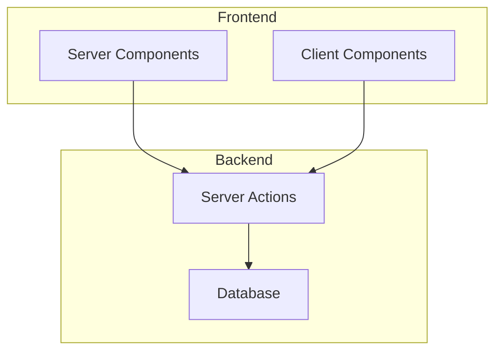

# Componentes e Ações do Servidor

<cite>
**Arquivos Referenciados neste Documento**   
- [agendamentos.ts](file://app/actions/agendamentos.ts)
- [notificacoes.ts](file://app/actions/notificacoes.ts)
- [page.tsx](file://app/(dashboard)/agendamentos/page.tsx)
- [page.tsx](file://app/(dashboard)/meus-agendamentos/page.tsx)
- [page.tsx](file://app/(dashboard)/professor/agendamentos/page.tsx)
- [form-panel.tsx](file://components/agendamento/form-panel.tsx)
- [right-panel.tsx](file://components/agendamento/right-panel.tsx)
- [meus-agendamentos-list.tsx](file://components/agendamento/meus-agendamentos-list.tsx)
- [agendamento-validations.ts](file://lib/agendamento-validations.ts)
- [server.ts](file://lib/server.ts)
</cite>

## Sumário
1. [Introdução](#introdução)
2. [Estrutura do Projeto](#estrutura-do-projeto)
3. [Componentes do Servidor](#componentes-do-servidor)
4. [Ações do Servidor](#ações-do-servidor)
5. [Validação de Formulários e Zod](#validação-de-formulários-e-zod)
6. [Gerenciamento de Estado no Cliente](#gerenciamento-de-estado-no-cliente)
7. [Segurança e Proteção](#segurança-e-proteção)
8. [Conclusão](#conclusão)

## Introdução
Esta documentação detalha o uso de Componentes do Servidor (Server Components) e Ações do Servidor (Server Actions) na aplicação, com foco nos arquivos `agendamentos.ts` e `notificacoes.ts`. O objetivo é explicar como os dados são carregados diretamente no servidor, reduzindo o custo de transferência e melhorando o desempenho. Também aborda o uso de Server Actions para manipulação de formulários e interações assíncronas sem APIs intermediárias.

## Estrutura do Projeto
A aplicação utiliza uma estrutura baseada em Next.js com componentes do servidor e ações do servidor. Os principais diretórios são:
- `app/`: Contém as páginas da aplicação.
- `app/actions/`: Contém as ações do servidor.
- `components/`: Contém os componentes reutilizáveis.
- `lib/`: Contém utilitários e funções de validação.



**Fontes do Diagrama**
- [agendamentos.ts](file://app/actions/agendamentos.ts)
- [notificacoes.ts](file://app/actions/notificacoes.ts)

**Fontes da Seção**
- [agendamentos.ts](file://app/actions/agendamentos.ts)
- [notificacoes.ts](file://app/actions/notificacoes.ts)

## Componentes do Servidor
Os Componentes do Servidor são utilizados para carregar dados diretamente no servidor, evitando a necessidade de chamadas de API no cliente. Isso reduz o custo de transferência de dados e melhora o desempenho da aplicação.

### Carregamento de Dados
O carregamento de dados é feito diretamente no componente do servidor, utilizando funções assíncronas. Por exemplo, na página de agendamentos, os dados são carregados antes da renderização:

```tsx
export default async function AgendamentosPage() {
    const supabase = await createClient();
    const { data: { user } } = await supabase.auth.getUser();
    const professorId = user?.id || ""; 
    return (
        <main>
            <AgendamentoScheduler professorId={professorId} />
        </main>
    );
}
```

**Fontes da Seção**
- [page.tsx](file://app/(dashboard)/agendamentos/page.tsx)

## Ações do Servidor
As Ações do Servidor são utilizadas para manipular formulários e interações assíncronas sem a necessidade de APIs intermediárias. Elas são definidas no diretório `app/actions/` e podem ser chamadas diretamente dos componentes do cliente.

### Definição de Ações
As ações são definidas como funções assíncronas no arquivo `agendamentos.ts`. Por exemplo, a ação `createAgendamento` é utilizada para criar um novo agendamento:

```ts
export async function createAgendamento(data: Omit<Agendamento, 'id' | 'created_at' | 'updated_at' | 'status'>) {
    const supabase = await createClient();
    const { data: { user } } = await supabase.auth.getUser();
    if (!user) {
        throw new Error('Unauthorized');
    }
    // Validação e criação do agendamento
    const { data: result, error } = await supabase
        .from('agendamentos')
        .insert(payload)
        .select()
        .single();
    if (error) {
        throw new Error('Failed to create appointment');
    }
    revalidatePath('/agendamentos');
    return result;
}
```

### Chamada de Ações
As ações são chamadas diretamente dos componentes do cliente, utilizando a função `useActionState` ou `useFormState`. Por exemplo, no componente `FormPanel`, a ação `createAgendamento` é chamada ao submeter o formulário:

```tsx
const handleSubmit = async (e: React.FormEvent) => {
    e.preventDefault();
    setLoading(true);
    try {
        await createAgendamento({
            professor_id: professorId,
            data_inicio: startDate,
            data_fim: endDate,
            observacoes: formData.observacoes,
        });
        toast.success("Agendamento solicitado com sucesso!");
        router.push("/meus-agendamentos");
    } catch (error) {
        toast.error("Erro ao agendar");
    } finally {
        setLoading(false);
    }
};
```

### Tratamento de Erros
O tratamento de erros é feito utilizando blocos `try-catch`. Em caso de erro, uma mensagem de erro é exibida ao usuário utilizando o componente `toast`.

### Atualização da UI
Após a execução da ação, a UI é atualizada utilizando a função `revalidatePath`, que invalida o cache da rota especificada, forçando a recarga dos dados.

**Fontes da Seção**
- [agendamentos.ts](file://app/actions/agendamentos.ts)
- [form-panel.tsx](file://components/agendamento/form-panel.tsx)

## Validação de Formulários e Zod
A validação de formulários é feita utilizando a biblioteca Zod, que permite definir esquemas de validação para os dados do formulário. Os esquemas são definidos no arquivo `agendamento-validations.ts` e utilizados nas ações do servidor para validar os dados antes de persisti-los no banco de dados.

### Exemplo de Validação
```ts
export function validateAppointment(
    slot: TimeSlot,
    options: {
        rules: AvailabilityRule[]
        existingSlots: TimeSlot[]
        minAdvanceMinutes: number
    }
): ValidationResult {
    // Validações de tempo mínimo, duração, disponibilidade e conflitos
}
```

**Fontes da Seção**
- [agendamento-validations.ts](file://lib/agendamento-validations.ts)

## Gerenciamento de Estado no Cliente
O gerenciamento de estado no cliente é feito utilizando o hook `useState` para gerenciar o estado local dos componentes. Por exemplo, no componente `FormPanel`, o estado do formulário é gerenciado utilizando `useState`:

```tsx
const [formData, setFormData] = useState({
    observacoes: "",
});
```

**Fontes da Seção**
- [form-panel.tsx](file://components/agendamento/form-panel.tsx)

## Segurança e Proteção
A segurança é garantida utilizando autenticação e autorização nas ações do servidor. A função `createClient` é utilizada para obter uma instância do cliente Supabase, que é utilizada para verificar a autenticação do usuário antes de executar qualquer ação.

### Proteção contra CSRF
A proteção contra CSRF é garantida utilizando tokens de autenticação fornecidos pelo Supabase. Esses tokens são verificados em cada requisição para garantir que apenas usuários autenticados possam executar ações.

**Fontes da Seção**
- [server.ts](file://lib/server.ts)
- [agendamentos.ts](file://app/actions/agendamentos.ts)

## Conclusão
O uso de Componentes e Ações do Servidor na aplicação permite carregar dados diretamente no servidor, reduzindo o custo de transferência e melhorando o desempenho. As ações do servidor são utilizadas para manipular formulários e interações assíncronas sem a necessidade de APIs intermediárias, garantindo segurança e eficiência. A validação de formulários e o gerenciamento de estado no cliente são feitos utilizando bibliotecas e hooks apropriados, garantindo uma experiência de usuário fluida e segura.