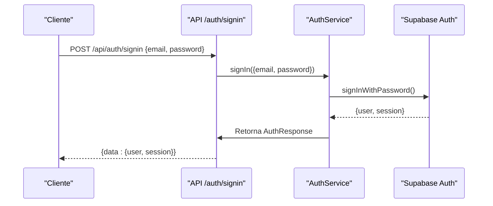
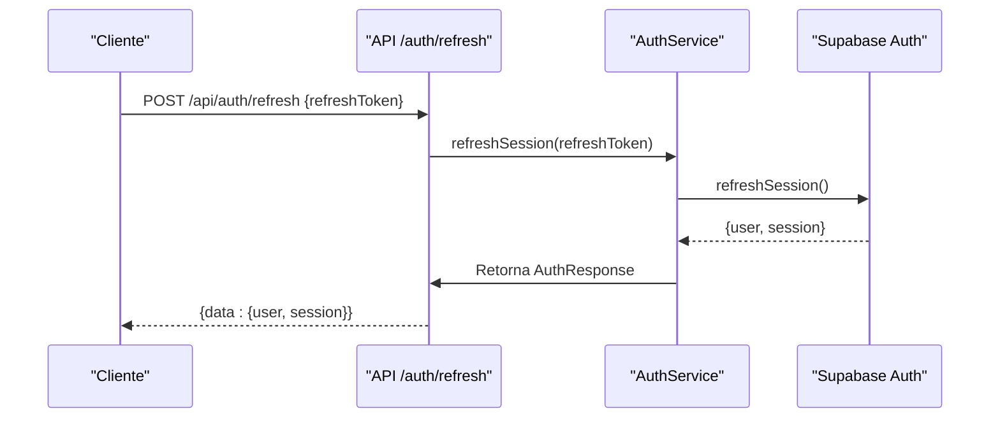
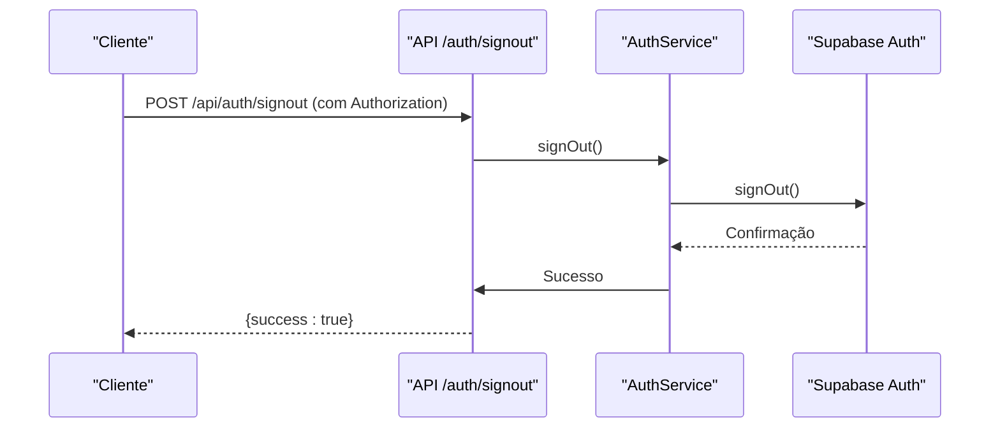
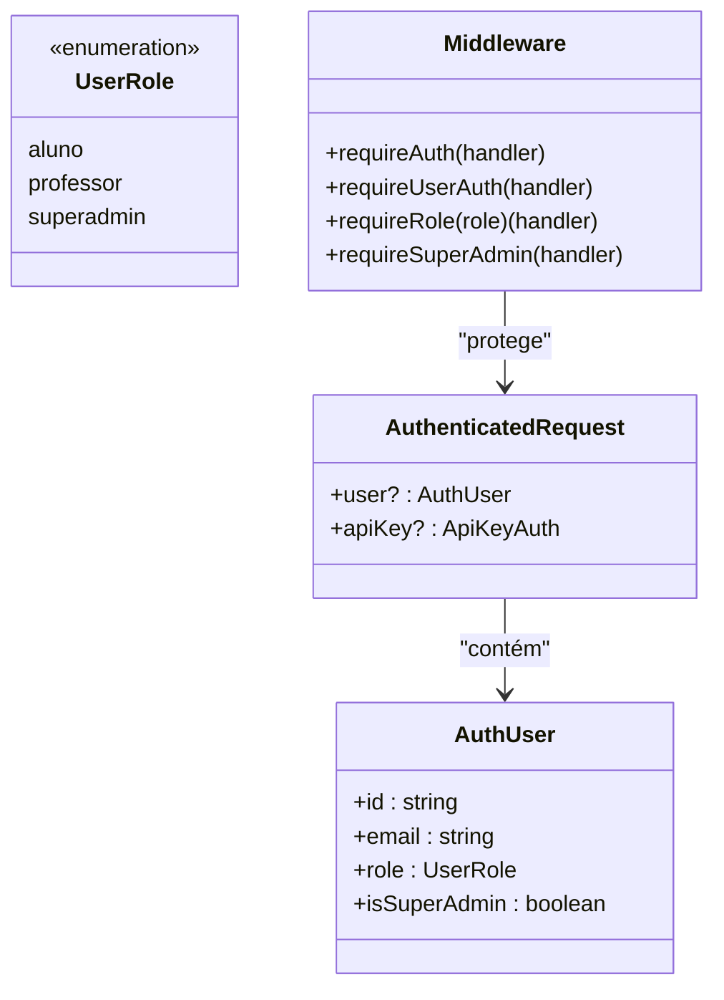
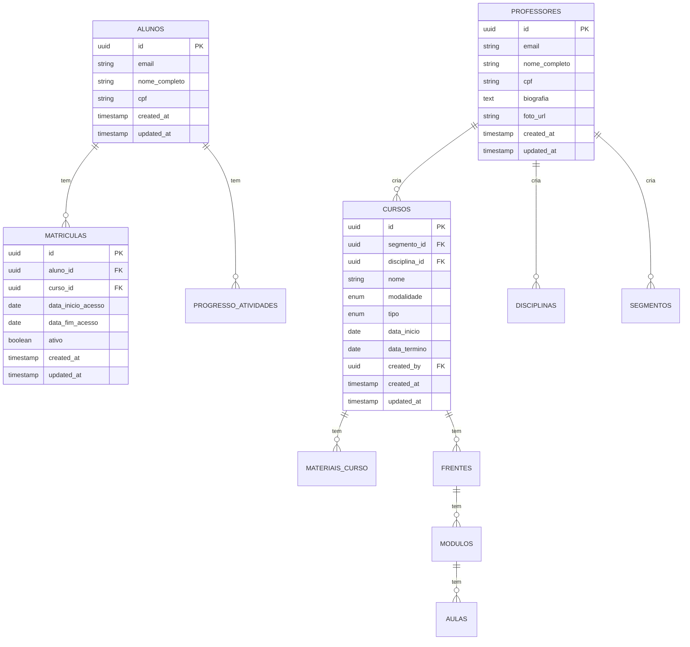
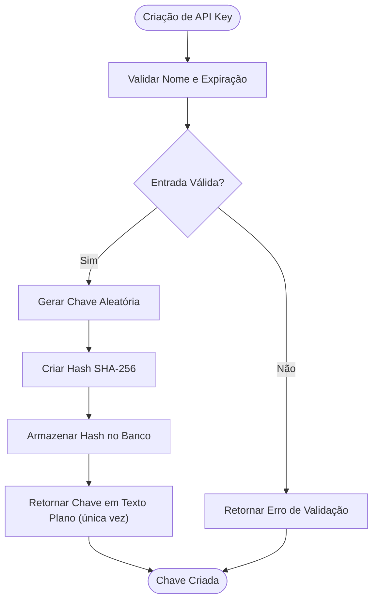
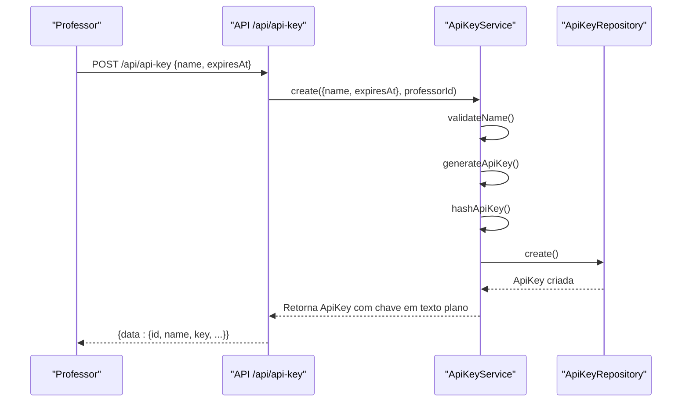

# Autenticação e Segurança

<cite>
**Arquivos Referenciados neste Documento**   
- [auth.service.ts](file://backend/auth/auth.service.ts)
- [middleware.ts](file://backend/auth/middleware.ts)
- [api-key.service.ts](file://backend/services/api-key/api-key.service.ts)
- [authentication.md](file://docs/authentication.md)
- [schema.md](file://docs/schema/schema.md)
- [signin/route.ts](file://app/api/auth/signin/route.ts)
- [refresh/route.ts](file://app/api/auth/refresh/route.ts)
- [signout/route.ts](file://app/api/auth/signout/route.ts)
- [me/route.ts](file://app/api/auth/me/route.ts)
- [lib/auth.ts](file://lib/auth.ts)
- [lib/roles.ts](file://lib/roles.ts)
</cite>

## Sumário
1. [Introdução](#introdução)
2. [Métodos de Autenticação](#métodos-de-autenticação)
3. [Fluxo de Autenticação](#fluxo-de-autenticação)
4. [Controle de Acesso Baseado em Papéis (RBAC)](#controle-de-acesso-baseado-em-papéis-rbac)
5. [Segurança no Nível de Banco de Dados (RLS)](#segurança-no-nível-de-banco-de-dados-rls)
6. [Práticas de Segurança](#práticas-de-segurança)
7. [Gerenciamento de API Keys](#gerenciamento-de-api-keys)
8. [Conformidade e Auditoria](#conformidade-e-auditoria)
9. [Considerações Finais](#considerações-finais)

## Introdução

O sistema Área do Aluno implementa um modelo robusto de autenticação e segurança, projetado para proteger dados sensíveis de alunos, professores e administradores. Este documento detalha os mecanismos de autenticação, autorização, controle de acesso e práticas de segurança aplicadas ao longo da arquitetura do sistema.

A segurança é implementada em múltiplas camadas: desde a autenticação de usuários e validação de credenciais até políticas de segurança no nível do banco de dados (Row Level Security - RLS) e proteção contra ataques comuns. O sistema suporta dois métodos principais de autenticação: JWT para interfaces de usuário e API Keys para integrações automatizadas.

**Seção fontes**
- [authentication.md](file://docs/authentication.md#L1-L137)
- [README.md](file://README.md#L159-L167)

## Métodos de Autenticação

O sistema Área do Aluno suporta dois métodos distintos de autenticação, cada um projetado para um tipo específico de uso:

### Autenticação via JWT (Interface de Usuário)

A autenticação baseada em JWT (JSON Web Token) é utilizada para usuários que acessam o sistema através da interface web. Após o login bem-sucedido, o usuário recebe um token JWT que é armazenado no cliente e enviado em requisições subsequentes.

**Cabeçalho de Autenticação:**
```
Authorization: Bearer <jwt_token>
```

O token JWT contém informações sobre o usuário autenticado, incluindo seu ID, email, papel (role) e status de superadmin. Este método é utilizado para todas as interações do usuário com a interface do sistema.

### Autenticação via API Key (Integrações)

Para integrações automatizadas e chamadas diretas à API, o sistema utiliza API Keys. Este método é projetado para aplicações externas que precisam interagir com o backend sem a presença de um usuário na interface.

**Cabeçalho de Autenticação:**
```
X-API-Key: <api_key>
```

As API Keys são criadas por professores e podem ser configuradas com data de expiração, permitindo um gerenciamento seguro de integrações. Internamente, o uso de uma API Key permite o bypass das políticas RLS através da Service Role Key do Supabase, quando necessário.

**Seção fontes**
- [authentication.md](file://docs/authentication.md#L3-L67)
- [API.md](file://docs/API.md#L5-L42)

## Fluxo de Autenticação

O sistema implementa um fluxo completo de autenticação que inclui login, refresh de token e logout, garantindo uma experiência segura e contínua para os usuários.

### Fluxo de Login

O processo de login inicia quando um usuário envia suas credenciais (email e senha) para o endpoint `/api/auth/signin`. O serviço de autenticação valida as credenciais com o Supabase Auth e, se bem-sucedido, retorna um objeto contendo o usuário autenticado e a sessão com os tokens de acesso e refresh.



**Diagrama fontes**
- [auth.service.ts](file://backend/auth/auth.service.ts#L44-L74)
- [signin/route.ts](file://app/api/auth/signin/route.ts#L4-L17)

### Refresh de Token

Para manter a sessão do usuário ativa sem exigir login frequente, o sistema implementa um mecanismo de refresh de token. Quando o token de acesso está próximo de expirar, o cliente pode usar o token de refresh para obter um novo par de tokens.

O endpoint `/api/auth/refresh` aceita o token de refresh e solicita ao Supabase Auth a renovação da sessão, retornando novos tokens de acesso e refresh.



**Diagrama fontes**
- [auth.service.ts](file://backend/auth/auth.service.ts#L106-L136)
- [refresh/route.ts](file://app/api/auth/refresh/route.ts#L4-L17)

### Logout

O processo de logout invalida a sessão do usuário no Supabase Auth. O endpoint `/api/auth/signout` chama o método `signOut` do Supabase Auth, encerrando a sessão ativa.



**Diagrama fontes**
- [auth.service.ts](file://backend/auth/auth.service.ts#L77-L84)
- [signout/route.ts](file://app/api/auth/signout/route.ts#L5-L12)

## Controle de Acesso Baseado em Papéis (RBAC)

O sistema implementa um modelo de controle de acesso baseado em papéis (RBAC) com três níveis principais de permissão: Aluno, Professor e Superadmin.

### Papéis do Sistema

**Aluno**: Usuários com papel de aluno têm acesso limitado aos seus próprios dados. Podem visualizar e editar seu perfil, ver suas matrículas e acessar materiais dos cursos em que estão matriculados.

**Professor**: Professores podem criar e gerenciar cursos, disciplinas, segmentos e materiais. Também podem criar API Keys para integrações. Têm permissão para gerenciar recursos que criaram.

**Superadmin**: Professores com papel de superadmin têm acesso total ao sistema. Podem gerenciar todos os recursos, independentemente de quem os criou, e têm bypass completo das políticas RLS quando usando JWT.

### Implementação do RBAC

O controle de acesso é implementado através de middlewares que verificam o papel do usuário antes de permitir o acesso a recursos protegidos. Os principais middlewares disponíveis são:

- `requireAuth`: Aceita tanto JWT quanto API Key
- `requireUserAuth`: Exige apenas JWT (usuário autenticado)
- `requireRole(role)`: Exige usuário com papel específico
- `requireSuperAdmin`: Exige apenas superadmin



**Diagrama fontes**
- [middleware.ts](file://backend/auth/middleware.ts#L6-L193)
- [lib/roles.ts](file://lib/roles.ts#L1-L47)
- [lib/auth.ts](file://lib/auth.ts#L7-L121)

**Seção fontes**
- [authentication.md](file://docs/authentication.md#L14-L31)
- [API.md](file://docs/API.md#L43-L59)

## Segurança no Nível de Banco de Dados (RLS)

O sistema utiliza Row Level Security (RLS) no Supabase para garantir que os usuários só possam acessar dados para os quais têm permissão, adicionando uma camada crítica de segurança no nível do banco de dados.

### Políticas RLS Implementadas

As políticas RLS são configuradas para cada tabela do banco de dados, definindo quem pode ler, criar, atualizar ou deletar registros:

- **Alunos**: Podem ver apenas seus próprios dados (perfil, matrículas)
- **Professores**: Podem criar e gerenciar recursos educacionais que criaram
- **Superadmin**: Têm acesso total a todos os dados (bypass RLS com JWT)
- **API Keys**: Usam a Service Role Key do Supabase, permitindo bypass completo das políticas RLS quando necessário

### Exemplos de Políticas RLS

```sql
-- Aluno vê apenas suas próprias matrículas
CREATE POLICY "Aluno vê suas próprias matrículas" ON public.matriculas 
    FOR SELECT USING (auth.uid() = aluno_id);

-- Professor edita apenas seu próprio perfil
CREATE POLICY "Professor edita seu perfil" ON public.professores 
    FOR UPDATE USING (auth.uid() = id);

-- Acesso a materiais apenas para matriculados
CREATE POLICY "Acesso a materiais apenas para matriculados" ON public.materiais_curso 
    FOR SELECT 
    USING (
        EXISTS (
            SELECT 1 FROM public.matriculas m
            WHERE m.curso_id = materiais_curso.curso_id 
            AND m.aluno_id = auth.uid()
            AND m.ativo = true
        )
    );
```

Essas políticas garantem que mesmo se um atacante conseguir acesso direto à API do Supabase, não poderá acessar dados para os quais não tem permissão.



**Diagrama fontes**
- [schema.md](file://docs/schema/schema.md#L141-L396)
- [LOGICA_COMPLETA_SALA_ESTUDOS.md](file://docs/LOGICA_COMPLETA_SALA_ESTUDOS.md#L702-L713)

**Seção fontes**
- [authentication.md](file://docs/authentication.md#L130-L136)
- [schema.md](file://docs/schema/schema.md#L141-L181)

## Práticas de Segurança

O sistema implementa diversas práticas de segurança para proteger contra ataques comuns e garantir a integridade dos dados.

### Validação de Entrada

Todos os endpoints realizam validação rigorosa dos dados de entrada para prevenir injeção de dados maliciosos. A validação inclui:

- Verificação de tipos e formatos de dados
- Sanitização de entradas de texto
- Validação de endereços de email e CPF
- Limitação de tamanho de campos

### Proteção contra Ataques Comuns

O sistema inclui proteções contra os principais tipos de ataques:

**XSS (Cross-Site Scripting)**: Todos os dados exibidos na interface são escapados para prevenir execução de scripts maliciosos.

**CSRF (Cross-Site Request Forgery)**: O uso de tokens JWT e a arquitetura stateless da API reduzem significativamente o risco de ataques CSRF.

**Injeção SQL**: O uso de consultas parametrizadas e a camada de repositório previnem injeção SQL.

### Armazenamento Seguro de Senhas

O sistema não armazena senhas diretamente. O Supabase Auth gerencia o armazenamento seguro de senhas usando algoritmos de hash criptográficos (bcrypt), garantindo que mesmo em caso de vazamento de banco de dados, as senhas dos usuários permaneçam protegidas.

### Segurança de API Keys

As API Keys são armazenadas como hash SHA-256 no banco de dados, nunca em texto plano. Quando uma API Key é criada, ela é retornada apenas uma vez em texto plano, exigindo que o criador a salve imediatamente. Após isso, apenas o hash é armazenado.



**Diagrama fontes**
- [api-key.service.ts](file://backend/services/api-key/api-key.service.ts#L30-L50)
- [api-key.service.ts](file://backend/services/api-key/api-key.service.ts#L139-L143)

**Seção fontes**
- [authentication.md](file://docs/authentication.md#L60-L67)
- [api-key.service.ts](file://backend/services/api-key/api-key.service.ts#L1-L158)

## Gerenciamento de API Keys

O sistema fornece uma interface completa para gerenciamento de API Keys, permitindo criação, listagem, atualização e exclusão de chaves.

### Criação de API Keys

Apenas professores podem criar API Keys através do endpoint `POST /api/api-key`. A criação requer autenticação JWT e retorna a chave em texto plano apenas uma vez.

### Gerenciamento de API Keys

Os professores podem gerenciar suas API Keys através dos seguintes endpoints:

- `GET /api/api-key`: Listar todas as API Keys do usuário
- `GET /api/api-key/{id}`: Obter detalhes de uma API Key específica
- `PUT /api/api-key/{id}`: Atualizar uma API Key (ativar/desativar, definir expiração)
- `DELETE /api/api-key/{id}`: Deletar uma API Key

### Rotação de Segredos

O sistema suporta rotação de segredos através da desativação de API Keys antigas e criação de novas. As chaves podem ser desativadas sem serem deletadas, permitindo uma transição segura entre versões.

### Auditoria de Uso

O sistema rastreia o último uso de cada API Key, fornecendo visibilidade sobre quais integrações estão ativas e quando foram utilizadas pela última vez.



**Diagrama fontes**
- [api-key.service.ts](file://backend/services/api-key/api-key.service.ts#L30-L50)
- [api-key.types.ts](file://backend/services/api-key/api-key.types.ts#L1-L24)

**Seção fontes**
- [authentication.md](file://docs/authentication.md#L43-L59)
- [API.md](file://docs/API.md#L111-L159)

## Conformidade e Auditoria

O sistema implementa práticas que suportam conformidade com regulamentações de privacidade e segurança de dados.

### Auditoria de Acesso

O sistema mantém registros de auditoria para operações críticas, incluindo:

- Login e logout de usuários
- Criação e uso de API Keys
- Alterações em dados sensíveis

### Conformidade com Regulamentações

As práticas de segurança implementadas suportam conformidade com regulamentações como LGPD, incluindo:

- Princípio da mínima privilégio (usuários acessam apenas dados necessários)
- Armazenamento seguro de dados sensíveis
- Auditoria de acesso a dados
- Consentimento explícito para uso de dados

### Gestão de Segredos

O sistema segue melhores práticas de gestão de segredos:

- API Keys armazenadas como hash
- Chaves retornadas apenas uma vez em texto plano
- Suporte a rotação de segredos
- Monitoramento de uso de chaves

**Seção fontes**
- [authentication.md](file://docs/authentication.md#L60-L67)
- [first-professor-superadmin.md](file://docs/first-professor-superadmin.md#L100-L106)

## Considerações Finais

O sistema de autenticação e segurança do Área do Aluno combina múltiplas camadas de proteção para garantir a integridade dos dados e a privacidade dos usuários. A combinação de JWT para interfaces de usuário, API Keys para integrações, controle RBAC e políticas RLS no banco de dados cria um modelo robusto e flexível de segurança.

A arquitetura permite escalabilidade e integração segura com sistemas externos, enquanto protege rigorosamente os dados sensíveis dos alunos. As práticas de segurança implementadas seguem padrões modernos e suportam conformidade com regulamentações de privacidade.

Para manter a segurança do sistema, recomenda-se:
- Rotação regular de API Keys
- Auditoria periódica de acessos
- Atualização contínua das práticas de segurança
- Treinamento de professores sobre segurança de API Keys