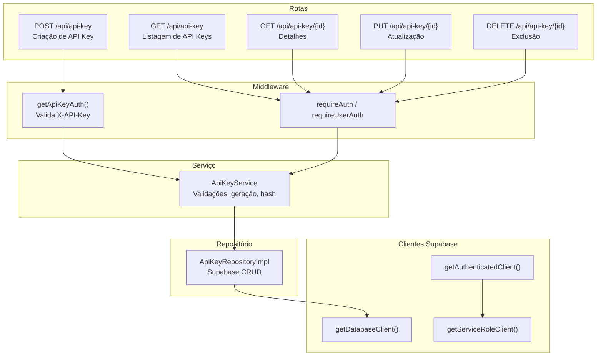
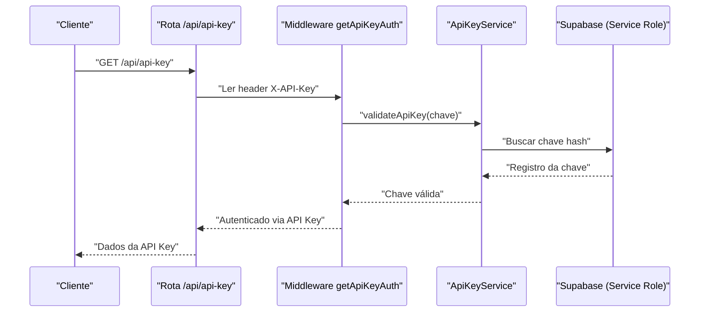
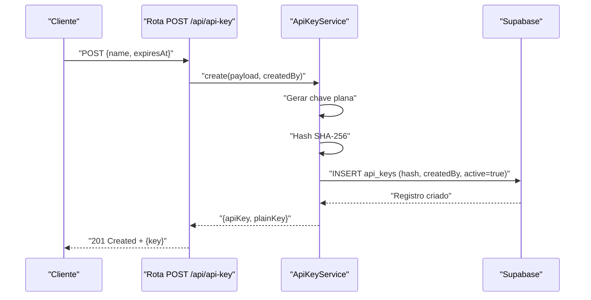
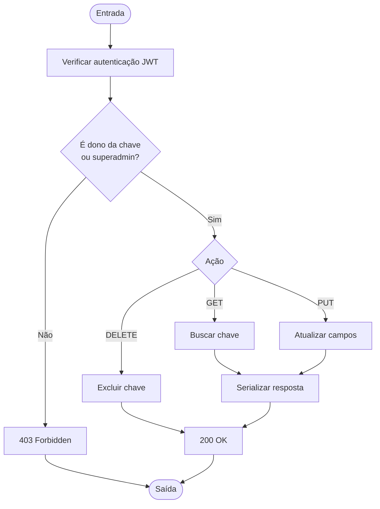
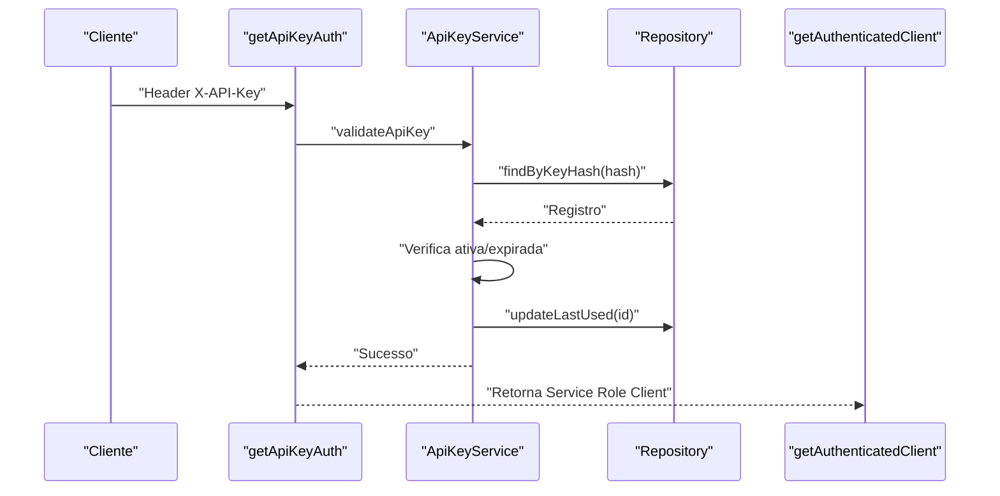
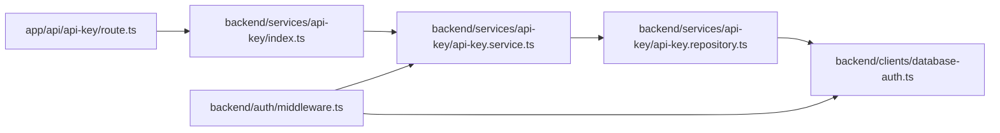

# Autenticação via API Keys

<cite>
**Arquivos Referenciados neste Documento**
- [app/api/api-key/route.ts](file://app/api/api-key/route.ts)
- [app/api/api-key/[id]/route.ts](file://app/api/api-key/[id]/route.ts)
- [backend/services/api-key/index.ts](file://backend/services/api-key/index.ts)
- [backend/services/api-key/api-key.service.ts](file://backend/services/api-key/api-key.service.ts)
- [backend/services/api-key/api-key.repository.ts](file://backend/services/api-key/api-key.repository.ts)
- [backend/services/api-key/api-key.types.ts](file://backend/services/api-key/api-key.types.ts)
- [backend/services/api-key/errors.ts](file://backend/services/api-key/errors.ts)
- [backend/auth/middleware.ts](file://backend/auth/middleware.ts)
- [backend/clients/database-auth.ts](file://backend/clients/database-auth.ts)
- [backend/clients/database.ts](file://backend/clients/database.ts)
- [docs/API.md](file://docs/API.md)
- [docs/authentication.md](file://docs/authentication.md)
- [backend/swagger/api-key.spec.ts](file://backend/swagger/api-key.spec.ts)
</cite>

## Sumário
1. [Introdução](#introdução)
2. [Estrutura do Projeto](#estrutura-do-projeto)
3. [Componentes Principais](#componentes-principais)
4. [Visão Geral da Arquitetura](#visão-geral-da-arquitetura)
5. [Análise Detalhada dos Componentes](#análise-detalhada-dos-componentes)
6. [Análise de Dependências](#análise-de-dependências)
7. [Considerações de Desempenho](#considerações-de-desempenho)
8. [Guia de Solução de Problemas](#guia-de-solução-de-problemas)
9. [Conclusão](#conclusão)
10. [Apêndices](#apêndices)

## Introdução
Este documento apresenta a documentação completa do sistema de API Keys para integrações programáticas. Ele explica como professores criam, gerenciam e revogam chaves, como o backend as valida e armazena, e como o uso da Service Role Key do Supabase permite bypass das políticas RLS (Row Level Security) em operações administrativas. Também detalha os erros comuns e suas respostas HTTP, além de mostrar como utilizar o header X-API-Key em requisições.

## Estrutura do Projeto
O sistema de API Keys é composto pelos seguintes elementos principais:
- Rotas da API REST (Next.js App Router) para criar, listar, obter, atualizar e excluir chaves
- Serviço de API Keys com regras de negócio e validações
- Repositório de dados com acesso ao Supabase
- Middleware de autenticação que aceita tanto JWT quanto API Key
- Clientes Supabase para autenticação e operações administrativas

**Diagrama fonte**
- [app/api/api-key/route.ts](file://app/api/api-key/route.ts#L1-L79)
- [app/api/api-key/[id]/route.ts](file://app/api/api-key/[id]/route.ts#L1-L115)
- [backend/auth/middleware.ts](file://backend/auth/middleware.ts#L53-L70)
- [backend/services/api-key/api-key.service.ts](file://backend/services/api-key/api-key.service.ts#L1-L158)
- [backend/services/api-key/api-key.repository.ts](file://backend/services/api-key/api-key.repository.ts#L1-L168)
- [backend/clients/database-auth.ts](file://backend/clients/database-auth.ts#L1-L68)

**Seção fonte**
- [app/api/api-key/route.ts](file://app/api/api-key/route.ts#L1-L79)
- [app/api/api-key/[id]/route.ts](file://app/api/api-key/[id]/route.ts#L1-L115)
- [backend/auth/middleware.ts](file://backend/auth/middleware.ts#L53-L70)
- [backend/services/api-key/index.ts](file://backend/services/api-key/index.ts#L1-L27)
- [backend/services/api-key/api-key.service.ts](file://backend/services/api-key/api-key.service.ts#L1-L158)
- [backend/services/api-key/api-key.repository.ts](file://backend/services/api-key/api-key.repository.ts#L1-L168)
- [backend/clients/database-auth.ts](file://backend/clients/database-auth.ts#L1-L68)

## Componentes Principais
- Rota de criação e listagem de API Keys: [app/api/api-key/route.ts](file://app/api/api-key/route.ts#L1-L79)
- Rota de detalhes, atualização e exclusão de API Keys: [app/api/api-key/[id]/route.ts](file://app/api/api-key/[id]/route.ts#L1-L115)
- Serviço de API Keys: [backend/services/api-key/api-key.service.ts](file://backend/services/api-key/api-key.service.ts#L1-L158)
- Repositório de API Keys: [backend/services/api-key/api-key.repository.ts](file://backend/services/api-key/api-key.repository.ts#L1-L168)
- Tipos de dados: [backend/services/api-key/api-key.types.ts](file://backend/services/api-key/api-key.types.ts#L1-L24)
- Erros específicos: [backend/services/api-key/errors.ts](file://backend/services/api-key/errors.ts#L1-L29)
- Middleware de autenticação: [backend/auth/middleware.ts](file://backend/auth/middleware.ts#L53-L70)
- Clientes Supabase: [backend/clients/database-auth.ts](file://backend/clients/database-auth.ts#L1-L68), [backend/clients/database.ts](file://backend/clients/database.ts#L1-L43)
- Documentação pública: [docs/API.md](file://docs/API.md#L1-L649), [docs/authentication.md](file://docs/authentication.md#L1-L137)
- Especificação OpenAPI/Swagger: [backend/swagger/api-key.spec.ts](file://backend/swagger/api-key.spec.ts#L1-L329)

**Seção fonte**
- [app/api/api-key/route.ts](file://app/api/api-key/route.ts#L1-L79)
- [app/api/api-key/[id]/route.ts](file://app/api/api-key/[id]/route.ts#L1-L115)
- [backend/services/api-key/api-key.service.ts](file://backend/services/api-key/api-key.service.ts#L1-L158)
- [backend/services/api-key/api-key.repository.ts](file://backend/services/api-key/api-key.repository.ts#L1-L168)
- [backend/services/api-key/api-key.types.ts](file://backend/services/api-key/api-key.types.ts#L1-L24)
- [backend/services/api-key/errors.ts](file://backend/services/api-key/errors.ts#L1-L29)
- [backend/auth/middleware.ts](file://backend/auth/middleware.ts#L53-L70)
- [backend/clients/database-auth.ts](file://backend/clients/database-auth.ts#L1-L68)
- [backend/clients/database.ts](file://backend/clients/database.ts#L1-L43)
- [docs/API.md](file://docs/API.md#L1-L649)
- [docs/authentication.md](file://docs/authentication.md#L1-L137)
- [backend/swagger/api-key.spec.ts](file://backend/swagger/api-key.spec.ts#L1-L329)

## Visão Geral da Arquitetura
O fluxo de autenticação aceita tanto JWT quanto API Key. Quando um header X-API-Key é fornecido, o middleware o valida e, caso válido, o backend usa o Service Role Client do Supabase para operações, permitindo bypass de RLS. As rotas de API Key exigem autenticação JWT de professor, exceto a validação em si, que pode ser feita com a chave.

**Diagrama fonte**
- [backend/auth/middleware.ts](file://backend/auth/middleware.ts#L53-L70)
- [backend/services/api-key/api-key.service.ts](file://backend/services/api-key/api-key.service.ts#L81-L100)
- [backend/services/api-key/api-key.repository.ts](file://backend/services/api-key/api-key.repository.ts#L83-L95)
- [backend/clients/database-auth.ts](file://backend/clients/database-auth.ts#L58-L66)

## Análise Detalhada dos Componentes

### Rota de Criação de API Key (POST /api/api-key)
- Requer autenticação JWT de professor ou superadmin
- Valida payload com nome e data de expiração (opcional)
- Gera uma chave plana única no formato `sk_live_<32 caracteres hexadecimais>`
- Armazena o hash SHA-256 da chave
- Retorna a chave plana apenas uma vez, após a criação

**Diagrama fonte**
- [app/api/api-key/route.ts](file://app/api/api-key/route.ts#L47-L68)
- [backend/services/api-key/api-key.service.ts](file://backend/services/api-key/api-key.service.ts#L30-L50)
- [backend/services/api-key/api-key.repository.ts](file://backend/services/api-key/api-key.repository.ts#L97-L117)

**Seção fonte**
- [app/api/api-key/route.ts](file://app/api/api-key/route.ts#L47-L68)
- [backend/services/api-key/api-key.service.ts](file://backend/services/api-key/api-key.service.ts#L30-L50)
- [backend/services/api-key/api-key.repository.ts](file://backend/services/api-key/api-key.repository.ts#L97-L117)

### Rota de Listagem de API Keys (GET /api/api-key)
- Requer autenticação JWT
- Lista as chaves criadas pelo usuário logado (ordenadas por data decrescente)

**Seção fonte**
- [app/api/api-key/route.ts](file://app/api/api-key/route.ts#L38-L45)
- [backend/services/api-key/api-key.repository.ts](file://backend/services/api-key/api-key.repository.ts#L69-L81)

### Rota de Detalhes, Atualização e Exclusão de API Key
- GET /api/api-key/{id}: somente o criador ou superadmin podem acessar
- PUT /api/api-key/{id}: atualiza nome, ativo e data de expiração
- DELETE /api/api-key/{id}: exclui a chave

**Diagrama fonte**
- [app/api/api-key/[id]/route.ts](file://app/api/api-key/[id]/route.ts#L37-L99)
- [backend/services/api-key/api-key.service.ts](file://backend/services/api-key/api-key.service.ts#L52-L75)

**Seção fonte**
- [app/api/api-key/[id]/route.ts](file://app/api/api-key/[id]/route.ts#L37-L99)
- [backend/services/api-key/api-key.service.ts](file://backend/services/api-key/api-key.service.ts#L52-L75)

### Validação de Chave e Middleware
- O middleware lê o header X-API-Key e chama ApiKeyService.validateApiKey
- Validações incluem: existência, ativação e expiração
- Após validação bem-sucedida, atualiza last_used_at
- Ao usar API Key, o backend usa o Service Role Client (bypass RLS)

**Diagrama fonte**
- [backend/auth/middleware.ts](file://backend/auth/middleware.ts#L53-L70)
- [backend/services/api-key/api-key.service.ts](file://backend/services/api-key/api-key.service.ts#L81-L100)
- [backend/services/api-key/api-key.repository.ts](file://backend/services/api-key/api-key.repository.ts#L148-L157)
- [backend/clients/database-auth.ts](file://backend/clients/database-auth.ts#L58-L66)

**Seção fonte**
- [backend/auth/middleware.ts](file://backend/auth/middleware.ts#L53-L70)
- [backend/services/api-key/api-key.service.ts](file://backend/services/api-key/api-key.service.ts#L81-L100)
- [backend/services/api-key/api-key.repository.ts](file://backend/services/api-key/api-key.repository.ts#L148-L157)
- [backend/clients/database-auth.ts](file://backend/clients/database-auth.ts#L58-L66)

### Armazenamento, Hash e Rastreamento
- Armazenamento: tabela api_keys com campos id, name, key (hash), created_by, last_used_at, expires_at, active, created_at, updated_at
- Hash: SHA-256 da chave plana
- Rastreamento: last_used_at atualizado após validação bem-sucedida
- Expiração: campo expires_at comparado com data atual

**Seção fonte**
- [backend/services/api-key/api-key.repository.ts](file://backend/services/api-key/api-key.repository.ts#L17-L41)
- [backend/services/api-key/api-key.repository.ts](file://backend/services/api-key/api-key.repository.ts#L83-L95)
- [backend/services/api-key/api-key.repository.ts](file://backend/services/api-key/api-key.repository.ts#L148-L157)
- [backend/services/api-key/api-key.service.ts](file://backend/services/api-key/api-key.service.ts#L145-L147)

### Exemplos de Uso com X-API-Key
- Cabeçalho: X-API-Key: sk_live_...
- Exemplos de uso em documentos públicos: [docs/API.md](file://docs/API.md#L1-L649), [docs/authentication.md](file://docs/authentication.md#L1-L137)

**Seção fonte**
- [docs/API.md](file://docs/API.md#L1-L649)
- [docs/authentication.md](file://docs/authentication.md#L1-L137)

### Erros Comuns e Respostas HTTP
- ApiKeyValidationError: 400 Bad Request
- ApiKeyNotFoundError: 404 Not Found
- ApiKeyExpiredError: 401 Unauthorized
- ApiKeyInactiveError: 401 Unauthorized

**Seção fonte**
- [backend/services/api-key/errors.ts](file://backend/services/api-key/errors.ts#L1-L29)
- [app/api/api-key/route.ts](file://app/api/api-key/route.ts#L19-L26)
- [app/api/api-key/[id]/route.ts](file://app/api/api-key/[id]/route.ts#L20-L31)
- [backend/services/api-key/api-key.service.ts](file://backend/services/api-key/api-key.service.ts#L81-L100)

### Service Role Key e Bypass de RLS
- O backend detecta autenticação via API Key e usa o Service Role Client
- Isso permite bypass de RLS em operações administrativas
- Apenas o criador da chave ou superadmin podem gerenciar

**Seção fonte**
- [backend/clients/database-auth.ts](file://backend/clients/database-auth.ts#L58-L66)
- [docs/authentication.md](file://docs/authentication.md#L1-L137)

## Análise de Dependências

**Diagrama fonte**
- [app/api/api-key/route.ts](file://app/api/api-key/route.ts#L1-L79)
- [backend/services/api-key/index.ts](file://backend/services/api-key/index.ts#L1-L27)
- [backend/services/api-key/api-key.service.ts](file://backend/services/api-key/api-key.service.ts#L1-L158)
- [backend/services/api-key/api-key.repository.ts](file://backend/services/api-key/api-key.repository.ts#L1-L168)
- [backend/clients/database-auth.ts](file://backend/clients/database-auth.ts#L1-L68)
- [backend/auth/middleware.ts](file://backend/auth/middleware.ts#L53-L70)

**Seção fonte**
- [app/api/api-key/route.ts](file://app/api/api-key/route.ts#L1-L79)
- [backend/services/api-key/index.ts](file://backend/services/api-key/index.ts#L1-L27)
- [backend/services/api-key/api-key.service.ts](file://backend/services/api-key/api-key.service.ts#L1-L158)
- [backend/services/api-key/api-key.repository.ts](file://backend/services/api-key/api-key.repository.ts#L1-L168)
- [backend/clients/database-auth.ts](file://backend/clients/database-auth.ts#L1-L68)
- [backend/auth/middleware.ts](file://backend/auth/middleware.ts#L53-L70)

## Considerações de Desempenho
- Validação de chave envolve busca no banco e atualização de last_used_at; manter índices adequados em key e id é importante
- Hash SHA-256 é rápido e seguro; evite buscar chaves em escala massiva sem paginação
- Em operações administrativas, o uso do Service Role Client pode impactar em consultas complexas; otimize consultas e utilize filtros específicos

[Sem fonte específica, pois esta seção oferece orientações gerais]

## Guia de Solução de Problemas
- Erro 401 Unauthorized com X-API-Key:
  - Verifique se a chave existe e está ativa
  - Confirme que a data de expiração não foi ultrapassada
  - Certifique-se de que o header X-API-Key está presente e correto
- Erro 403 Forbidden ao acessar/chamar API Key:
  - Somente o criador da chave ou superadmin podem gerenciar
- Erro 404 Not Found:
  - A chave pode ter sido excluída ou o ID incorreto
- Erro 400 Bad Request:
  - Validação de nome (tamanho mínimo/máximo) ou data inválida

**Seção fonte**
- [backend/services/api-key/api-key.service.ts](file://backend/services/api-key/api-key.service.ts#L81-L100)
- [app/api/api-key/[id]/route.ts](file://app/api/api-key/[id]/route.ts#L37-L99)
- [app/api/api-key/route.ts](file://app/api/api-key/route.ts#L19-L26)

## Conclusão
O sistema de API Keys permite que professores criem e gerenciem chaves seguras para integrações programáticas. O backend valida a chave, armazena o hash SHA-256, rastreia o último uso e suporta expiração. O uso da Service Role Key permite bypass de RLS em operações administrativas, enquanto o middleware aceita tanto JWT quanto API Key, oferecendo flexibilidade e segurança.

[Sem fonte específica, pois esta seção resume sem análise de arquivos]

## Apêndices

### Endpoints e Headers
- POST /api/api-key: Criação de API Key (JWT obrigatório)
- GET /api/api-key: Listagem de API Keys (JWT obrigatório)
- GET /api/api-key/{id}: Detalhes (JWT obrigatório; dono ou superadmin)
- PUT /api/api-key/{id}: Atualização (JWT obrigatório; dono ou superadmin)
- DELETE /api/api-key/{id}: Exclusão (JWT obrigatório; dono ou superadmin)
- Header: X-API-Key: sk_live_...

**Seção fonte**
- [docs/API.md](file://docs/API.md#L1-L649)
- [docs/authentication.md](file://docs/authentication.md#L1-L137)
- [backend/swagger/api-key.spec.ts](file://backend/swagger/api-key.spec.ts#L75-L329)