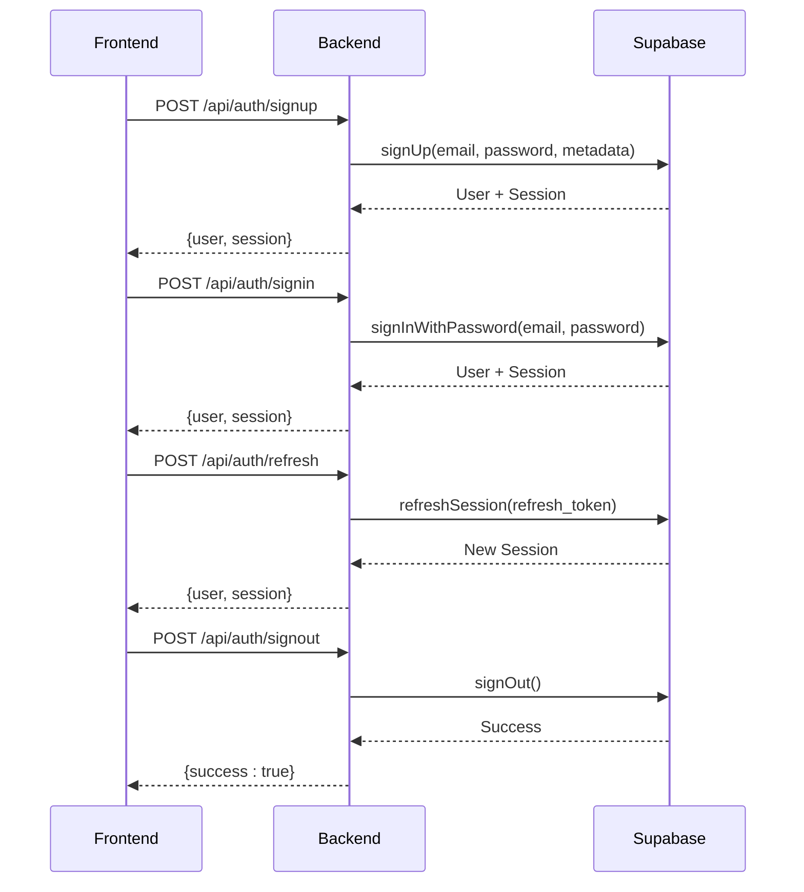
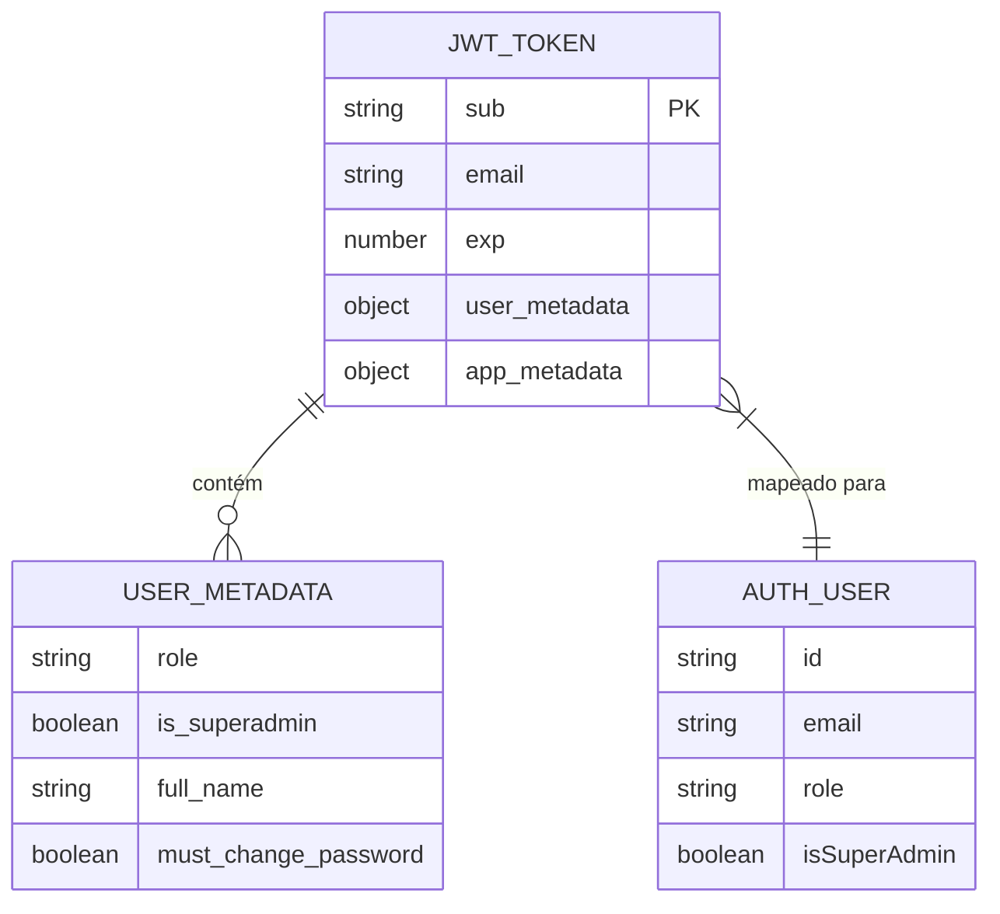
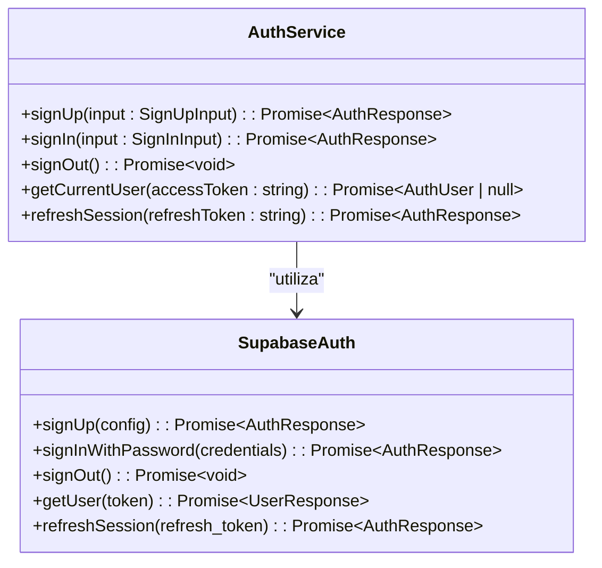
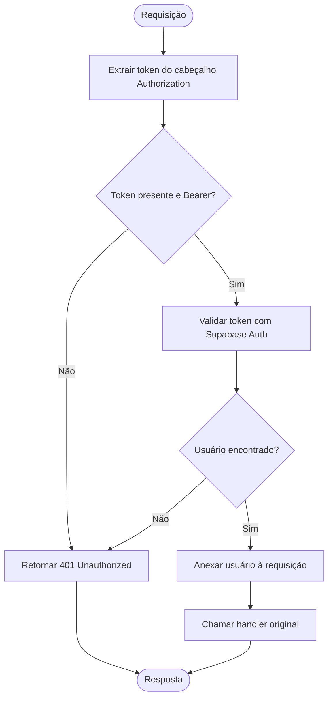
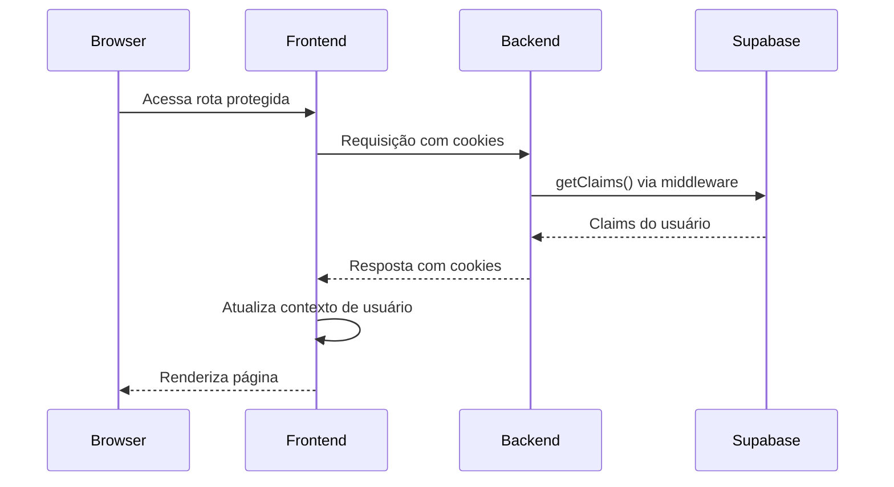

# Autenticação via JWT

<cite>
**Arquivos Referenciados neste Documento**  
- [auth.service.ts](file://backend/auth/auth.service.ts)
- [middleware.ts](file://backend/auth/middleware.ts)
- [types.ts](file://backend/auth/types.ts)
- [route.ts](file://app/api/auth/signin/route.ts)
- [route.ts](file://app/api/auth/signup/route.ts)
- [route.ts](file://app/api/auth/refresh/route.ts)
- [route.ts](file://app/api/auth/signout/route.ts)
- [route.ts](file://app/api/auth/me/route.ts)
- [lib/auth.ts](file://lib/auth.ts)
- [lib/middleware.ts](file://lib/middleware.ts)
- [user-provider.tsx](file://components/providers/user-provider.tsx)
- [login-form.tsx](file://components/login-form.tsx)
- [roles.ts](file://lib/roles.ts)
- [user.ts](file://types/user.ts)
</cite>

## Sumário
1. [Introdução](#introdução)
2. [Fluxo de Autenticação](#fluxo-de-autenticação)
3. [Estrutura do JWT e Claims Personalizados](#estrutura-do-jwt-e-claims-personalizados)
4. [Serviço AuthService e Integração com Supabase](#serviço-authservice-e-integração-com-supabase)
5. [Endpoints de Autenticação](#endpoints-de-autenticação)
6. [Validação de Entrada e Segurança](#validação-de-entrada-e-segurança)
7. [Middleware requireUserAuth](#middleware-requireuserauth)
8. [Fluxo de Registro (Sign-Up)](#fluxo-de-registro-sign-up)
9. [Fluxo de Login (Sign-In)](#fluxo-de-login-sign-in)
10. [Refresh de Token](#refresh-de-token)
11. [Logout](#logout)
12. [Gerenciamento de Sessão no Frontend](#gerenciamento-de-sessão-no-frontend)
13. [Proteção contra Ataques Comuns](#proteção-contra-ataques-comuns)
14. [Conclusão](#conclusão)

## Introdução

O sistema de autenticação da aplicação utiliza tokens JWT fornecidos pelo Supabase Auth para gerenciar a identidade e as permissões dos usuários. O fluxo completo envolve registro (sign-up), login (sign-in), refresh de token e logout, com validação rigorosa de entrada e proteção contra vulnerabilidades comuns. A identidade do usuário é enriquecida com claims personalizados como `role` e `is_superadmin`, permitindo controle de acesso refinado. Este documento detalha a arquitetura, os componentes principais e os fluxos de autenticação, com foco na integração entre frontend, backend e Supabase.

**Seção fontes**  
- [auth.service.ts](file://backend/auth/auth.service.ts#L1-L141)
- [middleware.ts](file://backend/auth/middleware.ts#L1-L193)

## Fluxo de Autenticação

O sistema de autenticação segue um fluxo baseado em JWT com os seguintes passos principais:

1. **Registro (Sign-Up)**: O usuário fornece email, senha e nome completo. O frontend envia esses dados ao endpoint `/api/auth/signup`, que utiliza o Supabase Auth para criar a conta com metadados iniciais.
2. **Login (Sign-In)**: O usuário insere suas credenciais no formulário de login. O frontend chama o endpoint `/api/auth/signin`, que valida as credenciais com o Supabase e retorna um JWT e um refresh token.
3. **Refresh de Token**: Quando o JWT expira, o frontend envia o refresh token ao endpoint `/api/auth/refresh` para obter um novo par de tokens.
4. **Logout**: O usuário encerra a sessão chamando o endpoint `/api/auth/signout`, que invalida a sessão no Supabase.
5. **Validação de Sessão**: Em cada requisição autenticada, o middleware `requireUserAuth` valida o JWT e extrai as informações do usuário.



**Fontes do diagrama**  
- [auth.service.ts](file://backend/auth/auth.service.ts#L5-L137)
- [route.ts](file://app/api/auth/signup/route.ts#L1-L24)
- [route.ts](file://app/api/auth/signin/route.ts#L1-L20)
- [route.ts](file://app/api/auth/refresh/route.ts#L1-L20)
- [route.ts](file://app/api/auth/signout/route.ts#L1-L17)

**Seção fontes**  
- [auth.service.ts](file://backend/auth/auth.service.ts#L5-L137)
- [route.ts](file://app/api/auth/signup/route.ts#L1-L24)
- [route.ts](file://app/api/auth/signin/route.ts#L1-L20)
- [route.ts](file://app/api/auth/refresh/route.ts#L1-L20)
- [route.ts](file://app/api/auth/signout/route.ts#L1-L17)

## Estrutura do JWT e Claims Personalizados

O JWT gerado pelo Supabase Auth contém claims padrão (como `sub`, `email`, `exp`) e claims personalizados armazenados no `user_metadata`. Os principais claims personalizados utilizados no sistema são:

- **`role`**: Define o papel do usuário (`aluno`, `professor`, `superadmin`). É usado para controle de acesso e redirecionamento.
- **`is_superadmin`**: Um booleano que indica se o usuário tem privilégios elevados, mesmo que sua `role` seja `professor`. Isso permite promover um professor a superadmin sem alterar sua role principal.
- **`full_name`**: Nome completo do usuário, usado para exibição na interface.
- **`must_change_password`**: Indica se o usuário deve alterar sua senha no primeiro acesso.

O serviço `AuthService` normaliza esses claims ao construir o objeto `AuthUser`, garantindo que `role` seja sempre `superadmin` quando `is_superadmin` for verdadeiro, independentemente do valor de `role`.



**Fontes do diagrama**  
- [auth.service.ts](file://backend/auth/auth.service.ts#L27-L36)
- [types.ts](file://backend/auth/types.ts#L3-L8)
- [lib/auth.ts](file://lib/auth.ts#L18-L95)

**Seção fontes**  
- [auth.service.ts](file://backend/auth/auth.service.ts#L27-L36)
- [types.ts](file://backend/auth/types.ts#L3-L8)
- [lib/auth.ts](file://lib/auth.ts#L18-L95)

## Serviço AuthService e Integração com Supabase

O `AuthService` é o componente central do backend responsável por orquestrar a autenticação com o Supabase Auth. Ele encapsula as chamadas à API do Supabase, tratando erros e normalizando as respostas para um formato consistente usado pela aplicação.

O serviço utiliza o cliente de banco de dados fornecido por `getDatabaseClient()` para acessar o objeto `auth` do Supabase. Os métodos principais são:

- **`signUp`**: Cria um novo usuário com metadados iniciais. Para o frontend, o `role` é sempre definido como `professor`.
- **`signIn`**: Valida credenciais e inicia uma sessão.
- **`signOut`**: Encerra a sessão atual.
- **`getCurrentUser`**: Valida um token de acesso e retorna os dados do usuário.
- **`refreshSession`**: Usa um refresh token para obter um novo par de tokens.

A integração é feita diretamente com a biblioteca do Supabase, garantindo que todas as operações de autenticação sejam seguras e confiáveis.



**Fontes do diagrama**  
- [auth.service.ts](file://backend/auth/auth.service.ts#L4-L137)
- [types.ts](file://backend/auth/types.ts#L16-L36)

**Seção fontes**  
- [auth.service.ts](file://backend/auth/auth.service.ts#L4-L137)

## Endpoints de Autenticação

A aplicação expõe uma série de endpoints RESTful para gerenciar a autenticação, localizados em `app/api/auth/`. Cada endpoint é um handler do Next.js que processa requisições HTTP.

- **`POST /api/auth/signup`**: Recebe os dados do formulário de cadastro, chama `authService.signUp` e retorna os dados do usuário e da sessão.
- **`POST /api/auth/signin`**: Recebe email e senha, chama `authService.signIn` e retorna os dados da sessão.
- **`POST /api/auth/refresh`**: Recebe um refresh token, chama `authService.refreshSession` e retorna um novo par de tokens.
- **`POST /api/auth/signout`**: Encerra a sessão do usuário. Usa o middleware `requireAuth` para garantir que apenas usuários autenticados possam chamar este endpoint.
- **`GET /api/auth/me`**: Retorna os dados do usuário autenticado. Útil para o frontend verificar o estado de autenticação.

```mermaid
flowchart TD
A[Frontend] --> B[/api/auth/signup]
A --> C[/api/auth/signin]
A --> D[/api/auth/refresh]
A --> E[/api/auth/signout]
A --> F[/api/auth/me]
B --> G[authService.signUp]
C --> H[authService.signIn]
D --> I[authService.refreshSession]
E --> J[authService.signOut]
F --> K[getAuthUser]
G --> L[Supabase Auth]
H --> L
I --> L
J --> L
K --> L
```

**Fontes do diagrama**  
- [route.ts](file://app/api/auth/signup/route.ts#L1-L24)
- [route.ts](file://app/api/auth/signin/route.ts#L1-L20)
- [route.ts](file://app/api/auth/refresh/route.ts#L1-L20)
- [route.ts](file://app/api/auth/signout/route.ts#L1-L17)
- [route.ts](file://app/api/auth/me/route.ts#L1-L41)

**Seção fontes**  
- [route.ts](file://app/api/auth/signup/route.ts#L1-L24)
- [route.ts](file://app/api/auth/signin/route.ts#L1-L20)
- [route.ts](file://app/api/auth/refresh/route.ts#L1-L20)
- [route.ts](file://app/api/auth/signout/route.ts#L1-L17)
- [route.ts](file://app/api/auth/me/route.ts#L1-L41)

## Validação de Entrada e Segurança

O sistema implementa validações de entrada tanto no frontend quanto no backend para garantir a integridade dos dados e prevenir ataques.

- **Frontend**: O componente `login-form.tsx` valida que os campos de email e senha não estão vazios antes de enviar a requisição.
- **Backend**: Os endpoints de autenticação verificam a presença dos campos necessários no corpo da requisição. Por exemplo, `/api/auth/refresh` verifica se `refreshToken` está presente.
- **Supabase Auth**: O próprio serviço de autenticação do Supabase valida a força da senha, previne tentativas de login excessivas e protege contra ataques de força bruta.

Além disso, o sistema utiliza HTTPS para todas as comunicações, garantindo que os tokens JWT e as credenciais sejam transmitidos de forma segura.

**Seção fontes**  
- [login-form.tsx](file://components/login-form.tsx#L26-L38)
- [route.ts](file://app/api/auth/refresh/route.ts#L8-L10)

## Middleware requireUserAuth

O middleware `requireUserAuth` é uma função de ordem superior que protege rotas do backend que exigem autenticação. Ele extrai o token JWT do cabeçalho `Authorization`, valida-o com o Supabase Auth e anexa os dados do usuário à requisição.

Se o token for inválido ou ausente, o middleware retorna uma resposta `401 Unauthorized`. Caso contrário, ele chama o handler original com a requisição estendida contendo o objeto `user`.

Este middleware é usado em endpoints como `/api/auth/signout` e em qualquer outro endpoint que precise do contexto do usuário autenticado.



**Fontes do diagrama**  
- [middleware.ts](file://backend/auth/middleware.ts#L114-L151)

**Seção fontes**  
- [middleware.ts](file://backend/auth/middleware.ts#L114-L151)

## Fluxo de Registro (Sign-Up)

O fluxo de registro é iniciado quando um novo professor se cadastra na aplicação. O frontend envia uma requisição POST para `/api/auth/signup` com os dados do usuário.

O endpoint chama `authService.signUp`, que por sua vez utiliza `supabase.auth.signUp` para criar a conta. Os metadados do usuário são definidos com `role: 'professor'`. Após a criação bem-sucedida, o Supabase gera um JWT e um refresh token, que são retornados ao frontend.

É importante notar que o primeiro professor cadastrado é automaticamente promovido a `superadmin` por um trigger no banco de dados, garantindo que haja sempre um administrador no sistema.

**Seção fontes**  
- [route.ts](file://app/api/auth/signup/route.ts#L1-L24)
- [auth.service.ts](file://backend/auth/auth.service.ts#L5-L42)

## Fluxo de Login (Sign-In)

O fluxo de login começa com o usuário preenchendo o formulário de login (`login-form.tsx`). O frontend valida os campos e chama `supabase.auth.signInWithPassword` com o email e a senha.

Após a autenticação bem-sucedida, o frontend obtém os dados do usuário com `supabase.auth.getUser()` e verifica se a `role` do usuário corresponde à seleção feita no formulário (aluno ou professor). Se houver incompatibilidade, a sessão é encerrada e um erro é exibido.

O frontend então redireciona o usuário para a rota padrão correspondente à sua role, ou para `/primeiro-acesso` se `must_change_password` for verdadeiro.

**Seção fontes**  
- [login-form.tsx](file://components/login-form.tsx#L33-L113)
- [lib/auth.ts](file://lib/auth.ts#L7-L96)

## Refresh de Token

O refresh de token é um processo automático que ocorre quando o JWT expira. O frontend detecta a expiração (por exemplo, através de um erro 401 em uma requisição) e envia o refresh token armazenado ao endpoint `/api/auth/refresh`.

O backend chama `authService.refreshSession`, que utiliza `supabase.auth.refreshSession` para obter um novo par de tokens. Os novos tokens são retornados ao frontend, que os armazena e continua a sessão sem interrupção.

Este mecanismo permite que os usuários permaneçam autenticados por longos períodos sem precisar fazer login novamente, enquanto mantém a segurança ao usar tokens de acesso de curta duração.

**Seção fontes**  
- [route.ts](file://app/api/auth/refresh/route.ts#L1-L20)
- [auth.service.ts](file://backend/auth/auth.service.ts#L106-L137)

## Logout

O logout é um processo simples que encerra a sessão do usuário. O frontend chama o endpoint `/api/auth/signout`, que por sua vez chama `authService.signOut`, que invoca `supabase.auth.signOut`.

Após o logout bem-sucedido, o frontend deve redirecionar o usuário para a página de login. O Supabase invalida o refresh token, garantindo que a sessão não possa ser restaurada.

**Seção fontes**  
- [route.ts](file://app/api/auth/signout/route.ts#L1-L17)
- [auth.service.ts](file://backend/auth/auth.service.ts#L77-L84)

## Gerenciamento de Sessão no Frontend

O frontend gerencia a sessão do usuário utilizando o provedor de contexto `UserProvider` e o hook `useCurrentUser`. Após o login, os dados do usuário são obtidos e fornecidos a toda a aplicação.

O middleware do Next.js (`lib/middleware.ts`) é responsável por verificar a sessão em cada requisição ao servidor. Ele utiliza `createServerClient` para acessar os cookies de autenticação e validar a sessão. Se não houver um usuário autenticado e a rota não for pública, o usuário é redirecionado para `/auth`.



**Fontes do diagrama**  
- [lib/middleware.ts](file://lib/middleware.ts#L1-L75)
- [user-provider.tsx](file://components/providers/user-provider.tsx#L1-L50)
- [lib/auth.ts](file://lib/auth.ts#L7-L121)

**Seção fontes**  
- [lib/middleware.ts](file://lib/middleware.ts#L1-L75)
- [user-provider.tsx](file://components/providers/user-provider.tsx#L1-L50)
- [lib/auth.ts](file://lib/auth.ts#L7-L121)

## Proteção contra Ataques Comuns

O sistema implementa várias medidas para proteger contra ataques comuns:

- **Ataques de força bruta**: O Supabase Auth limita automaticamente o número de tentativas de login.
- **CSRF**: O uso de tokens JWT armazenados em cookies HTTPOnly e o middleware do Supabase mitigam riscos de CSRF.
- **XSS**: Os cookies de autenticação são marcados como HTTPOnly, impedindo o acesso via JavaScript.
- **Token leakage**: O JWT é transmitido apenas via HTTPS e os refresh tokens são armazenados de forma segura.
- **Injeção de SQL**: O uso do cliente do Supabase e do Prisma previne injeção de SQL.

Além disso, o sistema valida rigorosamente todas as entradas do usuário e utiliza práticas recomendadas de segurança em toda a stack.

**Seção fontes**  
- [middleware.ts](file://backend/auth/middleware.ts#L11-L51)
- [lib/middleware.ts](file://lib/middleware.ts#L1-L75)

## Conclusão

O sistema de autenticação baseado em JWT é robusto, seguro e bem integrado com o Supabase Auth. Ele fornece um fluxo de usuário suave para registro, login, refresh e logout, enquanto implementa controles de acesso refinados através de claims personalizados como `role` e `is_superadmin`. A arquitetura clara, com separação entre frontend, backend e serviço de autenticação, facilita a manutenção e a escalabilidade. As práticas de segurança implementadas garantem que a identidade dos usuários seja protegida contra ameaças comuns.