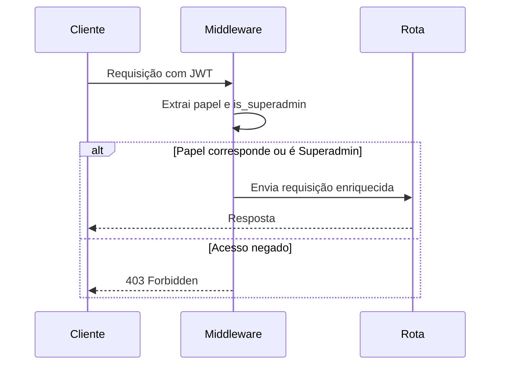
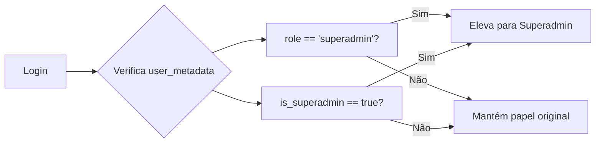
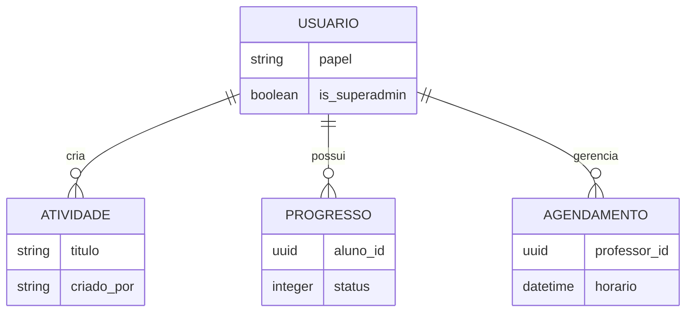
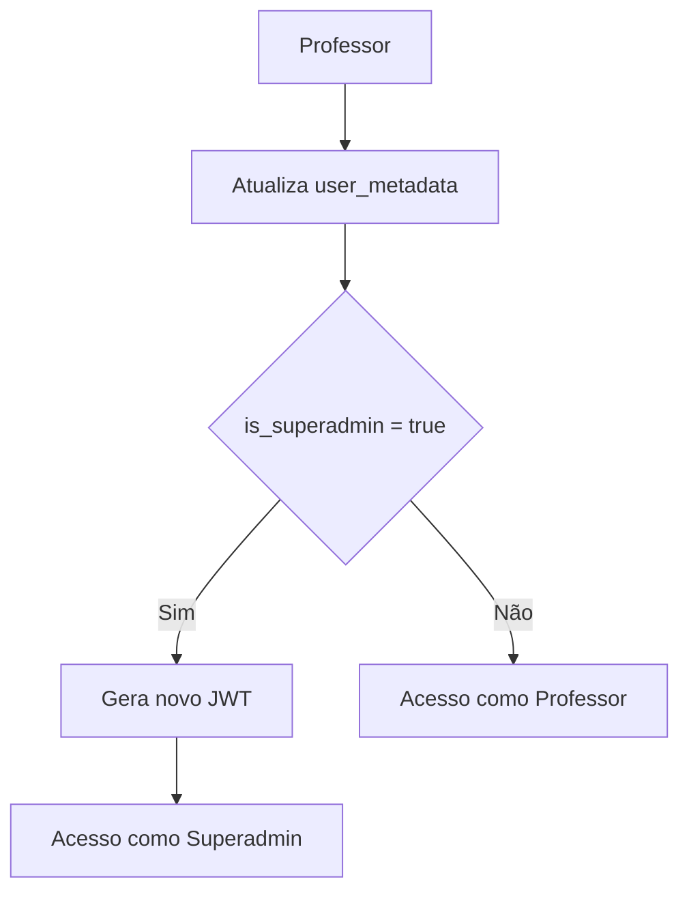

# Controle de Acesso por Papéis (RBAC)

<cite>
**Arquivos Referenciados neste Documento**   
- [middleware.ts](file://lib/middleware.ts)
- [roles.ts](file://lib/roles.ts)
- [middleware.ts](file://backend/auth/middleware.ts)
- [types.ts](file://backend/auth/types.ts)
- [auth.service.ts](file://backend/auth/auth.service.ts)
- [me/route.ts](file://app/api/auth/me/route.ts)
- [authentication.md](file://docs/authentication.md)
- [LOGICA_COMPLETA_SALA_ESTUDOS.md](file://docs/LOGICA_COMPLETA_SALA_ESTUDOS.md)
</cite>

## Sumário
1. [Introdução](#introdução)
2. [Papéis do Sistema](#papéis-do-sistema)
3. [Middleware de Autorização](#middleware-de-autorização)
4. [Elevação de Privilégios com is_superadmin](#elevação-de-privilégios-com-is_superadmin)
5. [Visibilidade de Dados e Funcionalidades](#visibilidade-de-dados-e-funcionalidades)
6. [Casos de Uso e Implicações de Segurança](#casos-de-uso-e-implicações-de-segurança)

## Introdução
O sistema implementa um modelo de Controle de Acesso Baseado em Papéis (RBAC) que define três papéis principais: Aluno, Professor e Superadmin. Este modelo regula o acesso a recursos, rotas e funcionalidades com base na identidade do usuário e em flags de autorização armazenadas nos metadados do Supabase. O sistema utiliza middlewares para enriquecer requisições com informações de autorização e aplicar políticas de segurança de forma consistente.

**Section sources**
- [authentication.md](file://docs/authentication.md#L130-L136)

## Papéis do Sistema

### Aluno
O papel de Aluno é o nível básico de acesso. Alunos têm permissão para visualizar apenas seus próprios dados e interagir com funcionalidades limitadas do sistema, como dashboard pessoal, biblioteca de estudos e flashcards. Eles não podem criar ou modificar recursos compartilhados.

### Professor
Professores possuem permissões expandidas, permitindo-lhes criar e gerenciar recursos como atividades, materiais didáticos e agendamentos. Eles têm acesso a painéis administrativos específicos e podem visualizar dados relacionados às suas turmas e cursos.

### Superadmin
Superadmin representa o nível máximo de acesso, concedendo permissões completas a todas as funcionalidades do sistema. Usuários com este papel podem contornar políticas de segurança de linha (RLS) e acessar todos os dados, independentemente da propriedade.

```mermaid
flowchart TD
A[Usuário] --> B{Verifica is_superadmin}
B --> |Sim| C[Acesso Total (Superadmin)]
B --> |Não| D{Verifica Papel}
D --> |aluno| E[Acesso Limitado]
D --> |professor| F[Acesso a Recursos de Professor]
D --> |superadmin no metadata| C
```

**Diagram sources**
- [middleware.ts](file://backend/auth/middleware.ts#L30-L31)
- [types.ts](file://backend/auth/types.ts#L1)

**Section sources**
- [authentication.md](file://docs/authentication.md#L130-L136)

## Middleware de Autorização

### Middleware requireRole
O middleware `requireRole` garante que apenas usuários com um papel específico possam acessar determinadas rotas. Ele verifica se o papel do usuário corresponde ao papel exigido ou se o usuário possui privilégios de superadmin. Este middleware enriquece a requisição com o objeto `user`, tornando as informações de autorização disponíveis nos manipuladores de rotas.

### Middleware requireSuperAdmin
O middleware `requireSuperAdmin` restringe o acesso exclusivamente a usuários com privilégios elevados. Ele verifica a presença da flag `isSuperAdmin` no objeto do usuário. Caso o usuário não seja um superadmin, a requisição é rejeitada com status 403.



**Diagram sources**
- [middleware.ts](file://backend/auth/middleware.ts#L153-L174)
- [middleware.ts](file://backend/auth/middleware.ts#L176-L192)

**Section sources**
- [middleware.ts](file://backend/auth/middleware.ts#L153-L192)

## Elevação de Privilégios com is_superadmin

### Campo is_superadmin nos Metadados
O acesso de superadmin é concedido através do campo `is_superadmin` nos metadados do usuário no Supabase (`user_metadata.is_superadmin`). Quando este campo é definido como `true`, o sistema eleva automaticamente o papel do usuário para `superadmin`, independentemente do papel base.

### Processo de Autenticação
Durante a autenticação, o sistema verifica tanto o papel declarado quanto a flag `is_superadmin`. Se qualquer uma das condições for atendida (papel é 'superadmin' ou `is_superadmin` é verdadeiro), o usuário recebe privilégios totais.



**Diagram sources**
- [auth.service.ts](file://backend/auth/auth.service.ts#L27)
- [middleware.ts](file://backend/auth/middleware.ts#L30)

**Section sources**
- [auth.service.ts](file://backend/auth/auth.service.ts#L27-L28)
- [me/route.ts](file://app/api/auth/me/route.ts#L35-L36)

## Visibilidade de Dados e Funcionalidades

### Políticas RLS (Row Level Security)
O sistema utiliza políticas RLS no banco de dados para controlar o acesso a dados:
- **Alunos**: Apenas seus próprios registros
- **Professores**: Recursos que criaram ou gerenciam
- **Superadmin**: Todos os dados, com bypass de políticas

### Influência na Interface
Os papéis determinam a visibilidade de componentes na interface:
- Alunos veem apenas opções de estudo e progresso
- Professores têm acesso a painéis de administração e criação de conteúdo
- Superadmins veem todas as opções, incluindo ferramentas de gerenciamento global



**Diagram sources**
- [LOGICA_COMPLETA_SALA_ESTUDOS.md](file://docs/LOGICA_COMPLETA_SALA_ESTUDOS.md#L702-L713)
- [roles.ts](file://lib/roles.ts#L3)

**Section sources**
- [LOGICA_COMPLETA_SALA_ESTUDOS.md](file://docs/LOGICA_COMPLETA_SALA_ESTUDOS.md#L702-L729)

## Casos de Uso e Implicações de Segurança

### Promoção de Professor a Superadmin
Um professor pode ser promovido a superadmin através da atualização de seus metadados no Supabase. Este processo envolve:
1. Acesso ao painel de autenticação do Supabase
2. Edição do campo `user_metadata` do usuário
3. Definição de `is_superadmin` como `true`
4. Solicitação de novo login para atualizar o token JWT

### Implicações de Segurança
A promoção a superadmin concede acesso irrestrito ao sistema, incluindo:
- Visualização de todos os dados de usuários
- Modificação de qualquer recurso
- Potencial para alterações indesejadas em configurações críticas

É essencial que:
- A promoção seja feita apenas por administradores confiáveis
- Os privilégios sejam revogados quando não mais necessários
- O usuário entenda as responsabilidades associadas



**Diagram sources**
- [middleware.ts](file://backend/auth/middleware.ts#L108-L109)
- [auth.service.ts](file://backend/auth/auth.service.ts#L27)

**Section sources**
- [first-professor-superadmin.md](file://docs/first-professor-superadmin.md)
- [authentication.md](file://docs/authentication.md#L134)