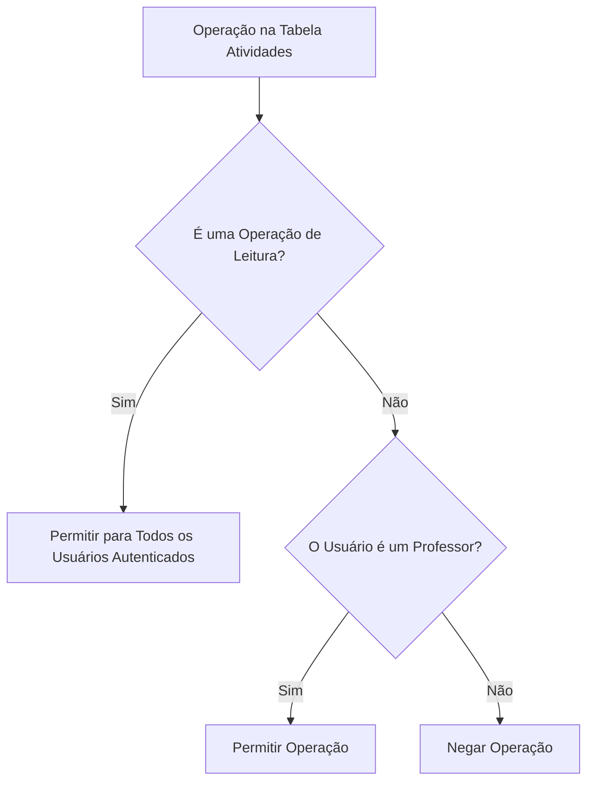
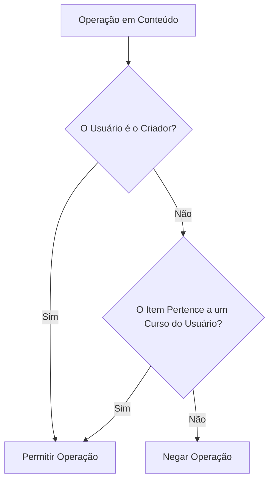
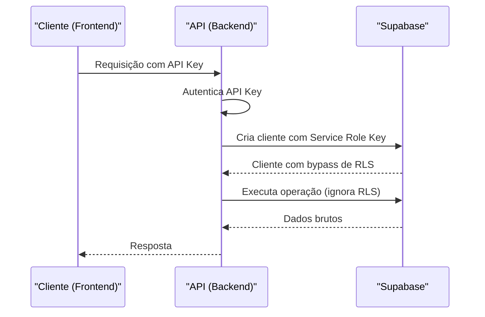

# Segurança com Row Level Security (RLS)

<cite>
**Arquivos Referenciados neste Documento**  
- [20250120_create_alunos.sql](file://supabase/migrations/20250120_create_alunos.sql)
- [20250128_add_created_by_to_content_tables.sql](file://supabase/migrations/20250128_add_created_by_to_content_tables.sql)
- [20250129_add_alunos_cursos_rls_policies.sql](file://supabase/migrations/20250129_add_alunos_cursos_rls_policies.sql)
- [20250129_fix_alunos_rls_update_policy.sql](file://supabase/migrations/20250129_fix_alunos_rls_update_policy.sql)
- [20250131_create_atividades_tables.sql](file://supabase/migrations/20250131_create_atividades_tables.sql)
- [20251208_create_agendamentos.sql](file://supabase/migrations/20251208_create_agendamentos.sql)
- [database-auth.ts](file://backend/clients/database-auth.ts)
- [gerar-cronograma/index.ts](file://supabase/functions/gerar-cronograma/index.ts)
</cite>

## Sumário
1. [Introdução](#introdução)
2. [Implementação do RLS no Supabase](#implementação-do-rls-no-supabase)
3. [Políticas RLS por Tabela](#políticas-rls-por-tabela)
4. [Uso do Contexto de Usuário Autenticado (JWT)](#uso-do-contexto-de-usuário-autenticado-jwt)
5. [Exceções: Service Role Key e API Keys](#exceções-service-role-key-e-api-keys)
6. [Boas Práticas de Segurança](#boas-práticas-de-segurança)
7. [Conclusão](#conclusão)

## Introdução

O Row Level Security (RLS) é um mecanismo fundamental de segurança no Supabase que garante que os dados sensíveis sejam acessados apenas por usuários autorizados. No sistema "Área do Aluno", o RLS é utilizado para implementar um modelo de controle de acesso granular, onde alunos visualizam apenas seus próprios dados, professores gerenciam apenas os recursos que criaram ou estão vinculados aos seus cursos, e superadmins possuem acesso total ao sistema. Este documento detalha a implementação técnica do RLS, incluindo políticas específicas, uso do contexto JWT, exceções com Service Role Key e boas práticas de segurança.

## Implementação do RLS no Supabase

O RLS é habilitado diretamente nas tabelas do banco de dados PostgreSQL do Supabase através de políticas SQL. Cada política define condições para operações específicas (SELECT, INSERT, UPDATE, DELETE) baseadas no contexto do usuário autenticado, acessível via funções como `auth.uid()`. A ativação do RLS é feita com o comando `ALTER TABLE ... ENABLE ROW LEVEL SECURITY`, seguido pela criação de políticas com `CREATE POLICY`.

**Fontes da Seção**
- [20250120_create_alunos.sql](file://supabase/migrations/20250120_create_alunos.sql#L40)
- [20250131_create_atividades_tables.sql](file://supabase/migrations/20250131_create_atividades_tables.sql#L121)

## Políticas RLS por Tabela

### Tabela `alunos`

A tabela `alunos` armazena dados pessoais dos estudantes. As políticas garantem que cada aluno só possa ver, atualizar ou inserir seu próprio registro, vinculado ao seu ID de autenticação (`auth.uid()`).

```mermaid
flowchart TD
A[Operação no Banco de Dados] --> B{Tipo de Operação?}
B --> |SELECT| C[Verifica se auth.uid() = id]
B --> |UPDATE| D[Verifica se auth.uid() = id]
B --> |INSERT| E[Verifica se auth.uid() = id]
C --> F[Permitir Acesso]
D --> F
E --> F
C -. Falha .-> G[Negar Acesso]
D -. Falha .-> G
E -. Falha .-> G
```

**Fontes do Diagrama**
- [20250120_create_alunos.sql](file://supabase/migrations/20250120_create_alunos.sql#L43-L53)
- [20250129_fix_alunos_rls_update_policy.sql](file://supabase/migrations/20250129_fix_alunos_rls_update_policy.sql#L10-L13)

**Fontes da Seção**
- [20250120_create_alunos.sql](file://supabase/migrations/20250120_create_alunos.sql#L43-L53)
- [20250129_fix_alunos_rls_update_policy.sql](file://supabase/migrations/20250129_fix_alunos_rls_update_policy.sql#L10-L13)

### Tabela `atividades`

A tabela `atividades` contém os materiais de estudo. As políticas diferenciam entre leitura e escrita. Qualquer usuário autenticado pode visualizar as atividades (`FOR SELECT USING (true)`), mas apenas professores podem criar, atualizar ou deletar registros (`FOR ALL USING (EXISTS (SELECT 1 FROM public.professores WHERE id = auth.uid()))`).



**Fontes do Diagrama**
- [20250131_create_atividades_tables.sql](file://supabase/migrations/20250131_create_atividades_tables.sql#L127-L131)

**Fontes da Seção**
- [20250131_create_atividades_tables.sql](file://supabase/migrations/20250131_create_atividades_tables.sql#L127-L131)

### Tabela `progresso_atividades`

A tabela `progresso_atividades` armazena o andamento individual dos alunos em cada atividade. O RLS garante que um aluno só possa ver, inserir ou editar seu próprio progresso.

```mermaid
flowchart TD
N[Operação no Progresso] --> O{Tipo de Operação?}
O --> |SELECT| P[Verifica se auth.uid() = aluno_id]
O --> |INSERT| Q[Verifica se auth.uid() = aluno_id]
O --> |UPDATE| R[Verifica se auth.uid() = aluno_id]
P --> S[Permitir Acesso]
Q --> S
R --> S
P -. Falha .-> T[Negar Acesso]
Q -. Falha .-> T
R -. Falha .-> T
```

**Fontes do Diagrama**
- [20250131_create_atividades_tables.sql](file://supabase/migrations/20250131_create_atividades_tables.sql#L135-L139)

**Fontes da Seção**
- [20250131_create_atividades_tables.sql](file://supabase/migrations/20250131_create_atividades_tables.sql#L135-L139)

### Tabelas de Conteúdo (`frentes`, `modulos`, `aulas`)

Tabelas que armazenam conteúdo educacional possuem políticas mais complexas. Um professor pode gerenciar um item se ele for o `created_by` do registro ou se o item pertencer a um curso que ele criou. Isso é implementado com subconsultas que verificam a hierarquia `cursos -> frentes -> modulos -> aulas`.



**Fontes do Diagrama**
- [20250128_add_created_by_to_content_tables.sql](file://supabase/migrations/20250128_add_created_by_to_content_tables.sql#L86-L110)

**Fontes da Seção**
- [20250128_add_created_by_to_content_tables.sql](file://supabase/migrations/20250128_add_created_by_to_content_tables.sql#L86-L110)

### Tabela `alunos_cursos`

Esta tabela de junção permite que alunos sejam matriculados em cursos. A política de leitura garante que um aluno só veja suas próprias matrículas. As políticas de inserção e deleção são mais permissivas (`WITH CHECK (true)`), permitindo que administradores ou professores realizem essas operações.

```mermaid
flowchart TD
Z[Operação em alunos_cursos] --> AA{Tipo de Operação?}
AA --> |SELECT| AB[Verifica se auth.uid() = aluno_id]
AA --> |INSERT| AC[Permitir para Usuários Autenticados]
AA --> |DELETE| AD[Permitir para Usuários Autenticados]
AB --> AE[Permitir Acesso]
AC --> AE
AD --> AE
AB -. Falha .-> AF[Negar Acesso]
```

**Fontes do Diagrama**
- [20250129_add_alunos_cursos_rls_policies.sql](file://supabase/migrations/20250129_add_alunos_cursos_rls_policies.sql#L15-L28)

**Fontes da Seção**
- [20250129_add_alunos_cursos_rls_policies.sql](file://supabase/migrations/20250129_add_alunos_cursos_rls_policies.sql#L15-L28)

## Uso do Contexto de Usuário Autenticado (JWT)

O contexto do usuário autenticado é fornecido pelo Supabase através do token JWT enviado no cabeçalho `Authorization` das requisições. A função `auth.uid()` dentro das políticas RLS extrai o ID do usuário do JWT. Quando um cliente realiza uma consulta, o Supabase injeta automaticamente o `auth.uid()` do usuário autenticado na cláusula `USING` ou `WITH CHECK` da política RLS correspondente, filtrando os resultados em tempo real.

**Fontes da Seção**
- [20250120_create_alunos.sql](file://supabase/migrations/20250120_create_alunos.sql#L45)
- [20250128_add_created_by_to_content_tables.sql](file://supabase/migrations/20250128_add_created_by_to_content_tables.sql#L93)

## Exceções: Service Role Key e API Keys

Existem cenários onde o RLS precisa ser contornado para operações administrativas. Isso é feito usando a **Service Role Key**, uma chave privilegiada do Supabase que bypassa todas as políticas RLS. No código, isso é implementado criando um cliente Supabase com a `SUPABASE_SERVICE_ROLE_KEY` em vez da chave anônima ou pública.



**Fontes do Diagrama**
- [database-auth.ts](file://backend/clients/database-auth.ts#L58-L65)
- [gerar-cronograma/index.ts](file://supabase/functions/gerar-cronograma/index.ts#L208)

**Fontes da Seção**
- [database-auth.ts](file://backend/clients/database-auth.ts#L58-L65)
- [gerar-cronograma/index.ts](file://supabase/functions/gerar-cronograma/index.ts#L208)

## Boas Práticas de Segurança

1.  **Verificação de `created_by` em Operações de Escrita:** Sempre que um professor cria um novo recurso (frente, módulo, aula), o campo `created_by` é automaticamente preenchido com o `auth.uid()` do usuário autenticado por um trigger (`handle_created_by`). Isso é crucial para que as políticas RLS funcionem corretamente.
2.  **Proteção contra Elevação de Privilégios:** As políticas RLS são a primeira linha de defesa. Mesmo que um usuário tente manipular a API, o banco de dados recusará a operação se as condições da política não forem atendidas.
3.  **Uso Restrito da Service Role Key:** A Service Role Key deve ser usada apenas em funções do backend ou em Edge Functions, nunca exposta no frontend. O código valida sua presença antes de criar o cliente administrativo.
4.  **Princípio do Menor Privilégio:** As políticas são definidas com o mínimo de permissões necessárias. Por exemplo, um aluno não pode ver os dados de outro aluno, mesmo que saiba o ID.

**Fontes da Seção**
- [20250128_add_created_by_to_content_tables.sql](file://supabase/migrations/20250128_add_created_by_to_content_tables.sql#L34-L43)
- [database-auth.ts](file://backend/clients/database-auth.ts#L36-L51)

## Conclusão

A implementação do Row Level Security no sistema "Área do Aluno" é robusta e eficaz, criando um ambiente seguro onde o acesso aos dados é estritamente controlado com base na identidade e no papel do usuário. O uso combinado de políticas RLS baseadas em `auth.uid()` e o mecanismo de bypass controlado com a Service Role Key para operações administrativas oferece um equilíbrio ideal entre segurança e funcionalidade. A adesão a boas práticas, como a verificação do `created_by` e o uso restrito de chaves privilegiadas, fortalece ainda mais a integridade do sistema.