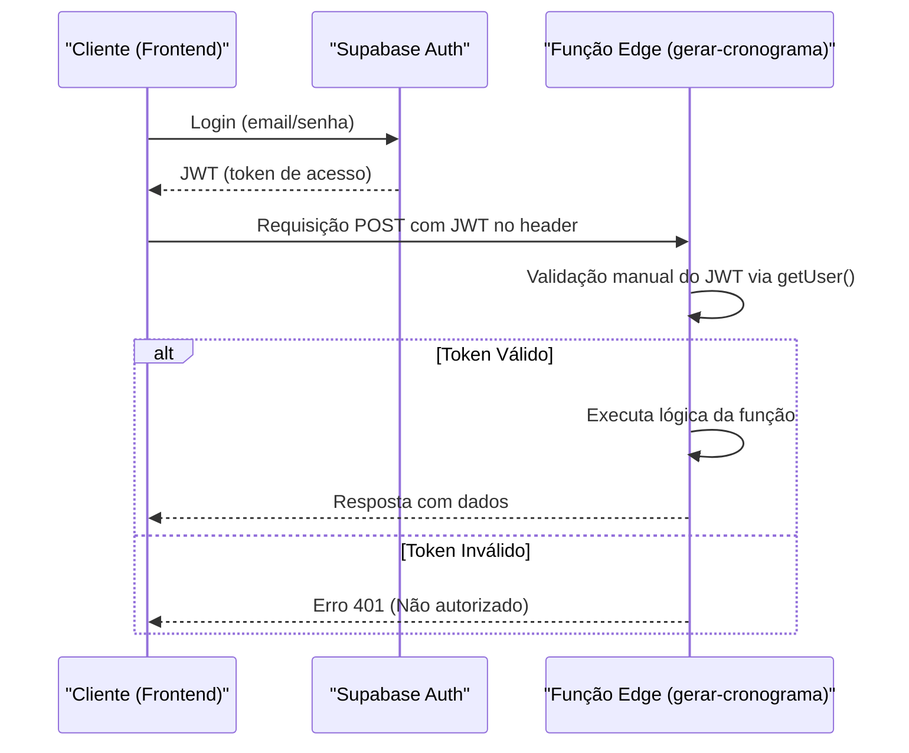
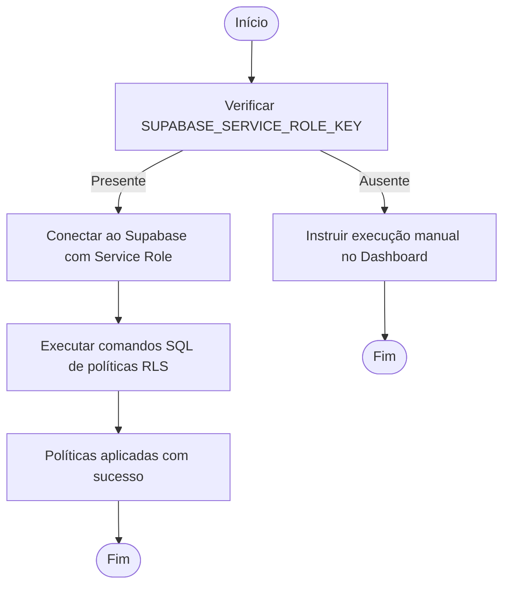
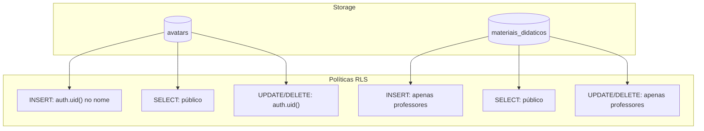
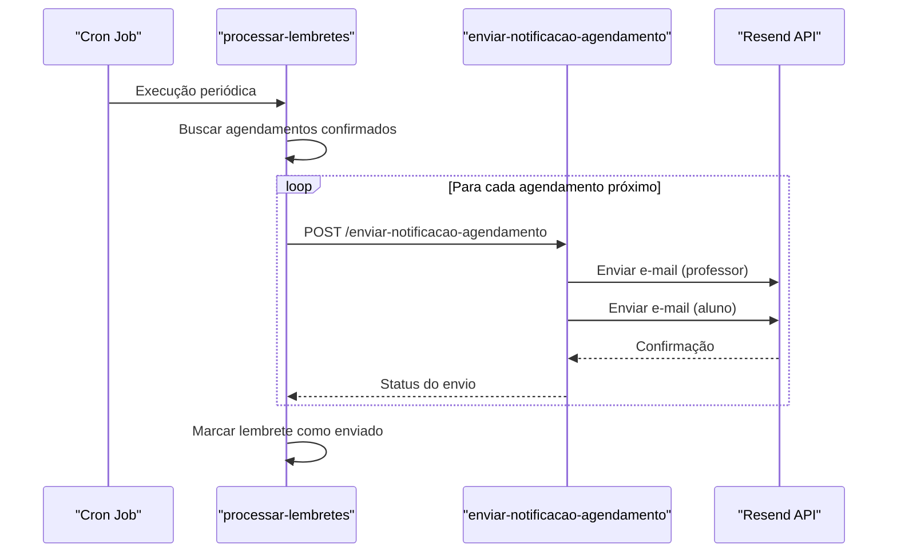

# Configuração do Supabase

<cite>
**Arquivos Referenciados neste Documento**   
- [apply-rls-policies.js](file://scripts/apply-rls-policies.js)
- [setup-supabase-mcp.sh](file://scripts/setup-supabase-mcp.sh)
- [setup-supabase-mcp.ps1](file://scripts/setup-supabase-mcp.ps1)
- [config.toml](file://supabase/config.toml)
- [20250129_add_alunos_cursos_rls_policies.sql](file://supabase/migrations/20250129_add_alunos_cursos_rls_policies.sql)
- [20250130_create_avatars_bucket.sql](file://supabase/migrations/20250130_create_avatars_bucket.sql)
- [20250131_create_materiais_didaticos_bucket_policies.sql](file://supabase/migrations/20250131_create_materiais_didaticos_bucket_policies.sql)
- [gerar-cronograma/index.ts](file://supabase/functions/gerar-cronograma/index.ts)
- [processar-lembretes/index.ts](file://supabase/functions/processar-lembretes/index.ts)
- [enviar-notificacao-agendamento/index.ts](file://supabase/functions/enviar-notificacao-agendamento/index.ts)
- [GUIA_CONFIGURACAO_MANUAL_BUCKET.md](file://docs/GUIA_CONFIGURACAO_MANUAL_BUCKET.md)
- [MCP_SUPABASE_SETUP.md](file://docs/MCP_SUPABASE_SETUP.md)
- [SETUP_AVATAR_BUCKET.md](file://docs/SETUP_AVATAR_BUCKET.md)
</cite>

## Sumário
1. [Criação do Projeto no Supabase Dashboard](#criação-do-projeto-no-supabase-dashboard)
2. [Configuração de Autenticação com JWT](#configuração-de-autenticação-com-jwt)
3. [Habilitação da RLS (Row Level Security)](#habilitação-da-rls-row-level-security)
4. [Criação de Políticas de Acesso para Tabelas](#criação-de-políticas-de-acesso-para-tabelas)
5. [Aplicação de Migrations com Supabase CLI](#aplicação-de-migrations-com-supabase-cli)
6. [Execução de Scripts de Setup](#execução-de-scripts-de-setup)
7. [Configuração de Buckets de Armazenamento](#configuração-de-buckets-de-armazenamento)
8. [Configuração de Funções Edge](#configuração-de-funções-edge)
9. [Verificação de Saúde do Banco](#verificação-de-saúde-do-banco)
10. [Troubleshooting de Conexão e Permissões](#troubleshooting-de-conexão-e-permissões)

## Criação do Projeto no Supabase Dashboard

Para iniciar a configuração do Supabase para o projeto Área do Aluno, o primeiro passo é criar um novo projeto no Supabase Dashboard. Acesse [https://supabase.com/dashboard](https://supabase.com/dashboard), faça login com sua conta e clique em "New Project". Preencha os detalhes do projeto, como nome (ex: "Área do Aluno"), região de hospedagem e plano (pode começar com o gratuito). Após a criação, aguarde a inicialização completa do projeto, que pode levar alguns minutos. Uma vez concluído, você será redirecionado para o painel do projeto, onde poderá acessar todas as funcionalidades do Supabase, incluindo banco de dados, autenticação, armazenamento e funções edge.

**Seção fontes**
- [MCP_SUPABASE_SETUP.md](file://docs/MCP_SUPABASE_SETUP.md#L1-L117)

## Configuração de Autenticação com JWT

A autenticação no projeto Área do Aluno é baseada em JWT (JSON Web Tokens), fornecido nativamente pelo Supabase Auth. O sistema utiliza chaves publishable/secret para segurança aprimorada. No arquivo `supabase/config.toml`, a verificação automática do JWT está desabilitada (`verify_jwt = false`) para permitir validação manual do token do usuário nas funções edge, garantindo maior controle sobre o processo de autenticação. As funções edge, como `gerar-cronograma`, validam manualmente o JWT usando o método `supabase.auth.getUser()` com o token fornecido no header `Authorization`. Isso permite que o sistema verifique a identidade do usuário antes de executar operações sensíveis, mantendo a segurança mesmo com a verificação automática desativada.



**Fontes do diagrama**
- [config.toml](file://supabase/config.toml#L1-L15)
- [gerar-cronograma/index.ts](file://supabase/functions/gerar-cronograma/index.ts#L160-L253)

**Seção fontes**
- [config.toml](file://supabase/config.toml#L1-L15)
- [gerar-cronograma/index.ts](file://supabase/functions/gerar-cronograma/index.ts#L160-L253)

## Habilitação da RLS (Row Level Security)

A Segurança em Nível de Linha (RLS) é uma funcionalidade crucial do Supabase que garante que os dados sejam acessados apenas por usuários autorizados. A RLS está habilitada para todas as tabelas relevantes do projeto, como `alunos`, `professores`, `matrículas` e `atividades`. Para habilitar a RLS em uma tabela, execute o comando SQL `ALTER TABLE public.nome_tabela ENABLE ROW LEVEL SECURITY;`. Após habilitar, políticas específicas devem ser criadas para definir as regras de acesso. A RLS é configurada via migrações SQL no diretório `supabase/migrations/`, garantindo que a configuração seja versionada e aplicada de forma consistente em todos os ambientes.

**Seção fontes**
- [20250129_add_alunos_cursos_rls_policies.sql](file://supabase/migrations/20250129_add_alunos_cursos_rls_policies.sql#L7-L8)

## Criação de Políticas de Acesso para Tabelas

As políticas de acesso definem quem pode ler, inserir, atualizar ou deletar dados em uma tabela com RLS habilitada. Para as tabelas principais do projeto, foram definidas políticas específicas:

- **Tabela `alunos_cursos`**: Permite que alunos vejam apenas suas próprias associações com cursos (`USING (auth.uid() = aluno_id)`), enquanto usuários autenticados (como administradores) podem inserir e deletar registros.
- **Tabela `agendamentos`**: Políticas garantem que apenas professores e alunos envolvidos possam visualizar ou modificar seus agendamentos.
- **Tabela `cronogramas`**: Restringe o acesso para que apenas o aluno dono do cronograma possa visualizá-lo.

Essas políticas são definidas em arquivos SQL de migração, como `20250129_add_alunos_cursos_rls_policies.sql`, e aplicadas automaticamente durante a inicialização do banco de dados.

```mermaid
erDiagram
ALUNOS_CURSOS {
uuid aluno_id PK, FK
uuid curso_id PK, FK
}
ALUNOS_CURSOS ||--|| ALUNOS : "pertence a"
ALUNOS_CURSOS ||--|| CURSOS : "pertence a"
class ALUNOS_CURSOS {
Política: SELECT (auth.uid() = aluno_id)
Política: INSERT (true)
Política: DELETE (true)
}
```

**Fontes do diagrama**
- [20250129_add_alunos_cursos_rls_policies.sql](file://supabase/migrations/20250129_add_alunos_cursos_rls_policies.sql#L15-L28)

**Seção fontes**
- [20250129_add_alunos_cursos_rls_policies.sql](file://supabase/migrations/20250129_add_alunos_cursos_rls_policies.sql#L1-L39)

## Aplicação de Migrations com Supabase CLI

As migrações de banco de dados são gerenciadas usando o Supabase CLI, que permite criar, aplicar e reverter alterações no esquema de forma controlada. Os arquivos de migração estão localizados no diretório `supabase/migrations/` e são executados em ordem alfabética. Para aplicar todas as migrações pendentes, use o comando `supabase db push` no diretório raiz do projeto. Isso sincroniza o banco de dados local com o esquema definido nos arquivos SQL. Para criar uma nova migração, use `supabase migration new nome-da-migracao`, que gera um novo arquivo SQL com timestamp. As migrações incluem a criação de tabelas, funções, triggers e políticas RLS, garantindo que a estrutura do banco esteja sempre atualizada.

**Seção fontes**
- [20250120_create_alunos.sql](file://supabase/migrations/20250120_create_alunos.sql#L1-L5)
- [20250123_create_cronogramas.sql](file://supabase/migrations/20250123_create_cronogramas.sql#L1-L5)

## Execução de Scripts de Setup

Alguns scripts de setup são necessários para configurações que não podem ser feitas apenas com migrações SQL. O script `scripts/apply-rls-policies.js` é um exemplo, usado para aplicar políticas RLS em tabelas específicas quando a execução direta de SQL não é possível via cliente JavaScript. Este script requer a variável de ambiente `SUPABASE_SERVICE_ROLE_KEY` para se conectar ao banco com privilégios elevados. Se a chave não estiver configurada, o script fornece instruções para executar o SQL manualmente no SQL Editor do Supabase Dashboard. Outros scripts, como `setup-supabase-mcp.sh` (Linux/Mac) e `setup-supabase-mcp.ps1` (Windows), automatizam a configuração do MCP (Model Context Protocol) do Supabase no Cursor IDE.



**Fontes do diagrama**
- [apply-rls-policies.js](file://scripts/apply-rls-policies.js#L1-L120)

**Seção fontes**
- [apply-rls-policies.js](file://scripts/apply-rls-policies.js#L1-L120)
- [setup-supabase-mcp.sh](file://scripts/setup-supabase-mcp.sh#L1-L10)
- [setup-supabase-mcp.ps1](file://scripts/setup-supabase-mcp.ps1#L1-L10)

## Configuração de Buckets de Armazenamento

O Supabase Storage é usado para armazenar arquivos como avatares de usuários e materiais didáticos. Dois buckets principais são configurados:

1. **Bucket `avatars`**: Armazena fotos de perfil dos usuários. É público, e as políticas RLS permitem que usuários autenticados façam upload, atualizem e deletam apenas seus próprios arquivos, identificados pelo padrão `{user_id}-timestamp.ext`.
2. **Bucket `materiais_didaticos`**: Armazena PDFs de materiais didáticos. É público para leitura, mas apenas professores podem fazer upload, atualizar ou deletar arquivos.

A criação dos buckets pode ser feita manualmente no Dashboard ou via API. As políticas RLS são aplicadas via arquivos SQL de migração, como `20250130_create_avatars_bucket.sql` e `20250131_create_materiais_didaticos_bucket_policies.sql`. O guia `GUIA_CONFIGURACAO_MANUAL_BUCKET.md` fornece instruções passo a passo para configuração manual no Dashboard.



**Fontes do diagrama**
- [20250130_create_avatars_bucket.sql](file://supabase/migrations/20250130_create_avatars_bucket.sql#L1-L53)
- [20250131_create_materiais_didaticos_bucket_policies.sql](file://supabase/migrations/20250131_create_materiais_didaticos_bucket_policies.sql#L1-L59)

**Seção fontes**
- [20250130_create_avatars_bucket.sql](file://supabase/migrations/20250130_create_avatars_bucket.sql#L1-L53)
- [20250131_create_materiais_didaticos_bucket_policies.sql](file://supabase/migrations/20250131_create_materiais_didaticos_bucket_policies.sql#L1-L59)
- [GUIA_CONFIGURACAO_MANUAL_BUCKET.md](file://docs/GUIA_CONFIGURACAO_MANUAL_BUCKET.md#L1-L219)
- [SETUP_AVATAR_BUCKET.md](file://docs/SETUP_AVATAR_BUCKET.md#L1-L30)

## Configuração de Funções Edge

Funções Edge são funções serverless executadas na borda da rede, próximas ao usuário, para baixa latência. O projeto utiliza três funções principais:

- **`gerar-cronograma`**: Gera cronogramas de estudo personalizados para alunos, considerando disciplinas, prioridades e disponibilidade. Valida manualmente o JWT do usuário e usa o service role key para operações bypass RLS.
- **`processar-lembretes`**: Executado periodicamente para enviar lembretes de agendamentos confirmados. Busca agendamentos próximos e dispara notificações via função `enviar-notificacao-agendamento`.
- **`enviar-notificacao-agendamento`**: Envia e-mails de notificação (criação, confirmação, cancelamento, lembrete) usando o serviço Resend, com base em templates HTML.

Essas funções estão localizadas em `supabase/functions/` e são configuradas no `config.toml` para desabilitar a verificação JWT quando necessário. Elas são essenciais para a lógica assíncrona e de notificação do sistema.



**Fontes do diagrama**
- [processar-lembretes/index.ts](file://supabase/functions/processar-lembretes/index.ts#L1-L194)
- [enviar-notificacao-agendamento/index.ts](file://supabase/functions/enviar-notificacao-agendamento/index.ts#L1-L345)

**Seção fontes**
- [gerar-cronograma/index.ts](file://supabase/functions/gerar-cronograma/index.ts#L1-L989)
- [processar-lembretes/index.ts](file://supabase/functions/processar-lembretes/index.ts#L1-L194)
- [enviar-notificacao-agendamento/index.ts](file://supabase/functions/enviar-notificacao-agendamento/index.ts#L1-L345)

## Verificação de Saúde do Banco

Para garantir que o banco de dados Supabase esteja saudável e acessível, utilize os seguintes métodos de verificação:

1. **SQL Editor no Dashboard**: Execute uma consulta simples como `SELECT 1;` para testar a conectividade.
2. **API de Status**: Acesse `https://<project-ref>.supabase.co/rest/v1/` (requer autenticação) para verificar se a API REST está respondendo.
3. **Supabase CLI**: Use `supabase status` para verificar o status do projeto local e conexão com o remoto.
4. **Logs de Funções Edge**: Verifique os logs em `Supabase Dashboard > Functions > Logs` para identificar erros de conexão ou autenticação.

Essas verificações ajudam a identificar problemas de rede, credenciais incorretas ou indisponibilidade do serviço.

**Seção fontes**
- [MCP_SUPABASE_SETUP.md](file://docs/MCP_SUPABASE_SETUP.md#L1-L117)

## Troubleshooting de Conexão e Permissões

Problemas comuns relacionados a conexão e permissões e suas soluções:

- **Erro: "SUPABASE_SERVICE_ROLE_KEY não encontrado"**: Certifique-se de que a variável de ambiente está definida no `.env.local` e no ambiente de execução (Vercel, local, etc.).
- **Erro: "Bucket not found"**: Verifique se o bucket foi criado no Dashboard com o nome exato (`avatars` ou `materiais_didaticos`) e está no projeto correto.
- **Erro: "Permission denied" ao fazer upload**: Confirme que as políticas RLS foram aplicadas corretamente e que o usuário autenticado tem o papel correto (professor para materiais).
- **Erro: "Token inválido ou expirado"**: Verifique se o JWT está sendo enviado corretamente no header `Authorization` e se o usuário ainda está autenticado.
- **Funções Edge não executam**: Verifique as variáveis de ambiente `SUPABASE_URL`, `SUPABASE_SERVICE_ROLE_KEY` e `SUPABASE_ANON_KEY` no Dashboard do Supabase (Settings > API).

Consulte os logs detalhados nas funções edge e no console do navegador para diagnóstico preciso.

**Seção fontes**
- [apply-rls-policies.js](file://scripts/apply-rls-policies.js#L16-L27)
- [gerar-cronograma/index.ts](file://supabase/functions/gerar-cronograma/index.ts#L142-L147)
- [enviar-notificacao-agendamento/index.ts](file://supabase/functions/enviar-notificacao-agendamento/index.ts#L178-L183)