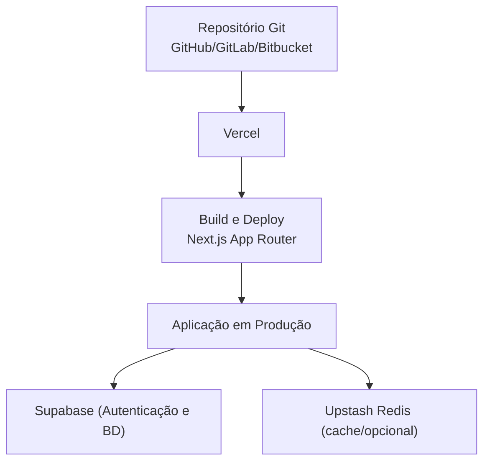
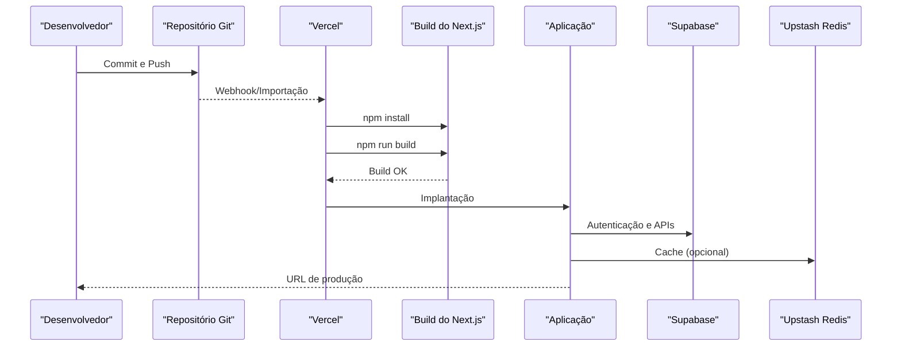
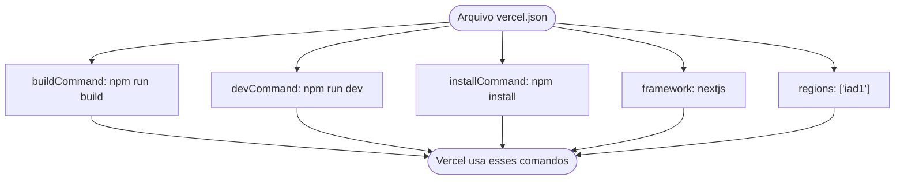
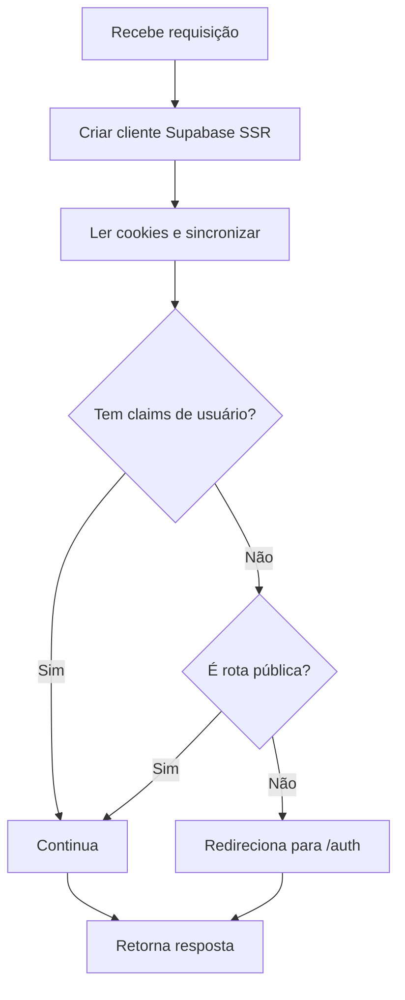
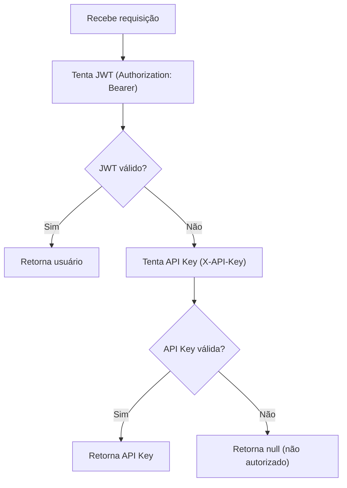
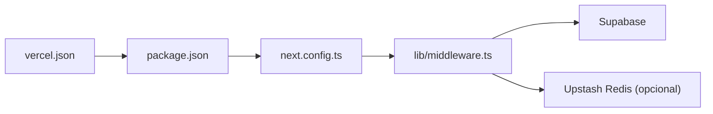

# Deploy na Vercel

<cite>
**Arquivos Referenciados neste Documento**
- [vercel.json](file://vercel.json)
- [package.json](file://package.json)
- [next.config.ts](file://next.config.ts)
- [README.md](file://README.md)
- [docs/DEPLOY.md](file://docs/DEPLOY.md)
- [docs/ENV_VARIABLES.md](file://docs/ENV_VARIABLES.md)
- [docs/UPSTASH_REDIS_SETUP.md](file://docs/UPSTASH_REDIS_SETUP.md)
- [lib/middleware.ts](file://lib/middleware.ts)
- [backend/auth/middleware.ts](file://backend/auth/middleware.ts)
</cite>

## Sumário
- Introdução
- Estrutura do Projeto
- Componentes-Chave
- Visão Geral da Arquitetura
- Análise Detalhada dos Componentes
- Análise de Dependências
- Considerações de Desempenho
- Guia de Deploy Passo a Passo
- Configuração de Domínio Customizado
- Variáveis de Ambiente por Ambiente
- Logs de Build e Diagnóstico
- Dicas de Otimização e Integração com Git
- Conclusão

## Introdução
Este guia apresenta um roteiro prático e detalhado para fazer o deploy do projeto Área do Aluno na Vercel. Ele cobre pré-requisitos, configuração automática do Next.js, ajustes manuais, significado de cada campo em vercel.json, configuração de variáveis de ambiente (Production, Preview, Development), domínio customizado, verificação pós-deploy, dicas de desempenho e integração com Git, além de exemplos de logs de build e como interpretá-los.

## Estrutura do Projeto
O projeto é um frontend Next.js com API Routes e backend modularizado em serviços. A configuração de deploy é simplificada com vercel.json e scripts do package.json. O middleware gerencia autenticação em rotas protegidas.

**Diagrama fonte**
- [vercel.json](file://vercel.json#L1-L9)
- [package.json](file://package.json#L1-L113)
- [next.config.ts](file://next.config.ts#L1-L12)
- [lib/middleware.ts](file://lib/middleware.ts#L1-L78)
- [backend/auth/middleware.ts](file://backend/auth/middleware.ts#L1-L193)

**Fontes da seção**
- [README.md](file://README.md#L261-L271)
- [docs/DEPLOY.md](file://docs/DEPLOY.md#L1-L191)

## Componentes-Chave
- vercel.json: define comandos de build/dev, framework e região.
- package.json: scripts do Next.js e dependências.
- next.config.ts: configurações do Next.js (SSR).
- lib/middleware.ts: middleware de autenticação com Supabase SSR.
- backend/auth/middleware.ts: middleware de autenticação baseada em JWT e API Key.
- docs/DEPLOY.md: orientações oficiais de deploy.
- docs/ENV_VARIABLES.md: variáveis de ambiente obrigatórias e recomendadas.
- docs/UPSTASH_REDIS_SETUP.md: configuração do Upstash Redis.

**Fontes da seção**
- [vercel.json](file://vercel.json#L1-L9)
- [package.json](file://package.json#L1-L113)
- [next.config.ts](file://next.config.ts#L1-L12)
- [lib/middleware.ts](file://lib/middleware.ts#L1-L78)
- [backend/auth/middleware.ts](file://backend/auth/middleware.ts#L1-L193)
- [docs/DEPLOY.md](file://docs/DEPLOY.md#L1-L191)
- [docs/ENV_VARIABLES.md](file://docs/ENV_VARIABLES.md#L1-L138)
- [docs/UPSTASH_REDIS_SETUP.md](file://docs/UPSTASH_REDIS_SETUP.md#L1-L178)

## Visão Geral da Arquitetura
O fluxo de deploy envolve a Vercel ler o repositório, detectar o Next.js, executar os scripts de instalação e build, e implantar a aplicação. O middleware garante autenticação em rotas protegidas, enquanto o Supabase e Upstash Redis fornecem backend e cache.

**Diagrama fonte**
- [docs/DEPLOY.md](file://docs/DEPLOY.md#L1-L191)
- [vercel.json](file://vercel.json#L1-L9)
- [package.json](file://package.json#L1-L113)
- [lib/middleware.ts](file://lib/middleware.ts#L1-L78)
- [backend/auth/middleware.ts](file://backend/auth/middleware.ts#L1-L193)

## Análise Detalhada dos Componentes

### vercel.json
- buildCommand: comando de build usado pela Vercel.
- devCommand: comando de desenvolvimento.
- installCommand: comando de instalação de dependências.
- framework: framework detectado automaticamente (Next.js).
- regions: região de implantação (ex: iad1).

**Fontes da seção**
- [vercel.json](file://vercel.json#L1-L9)
- [docs/DEPLOY.md](file://docs/DEPLOY.md#L56-L65)

### package.json
- Scripts: dev, build, start, lint.
- Dependências: Next.js, Supabase, Upstash Redis, React, Tailwind, etc.

**Fontes da seção**
- [package.json](file://package.json#L1-L113)

### next.config.ts
- Configurações gerais do Next.js.
- Output: undefined permite SSR padrão no Vercel.

**Fontes da seção**
- [next.config.ts](file://next.config.ts#L1-L12)

### Middleware de Autenticação (lib/middleware.ts)
- Cria cliente Supabase SSR.
- Lê cookies e sincroniza com a resposta.
- Redireciona para login se não autenticado e rota não pública.

**Fontes da seção**
- [lib/middleware.ts](file://lib/middleware.ts#L1-L78)

### Middleware de Autenticação Baseada em JWT e API Key (backend/auth/middleware.ts)
- Tenta autenticar via Authorization Bearer.
- Caso falhe, tenta via X-API-Key.
- Fornece funções utilitárias para exigir autenticação e papéis.

**Fontes da seção**
- [backend/auth/middleware.ts](file://backend/auth/middleware.ts#L1-L193)

## Análise de Dependências
- Vercel depende de vercel.json e scripts do package.json.
- Next.js SSR é configurado em next.config.ts.
- Autenticação depende de Supabase (variáveis de ambiente).
- Redis (opcional) melhora desempenho e funcionalidade em serverless.

**Diagrama fonte**
- [vercel.json](file://vercel.json#L1-L9)
- [package.json](file://package.json#L1-L113)
- [next.config.ts](file://next.config.ts#L1-L12)
- [lib/middleware.ts](file://lib/middleware.ts#L1-L78)
- [docs/ENV_VARIABLES.md](file://docs/ENV_VARIABLES.md#L1-L138)
- [docs/UPSTASH_REDIS_SETUP.md](file://docs/UPSTASH_REDIS_SETUP.md#L1-L178)

**Fontes da seção**
- [docs/DEPLOY.md](file://docs/DEPLOY.md#L1-L191)
- [docs/ENV_VARIABLES.md](file://docs/ENV_VARIABLES.md#L1-L138)
- [docs/UPSTASH_REDIS_SETUP.md](file://docs/UPSTASH_REDIS_SETUP.md#L1-L178)

## Considerações de Desempenho
- SSR padrão no Vercel: mantenha output como undefined (Next.js decide).
- Use Upstash Redis para cache e streaming de chat em ambientes serverless.
- Evite fallback em memória em produção (não funciona em múltiplas instâncias).
- Configure região próxima ao público-alvo (ex: iad1).

**Fontes da seção**
- [next.config.ts](file://next.config.ts#L1-L12)
- [docs/UPSTASH_REDIS_SETUP.md](file://docs/UPSTASH_REDIS_SETUP.md#L1-L178)
- [docs/DEPLOY.md](file://docs/DEPLOY.md#L98-L101)

## Guia de Deploy Passo a Passo

### Pré-requisitos
- Conta Vercel.
- Repositório Git (GitHub/GitLab/Bitbucket).
- Projeto Supabase configurado.
- Instância Upstash Redis (opcional, mas recomendado).

**Fontes da seção**
- [docs/DEPLOY.md](file://docs/DEPLOY.md#L5-L11)

### Conectar o repositório
- Importe o repositório na Vercel.
- A Vercel detectará automaticamente Next.js.

**Fontes da seção**
- [docs/DEPLOY.md](file://docs/DEPLOY.md#L24-L30)

### Configuração automática do Next.js
- Framework Preset: Next.js.
- Build Command: npm run build.
- Output Directory: .next.
- Install Command: npm install.

**Fontes da seção**
- [docs/DEPLOY.md](file://docs/DEPLOY.md#L56-L65)
- [vercel.json](file://vercel.json#L1-L9)
- [package.json](file://package.json#L1-L113)

### Ajustes manuais
- vercel.json: campos já configurados (buildCommand, devCommand, installCommand, framework, regions).
- next.config.ts: mantenha output como undefined (SSR).
- Middleware: verifique que as variáveis de ambiente estejam corretas.

**Fontes da seção**
- [vercel.json](file://vercel.json#L1-L9)
- [next.config.ts](file://next.config.ts#L1-L12)
- [lib/middleware.ts](file://lib/middleware.ts#L1-L78)

### Configuração de variáveis de ambiente
- Supabase (cliente):
  - NEXT_PUBLIC_SUPABASE_URL
  - NEXT_PUBLIC_SUPABASE_PUBLISHABLE_OR_ANON_KEY
- Supabase (servidor):
  - SUPABASE_URL
  - SUPABASE_SECRET_KEY
- Upstash Redis (opcional):
  - UPSTASH_REDIS_REST_URL
  - UPSTASH_REDIS_REST_TOKEN

**Fontes da seção**
- [docs/ENV_VARIABLES.md](file://docs/ENV_VARIABLES.md#L1-L138)
- [docs/DEPLOY.md](file://docs/DEPLOY.md#L31-L55)

### Variáveis de ambiente por ambiente
- Production, Preview (branches e PRs), Development (local).
- Configure em Settings > Environment Variables.

**Fontes da seção**
- [docs/DEPLOY.md](file://docs/DEPLOY.md#L89-L97)

### Domínio customizado
- Settings > Domains.
- Adicione e siga as instruções de DNS.

**Fontes da seção**
- [docs/DEPLOY.md](file://docs/DEPLOY.md#L83-L88)

### Verificação pós-deploy
- A aplicação carrega corretamente.
- Autenticação funciona.
- Rotas de API respondem.
- Redis funcionando (se configurado).

**Fontes da seção**
- [docs/DEPLOY.md](file://docs/DEPLOY.md#L72-L80)

## Logs de Build e Diagnóstico

### Exemplos de logs de build
- Build iniciado com npm install.
- Build com npm run build.
- Deploy bem-sucedido com URL de produção.

**Fontes da seção**
- [docs/DEPLOY.md](file://docs/DEPLOY.md#L56-L71)

### Como interpretar os logs
- Environment variables not found: verifique variáveis de ambiente.
- Build failed: verifique dependências e erros de TypeScript/lint.
- Problemas com autenticação: confirme URLs do Supabase.
- Problemas com Redis: verifique UPSTASH_REDIS_REST_URL e UPSTASH_REDIS_REST_TOKEN.

**Fontes da seção**
- [docs/DEPLOY.md](file://docs/DEPLOY.md#L122-L144)

## Dicas de Otimização e Integração com Git
- Garanta que o repositório esteja com todos os arquivos commitados e push realizado.
- Mantenha o .env local fora do repositório (.gitignore).
- Use variáveis de ambiente na Vercel para valores sensíveis.
- Configure CORS no Supabase e utilize HTTPS (automaticamente fornecido pela Vercel).
- Em produção, configure Upstash Redis e defina região adequada.

**Fontes da seção**
- [docs/DEPLOY.md](file://docs/DEPLOY.md#L1-L191)
- [docs/ENV_VARIABLES.md](file://docs/ENV_VARIABLES.md#L82-L100)
- [docs/UPSTASH_REDIS_SETUP.md](file://docs/UPSTASH_REDIS_SETUP.md#L1-L178)

## Conclusão
O deploy do Área do Aluno na Vercel é simplificado com vercel.json e scripts do Next.js. Com as variáveis de ambiente corretas, Supabase configurado e Upstash Redis (recomendado), você obtém uma implantação segura e escalável. Siga o guia, verifique os logs e aplique as dicas de desempenho e segurança.