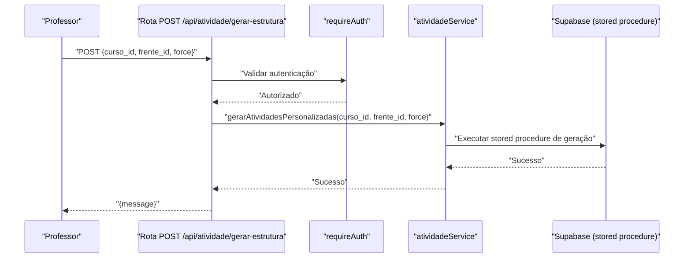
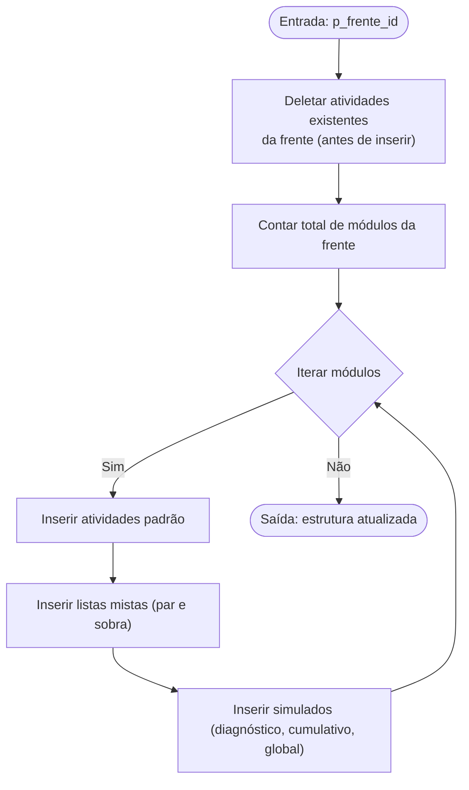

# Correção de Duplicação de Atividades

<cite>
**Arquivos Referenciados neste Documento**
- [docs/CORRECAO_DUPLICACAO_ATIVIDADES.md](file://docs/CORRECAO_DUPLICACAO_ATIVIDADES.md)
- [supabase/migrations/20250131_create_atividades_tables.sql](file://supabase/migrations/20250131_create_atividades_tables.sql)
- [supabase/migrations/20250201_update_gerar_atividades_padrao_delete_existing.sql](file://supabase/migrations/20250201_update_gerar_atividades_padrao_delete_existing.sql)
- [supabase/migrations/20250605_create_regras_atividades.sql](file://supabase/migrations/20250605_create_regras_atividades.sql)
- [app/api/atividade/gerar-estrutura/route.ts](file://app/api/atividade/gerar-estrutura/route.ts)
- [backend/services/atividade/atividade.service.ts](file://backend/services/atividade/atividade.service.ts)
- [docs/RELATORIO_TESTES_SISTEMATICOS.md](file://docs/RELATORIO_TESTES_SISTEMATICOS.md)
- [docs/TESTES_IMPLEMENTACAO_SALA_ESTUDOS.md](file://docs/TESTES_IMPLEMENTACAO_SALA_ESTUDOS.md)
</cite>

## Sumário
Este documento detalha a correção da duplicação de atividades no sistema Área do Aluno. Ele explica o problema identificado com a stored procedure de geração automática de atividades, a solução implementada (exclusão das atividades existentes antes de criar novas), o impacto positivo (eliminação de duplicatas e preservação do progresso), e os testes realizados para validar a correção. Também apresenta boas práticas de versionamento de migrations e estratégias de rollback seguras.

## Introdução
O problema ocorria quando o professor gerava novamente a estrutura de atividades para uma frente. A stored procedure original criava novas atividades sem remover as existentes, resultando em duplicação. Isso comprometia a integridade dos dados e gerava confusão na interface do aluno ao exibir atividades repetidas.

## Problema
- A stored procedure original gerava atividades padrão para cada módulo da frente, mas não removia atividades pré-existentes.
- Ao executar a geração múltiplas vezes, novas linhas eram inseridas sem apagar as anteriores, causando duplicação.
- Isso afetava a experiência do aluno e podia levar a inconsistências nos cálculos de progresso.

**Fonte do problema**
- Implementação original da stored procedure de geração automática de atividades.

**Seção fonte**
- [supabase/migrations/20250131_create_atividades_tables.sql](file://supabase/migrations/20250131_create_atividades_tables.sql#L144-L257)

## Solução Implementada
A solução foi modificar a stored procedure para deletar atividades existentes da frente antes de criar novas, preservando o progresso dos alunos mantendo intacta a tabela de progresso.

- Adicionada instrução de exclusão de atividades cujo módulo pertence à frente informada.
- A exclusão é feita antes da inserção, garantindo que não haja duplicação ao reexecutar a geração.
- O progresso antigo permanece armazenado (não deletamos a tabela de progresso), mas fica temporariamente “órfão” (sem atividade vinculada). Isso é aceitável pois o professor recria a estrutura com novas atividades e novos IDs, e o progresso antigo pode ser reconquistado pelas novas atividades.

**Trecho SQL da migration que implementa a lógica de DELETE antes do INSERT**
- [supabase/migrations/20250201_update_gerar_atividades_padrao_delete_existing.sql](file://supabase/migrations/20250201_update_gerar_atividades_padrao_delete_existing.sql#L1-L70)

**Seção fonte**
- [docs/CORRECAO_DUPLICACAO_ATIVIDADES.md](file://docs/CORRECAO_DUPLICACAO_ATIVIDADES.md#L1-L112)

## Fluxo Atualizado
- Antes: ao gerar estrutura novamente, atividades duplicadas eram criadas.
- Depois: a procedure deleta atividades existentes da frente antes de inserir novas, garantindo substituição e consistência.

**Seção fonte**
- [docs/CORRECAO_DUPLICACAO_ATIVIDADES.md](file://docs/CORRECAO_DUPLICACAO_ATIVIDADES.md#L56-L94)

## Impacto Positivo
- Tabela de atividades: sem duplicação, substituição correta ao regerar.
- Tabela de progresso: preservada, com progresso antigo mantido (mesmo que temporariamente órfão).
- Experiência do aluno: interface consistente entre frontend e backend, sem atividades duplicadas.

**Seção fonte**
- [docs/CORRECAO_DUPLICACAO_ATIVIDADES.md](file://docs/CORRECAO_DUPLICACAO_ATIVIDADES.md#L80-L112)

## Testes Realizados
Os testes validaram a correção e a manutenção da integridade dos dados:

- Primeira geração de estrutura: atividades criadas corretamente.
- Segunda geração de estrutura: substituição sem duplicação.
- Verificação de consistência: nenhuma atividade duplicada após múltiplas execuções.
- Preservação do progresso: dados antigos mantidos, mesmo que temporariamente órfãos.

**Seção fonte**
- [docs/CORRECAO_DUPLICACAO_ATIVIDADES.md](file://docs/CORRECAO_DUPLICACAO_ATIVIDADES.md#L99-L112)

## Sequência de Chamada da Geração de Estrutura
O fluxo de geração de atividades personalizadas (que também depende da stored procedure) segue:

- Requisição HTTP POST para a rota de geração de estrutura.
- Middleware de autenticação.
- Serviço de atividade que chama a stored procedure.
- Atualização de cache dos módulos afetados.

**Diagrama fonte**
- [app/api/atividade/gerar-estrutura/route.ts](file://app/api/atividade/gerar-estrutura/route.ts#L1-L57)
- [backend/services/atividade/atividade.service.ts](file://backend/services/atividade/atividade.service.ts#L179-L259)

**Seção fonte**
- [app/api/atividade/gerar-estrutura/route.ts](file://app/api/atividade/gerar-estrutura/route.ts#L1-L57)
- [backend/services/atividade/atividade.service.ts](file://backend/services/atividade/atividade.service.ts#L179-L259)

## Estrutura da Stored Procedure Corrigida
A stored procedure atualizada deleta atividades existentes antes de inserir novas, mantendo a mesma lógica de geração padrão.

**Diagrama fonte**
- [supabase/migrations/20250201_update_gerar_atividades_padrao_delete_existing.sql](file://supabase/migrations/20250201_update_gerar_atividades_padrao_delete_existing.sql#L1-L70)

**Seção fonte**
- [supabase/migrations/20250201_update_gerar_atividades_padrao_delete_existing.sql](file://supabase/migrations/20250201_update_gerar_atividades_padrao_delete_existing.sql#L1-L70)

## Boas Práticas de Versionamento de Migrations e Rollback
Boas práticas aplicadas e recomendadas com base no código:

- Separar a lógica de remoção e inserção em migrations distintas:
  - Migration inicial cria as tabelas e a stored procedure original.
  - Migration de atualização adiciona o DELETE antes do INSERT.
  - Migration subsequente (regras de atividades) remove funções antigas e tabelas relacionadas, mantendo a nova lógica.
- Manter rollback seguro:
  - Utilizar DROP FUNCTION e DROP TABLE com condições (IF EXISTS) para evitar falhas em ambientes de produção.
  - Garantir que o rollback não cause perdas irreversíveis de dados críticos (no caso, preservar a tabela de progresso).
- Documentar claramente as mudanças:
  - A documentação oficial da correção descreve os motivos, a solução e os impactos.

**Seção fonte**
- [supabase/migrations/20250131_create_atividades_tables.sql](file://supabase/migrations/20250131_create_atividades_tables.sql#L144-L257)
- [supabase/migrations/20250201_update_gerar_atividades_padrao_delete_existing.sql](file://supabase/migrations/20250201_update_gerar_atividades_padrao_delete_existing.sql#L1-L70)
- [supabase/migrations/20250605_create_regras_atividades.sql](file://supabase/migrations/20250605_create_regras_atividades.sql#L1-L33)
- [docs/CORRECAO_DUPLICACAO_ATIVIDADES.md](file://docs/CORRECAO_DUPLICACAO_ATIVIDADES.md#L1-L112)

## Conclusão
A correção eliminou a duplicação de atividades ao deletar registros existentes antes de gerar novas, mantendo intactos os dados de progresso dos alunos. A implementação foi validada com testes sistemáticos e a stored procedure atualizada garante consistência entre frontend e backend. As boas práticas de versionamento e rollback protegem a integridade dos dados durante a evolução do sistema.