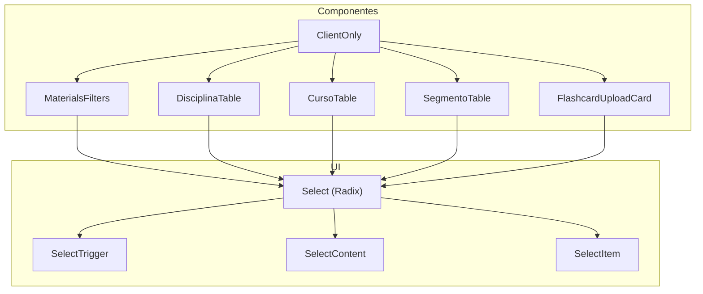
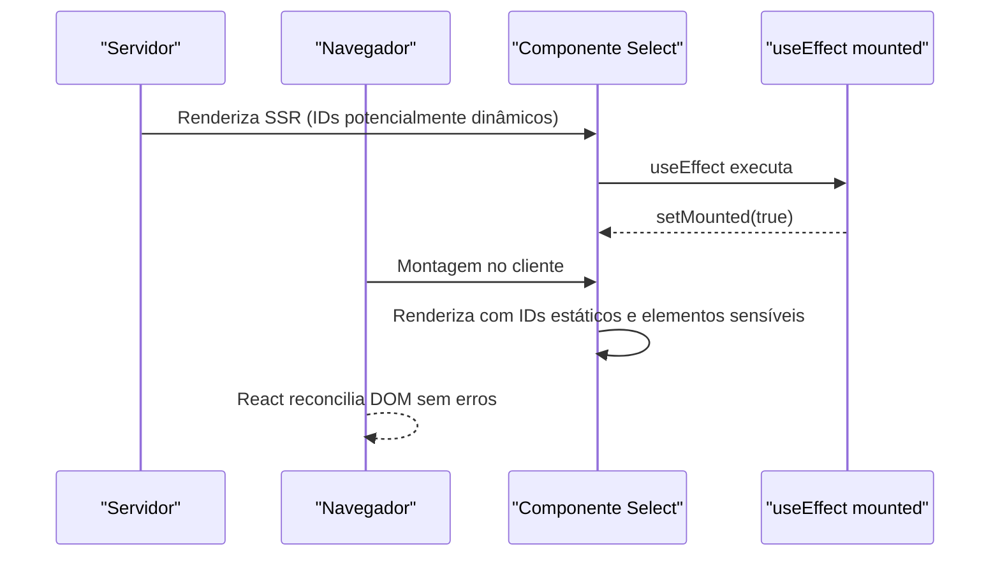
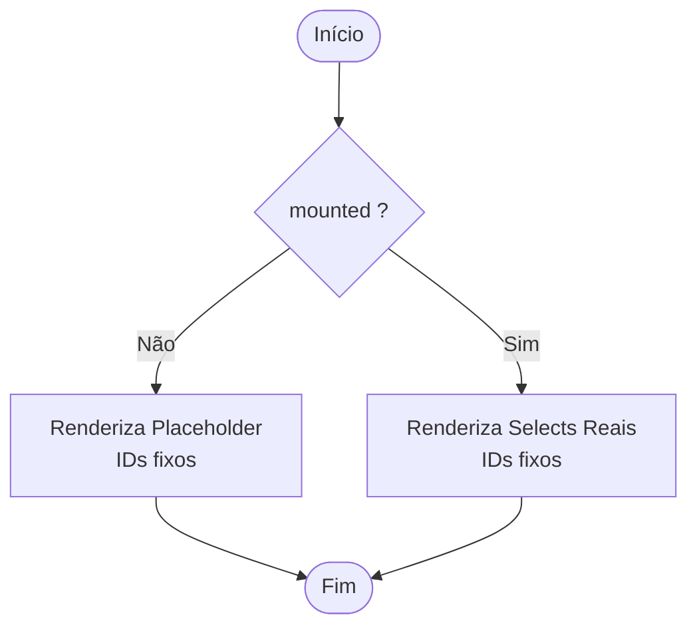
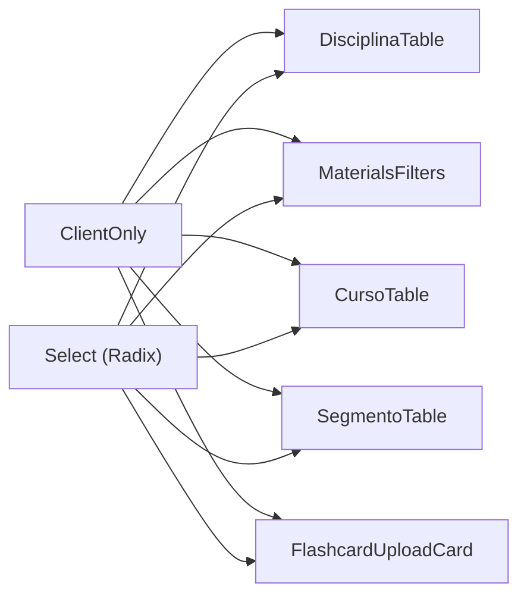

# Correção de Hidratação do React no Select

<cite>
**Arquivos Referenciados Neste Documento**
- [components/ui/select.tsx](file://components/ui/select.tsx)
- [components/client-only.tsx](file://components/client-only.tsx)
- [components/materials-filters.tsx](file://components/materials-filters.tsx)
- [components/disciplina-table.tsx](file://components/disciplina-table.tsx)
- [components/curso-table.tsx](file://components/curso-table.tsx)
- [components/segmento-table.tsx](file://components/segmento-table.tsx)
- [components/flashcard-upload-card.tsx](file://components/flashcard-upload-card.tsx)
- [docs/CORRECOES_APLICADAS.md](file://docs/CORRECOES_APLICADAS.md)
</cite>

## Índice
1. [Introdução](#introdução)
2. [Estrutura do Projeto](#estrutura-do-projeto)
3. [Componentes-Chave](#componentes-chave)
4. [Visão Geral da Arquitetura](#visão-geral-da-arquitetura)
5. [Análise Detalhada dos Componentes](#análise-detalhada-dos-componentes)
6. [Análise de Dependências](#análise-de-dependências)
7. [Considerações de Desempenho](#considerações-de-desempenho)
8. [Guia de Solução de Problemas](#guia-de-solução-de-problemas)
9. [Conclusão](#conclusão)

## Introdução
Este documento apresenta uma solução completa para o erro de hidratação do React em componentes que utilizam o Select, com foco em como inconsistências entre o conteúdo renderizado no servidor (SSR) e no cliente — causadas pela geração de IDs dinâmicos — levam à falha da reconciliação do React e quebras na interface. A abordagem adotada consiste em:
- Implementar uma renderização condicional baseada em um estado “mounted” que evita a renderização de elementos sensíveis até o cliente estar pronto.
- Garantir que IDs usados nos componentes Select sejam estáticos e previsíveis, evitando diferenças entre SSR e cliente.
- Aplicar essas práticas em componentes críticos, especialmente em tabelas dinâmicas como disciplina-table.

## Estrutura do Projeto
O projeto utiliza o Next.js App Router com componentes compartilhados e lógica de UI reutilizável. Os componentes Select são construídos com base em Radix UI e encapsulados em um pacote de UI local. A maioria dos componentes que dependem de APIs do navegador ou de IDs dinâmicos implementa a técnica de “mounted” para evitar erros de hidratação.

**Diagrama fontes**
- [components/ui/select.tsx](file://components/ui/select.tsx#L1-L168)
- [components/materials-filters.tsx](file://components/materials-filters.tsx#L1-L196)
- [components/disciplina-table.tsx](file://components/disciplina-table.tsx#L1-L669)
- [components/curso-table.tsx](file://components/curso-table.tsx#L1-L800)
- [components/segmento-table.tsx](file://components/segmento-table.tsx#L1-L724)
- [components/flashcard-upload-card.tsx](file://components/flashcard-upload-card.tsx#L1-L737)
- [components/client-only.tsx](file://components/client-only.tsx#L1-L19)

**Seção fontes**
- [components/ui/select.tsx](file://components/ui/select.tsx#L1-L168)
- [components/client-only.tsx](file://components/client-only.tsx#L1-L19)

## Componentes-Chave
- Select (Radix UI): Componente base do Select com Trigger, Content e Item.
- ClientOnly: Wrapper que espera a montagem no cliente antes de renderizar filhos.
- MaterialsFilters: Demonstração de uso de IDs estáticos e renderização condicional com mounted.
- DisciplinaTable, CursoTable, SegmentoTable, FlashcardUploadCard: Exemplos de tabelas e formulários que utilizam Select e aplicam a técnica de mounted.

**Seção fontes**
- [components/ui/select.tsx](file://components/ui/select.tsx#L1-L168)
- [components/client-only.tsx](file://components/client-only.tsx#L1-L19)
- [components/materials-filters.tsx](file://components/materials-filters.tsx#L1-L196)
- [components/disciplina-table.tsx](file://components/disciplina-table.tsx#L1-L669)
- [components/curso-table.tsx](file://components/curso-table.tsx#L1-L800)
- [components/segmento-table.tsx](file://components/segmento-table.tsx#L1-L724)
- [components/flashcard-upload-card.tsx](file://components/flashcard-upload-card.tsx#L1-L737)

## Visão Geral da Arquitetura
A solução se baseia em dois pilares:
- Renderização condicional com mounted: Evita que partes do DOM que dependem de APIs do navegador ou que geram IDs dinâmicos sejam renderizadas durante SSR.
- IDs estáticos: Garante que elementos como labels e triggers tenham IDs fixos, evitando divergência entre SSR e cliente.

**Diagrama fontes**
- [components/materials-filters.tsx](file://components/materials-filters.tsx#L60-L110)
- [components/disciplina-table.tsx](file://components/disciplina-table.tsx#L95-L115)
- [components/curso-table.tsx](file://components/curso-table.tsx#L148-L170)
- [components/segmento-table.tsx](file://components/segmento-table.tsx#L95-L115)
- [components/flashcard-upload-card.tsx](file://components/flashcard-upload-card.tsx#L55-L75)

## Análise Detalhada dos Componentes

### Select (Radix UI)
- Implementação: O componente Select é uma camada em torno de @radix-ui/react-select, com Trigger, Content e Item.
- Observação: O Select gera IDs internos automaticamente. Para evitar erros de hidratação, é necessário garantir que os IDs externos (labels, triggers) sejam estáticos e que a renderização ocorra somente no cliente.

**Seção fontes**
- [components/ui/select.tsx](file://components/ui/select.tsx#L1-L168)

### ClientOnly
- Propósito: Wrapper que espera a montagem no cliente (useEffect) para renderizar seus filhos.
- Uso: Ideal para componentes que dependem de APIs do navegador ou que geram IDs dinâmicos.

**Seção fontes**
- [components/client-only.tsx](file://components/client-only.tsx#L1-L19)

### MaterialsFilters
- IDs estáticos: Define constantes de IDs fixos para os selects de curso, disciplina e frente.
- Renderização condicional: Utiliza mounted para renderizar um placeholder durante SSR e o componente real após a montagem.
- Impacto: Elimina erros de hidratação relacionados a IDs dinâmicos e ações do DOM.

**Diagrama fontes**
- [components/materials-filters.tsx](file://components/materials-filters.tsx#L1-L196)

**Seção fontes**
- [components/materials-filters.tsx](file://components/materials-filters.tsx#L1-L196)

### DisciplinaTable
- mounted: Estado de montagem usado para controlar a renderização de diálogos e outros elementos sensíveis.
- Condição de renderização: A maioria dos elementos que dependem de APIs do navegador só aparece após mounted.

**Seção fontes**
- [components/disciplina-table.tsx](file://components/disciplina-table.tsx#L90-L120)

### CursoTable
- mounted: Mesmo padrão de mounted para evitar erros de hidratação em elementos que dependem de APIs do navegador.
- Selects: Utiliza Select em formulários com valores e estados controlados.

**Seção fontes**
- [components/curso-table.tsx](file://components/curso-table.tsx#L140-L170)

### SegmentoTable
- mounted: Aplica a mesma técnica de renderização condicional.
- Selects: Em formulários, os selects são renderizados somente após a montagem.

**Seção fontes**
- [components/segmento-table.tsx](file://components/segmento-table.tsx#L90-L120)

### FlashcardUploadCard
- IDs estáticos: Define IDs fixos para os selects de curso, disciplina e frente.
- Renderização condicional: Usa mounted para exibir um placeholder durante SSR e o formulário real após a montagem.
- Benefício: Garante que os IDs sejam consistentes entre SSR e cliente, evitando erros de hidratação.

**Seção fontes**
- [components/flashcard-upload-card.tsx](file://components/flashcard-upload-card.tsx#L1-L737)

## Análise de Dependências
- ClientOnly é utilizado indiretamente pelos mesmos componentes que usam mounted, mas também pode ser empregado diretamente em casos onde há componentes que dependem de APIs do navegador.
- Select (Radix) é usado em diversos componentes. A chave para evitar erros de hidratação está em:
  - Garantir que IDs externos (labels, triggers) sejam estáticos.
  - Apenas renderizar elementos sensíveis após a montagem no cliente.

**Diagrama fontes**
- [components/client-only.tsx](file://components/client-only.tsx#L1-L19)
- [components/materials-filters.tsx](file://components/materials-filters.tsx#L1-L196)
- [components/disciplina-table.tsx](file://components/disciplina-table.tsx#L1-L669)
- [components/curso-table.tsx](file://components/curso-table.tsx#L1-L800)
- [components/segmento-table.tsx](file://components/segmento-table.tsx#L1-L724)
- [components/flashcard-upload-card.tsx](file://components/flashcard-upload-card.tsx#L1-L737)
- [components/ui/select.tsx](file://components/ui/select.tsx#L1-L168)

**Seção fontes**
- [components/client-only.tsx](file://components/client-only.tsx#L1-L19)
- [components/ui/select.tsx](file://components/ui/select.tsx#L1-L168)

## Considerações de Desempenho
- A técnica de mounted adiciona uma etapa de renderização condicional, mas evita erros de hidratação e re-renderizações desnecessárias após a montagem.
- Manter IDs estáticos reduz a complexidade de reconciliação e melhora a estabilidade da UI em tabelas dinâmicas.

[Sem fontes, pois esta seção oferece orientações gerais]

## Guia de Solução de Problemas
- Erro de hidratação com atributos como aria-controls inconsistentes:
  - Confirme que os IDs dos labels e triggers dos Selects sejam fixos e previsíveis.
  - Garanta que os componentes que dependem de APIs do navegador só sejam renderizados após a montagem no cliente.
  - Veja exemplo de correção documentada em:
    - [docs/CORRECOES_APLICADAS.md](file://docs/CORRECOES_APLICADAS.md#L50-L102)

**Seção fontes**
- [docs/CORRECOES_APLICADAS.md](file://docs/CORRECOES_APLICADAS.md#L50-L102)

## Conclusão
A correção do erro de hidratação no Select foi alcançada através de:
- Renderização condicional baseada em mounted, evitando que elementos sensíveis sejam renderizados durante SSR.
- Uso de IDs estáticos para labels e triggers dos Selects, garantindo consistência entre SSR e cliente.
- Aplicação dessas práticas em componentes críticos, como MaterialsFilters e as tabelas DisciplinaTable, CursoTable, SegmentoTable e FlashcardUploadCard.

Essas práticas aumentam a robustez da interface, especialmente em ambientes com Next.js App Router, onde SSR e client-side rendering coexistem.

[Sem fontes, pois esta seção resume sem análise específica de arquivos]