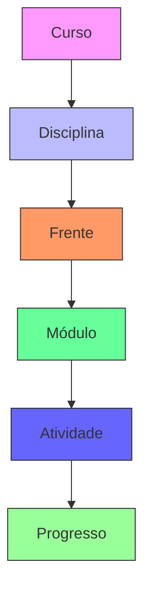
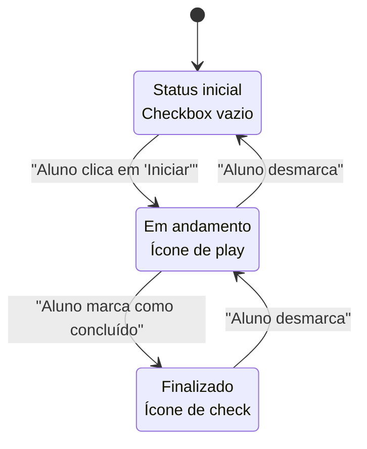
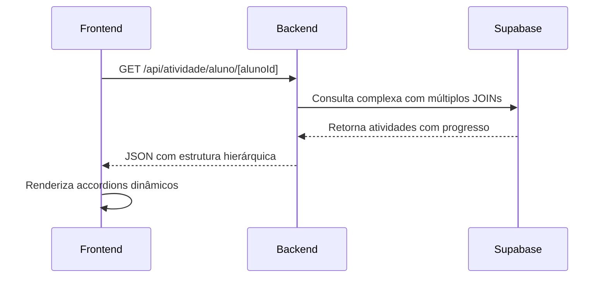

# Plano da Sala de Estudos

<cite>
**Arquivos Referenciados neste Documento**   
- [atividade.service.ts](file://backend/services/atividade/atividade.service.ts)
- [atividade.repository.ts](file://backend/services/atividade/atividade.repository.ts)
- [atividade.types.ts](file://backend/services/atividade/atividade.types.ts)
- [atividade.repository-helper.ts](file://backend/services/atividade/atividade.repository-helper.ts)
- [20250131_create_atividades_tables.sql](file://supabase/migrations/20250131_create_atividades_tables.sql)
- [PLANO_SALA_ESTUDOS.md](file://docs/PLANO_SALA_ESTUDOS.md)
- [LOGICA_COMPLETA_SALA_ESTUDOS.md](file://docs/LOGICA_COMPLETA_SALA_ESTUDOS.md)
- [sala-estudos-filters.tsx](file://components/sala-estudos-filters.tsx)
- [atividade-checklist-row.tsx](file://components/atividade-checklist-row.tsx)
- [modulo-activities-accordion.tsx](file://components/modulo-activities-accordion.tsx)
- [progresso-stats-card.tsx](file://components/progresso-stats-card.tsx)
- [sala-estudos-client.tsx](file://app/(dashboard)/aluno/sala-de-estudos/sala-estudos-client.tsx)
- [page.tsx](file://app/(dashboard)/aluno/sala-de-estudos/page.tsx)
- [types.ts](file://app/(dashboard)/aluno/sala-de-estudos/types.ts)
</cite>

## Sumário
1. [Introdução](#introdução)
2. [Arquitetura de Dados](#arquitetura-de-dados)
3. [Hierarquia de Aprendizado](#hierarquia-de-aprendizado)
4. [Fluxos de Progresso](#fluxos-de-progresso)
5. [Lógica de Ordenação Didática](#lógica-de-ordenação-didática)
6. [Integração Frontend-Backend](#integração-frontend-backend)
7. [Desafios Comuns e Soluções](#desafios-comuns-e-soluções)
8. [Orientações para Manutenção](#orientações-para-manutenção)
9. [Conclusão](#conclusão)

## Introdução

O Plano da Sala de Estudos é um sistema centralizado que organiza o aprendizado em uma hierarquia clara e estruturada: **Curso > Disciplina > Frente > Módulo > Atividade**. Este documento detalha a arquitetura, funcionalidades e integrações do sistema, com foco na experiência do aluno e na integridade dos dados. A Sala de Estudos permite que alunos visualizem, acompanhem e gerenciem seu progresso em atividades, enquanto professores têm visibilidade completa sobre todos os cursos. O sistema utiliza políticas de segurança de nível de linha (RLS) no Supabase para garantir que os alunos só acessem dados de cursos em que estão matriculados ativamente.

**Fontes da seção**
- [PLANO_SALA_ESTUDOS.md](file://docs/PLANO_SALA_ESTUDOS.md#11-objetivo)
- [LOGICA_COMPLETA_SALA_ESTUDOS.md](file://docs/LOGICA_COMPLETA_SALA_ESTUDOS.md#visão-geral)

## Arquitetura de Dados

A arquitetura de dados do sistema é baseada em uma estrutura relacional que reflete a hierarquia do aprendizado. As principais tabelas no Supabase são `atividades`, `progresso_atividades`, `modulos`, `frentes`, `disciplinas` e `cursos`. A tabela `atividades` armazena os materiais didáticos, enquanto `progresso_atividades` registra o status de cada atividade para cada aluno. A segurança é implementada através de políticas RLS, garantindo que alunos só possam ver e atualizar seu próprio progresso.

```mermaid
erDiagram
USER ||--o{ ENROLLMENT : "matricula"
ENROLLMENT }|--|| COURSE : "pertence_a"
COURSE ||--o{ COURSE_DISCIPLINE : "contém"
COURSE_DISCIPLINE }|--|| DISCIPLINE : "vinculada_a"
DISCIPLINE ||--o{ FRENTE : "dividida_em"
FRENTE ||--o{ MODULO : "composta_por"
MODULO ||--o{ ATIVIDADE : "possui"
ALUNO ||--o{ PROGRESSO_ATIVIDADE : "registra"
ATIVIDADE ||--o{ PROGRESSO_ATIVIDADE : "tem_progresso"
class USER "Aluno"
class ENROLLMENT "Matrícula"
class COURSE "Curso"
class COURSE_DISCIPLINE "Relacionamento Curso-Disciplina"
class DISCIPLINE "Disciplina"
class FRENTE "Frente"
class MODULO "Módulo"
class ATIVIDADE "Atividade"
class PROGRESSO_ATIVIDADE "Progresso da Atividade"
```

**Fontes do diagrama**
- [20250131_create_atividades_tables.sql](file://supabase/migrations/20250131_create_atividades_tables.sql)
- [PLANO_SALA_ESTUDOS.md](file://docs/PLANO_SALA_ESTUDOS.md#12-estrutura-de-dados)

### Estrutura de Tabelas

A tabela `atividades` é a entidade central do sistema, armazenando todos os materiais didáticos. Ela possui campos como `titulo`, `tipo`, `arquivo_url` e `ordem_exibicao`, além de uma chave estrangeira `modulo_id` que a vincula à tabela `modulos`. A tabela `progresso_atividades` registra o estado de cada atividade para cada aluno, com campos como `status`, `data_inicio` e `data_conclusao`. A chave primária composta `(aluno_id, atividade_id)` garante que cada aluno tenha apenas um registro de progresso por atividade.

```sql
-- Estrutura da tabela atividades
CREATE TABLE public.atividades (
    id UUID DEFAULT gen_random_uuid() PRIMARY KEY,
    modulo_id UUID REFERENCES public.modulos(id) ON DELETE CASCADE,
    tipo enum_tipo_atividade NOT NULL,
    titulo TEXT NOT NULL, 
    arquivo_url TEXT, 
    gabarito_url TEXT, 
    link_externo TEXT, 
    obrigatorio BOOLEAN DEFAULT TRUE,
    ordem_exibicao INTEGER DEFAULT 0,
    created_by UUID REFERENCES auth.users(id) ON DELETE SET NULL,
    created_at TIMESTAMP WITH TIME ZONE DEFAULT NOW(),
    updated_at TIMESTAMP WITH TIME ZONE DEFAULT NOW()
);

-- Estrutura da tabela progresso_atividades
CREATE TABLE public.progresso_atividades (
    id UUID DEFAULT gen_random_uuid() PRIMARY KEY,
    aluno_id UUID REFERENCES public.alunos(id) ON DELETE CASCADE,
    atividade_id UUID REFERENCES public.atividades(id) ON DELETE CASCADE,
    status enum_status_atividade DEFAULT 'Pendente',
    data_inicio TIMESTAMP WITH TIME ZONE,
    data_conclusao TIMESTAMP WITH TIME ZONE,
    questoes_totais INTEGER DEFAULT 0,
    questoes_acertos INTEGER DEFAULT 0,
    dificuldade_percebida enum_dificuldade_percebida,
    anotacoes_pessoais TEXT, 
    created_at TIMESTAMP WITH TIME ZONE DEFAULT NOW(),
    updated_at TIMESTAMP WITH TIME ZONE DEFAULT NOW(),
    UNIQUE(aluno_id, atividade_id)
);
```

**Fontes do diagrama**
- [20250131_create_atividades_tables.sql](file://supabase/migrations/20250131_create_atividades_tables.sql)

### Controle de Acesso com RLS

O controle de acesso é implementado através de políticas de segurança de nível de linha (RLS) no Supabase. As políticas garantem que os alunos só possam acessar dados relevantes para suas matrículas ativas. A política `Aluno vê seu progresso` permite que um aluno selecione apenas seus próprios registros em `progresso_atividades`, enquanto a política `Aluno atualiza seu progresso` permite inserções e atualizações apenas quando o `aluno_id` corresponde ao ID do usuário autenticado. Isso elimina a necessidade de validações manuais no backend, aumentando a segurança e a integridade dos dados.

```sql
-- Políticas RLS para progresso_atividades
CREATE POLICY "Aluno vê seu progresso" ON public.progresso_atividades FOR SELECT USING (auth.uid() = aluno_id);
CREATE POLICY "Aluno atualiza seu progresso" ON public.progresso_atividades FOR INSERT WITH CHECK (auth.uid() = aluno_id);
CREATE POLICY "Aluno edita seu progresso" ON public.progresso_atividades FOR UPDATE USING (auth.uid() = aluno_id);
```

**Fontes da seção**
- [20250131_create_atividades_tables.sql](file://supabase/migrations/20250131_create_atividades_tables.sql#120-141)
- [LOGICA_COMPLETA_SALA_ESTUDOS.md](file://docs/LOGICA_COMPLETA_SALA_ESTUDOS.md#segurança-rls)

## Hierarquia de Aprendizado

A hierarquia de aprendizado é a estrutura fundamental do sistema, organizando o conteúdo em níveis lógicos: **Curso > Disciplina > Frente > Módulo > Atividade**. Essa estrutura permite uma navegação intuitiva e uma organização clara do conteúdo. Cada nível da hierarquia é representado por uma tabela no banco de dados, com relacionamentos definidos por chaves estrangeiras. A hierarquia é mantida durante todo o fluxo de dados, desde a consulta no banco até a renderização no frontend.



**Fontes do diagrama**
- [PLANO_SALA_ESTUDOS.md](file://docs/PLANO_SALA_ESTUDOS.md#12-estrutura-de-dados)
- [LOGICA_COMPLETA_SALA_ESTUDOS.md](file://docs/LOGICA_COMPLETA_SALA_ESTUDOS.md#hierarquia-completa)

### Relacionamentos entre Entidades

Os relacionamentos entre as entidades são definidos por chaves estrangeiras e tabelas de junção. A tabela `cursos_disciplinas` é uma tabela de junção que relaciona cursos a disciplinas, permitindo que uma disciplina pertença a múltiplos cursos. A tabela `alunos_cursos` armazena as matrículas dos alunos, com um campo `ativo` que indica se a matrícula está ativa. Essa estrutura permite uma flexibilidade significativa, permitindo que o mesmo conteúdo (disciplinas, frentes, módulos) seja reutilizado em diferentes cursos.

**Fontes da seção**
- [LOGICA_COMPLETA_SALA_ESTUDOS.md](file://docs/LOGICA_COMPLETA_SALA_ESTUDOS.md#hierarquia-completa)
- [PLANO_SALA_ESTUDOS.md](file://docs/PLANO_SALA_ESTUDOS.md#12-estrutura-de-dados)

## Fluxos de Progresso

O sistema de progresso permite que os alunos marquem o status de cada atividade como **Pendente**, **Iniciado** ou **Concluído**. Esses estados são armazenados na tabela `progresso_atividades` e são atualizados através de chamadas à API. O fluxo de progresso é projetado para ser intuitivo e responsivo, com atualizações otimistas na interface do usuário para fornecer feedback imediato.



**Fontes do diagrama**
- [PLANO_SALA_ESTUDOS.md](file://docs/PLANO_SALA_ESTUDOS.md#41-carregar-atividades)
- [atividade.types.ts](file://backend/services/atividade/atividade.types.ts#49-67)

### Atualização de Status

A atualização de status é realizada através da API `/api/progresso-atividade/[id]` com o método `PATCH`. Quando um aluno clica no checkbox de uma atividade, o frontend determina o novo status e faz uma chamada à API. Se o status for `Concluído`, o sistema pode abrir um modal para coletar dados de desempenho, como número de acertos e dificuldade percebida. O frontend utiliza atualização otimista, atualizando a interface imediatamente antes da resposta do servidor, melhorando a experiência do usuário.

**Fontes da seção**
- [PLANO_SALA_ESTUDOS.md](file://docs/PLANO_SALA_ESTUDOS.md#43-marcar-como-concluído)
- [atividade-checklist-row.tsx](file://components/atividade-checklist-row.tsx#55-119)

## Lógica de Ordenação Didática

A ordenação didática é crucial para garantir que o conteúdo seja apresentado na sequência correta. O sistema utiliza a função `COALESCE` em consultas SQL para garantir que valores nulos sejam tratados corretamente, colocando-os no final da ordenação. Os módulos são ordenados por `numero_modulo` e as atividades por `ordem_exibicao`, ambos em ordem ascendente. Essa lógica é aplicada tanto no backend quanto no frontend para garantir consistência.

```sql
SELECT 
  a.*,
  m.nome as modulo_nome,
  m.numero_modulo,
  f.nome as frente_nome,
  d.nome as disciplina_nome,
  c.nome as curso_nome,
  pa.status,
  pa.data_inicio,
  pa.data_conclusao
FROM atividades a
JOIN modulos m ON a.modulo_id = m.id
JOIN frentes f ON m.frente_id = f.id
JOIN disciplinas d ON f.disciplina_id = d.id
JOIN cursos_disciplinas cd ON d.id = cd.disciplina_id
JOIN cursos c ON cd.curso_id = c.id
JOIN matriculas mat ON c.id = mat.curso_id
LEFT JOIN progresso_atividades pa ON a.id = pa.atividade_id AND pa.aluno_id = :aluno_id
WHERE mat.aluno_id = :aluno_id
  AND mat.ativo = true
ORDER BY 
  c.nome ASC,
  d.nome ASC,
  f.nome ASC,
  COALESCE(m.numero_modulo, 0) ASC,
  COALESCE(a.ordem_exibicao, 0) ASC
```

**Fontes da seção**
- [PLANO_SALA_ESTUDOS.md](file://docs/PLANO_SALA_ESTUDOS.md#534-ordenação-didática-rigorosa)
- [LOGICA_COMPLETA_SALA_ESTUDOS.md](file://docs/LOGICA_COMPLETA_SALA_ESTUDOS.md#ordenação-didática)

## Integração Frontend-Backend

A integração entre frontend e backend é realizada através de chamadas à API RESTful. O frontend, construído com React e Next.js, consome dados do backend, que é implementado com Supabase. A chamada principal é feita para a rota `/api/atividade/aluno/[alunoId]`, que retorna todas as atividades do aluno com seu progresso, organizadas na hierarquia completa.



**Fontes do diagrama**
- [PLANO_SALA_ESTUDOS.md](file://docs/PLANO_SALA_ESTUDOS.md#213-api-routes)
- [LOGICA_COMPLETA_SALA_ESTUDOS.md](file://docs/LOGICA_COMPLETA_SALA_ESTUDOS.md#carregamento-de-atividades-query-complexa)

### Componentes do Frontend

Os principais componentes do frontend são `sala-estudos-filters.tsx`, `atividade-checklist-row.tsx`, `modulo-activities-accordion.tsx` e `progresso-stats-card.tsx`. O componente `sala-estudos-filters` permite que o aluno filtre as atividades por curso, disciplina e frente. O `atividade-checklist-row` exibe uma atividade com seu status e botões de ação. O `modulo-activities-accordion` agrupa as atividades por módulo em um accordion, e o `progresso-stats-card` mostra estatísticas de progresso.

**Fontes da seção**
- [sala-estudos-filters.tsx](file://components/sala-estudos-filters.tsx)
- [atividade-checklist-row.tsx](file://components/atividade-checklist-row.tsx)
- [modulo-activities-accordion.tsx](file://components/modulo-activities-accordion.tsx)
- [progresso-stats-card.tsx](file://components/progresso-stats-card.tsx)

## Desafios Comuns e Soluções

### Inconsistências de Hierarquia

Inconsistências na hierarquia podem ocorrer se um módulo não estiver vinculado corretamente a uma frente, ou se uma frente não estiver vinculada a uma disciplina. A solução é garantir que todas as operações de criação e atualização validem os relacionamentos. O backend deve verificar a existência das entidades pai antes de criar uma entidade filha.

**Fontes da seção**
- [atividade.service.ts](file://backend/services/atividade/atividade.service.ts#50-69)

### Problemas de Cache

Problemas de cache podem ocorrer quando uma atividade é criada ou atualizada, mas o cache não é invalidado. A solução é invalidar o cache do módulo sempre que uma atividade for modificada. O serviço `activityCacheService` é responsável por essa invalidação.

```typescript
// Invalidar cache do módulo após atualização
await activityCacheService.invalidateModulo(existing.moduloId);
```

**Fontes da seção**
- [atividade.service.ts](file://backend/services/atividade/atividade.service.ts#67)

## Orientações para Manutenção

### Atualização de Atividades

Ao atualizar uma atividade, é crucial garantir que o cache do módulo seja invalidado para que as mudanças sejam refletidas imediatamente na interface do usuário. Isso é feito automaticamente pelo serviço `AtividadeService` ao chamar `invalidateModulo`.

**Fontes da seção**
- [atividade.service.ts](file://backend/services/atividade/atividade.service.ts#97)

### Adição de Novos Tipos de Atividade

Para adicionar um novo tipo de atividade, é necessário atualizar o enum `TipoAtividade` no arquivo `atividade.types.ts` e garantir que o frontend trate o novo tipo corretamente. Além disso, pode ser necessário atualizar a função `atividadeRequerDesempenho` para definir se o novo tipo requer um modal de desempenho.

**Fontes da seção**
- [atividade.types.ts](file://backend/services/atividade/atividade.types.ts#1-12)

## Conclusão

O Plano da Sala de Estudos é um sistema robusto e bem estruturado que organiza o aprendizado em uma hierarquia clara e intuitiva. A integração entre frontend e backend é eficiente, e o uso de RLS no Supabase garante a segurança dos dados. A documentação detalhada dos fluxos, da arquitetura de dados e dos desafios comuns fornece uma base sólida para a manutenção e evolução do sistema.