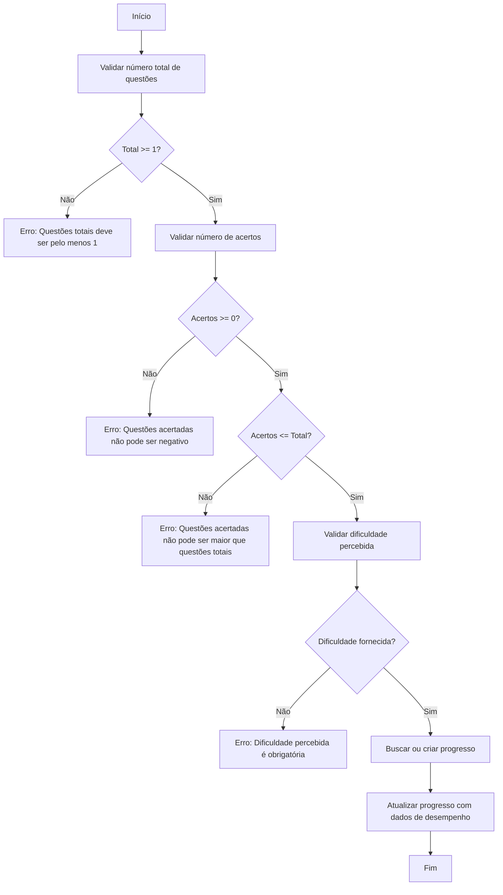
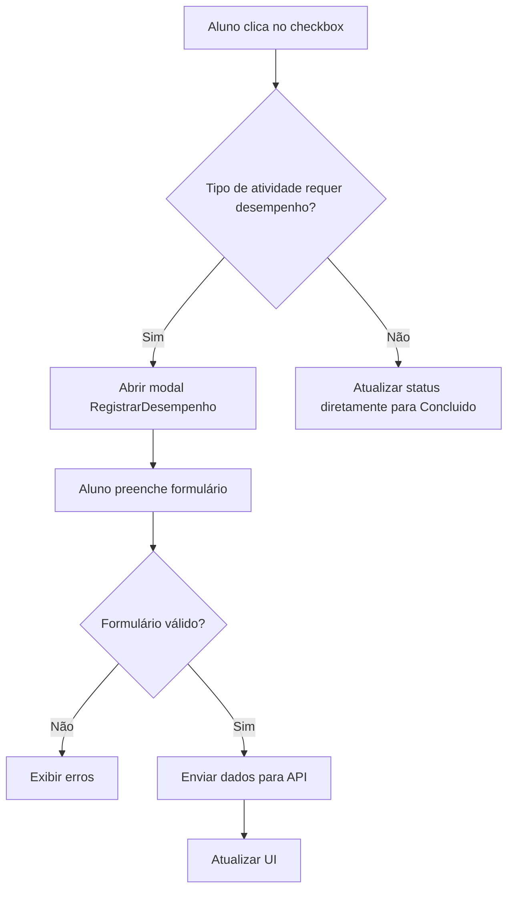

# Plano do Check Qualificado

<cite>
**Arquivos Referenciados neste Documento**   
- [PLANO_CHECK_QUALIFICADO.md](file://docs/PLANO_CHECK_QUALIFICADO.md)
- [CORRECAO_CONCEITUARIO_CHECK_QUALIFICADO.md](file://docs/CORRECAO_CONCEITUARIO_CHECK_QUALIFICADO.md)
- [IMPLEMENTACAO_BACKEND_CHECK_QUALIFICADO.md](file://docs/IMPLEMENTACAO_BACKEND_CHECK_QUALIFICADO.md)
- [IMPLEMENTACAO_FRONTEND_CHECK_QUALIFICADO.md](file://docs/IMPLEMENTACAO_FRONTEND_CHECK_QUALIFICADO.md)
- [progresso-atividade.types.ts](file://backend/services/progresso-atividade/progresso-atividade.types.ts)
- [progresso-atividade.service.ts](file://backend/services/progresso-atividade/progresso-atividade.service.ts)
- [progresso-atividade.repository.ts](file://backend/services/progresso-atividade/progresso-atividade.repository.ts)
- [20250131_create_atividades_tables.sql](file://supabase/migrations/20250131_create_atividades_tables.sql)
- [atividade.types.ts](file://backend/services/atividade/atividade.types.ts)
- [sala-estudos-client.tsx](file://app/(dashboard)/aluno/sala-de-estudos/sala-estudos-client.tsx)
- [registrar-desempenho-modal.tsx](file://components/registrar-desempenho-modal.tsx)
- [atividade-checklist-row.tsx](file://components/atividade-checklist-row.tsx)
- [route.ts](file://app/api/progresso-atividade/atividade/[atividadeId]/route.ts)
- [atividade.repository-helper.ts](file://backend/services/atividade/atividade.repository-helper.ts)
</cite>

## Sumário
1. [Introdução](#introdução)
2. [Modelagem de Dados](#modelagem-de-dados)
3. [Lógica de Validação no Backend](#lógica-de-validação-no-backend)
4. [Renderização no Frontend](#renderização-no-frontend)
5. [Exemplos de Requisições à API](#exemplos-de-requisições-à-api)
6. [Decisões Técnicas](#decisões-técnicas)
7. [Casos de Uso e Problemas Potenciais](#casos-de-uso-e-problemas-potenciais)
8. [Orientações para Implementação](#orientações-para-implementação)
9. [Conclusão](#conclusão)

## Introdução

O Plano do Check Qualificado introduz uma distinção fundamental entre dois tipos de atividades no sistema: **checks simples** e **checks qualificados**. Essa diferenciação permite uma coleta mais rica de dados de desempenho do aluno, especialmente em atividades que envolvem exercícios, simulados e outros formatos que exigem avaliação quantitativa.

Os **checks simples** são usados para atividades como "Conceituario" e "Revisao", onde a conclusão é marcada diretamente sem a necessidade de registrar métricas detalhadas. Já os **checks qualificados** são obrigatórios para atividades como "Exercícios", "Simulados", "Flashcards" e outros tipos que requerem o preenchimento de dados de desempenho, como número de questões, acertos e nível de dificuldade percebida.

Este documento detalha a implementação completa do sistema, abrangendo a modelagem de dados, lógica de validação, renderização no frontend, integração com a API e decisões técnicas que sustentam essa funcionalidade.

**Seção fontes**
- [PLANO_CHECK_QUALIFICADO.md](file://docs/PLANO_CHECK_QUALIFICADO.md#L1-L602)

## Modelagem de Dados

A modelagem de dados para o Check Qualificado é baseada na tabela `progresso_atividades`, que armazena o estado e o desempenho do aluno em cada atividade. A tabela foi projetada para suportar tanto checks simples quanto qualificados, com campos opcionais para métricas detalhadas.

### Estrutura da Tabela `progresso_atividades`

A tabela `progresso_atividades` é definida no script de migração `20250131_create_atividades_tables.sql` e contém os seguintes campos:

- **id**: UUID único da entidade.
- **aluno_id**: Referência ao aluno (chave estrangeira para `alunos.id`).
- **atividade_id**: Referência à atividade (chave estrangeira para `atividades.id`).
- **status**: Status da atividade, definido pelo enum `enum_status_atividade` (`Pendente`, `Iniciado`, `Concluido`).
- **data_inicio**: Timestamp da data de início da atividade.
- **data_conclusao**: Timestamp da data de conclusão da atividade.
- **questoes_totais**: Número total de questões (padrão: 0).
- **questoes_acertos**: Número de questões acertadas (padrão: 0).
- **dificuldade_percebida**: Nível de dificuldade percebido pelo aluno, definido pelo enum `enum_dificuldade_percebida` (`Muito Facil`, `Facil`, `Medio`, `Dificil`, `Muito Dificil`).
- **anotacoes_pessoais**: Campo de texto para anotações pessoais do aluno.
- **created_at** e **updated_at**: Timestamps de criação e atualização.

A tabela possui uma restrição de unicidade composta por `aluno_id` e `atividade_id`, garantindo que cada aluno tenha apenas um registro de progresso por atividade.

### Tipos TypeScript

No backend, os tipos são definidos no arquivo `progresso-atividade.types.ts`. A interface `ProgressoAtividade` reflete diretamente a estrutura da tabela:

```typescript
export interface ProgressoAtividade {
  id: string;
  alunoId: string;
  atividadeId: string;
  status: StatusAtividade;
  dataInicio: Date | null;
  dataConclusao: Date | null;
  questoesTotais: number;
  questoesAcertos: number;
  dificuldadePercebida: DificuldadePercebida | null;
  anotacoesPessoais: string | null;
  createdAt: Date;
  updatedAt: Date;
}
```

Além disso, são definidos tipos para operações de criação e atualização (`CreateProgressoInput` e `UpdateProgressoInput`), permitindo que campos opcionais sejam omitidos durante as operações.

### Enumeradores

Os enumeradores `enum_status_atividade` e `enum_dificuldade_percebida` são definidos diretamente no banco de dados, garantindo consistência e validação no nível do schema. Isso evita valores inválidos e facilita a manutenção.

**Seção fontes**
- [20250131_create_atividades_tables.sql](file://supabase/migrations/20250131_create_atividades_tables.sql#L1-L257)
- [progresso-atividade.types.ts](file://backend/services/progresso-atividade/progresso-atividade.types.ts#L1-L49)

## Lógica de Validação no Backend

A lógica de validação no backend é implementada no serviço `progresso-atividade`, garantindo que os dados de desempenho sejam consistentes e válidos antes de serem persistidos.

### Serviço `ProgressoAtividadeService`

O serviço `ProgressoAtividadeService` contém métodos específicos para lidar com checks qualificados. O método mais importante é `marcarComoConcluidoComDesempenho`, que valida e registra o desempenho do aluno ao concluir uma atividade.



**Fontes do diagrama**
- [progresso-atividade.service.ts](file://backend/services/progresso-atividade/progresso-atividade.service.ts#L84-L129)

### Validações Implementadas

As validações realizadas no método `marcarComoConcluidoComDesempenho` são:

1. **Questões totais**: Deve ser pelo menos 1.
2. **Questões acertadas**: Não pode ser negativo e não pode exceder o número total de questões.
3. **Dificuldade percebida**: É obrigatória e deve ser um valor válido do enum.
4. **Consistência de datas**: Se `dataConclusao` for fornecida, ela deve ser posterior a `dataInicio`.

Essas validações são executadas antes de qualquer operação no banco de dados, garantindo que apenas dados válidos sejam armazenados.

### Camada de Repositório

A camada de repositório (`ProgressoAtividadeRepositoryImpl`) é responsável por mapear os dados entre o formato do banco de dados e as interfaces TypeScript. O método `findOrCreateProgresso` garante que um registro de progresso exista antes de atualizá-lo, criando um novo se necessário.

**Seção fontes**
- [progresso-atividade.service.ts](file://backend/services/progresso-atividade/progresso-atividade.service.ts#L1-L166)
- [progresso-atividade.repository.ts](file://backend/services/progresso-atividade/progresso-atividade.repository.ts#L1-L184)

## Renderização no Frontend

A renderização no frontend é controlada pelo tipo de atividade, determinando se um check simples ou qualificado deve ser aplicado.

### Componente `AtividadeChecklistRow`

O componente `AtividadeChecklistRow` é responsável por renderizar cada atividade na lista. Ele utiliza a função `atividadeRequerDesempenho` para decidir o comportamento ao marcar uma atividade como concluída.



**Fontes do diagrama**
- [atividade-checklist-row.tsx](file://components/atividade-checklist-row.tsx#L1-L322)

### Modal `RegistrarDesempenhoModal`

O modal `RegistrarDesempenhoModal` é exibido para atividades que requerem desempenho. Ele contém um formulário com os seguintes campos:

- **Questões Totais**: Campo numérico obrigatório, mínimo 1.
- **Questões Acertadas**: Campo numérico obrigatório, mínimo 0, máximo igual ao total.
- **Dificuldade Percebida**: Select com opções do enum.
- **Anotações Pessoais**: Campo de texto opcional.

O modal realiza validações em tempo real e exibe mensagens de erro inline. A taxa de acerto é calculada automaticamente e exibida ao usuário.

### Visualização de Métricas

Após a conclusão de uma atividade com check qualificado, a UI exibe badges com as métricas registradas:

- **Badge de acertos**: Mostra o formato "Acertos: X/Y".
- **Badge de dificuldade**: Mostra o nível de dificuldade com uma cor contextual (verde para fácil, vermelho para difícil, etc.).
- **Ícone de anotações**: Exibe um ícone que, ao ser hoverado, mostra as anotações do aluno em um tooltip.

**Seção fontes**
- [registrar-desempenho-modal.tsx](file://components/registrar-desempenho-modal.tsx#L1-L279)
- [atividade-checklist-row.tsx](file://components/atividade-checklist-row.tsx#L1-L322)

## Exemplos de Requisições à API

A API para registro de progresso está disponível em `PATCH /api/progresso-atividade/atividade/{atividadeId}`. Ela suporta dois fluxos: check simples e check qualificado.

### Requisição de Check Qualificado

Para registrar uma atividade com desempenho, envie um PATCH com o corpo contendo o status e o objeto `desempenho`:

```http
PATCH /api/progresso-atividade/atividade/123e4567-e89b-12d3-a456-426614174000
Content-Type: application/json
Authorization: Bearer {token}

{
  "status": "Concluido",
  "desempenho": {
    "questoesTotais": 10,
    "questoesAcertos": 8,
    "dificuldadePercebida": "Medio",
    "anotacoesPessoais": "Preciso revisar a teoria sobre direitos humanos."
  }
}
```

### Requisição de Check Simples

Para atividades que não requerem desempenho, envie apenas o status:

```http
PATCH /api/progresso-atividade/atividade/123e4567-e89b-12d3-a456-426614174001
Content-Type: application/json
Authorization: Bearer {token}

{
  "status": "Concluido"
}
```

### Resposta da API

Em caso de sucesso, a API retorna o objeto de progresso atualizado:

```json
{
  "data": {
    "id": "uuid",
    "alunoId": "uuid",
    "atividadeId": "uuid",
    "status": "Concluido",
    "dataInicio": "2025-01-30T10:00:00Z",
    "dataConclusao": "2025-01-31T10:30:00Z",
    "questoesTotais": 10,
    "questoesAcertos": 8,
    "dificuldadePercebida": "Medio",
    "anotacoesPessoais": "Preciso revisar a teoria sobre direitos humanos.",
    "createdAt": "...",
    "updatedAt": "..."
  }
}
```

Em caso de erro, a API retorna um código 400 com uma mensagem descritiva, como "Questões acertadas não pode ser maior que questões totais".

**Seção fontes**
- [route.ts](file://app/api/progresso-atividade/atividade/[atividadeId]/route.ts#L1-L125)

## Decisões Técnicas

Várias decisões técnicas foram tomadas para garantir a robustez e escalabilidade do sistema.

### Tipos Customizados no TypeScript

O uso de tipos customizados, como `StatusAtividade` e `DificuldadePercebida`, garante que o código seja tipado de forma segura. Isso previne erros em tempo de execução e melhora a experiência de desenvolvimento com autocomplete e verificação de tipo.

### Validação no Serviço

A validação é realizada no serviço `progresso-atividade`, não no repositório. Isso permite que a camada de serviço contenha a lógica de negócio, enquanto o repositório se concentra apenas nas operações de banco de dados. Essa separação de responsabilidades facilita testes e manutenção.

### Função Helper `atividadeRequerDesempenho`

A função `atividadeRequerDesempenho` é definida no serviço `atividade` e é usada tanto no frontend quanto no backend. Isso garante consistência na lógica de negócios. A função foi atualizada para incluir `Conceituario` como atividade que requer desempenho, conforme documentado em `CORRECAO_CONCEITUARIO_CHECK_QUALIFICADO.md`.

### Paginação de Consultas

Na consulta de progresso no frontend, as atividades são divididas em lotes de 100 IDs para evitar URLs muito longas. Isso é implementado em `sala-estudos-client.tsx` e é crucial para a performance com um grande número de atividades.

**Seção fontes**
- [atividade.types.ts](file://backend/services/atividade/atividade.types.ts#L1-L76)
- [sala-estudos-client.tsx](file://app/(dashboard)/aluno/sala-de-estudos/sala-estudos-client.tsx#L1-L800)
- [atividade.repository-helper.ts](file://backend/services/atividade/atividade.repository-helper.ts#L1-L282)

## Casos de Uso e Problemas Potenciais

### Casos de Uso Comuns

1. **Aluno conclui um simulado**: O aluno clica no checkbox, o sistema detecta que é um check qualificado, abre o modal, o aluno preenche os dados e clica em "Salvar e Concluir". O sistema registra o desempenho e atualiza a UI com os badges.
2. **Aluno revisa um conceitual**: O aluno clica no checkbox, o sistema detecta que é um check simples e atualiza o status diretamente.

### Problemas Potenciais

1. **Inconsistência de Dados**: Se o frontend não validar corretamente, dados inválidos podem ser enviados para a API. Isso é mitigado pela validação no backend.
2. **Desempenho com Muitas Atividades**: A consulta de progresso pode ser lenta se houver milhares de atividades. A paginação em lotes ajuda, mas pode ser necessário implementar cache.
3. **Concorrência**: Se o aluno tentar concluir a mesma atividade duas vezes simultaneamente, pode ocorrer um conflito. O uso de transações no banco de dados pode resolver isso.

### Estratégias de Resolução

- **Validação Dupla**: Validar no frontend para melhor UX e no backend para segurança.
- **Cache**: Implementar cache de progresso no frontend para reduzir chamadas à API.
- **Tratamento de Erros**: Mostrar mensagens claras ao usuário em caso de erro e permitir tentativas.

**Seção fontes**
- [PLANO_CHECK_QUALIFICADO.md](file://docs/PLANO_CHECK_QUALIFICADO.md#L1-L602)
- [CORRECAO_CONCEITUARIO_CHECK_QUALIFICADO.md](file://docs/CORRECAO_CONCEITUARIO_CHECK_QUALIFICADO.md#L1-L83)

## Orientações para Implementação

Para implementar novos tipos de check qualificado, siga estas orientações:

1. **Adicionar ao Enum**: Atualize o enum `enum_tipo_atividade` no banco de dados e no tipo `TipoAtividade` no backend.
2. **Atualizar a Função Helper**: A função `atividadeRequerDesempenho` já retorna `true` para qualquer tipo que não seja `Revisao`, então novos tipos serão automaticamente tratados como checks qualificados.
3. **Testar a UI**: Verifique se o modal é exibido corretamente e se os dados são salvos e exibidos na UI.
4. **Documentar**: Atualize a documentação com o novo tipo de atividade.

**Seção fontes**
- [PLANO_CHECK_QUALIFICADO.md](file://docs/PLANO_CHECK_QUALIFICADO.md#L1-L602)

## Conclusão

O Plano do Check Qualificado foi implementado com sucesso, introduzindo uma distinção clara entre checks simples e qualificados. A modelagem de dados é robusta, com validações no backend e uma UI intuitiva no frontend. A arquitetura permite fácil extensão para novos tipos de atividades, e as decisões técnicas garantem consistência e escalabilidade. O sistema está pronto para coletar dados de desempenho ricos, proporcionando insights valiosos sobre o progresso dos alunos.

**Seção fontes**
- [PLANO_CHECK_QUALIFICADO.md](file://docs/PLANO_CHECK_QUALIFICADO.md#L1-L602)
- [IMPLEMENTACAO_BACKEND_CHECK_QUALIFICADO.md](file://docs/IMPLEMENTACAO_BACKEND_CHECK_QUALIFICADO.md#L1-L286)
- [IMPLEMENTACAO_FRONTEND_CHECK_QUALIFICADO.md](file://docs/IMPLEMENTACAO_FRONTEND_CHECK_QUALIFICADO.md#L1-L375)