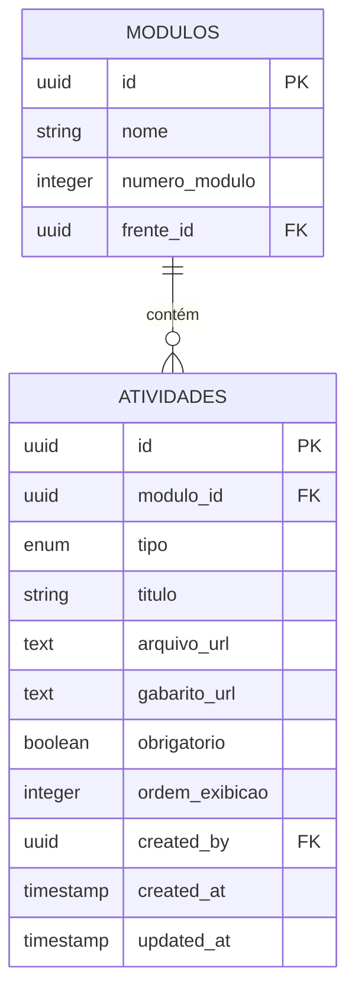
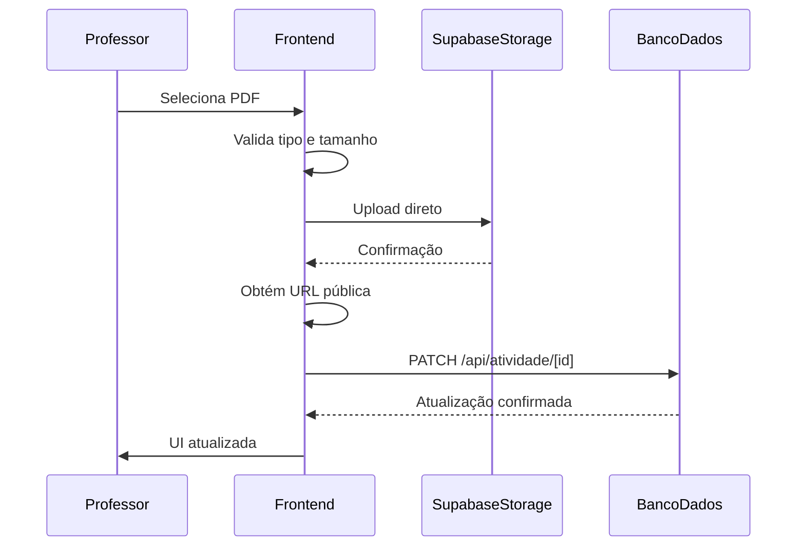

# Plano do Módulo de Materiais

<cite>
**Arquivos Referenciados neste Documento**  
- [PLANO_MODULO_MATERIAIS.md](file://docs/PLANO_MODULO_MATERIAIS.md)
- [MATERIAIS_DIDATICOS_BUCKET_SETUP.md](file://docs/MATERIAIS_DIDATICOS_BUCKET_SETUP.md)
- [N8N_EXTRACT_PDF_CONFIG.md](file://docs/N8N_EXTRACT_PDF_CONFIG.md)
- [activity-upload-row.tsx](file://components/activity-upload-row.tsx)
- [module-accordion.tsx](file://components/module-accordion.tsx)
- [materials-filters.tsx](file://components/materials-filters.tsx)
- [20250131_create_materiais_didaticos_bucket_policies.sql](file://supabase/migrations/20250131_create_materiais_didaticos_bucket_policies.sql)
- [atividade.types.ts](file://backend/services/atividade/atividade.types.ts)
- [types.ts](file://app/(dashboard)/admin/materiais/types.ts)
</cite>

## Sumário
1. [Introdução](#introdução)
2. [Fluxo de Importação de Materiais](#fluxo-de-importação-de-materiais)
3. [Estrutura de Atividades e Geração Automática](#estrutura-de-atividades-e-geração-automática)
4. [Upload de Arquivos ao Bucket do Supabase](#upload-de-arquivos-ao-bucket-do-supabase)
5. [Configuração de Políticas de Armazenamento (RLS)](#configuração-de-políticas-de-armazenamento-rls)
6. [Rotas API para Geração de Estrutura](#rotas-api-para-geração-de-estrutura)
7. [Triggers no Supabase](#triggers-no-supabase)
8. [Integração com N8N para Extração de Texto de PDFs](#integração-com-n8n-para-extração-de-texto-de-pdfs)
9. [Práticas Recomendadas para Organização de Materiais](#práticas-recomendadas-para-organização-de-materiais)
10. [Tratamento de Erros Comuns](#tratamento-de-erros-comuns)
11. [Extensão do Módulo com Novos Tipos de Conteúdo](#extensão-do-módulo-com-novos-tipos-de-conteúdo)

## Introdução

O Módulo de Materiais é uma funcionalidade central do sistema Área do Aluno, projetada para permitir que professores gerenciem conteúdos didáticos de forma estruturada, com upload direto de arquivos, geração automática de atividades e integração com ferramentas externas para processamento de conteúdo. Este documento detalha a arquitetura, fluxos de trabalho, configurações técnicas e boas práticas relacionadas à implementação e uso do módulo.

O sistema utiliza o Supabase como backend, aproveitando seus recursos de armazenamento, políticas de segurança (RLS) e funções armazenadas (RPCs) para garantir escalabilidade, segurança e eficiência no processamento de materiais educacionais.

**Seção fontes**
- [PLANO_MODULO_MATERIAIS.md](file://docs/PLANO_MODULO_MATERIAIS.md)

## Fluxo de Importação de Materiais

O fluxo de importação inicia-se com o upload de um arquivo PDF pelo professor na interface administrativa. Após o upload, o sistema gera automaticamente uma estrutura de atividades vinculada a módulos e frentes específicas, registrando os metadados no banco de dados e armazenando o arquivo no bucket `materiais_didaticos` do Supabase.

O processo completo envolve:
1. Seleção da disciplina, frente e módulo desejados.
2. Clique no botão "Gerar Estrutura", que dispara uma chamada à API.
3. Execução da função armazenada `gerar_atividades_padrao` no banco de dados.
4. Criação de registros na tabela `atividades` com base na frente selecionada.
5. Upload direto do arquivo ao bucket do Supabase via cliente frontend.
6. Atualização do campo `arquivo_url` no registro da atividade.

```mermaid
flowchart TD
A[Professor acessa /admin/materiais] --> B[Seleciona Disciplina, Frente e Módulo]
B --> C[Clica em "Gerar Estrutura"]
C --> D[Chama POST /api/atividade/gerar-estrutura]
D --> E[Executa RPC gerar_atividades_padrao]
E --> F[Cria registros em atividades]
F --> G[Interface exibe atividades]
G --> H[Professor faz upload de PDF]
H --> I[Upload direto ao bucket materiais_didaticos]
I --> J[Obtém URL pública]
J --> K[PATCH /api/atividade/[id] com URL]
K --> L[Atualiza arquivo_url no banco]
L --> M[Atividade marcada como concluída]
```

**Fontes do diagrama**
- [PLANO_MODULO_MATERIAIS.md](file://docs/PLANO_MODULO_MATERIAIS.md)
- [activity-upload-row.tsx](file://components/activity-upload-row.tsx)

**Seção fontes**
- [PLANO_MODULO_MATERIAIS.md](file://docs/PLANO_MODULO_MATERIAIS.md)
- [activity-upload-row.tsx](file://components/activity-upload-row.tsx)

## Estrutura de Atividades e Geração Automática

A geração automática de estrutura de atividades é baseada em uma função armazenada (`gerar_atividades_padrao`) que recebe o `frente_id` como parâmetro e cria um conjunto predefinido de atividades para cada módulo associado à frente.

Os tipos de atividades suportados incluem:
- Nível 1 a Nível 4
- Conceituário
- Lista Mista
- Simulados (Diagnóstico, Cumulativo, Global)
- Flashcards
- Revisão

Cada atividade é vinculada a um módulo e armazena metadados como título, tipo, obrigatoriedade e URLs de arquivo e gabarito.



**Fontes do diagrama**
- [PLANO_MODULO_MATERIAIS.md](file://docs/PLANO_MODULO_MATERIAIS.md)
- [atividade.types.ts](file://backend/services/atividade/atividade.types.ts)

**Seção fontes**
- [PLANO_MODULO_MATERIAIS.md](file://docs/PLANO_MODULO_MATERIAIS.md)
- [atividade.types.ts](file://backend/services/atividade/atividade.types.ts)

## Upload de Arquivos ao Bucket do Supabase

O upload de arquivos é realizado diretamente do frontend ao bucket `materiais_didaticos` no Supabase Storage, sem passar pelo servidor Next.js. Isso evita gargalos, limites de tamanho de corpo e sobrecarga no servidor.

O componente `ActivityUploadRow` implementa este fluxo com as seguintes etapas:
1. Validação do tipo de arquivo (apenas PDF).
2. Verificação do tamanho (máximo de 10MB).
3. Upload direto usando `supabase.storage.from('materiais_didaticos').upload()`.
4. Geração do caminho no formato `{atividade_id}/{timestamp}-{nome_original}.pdf`.
5. Chamada à API para atualizar o campo `arquivo_url`.



**Fontes do diagrama**
- [activity-upload-row.tsx](file://components/activity-upload-row.tsx)
- [MATERIAIS_DIDATICOS_BUCKET_SETUP.md](file://docs/MATERIAIS_DIDATICOS_BUCKET_SETUP.md)

**Seção fontes**
- [activity-upload-row.tsx](file://components/activity-upload-row.tsx)
- [MATERIAIS_DIDATICOS_BUCKET_SETUP.md](file://docs/MATERIAIS_DIDATICOS_BUCKET_SETUP.md)

## Configuração de Políticas de Armazenamento (RLS)

As políticas de segurança em linha (RLS) para o bucket `materiais_didaticos` são definidas na migration `20250131_create_materiais_didaticos_bucket_policies.sql` e garantem que:
- Apenas professores autenticados possam fazer upload, substituir ou remover arquivos.
- O público em geral possa ler arquivos (bucket público).
- Os arquivos sejam organizados em pastas por `atividade_id`.

As políticas implementadas são:
- **Professores podem fazer upload de materiais**: INSERT permitido para professores.
- **Leitura pública de materiais didáticos**: SELECT permitido para público.
- **Professores podem substituir materiais**: UPDATE permitido para professores.
- **Professores podem remover materiais**: DELETE permitido para professores.

```sql
-- Exemplo de política de leitura pública
CREATE POLICY "Leitura pública de materiais didáticos"
ON storage.objects
FOR SELECT
TO public
USING (bucket_id = 'materiais_didaticos'::text);
```

**Seção fontes**
- [20250131_create_materiais_didaticos_bucket_policies.sql](file://supabase/migrations/20250131_create_materiais_didaticos_bucket_policies.sql)

## Rotas API para Geração de Estrutura

As rotas API relacionadas ao módulo de materiais estão localizadas em `app/api/atividade/` e incluem:

- **GET `/api/atividade`**: Lista atividades com filtros por `modulo_id` ou `frente_id`.
- **PATCH `/api/atividade/[id]`**: Atualiza campos da atividade, especialmente `arquivo_url` após upload.
- **POST `/api/atividade/gerar-estrutura`**: Chama a função RPC `gerar_atividades_padrao` para criar a estrutura de atividades.

A rota de geração de estrutura espera um corpo com `frenteId` e é protegida por middleware de autenticação e autorização de professores.

**Seção fontes**
- [PLANO_MODULO_MATERIAIS.md](file://docs/PLANO_MODULO_MATERIAIS.md)

## Triggers no Supabase

Embora não haja triggers específicas documentadas para o módulo de materiais, o sistema utiliza funções armazenadas (RPCs) como `gerar_atividades_padrao` para gerar estruturas de atividades. Essas funções são chamadas explicitamente pela API e não por triggers de banco de dados.

A arquitetura evita o uso de triggers para manter o controle explícito sobre a geração de conteúdo e facilitar o debug e testes.

**Seção fontes**
- [PLANO_MODULO_MATERIAIS.md](file://docs/PLANO_MODULO_MATERIAIS.md)

## Integração com N8N para Extração de Texto de PDFs

O sistema integra-se com o N8N para extração de texto de PDFs anexados em conversas. A configuração correta é crítica para evitar erros comuns como "No password given".

### Configuração do Nó HTTP Request
- **Método**: GET
- **URL**: `{{ $json.attachments_metadata[0].url }}`
- **Response Format**: `File` (não JSON)

### Configuração do Nó Extract from PDF
- **Binary Property**: `data`
- **Password**: Deve estar **vazio** (não preencher)

### Fluxo Recomendado


**Fontes do diagrama**
- [N8N_EXTRACT_PDF_CONFIG.md](file://docs/N8N_EXTRACT_PDF_CONFIG.md)

**Seção fontes**
- [N8N_EXTRACT_PDF_CONFIG.md](file://docs/N8N_EXTRACT_PDF_CONFIG.md)

## Práticas Recomendadas para Organização de Materiais

- **Nomeação de Arquivos**: Use nomes descritivos e sem caracteres especiais.
- **Tamanho de Arquivos**: Mantenha abaixo de 10MB; divida PDFs grandes.
- **Estrutura de Conteúdo**: Organize por frente, módulo e tipo de atividade.
- **Atualizações**: Substitua arquivos apenas quando necessário, mantendo a URL consistente.
- **Acessibilidade**: Garanta que PDFs sejam legíveis por leitores de tela.

**Seção fontes**
- [MATERIAIS_DIDATICOS_BUCKET_SETUP.md](file://docs/MATERIAIS_DIDATICOS_BUCKET_SETUP.md)

## Tratamento de Erros Comuns

### Erro: "Bucket not found"
- **Causa**: Bucket não criado ou nome incorreto.
- **Solução**: Verifique se o bucket `materiais_didaticos` existe no Supabase.

### Erro: "Permission denied"
- **Causa**: Políticas RLS não aplicadas ou usuário não autenticado.
- **Solução**: Aplique a migration de políticas e verifique autenticação.

### Erro: "File too large"
- **Causa**: Arquivo excede 10MB.
- **Solução**: Reduza o tamanho ou divida o PDF.

### Erro: "No password given" no N8N
- **Causa**: Campo de senha preenchido incorretamente.
- **Solução**: Deixe o campo de senha vazio no nó "Extract from PDF".

**Seção fontes**
- [MATERIAIS_DIDATICOS_BUCKET_SETUP.md](file://docs/MATERIAIS_DIDATICOS_BUCKET_SETUP.md)
- [N8N_EXTRACT_PDF_CONFIG.md](file://docs/N8N_EXTRACT_PDF_CONFIG.md)

## Extensão do Módulo com Novos Tipos de Conteúdo

Para adicionar novos tipos de conteúdo:
1. Atualize o enum `TipoAtividade` nos arquivos de tipos.
2. Crie migrações de banco de dados se necessário.
3. Implemente lógica de serviço para o novo tipo.
4. Adicione suporte no frontend (componentes e rotas).
5. Atualize as políticas de armazenamento se novos buckets forem necessários.

A arquitetura é modular e permite extensões sem impacto nas funcionalidades existentes.

**Seção fontes**
- [atividade.types.ts](file://backend/services/atividade/atividade.types.ts)
- [types.ts](file://app/(dashboard)/admin/materiais/types.ts)