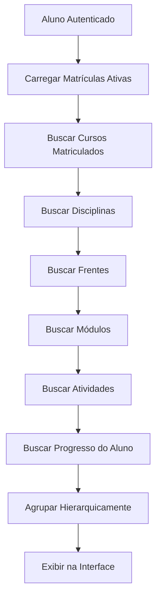
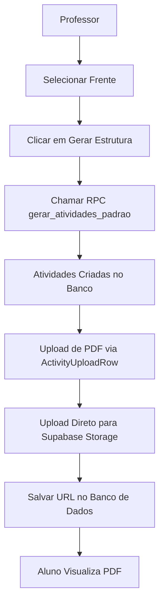
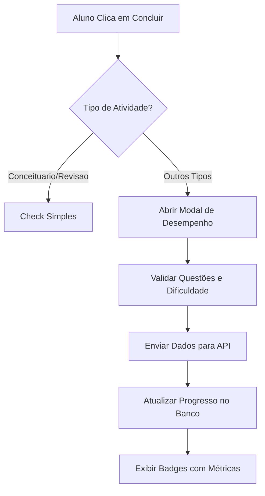

# Planos de Implementação

<cite>
**Arquivos Referenciados neste Documento**   
- [PLANO_SALA_ESTUDOS.md](file://docs/PLANO_SALA_ESTUDOS.md)
- [PLANO_MODULO_MATERIAIS.md](file://docs/PLANO_MODULO_MATERIAIS.md)
- [PLANO_CHECK_QUALIFICADO.md](file://docs/PLANO_CHECK_QUALIFICADO.md)
- [sala-estudos-client.tsx](file://app/(dashboard)/aluno/sala-de-estudos/sala-estudos-client.tsx)
- [atividade.service.ts](file://backend/services/atividade/atividade.service.ts)
- [progresso-atividade.service.ts](file://backend/services/progresso-atividade/progresso-atividade.service.ts)
- [course-structure-cache.service.ts](file://backend/services/cache/course-structure-cache.service.ts)
- [activity-upload-row.tsx](file://components/activity-upload-row.tsx)
- [supabase/migrations/20250131_create_materiais_didaticos_bucket_policies.sql](file://supabase/migrations/20250131_create_materiais_didaticos_bucket_policies.sql)
- [regras-atividade.service.ts](file://backend/services/regras-atividade/regras-atividade.service.ts)
</cite>

## Sumário
1. [Plano da Sala de Estudos](#plano-da-sala-de-estudos)
2. [Plano do Módulo de Materiais](#plano-do-módulo-de-materiais)
3. [Plano do Check Qualificado](#plano-do-check-qualificado)

## Plano da Sala de Estudos

O plano da Sala de Estudos define a estrutura hierárquica e os fluxos de progresso para o acompanhamento das atividades acadêmicas pelos alunos. A hierarquia é organizada como: Curso > Disciplina > Frente > Módulo > Atividade, garantindo uma navegação lógica e didática.

### Objetivos e Escopo
O objetivo principal é fornecer uma interface onde os alunos possam visualizar suas atividades, marcar o progresso (Pendente, Iniciado, Concluído) e acessar materiais em PDF. O escopo inclui a implementação completa do backend e frontend para suportar essa funcionalidade, com foco na integridade dos dados e na experiência do usuário.

### Dependências
As principais dependências são:
- Tabelas no banco de dados já criadas (`atividades`, `progresso_atividades`)
- Serviço de autenticação funcional
- Políticas RLS (Row Level Security) configuradas no Supabase para garantir que os alunos acessem apenas seus próprios dados

### Fases de Execução
A implementação foi dividida em fases:
1. **Backend - Camada de Serviço**: Implementação dos serviços de progresso de atividades e listagem de atividades por aluno
2. **Backend - Rotas da API**: Criação das rotas para obter e atualizar o progresso
3. **Frontend - Tipos e Componentes Base**: Definição de tipos TypeScript e criação de componentes como `AtividadeChecklistRow` e `ModuloActivitiesAccordion`
4. **Frontend - Página Principal**: Integração dos componentes na página da Sala de Estudos
5. **Testes e Ajustes**: Validação de todos os fluxos, incluindo filtros, visualização de PDFs e atualização de progresso

### Impacto no Sistema
A Sala de Estudos é um componente central do sistema, impactando diretamente a experiência do aluno. Sua implementação correta garante que os alunos possam acompanhar seu progresso de forma clara e estruturada, aumentando o engajamento e a eficácia do aprendizado.

### Decisões Técnicas
- **RLS no Supabase**: Utilizado para garantir que os alunos acessem apenas seus próprios dados de progresso, sem necessidade de lógica adicional no backend
- **Queries SQL com COALESCE**: Para ordenação rigorosa, a query utiliza `COALESCE(m.numero_modulo, 0)` e `COALESCE(a.ordem_exibicao, 0)` para garantir que valores nulos sejam tratados corretamente e não quebrem a ordenação
- **Integração Frontend-Backend**: O frontend consome diretamente as APIs do backend, utilizando o Supabase client para autenticação e chamadas de dados

**Fontes do Diagrama**
- [PLANO_SALA_ESTUDOS.md](file://docs/PLANO_SALA_ESTUDOS.md#L172-L188)
- [sala-estudos-client.tsx](file://app/(dashboard)/aluno/sala-de-estudos/sala-estudos-client.tsx#L57-L64)

**Fontes da Seção**
- [PLANO_SALA_ESTUDOS.md](file://docs/PLANO_SALA_ESTUDOS.md)
- [sala-estudos-client.tsx](file://app/(dashboard)/aluno/sala-de-estudos/sala-estudos-client.tsx)

## Plano do Módulo de Materiais

O plano do Módulo de Materiais foca na geração da estrutura de atividades, upload de arquivos e configuração do bucket de armazenamento.

### Objetivos e Escopo
O objetivo é permitir que professores gerem estruturas de atividades e façam upload de materiais didáticos diretamente no frontend. O escopo inclui a criação do bucket de armazenamento, configuração de políticas de segurança e implementação dos componentes de upload.

### Dependências
- Supabase Storage configurado
- Tabelas `atividades` e `progresso_atividades` criadas
- Professores autenticados com permissões adequadas

### Fases de Execução
1. **Banco de Dados**: Aplicação da migration para criar tabelas e stored procedures
2. **Backend**: Implementação do service layer e APIs para listar e atualizar atividades
3. **Componentes UI**: Criação de `ActivityUploadRow` para upload direto e `ModuleAccordion` para agrupamento
4. **Página Frontend**: Integração dos componentes na página de administração de materiais
5. **Configuração**: Criação do bucket `materiais_didaticos` e aplicação das políticas RLS

### Impacto no Sistema
O módulo permite que professores gerenciem conteúdos de forma autônoma, reduzindo a dependência de intervenções técnicas para disponibilizar materiais. Isso agiliza o processo de preparação de aulas e atualização de conteúdos.

### Decisões Técnicas
- **Upload Direto no Frontend**: O upload é feito diretamente do frontend para o Supabase Storage, evitando gargalos no servidor Next.js e aproveitando as políticas RLS do Supabase
- **Bucket Público**: O bucket `materiais_didaticos` é configurado como público para permitir que alunos acessem os PDFs via URL sem autenticação adicional
- **Estrutura de Pastas**: Os arquivos são armazenados em pastas nomeadas pelo ID da atividade, garantindo organização e evitando conflitos

**Fontes do Diagrama**
- [PLANO_MODULO_MATERIAIS.md](file://docs/PLANO_MODULO_MATERIAIS.md#L87-L94)
- [activity-upload-row.tsx](file://components/activity-upload-row.tsx)

**Fontes da Seção**
- [PLANO_MODULO_MATERIAIS.md](file://docs/PLANO_MODULO_MATERIAIS.md)
- [supabase/migrations/20250131_create_materiais_didaticos_bucket_policies.sql](file://supabase/migrations/20250131_create_materiais_didaticos_bucket_policies.sql)

## Plano do Check Qualificado

O plano do Check Qualificado introduz uma distinção entre atividades que exigem apenas uma marcação simples de conclusão e aquelas que requerem o registro de desempenho detalhado.

### Objetivos e Escopo
O objetivo é coletar dados de desempenho (questões totais, acertos, dificuldade percebida) para atividades que avaliam o conhecimento do aluno, enquanto atividades conceituais e de revisão mantêm um fluxo simplificado. O escopo inclui a implementação do modal de registro de desempenho e a lógica condicional no frontend.

### Dependências
- Tabela `progresso_atividades` com campos para desempenho
- Backend atualizado para aceitar dados de desempenho
- Tipos TypeScript atualizados

### Fases de Execução
1. **Componentes e UI**: Criação do `RegistrarDesempenhoModal` e atualização do `AtividadeChecklistRow`
2. **Backend e APIs**: Atualização da API de progresso para aceitar dados de desempenho
3. **Integração**: Conexão entre o modal e o fluxo de conclusão de atividades
4. **Testes**: Validação de todos os cenários, incluindo validações no modal

### Impacto no Sistema
O Check Qualificado enriquece os dados de progresso do aluno, permitindo análises mais profundas sobre o desempenho e dificuldade percebida. Isso fornece insights valiosos para professores e o sistema de recomendação.

### Decisões Técnicas
- **Distinção por Tipo de Atividade**: Atividades do tipo `Conceituario` e `Revisao` usam check simples, enquanto outros tipos exigem o modal de desempenho
- **Validações no Modal**: O modal valida que o número de acertos não exceda o total de questões e que a dificuldade seja selecionada
- **Integração com Backend**: Os dados de desempenho são enviados na mesma requisição que marca a atividade como concluída, garantindo atomicidade

**Fontes do Diagrama**
- [PLANO_CHECK_QUALIFICADO.md](file://docs/PLANO_CHECK_QUALIFICADO.md#L33-L46)
- [sala-estudos-client.tsx](file://app/(dashboard)/aluno/sala-de-estudos/sala-estudos-client.tsx)

**Fontes da Seção**
- [PLANO_CHECK_QUALIFICADO.md](file://docs/PLANO_CHECK_QUALIFICADO.md)
- [IMPLEMENTACAO_BACKEND_CHECK_QUALIFICADO.md](file://docs/IMPLEMENTACAO_BACKEND_CHECK_QUALIFICADO.md)