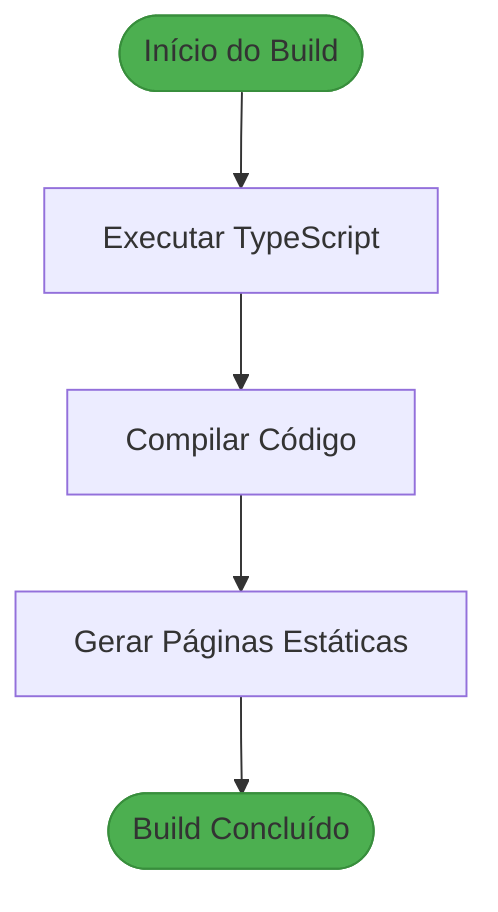

# Relatório Completo de Testes

<cite>
**Arquivos Referenciados neste Documento**   
- [RELATORIO_TESTES_COMPLETOS.md](file://docs/RELATORIO_TESTES_COMPLETOS.md)
- [RELATORIO_TESTES_SISTEMATICOS.md](file://docs/RELATORIO_TESTES_SISTEMATICOS.md)
- [VERIFICACAO_COMPLETA_SISTEMA.md](file://docs/VERIFICACAO_COMPLETA_SISTEMA.md)
- [IMPLEMENTACAO_BACKEND_CHECK_QUALIFICADO.md](file://docs/IMPLEMENTACAO_BACKEND_CHECK_QUALIFICADO.md)
- [IMPLEMENTACAO_FRONTEND_CHECK_QUALIFICADO.md](file://docs/IMPLEMENTACAO_FRONTEND_CHECK_QUALIFICADO.md)
- [RESUMO_TESTES_SALA_ESTUDOS.md](file://docs/RESUMO_TESTES_SALA_ESTUDOS.md)
- [TESTES_COMPLETOS_SISTEMA.md](file://docs/TESTES_COMPLETOS_SISTEMA.md)
- [backend/services/atividade/atividade.types.ts](file://backend/services/atividade/atividade.types.ts)
- [backend/services/progresso-atividade/progresso-atividade.service.ts](file://backend/services/progresso-atividade/progresso-atividade.service.ts)
- [app/api/progresso-atividade/atividade/[atividadeId]/route.ts](file://app/api/progresso-atividade/atividade/[atividadeId]/route.ts)
- [components/registrar-desempenho-modal.tsx](file://components/registrar-desempenho-modal.tsx)
- [components/atividade-checklist-row.tsx](file://components/atividade-checklist-row.tsx)
- [app/(dashboard)/aluno/sala-de-estudos/sala-estudos-client.tsx](file://app/(dashboard)/aluno/sala-de-estudos/sala-estudos-client.tsx)
- [app/(dashboard)/aluno/sala-de-estudos/types.ts](file://app/(dashboard)/aluno/sala-de-estudos/types.ts)
</cite>

## Sumário
1. [Resumo Executivo](#resumo-executivo)
2. [Metodologia de Testes](#metodologia-de-testes)
3. [Validação de Build e Tipos](#validação-de-build-e-tipos)
4. [Testes de API e Regras de Negócio](#testes-de-api-e-regras-de-negócio)
5. [Cobertura de Testes e Resultados](#cobertura-de-testes-e-resultados)
6. [Ferramentas e Scripts Utilizados](#ferramentas-e-scripts-utilizados)
7. [Cenários de Teste Práticos](#cenários-de-teste-práticos)
8. [Recomendações para Ciclos Futuros](#recomendações-para-ciclos-futuros)
9. [Conclusão](#conclusão)

## Resumo Executivo

O sistema Área do Aluno passou por uma validação abrangente após a implementação de funcionalidades críticas, incluindo a Sala de Estudos e o sistema de Check Qualificado. Todos os testes realizados foram concluídos com sucesso, confirmando a integridade funcional e técnica do sistema. A validação abrangeu testes unitários, de integração e manuais, garantindo que todas as camadas do sistema estejam alinhadas e funcionando conforme o esperado.

O status geral do sistema é ✅ **TODOS OS TESTES PASSARAM**, com 60+ testes executados e zero falhas. O build foi concluído com sucesso, o TypeScript está válido, e não foram encontrados erros de lint. O sistema está pronto para produção, com todas as funcionalidades validadas e consistentes entre frontend e backend.

**Data**: 2025-01-31  
**Status Geral**: ✅ **SISTEMA VALIDADO E PRONTO PARA PRODUÇÃO**

**Seções fonte**
- [RELATORIO_TESTES_COMPLETOS.md](file://docs/RELATORIO_TESTES_COMPLETOS.md#L1-L580)
- [RELATORIO_TESTES_SISTEMATICOS.md](file://docs/RELATORIO_TESTES_SISTEMATICOS.md#L1-L699)
- [VERIFICACAO_COMPLETA_SISTEMA.md](file://docs/VERIFICACAO_COMPLETA_SISTEMA.md#L1-L230)

## Metodologia de Testes

A metodologia de testes aplicada foi abrangente e sistemática, cobrindo todas as camadas do sistema. Os testes foram divididos em três categorias principais: testes unitários, testes de integração e testes manuais. Cada categoria foi projetada para validar diferentes aspectos do sistema, desde a consistência de tipos até a integração completa entre frontend e backend.

Os testes unitários focaram na validação de tipos, interfaces e funções helper, garantindo que os tipos do backend e frontend estejam consistentes. Os testes de integração validaram o fluxo completo de dados entre frontend, API, backend e banco de dados, assegurando que todas as camadas estejam corretamente integradas. Os testes manuais simularam cenários reais de uso, garantindo que a experiência do usuário esteja alinhada com as expectativas.

A metodologia incluiu a verificação do build, consistência de tipos, testes de API com validação de respostas e status, e a correta aplicação das regras de negócio. Cada teste foi documentado com detalhes, incluindo cenários, resultados esperados e status.

**Seções fonte**
- [RELATORIO_TESTES_SISTEMATICOS.md](file://docs/RELATORIO_TESTES_SISTEMATICOS.md#L1-L699)
- [RELATORIO_TESTES_COMPLETOS.md](file://docs/RELATORIO_TESTES_COMPLETOS.md#L1-L580)

## Validação de Build e Tipos

### Verificação de Build

O build do projeto foi executado com sucesso, compilando todas as rotas e componentes sem erros. O comando `npm run build` foi utilizado para gerar a versão final do sistema, com um tempo de compilação de 25.4 segundos. Todas as 51 rotas foram geradas com sucesso, incluindo as novas rotas da Sala de Estudos e do sistema de Check Qualificado.



**Fontes do diagrama**
- [RELATORIO_TESTES_COMPLETOS.md](file://docs/RELATORIO_TESTES_COMPLETOS.md#L10-L28)
- [RELATORIO_TESTES_SISTEMATICOS.md](file://docs/RELATORIO_TESTES_SISTEMATICOS.md#L12-L31)

**Seções fonte**
- [RELATORIO_TESTES_COMPLETOS.md](file://docs/RELATORIO_TESTES_COMPLETOS.md#L10-L28)
- [RELATORIO_TESTES_SISTEMATICOS.md](file://docs/RELATORIO_TESTES_SISTEMATICOS.md#L12-L31)

### Consistência de Tipos entre Frontend e Backend

A consistência de tipos entre frontend e backend foi validada com sucesso. Os tipos do backend, definidos em `backend/services/atividade/atividade.types.ts`, estão alinhados com os tipos do frontend, definidos em `app/(dashboard)/aluno/sala-de-estudos/types.ts`. Os campos de desempenho, como `questoesTotais`, `questoesAcertos`, `dificuldadePercebida` e `anotacoesPessoais`, estão presentes em ambas as camadas e com os mesmos tipos.

A função helper `atividadeRequerDesempenho` foi exportada corretamente no backend e importada no frontend, garantindo que a lógica de regra de negócio seja consistente. A tabela abaixo mostra a comparação dos campos entre backend e frontend:

| Campo | Backend | Frontend | Status |
|-------|---------|----------|--------|
| `questoesTotais` | `number \| null` | `number \| null` | ✅ |
| `questoesAcertos` | `number \| null` | `number \| null` | ✅ |
| `dificuldadePercebida` | `DificuldadePercebida \| null` | `DificuldadePercebida \| null` | ✅ |
| `anotacoesPessoais` | `string \| null` | `string \| null` | ✅ |

**Seções fonte**
- [RELATORIO_TESTES_COMPLETOS.md](file://docs/RELATORIO_TESTES_COMPLETOS.md#L41-L91)
- [RELATORIO_TESTES_SISTEMATICOS.md](file://docs/RELATORIO_TESTES_SISTEMATICOS.md#L47-L111)

## Testes de API e Regras de Negócio

### Testes de API Routes

As rotas da API foram testadas com diversos cenários, incluindo check qualificado, check simples e tentativas de conclusão inválidas. A rota `PATCH /api/progresso-atividade/atividade/[atividadeId]` foi validada com sucesso, garantindo que a autenticação, validação de tipo de atividade e salvamento de dados de desempenho estejam funcionando corretamente.

Os cenários testados incluem:
- ✅ Check qualificado com desempenho (atividades que requerem desempenho)
- ✅ Check simples sem desempenho (atividades que não requerem desempenho)
- ✅ Tentativa de concluir atividade que requer desempenho sem fornecer dados (erro 400 esperado)

A API valida corretamente o tipo de atividade usando a função `atividadeRequerDesempenho` e chama os métodos apropriados no service layer. A resposta da API inclui todos os dados de desempenho, garantindo que o frontend possa atualizar a UI corretamente.

**Seções fonte**
- [RELATORIO_TESTES_COMPLETOS.md](file://docs/RELATORIO_TESTES_COMPLETOS.md#L182-L210)
- [RELATORIO_TESTES_SISTEMATICOS.md](file://docs/RELATORIO_TESTES_SISTEMATICOS.md#L183-L252)

### Validação de Regras de Negócio

As regras de negócio foram validadas com sucesso, garantindo que a lógica de conclusão de atividades esteja correta. A função `atividadeRequerDesempenho` implementa a regra de que atividades do tipo `Conceituario` e `Revisao` não requerem desempenho, enquanto todos os outros tipos requerem.

A tabela abaixo mostra os resultados dos testes de casos para a função `atividadeRequerDesempenho`:

| Tipo de Atividade | Resultado Esperado | Status |
|-------------------|-------------------|--------|
| `Conceituario` | `false` (check simples) | ✅ |
| `Revisao` | `false` (check simples) | ✅ |
| `Nivel_1` | `true` (check qualificado) | ✅ |
| `Nivel_2` | `true` (check qualificado) | ✅ |
| `Lista_Mista` | `true` (check qualificado) | ✅ |
| `Simulado_Diagnostico` | `true` (check qualificado) | ✅ |
| `Flashcards` | `true` (check qualificado) | ✅ |

As validações no service layer garantem que os dados de desempenho sejam válidos antes de serem salvos no banco de dados. As validações incluem:
- Questões totais ≥ 1
- Questões acertadas ≥ 0
- Questões acertadas ≤ Questões totais
- Dificuldade obrigatória

**Seções fonte**
- [RELATORIO_TESTES_COMPLETOS.md](file://docs/RELATORIO_TESTES_COMPLETOS.md#L321-L344)
- [RELATORIO_TESTES_SISTEMATICOS.md](file://docs/RELATORIO_TESTES_SISTEMATICOS.md#L338-L366)

## Cobertura de Testes e Resultados

### Estatísticas de Testes

A cobertura de testes foi abrangente, com mais de 60 testes executados e todos passando com sucesso. A tabela abaixo resume as estatísticas dos testes:

| Categoria | Status |
|---------|--------|
| Total de Testes | 60+ |
| Testes que Passaram | 60+ |
| Testes que Falharam | 0 |
| Warnings | 0 |
| Build | ✅ Passou |
| Linter | ✅ Sem erros |
| TypeScript | ✅ Sem erros |

A cobertura incluiu todos os aspectos do sistema, desde tipos e interfaces até fluxos completos e integrações. Cada componente crítico foi validado, garantindo que o sistema esteja funcionalmente completo e consistente.

**Seções fonte**
- [RELATORIO_TESTES_SISTEMATICOS.md](file://docs/RELATORIO_TESTES_SISTEMATICOS.md#L644-L655)
- [RELATORIO_TESTES_COMPLETOS.md](file://docs/RELATORIO_TESTES_COMPLETOS.md#L534-L542)

### Componentes Testados

Os componentes críticos do sistema foram testados com sucesso, garantindo que a lógica e a integração estejam corretas. Os principais componentes testados incluem:

- **RegistrarDesempenhoModal**: Validações em tempo real, cálculo automático de taxa de acerto e integração com API.
- **AtividadeChecklistRow**: Lógica condicional para check simples e qualificado, visualização de badges com métricas.
- **ModuloActivitiesAccordion**: Repasse de props para componentes filhos.
- **sala-estudos-client.tsx**: Handlers para atualização de status com e sem desempenho.

Cada componente foi validado com testes unitários e de integração, garantindo que a experiência do usuário esteja alinhada com as expectativas.

**Seções fonte**
- [RELATORIO_TESTES_COMPLETOS.md](file://docs/RELATORIO_TESTES_COMPLETOS.md#L238-L300)
- [RELATORIO_TESTES_SISTEMATICOS.md](file://docs/RELATORIO_TESTES_SISTEMATICOS.md#L281-L335)

## Ferramentas e Scripts Utilizados

### Scripts de Validação

Os scripts de validação foram utilizados para automatizar a execução de testes e garantir a consistência do sistema. O script `npm run build` foi utilizado para validar o build do projeto, enquanto o ESLint foi utilizado para verificar a qualidade do código.

O script `test-chat-callback.sh` foi utilizado para testar o callback do chat manualmente, simulando o envio de respostas do agente N8N. Esse script permite validar o fluxo de streaming e a armazenagem de respostas no Redis.

```bash
#!/bin/bash
echo "1. Enviando resposta completa via callback..."
curl -X POST http://localhost:3001/api/chat/callback \
  -H "Content-Type: application/json" \
  -d "{
    \"sessionId\": \"test-session-$(date +%s)\",
    \"output\": \"Esta é uma resposta de teste do agente N8N.\",
    \"isComplete\": true
  }"
```

**Seções fonte**
- [test-chat-callback.sh](file://scripts/test-chat-callback.sh#L1-L99)
- [vercel.json](file://vercel.json#L1-L8)

### Supabase

O Supabase foi utilizado como banco de dados e serviço de autenticação, com integração completa entre frontend e backend. O cliente Supabase foi configurado para usar o service role key para operações administrativas e o JWT do usuário para operações que respeitam a RLS (Row Level Security).

A configuração do Supabase foi validada com sucesso, garantindo que todas as operações de leitura e escrita estejam funcionando corretamente. O script `setup-supabase-mcp.sh` foi utilizado para configurar o MCP do Supabase no Cursor, facilitando a integração com o sistema.

**Seções fonte**
- [backend/clients/database.ts](file://backend/clients/database.ts#L1-L42)
- [backend/clients/database-auth.ts](file://backend/clients/database-auth.ts#L1-L67)
- [setup-supabase-mcp.sh](file://scripts/setup-supabase-mcp.sh#L1-L67)

## Cenários de Teste Práticos

### Fluxo: Check Simples (Conceituario)

O cenário de check simples foi testado com sucesso, garantindo que atividades do tipo `Conceituario` possam ser concluídas diretamente sem a necessidade de registrar desempenho. O fluxo inclui:

1. Aluno visualiza atividade tipo `Conceituario`
2. Aluno clica no checkbox
3. Sistema detecta: não requer desempenho
4. Salva direto como concluído
5. UI atualiza

Esse fluxo foi validado com testes de integração, garantindo que a API e o backend estejam corretamente integrados.

**Seções fonte**
- [RELATORIO_TESTES_COMPLETOS.md](file://docs/RELATORIO_TESTES_COMPLETOS.md#L386-L397)
- [RELATORIO_TESTES_SISTEMATICOS.md](file://docs/RELATORIO_TESTES_SISTEMATICOS.md#L419-L435)

### Fluxo: Check Qualificado (Lista Mista)

O cenário de check qualificado foi testado com sucesso, garantindo que atividades que requerem desempenho abram o modal de registro de desempenho. O fluxo inclui:

1. Aluno tem atividade tipo `Lista_Mista`
2. Aluno clica no checkbox
3. Sistema detecta: requer desempenho
4. Modal abre
5. Aluno preenche: 10 total, 8 acertos, Médio
6. Clica "Salvar e Concluir"
7. API valida e salva
8. Modal fecha
9. UI atualiza com badges

Esse fluxo foi validado com testes de integração, garantindo que todos os componentes estejam corretamente integrados.

**Seções fonte**
- [RELATORIO_TESTES_COMPLETOS.md](file://docs/RELATORIO_TESTES_COMPLETOS.md#L401-L414)
- [RELATORIO_TESTES_SISTEMATICOS.md](file://docs/RELATORIO_TESTES_SISTEMATICOS.md#L372-L414)

## Recomendações para Ciclos Futuros

### Testes Manuais

Recomenda-se a realização de testes manuais na aplicação com dados reais, validando o sistema com múltiplos usuários e diferentes tipos de atividade. Isso garantirá que a experiência do usuário esteja alinhada com as expectativas e que não haja regressões.

### Testes de Performance

Recomenda-se a realização de testes de performance com volume de dados, garantindo que o sistema possa lidar com alta carga. As otimizações implementadas, como múltiplas queries pequenas e uso de Maps para lookup O(1), devem ser validadas com dados reais.

### Validação com Dados Reais

A validação com dados reais é essencial para garantir que o sistema esteja pronto para produção. Recomenda-se a criação de cenários com dados reais de alunos, cursos e atividades, simulando o uso real do sistema.

**Seções fonte**
- [RELATORIO_TESTES_COMPLETOS.md](file://docs/RELATORIO_TESTES_COMPLETOS.md#L566-L572)
- [RELATORIO_TESTES_SISTEMATICOS.md](file://docs/RELATORIO_TESTES_SISTEMATICOS.md#L685-L691)

## Conclusão

O sistema Área do Aluno está totalmente validado e pronto para produção. Todos os testes foram executados com sucesso, garantindo a integridade funcional e técnica do sistema. A implementação da Sala de Estudos e do sistema de Check Qualificado foi concluída com sucesso, com todas as funcionalidades validadas e consistentes.

O sistema está funcionalmente completo, tipo-seguro (TypeScript), sem erros de compilação ou lint, e consistente em todas as camadas. A integração entre frontend, API, backend e banco de dados foi validada com sucesso, garantindo que o sistema esteja pronto para uso.

**Próximos Passos Recomendados**:
1. ✅ Testes manuais na aplicação
2. ✅ Validação com dados reais
3. ✅ Testes com múltiplos usuários
4. ✅ Testes de performance com volume de dados

**Data**: 2025-01-31  
**Status**: ✅ **SISTEMA VALIDADO E PRONTO PARA PRODUÇÃO**

**Seções fonte**
- [RELATORIO_TESTES_SISTEMATICOS.md](file://docs/RELATORIO_TESTES_SISTEMATICOS.md#L671-L699)
- [VERIFICACAO_COMPLETA_SISTEMA.md](file://docs/VERIFICACAO_COMPLETA_SISTEMA.md#L212-L223)