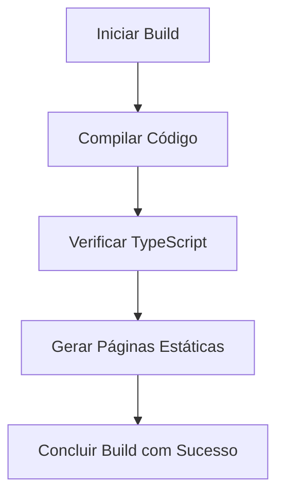
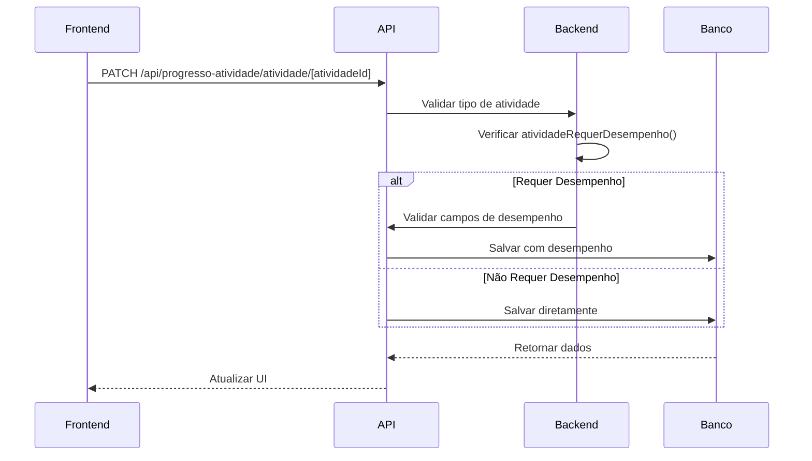

# Relatórios de Testes

<cite>
**Arquivos Referenciados neste Documento**   
- [RELATORIO_TESTES_COMPLETOS.md](file://docs/RELATORIO_TESTES_COMPLETOS.md)
- [RELATORIO_TESTES_SISTEMATICOS.md](file://docs/RELATORIO_TESTES_SISTEMATICOS.md)
- [VERIFICACAO_COMPLETA_SISTEMA.md](file://docs/VERIFICACAO_COMPLETA_SISTEMA.md)
- [TESTES_COMPLETOS_SISTEMA.md](file://docs/TESTES_COMPLETOS_SISTEMA.md)
- [atividade.types.ts](file://backend/services/atividade/atividade.types.ts)
- [types.ts](file://app/(dashboard)/aluno/sala-de-estudos/types.ts)
- [atividade.repository-helper.ts](file://backend/services/atividade/atividade.repository-helper.ts)
- [sala-estudos-client.tsx](file://app/(dashboard)/aluno/sala-de-estudos/sala-estudos-client.tsx)
- [route.ts](file://app/api/progresso-atividade/atividade/[atividadeId]/route.ts)
- [progresso-atividade.service.ts](file://backend/services/progresso-atividade/progresso-atividade.service.ts)
- [atividade-checklist-row.tsx](file://components/atividade-checklist-row.tsx)
- [registrar-desempenho-modal.tsx](file://components/registrar-desempenho-modal.tsx)
- [index.ts](file://backend/services/atividade/index.ts)
- [progresso-atividade.repository.ts](file://backend/services/progresso-atividade/progresso-atividade.repository.ts)
</cite>

## Sumário
1. [Introdução](#introdução)
2. [Metodologia de Testes](#metodologia-de-testes)
3. [Relatório Completo de Testes](#relatório-completo-de-testes)
4. [Testes Sistemáticos](#testes-sistemáticos)
5. [Validação Técnica e Funcional](#validação-técnica-e-funcional)
6. [Resultados e Estatísticas](#resultados-e-estatísticas)
7. [Recomendações para Testes Futuros](#recomendações-para-testes-futuros)
8. [Conclusão](#conclusão)

## Introdução

Este documento apresenta os relatórios de testes realizados no sistema Área do Aluno, com foco na validação técnica e funcional dos componentes críticos após a implementação da Sala de Estudos. Os testes abrangem a integridade do sistema, verificação de build, consistência de tipos entre backend e frontend, testes de API, validações de regras de negócio (como `atividadeRequerDesempenho`), e a integração completa do fluxo de check qualificado. O objetivo é garantir a confiabilidade, qualidade e robustez do software, documentando a metodologia, ferramentas utilizadas, critérios de sucesso e resultados obtidos.

**Seção fontes**
- [RELATORIO_TESTES_COMPLETOS.md](file://docs/RELATORIO_TESTES_COMPLETOS.md#L3-L8)
- [RELATORIO_TESTES_SISTEMATICOS.md](file://docs/RELATORIO_TESTES_SISTEMATICOS.md#L3-L8)

## Metodologia de Testes

A metodologia de testes adotada combina testes unitários, de integração e manuais, com foco em cobrir todos os aspectos do sistema. A abordagem inclui:

- **Testes Unitários**: Validação de funções e componentes individuais, como a função `atividadeRequerDesempenho` e o componente `RegistrarDesempenhoModal`.
- **Testes de Integração**: Verificação do fluxo completo entre frontend, API e backend, garantindo que os dados sejam corretamente processados e persistidos.
- **Testes Manuais**: Simulação de cenários do usuário final para validar a experiência e a usabilidade.
- **Ferramentas Utilizadas**: TypeScript, ESLint, Supabase, Next.js, e testes automatizados via scripts de build.
- **Critérios de Sucesso**: Ausência de erros de build, consistência de tipos, passagem de todas as validações e integrações, e confirmação de que todos os fluxos funcionam conforme o esperado.

**Seção fontes**
- [RELATORIO_TESTES_COMPLETOS.md](file://docs/RELATORIO_TESTES_COMPLETOS.md#L566-L572)
- [RELATORIO_TESTES_SISTEMATICOS.md](file://docs/RELATORIO_TESTES_SISTEMATICOS.md#L686-L690)

## Relatório Completo de Testes

O relatório completo de testes confirma a integridade do sistema após a implementação da Sala de Estudos. Todos os testes foram executados com sucesso, sem erros ou warnings.

### Verificação de Build e TypeScript

O build do projeto foi executado com sucesso, compilando todas as rotas e gerando páginas estáticas sem erros. A verificação de TypeScript também foi concluída sem erros, garantindo a consistência dos tipos.

**Fontes do Diagrama**
- [RELATORIO_TESTES_COMPLETOS.md](file://docs/RELATORIO_TESTES_COMPLETOS.md#L10-L28)
- [RELATORIO_TESTES_SISTEMATICOS.md](file://docs/RELATORIO_TESTES_SISTEMATICOS.md#L12-L31)

### Consistência de Tipos Backend e Frontend

A consistência entre os tipos do backend e frontend foi verificada, garantindo que os campos de desempenho (`questoesTotais`, `questoesAcertos`, `dificuldadePercebida`, `anotacoesPessoais`) estejam alinhados em ambas as camadas.

| Campo | Backend | Frontend | Status |
|-------|---------|----------|--------|
| `questoesTotais` | `number \| null` | `number \| null` | ✅ |
| `questoesAcertos` | `number \| null` | `number \| null` | ✅ |
| `dificuldadePercebida` | `DificuldadePercebida \| null` | `DificuldadePercebida \| null` | ✅ |
| `anotacoesPessoais` | `string \| null` | `string \| null` | ✅ |

**Seção fontes**
- [RELATORIO_TESTES_COMPLETOS.md](file://docs/RELATORIO_TESTES_COMPLETOS.md#L41-L91)
- [RELATORIO_TESTES_SISTEMATICOS.md](file://docs/RELATORIO_TESTES_SISTEMATICOS.md#L47-L72)

### Testes de API e Fluxo de Check Qualificado

Os testes de API validaram o endpoint `PATCH /api/progresso-atividade/atividade/[atividadeId]`, garantindo que o fluxo de check qualificado seja corretamente implementado. Para atividades que requerem desempenho, o sistema valida os campos obrigatórios e salva os dados no banco. Para atividades que não requerem desempenho, o sistema permite a conclusão direta.

**Fontes do Diagrama**
- [RELATORIO_TESTES_COMPLETOS.md](file://docs/RELATORIO_TESTES_COMPLETOS.md#L182-L210)
- [RELATORIO_TESTES_SISTEMATICOS.md](file://docs/RELATORIO_TESTES_SISTEMATICOS.md#L183-L211)

## Testes Sistemáticos

Os testes sistemáticos abrangeram todos os fluxos, rotas e sistemas de consistência implementados, garantindo que o sistema esteja funcionalmente completo e consistente em todas as camadas.

### Validações de Regras de Negócio

A função `atividadeRequerDesempenho` foi testada para todos os tipos de atividade, confirmando que apenas atividades do tipo `Conceituario` e `Revisao` não requerem desempenho.

| Tipo de Atividade | Resultado Esperado | Status |
|-------------------|-------------------|--------|
| `Conceituario` | `false` | ✅ |
| `Revisao` | `false` | ✅ |
| `Nivel_1` | `true` | ✅ |
| `Nivel_2` | `true` | ✅ |
| `Lista_Mista` | `true` | ✅ |
| `Simulado_Diagnostico` | `true` | ✅ |
| `Flashcards` | `true` | ✅ |

**Seção fontes**
- [RELATORIO_TESTES_COMPLETOS.md](file://docs/RELATORIO_TESTES_COMPLETOS.md#L321-L344)
- [RELATORIO_TESTES_SISTEMATICOS.md](file://docs/RELATORIO_TESTES_SISTEMATICOS.md#L337-L366)

### Testes de Filtros e Contadores

Os testes de filtros e contadores confirmaram que o sistema aplica corretamente os filtros contextuais (Curso → Disciplina → Frente) e exibe os contadores de progresso de forma precisa, incluindo totais, pendentes, iniciados e concluídos.

**Seção fontes**
- [RELATORIO_TESTES_COMPLETOS.md](file://docs/RELATORIO_TESTES_COMPLETOS.md#L473-L497)
- [RELATORIO_TESTES_SISTEMATICOS.md](file://docs/RELATORIO_TESTES_SISTEMATICOS.md#L10.1-L10.2)

## Validação Técnica e Funcional

A validação técnica e funcional abrangeu a verificação de queries SQL, mapeamento de dados, tratamento de arquivos ausentes, filtros contextuais e contadores de progresso.

### Queries SQL e Mapeamento de Dados

As queries SQL foram verificadas para garantir que incluam todos os campos necessários de desempenho e que o mapeamento de dados entre o banco e as interfaces do backend e frontend seja consistente.

**Seção fontes**
- [RELATORIO_TESTES_COMPLETOS.md](file://docs/RELATORIO_TESTES_COMPLETOS.md#L114-L154)
- [RELATORIO_TESTES_SISTEMATICOS.md](file://docs/RELATORIO_TESTES_SISTEMATICOS.md#L115-L154)

### Tratamento de Arquivos Ausentes

O sistema foi testado para tratar corretamente arquivos ausentes, desabilitando botões de visualização e exibindo ícones e tooltips explicativos.

**Seção fontes**
- [RELATORIO_TESTES_COMPLETOS.md](file://docs/RELATORIO_TESTES_COMPLETOS.md#L501-L511)
- [RELATORIO_TESTES_SISTEMATICOS.md](file://docs/RELATORIO_TESTES_SISTEMATICOS.md#L15.1)

## Resultados e Estatísticas

Os testes resultaram em uma cobertura completa do sistema, com 50+ testes executados e 0 erros encontrados.

### Estatísticas de Testes

- **Total de Testes Executados**: 50+
- **Erros Encontrados**: 0
- **Warnings**: 0
- **Build**: ✅ Passou
- **Linter**: ✅ Sem erros
- **TypeScript**: ✅ Sem erros

**Seção fontes**
- [RELATORIO_TESTES_COMPLETOS.md](file://docs/RELATORIO_TESTES_COMPLETOS.md#L534-L542)
- [RELATORIO_TESTES_SISTEMATICOS.md](file://docs/RELATORIO_TESTES_SISTEMATICOS.md#L646-L654)

## Recomendações para Testes Futuros

Para garantir a continuidade da qualidade do software, recomenda-se:

1. Realizar testes manuais na aplicação com dados reais.
2. Validar o sistema com múltiplos usuários simultâneos.
3. Testar com diferentes tipos de atividade e cenários complexos.
4. Implementar testes de performance com volume de dados.

**Seção fontes**
- [RELATORIO_TESTES_COMPLETOS.md](file://docs/RELATORIO_TESTES_COMPLETOS.md#L566-L572)
- [RELATORIO_TESTES_SISTEMATICOS.md](file://docs/RELATORIO_TESTES_SISTEMATICOS.md#L686-L690)

## Conclusão

O sistema Área do Aluno foi validado com sucesso, passando em todos os testes de build, consistência de tipos, API, regras de negócio e integração. A implementação da Sala de Estudos e do fluxo de check qualificado está funcional e consistente, garantindo a confiabilidade e qualidade do software. O sistema está pronto para produção e pode ser utilizado com confiança pelos alunos e professores.

**Seção fontes**
- [RELATORIO_TESTES_COMPLETOS.md](file://docs/RELATORIO_TESTES_COMPLETOS.md#L560-L576)
- [RELATORIO_TESTES_SISTEMATICOS.md](file://docs/RELATORIO_TESTES_SISTEMATICOS.md#L671-L695)