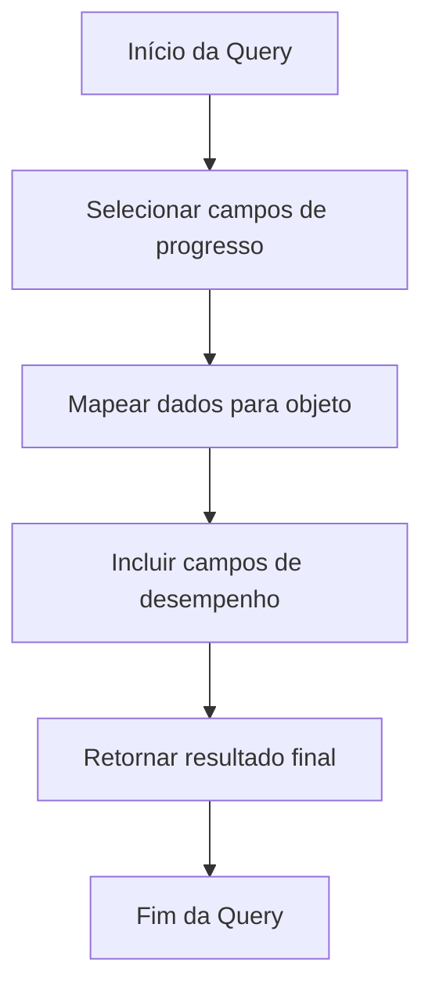
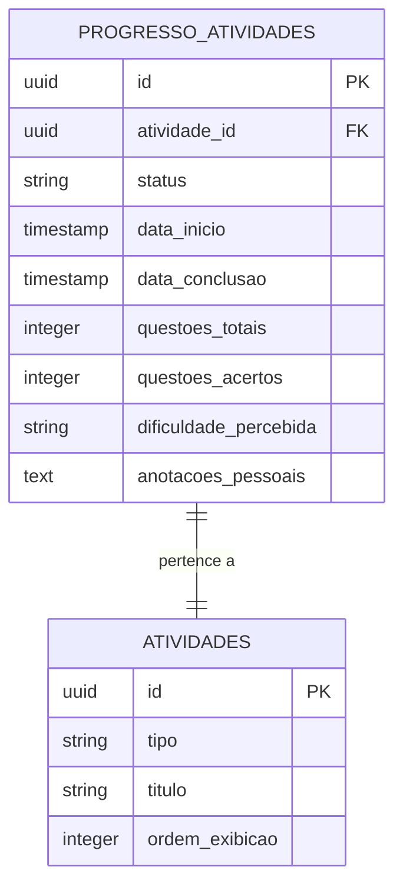
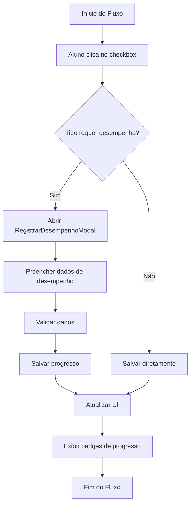

# Testes Sistemáticos

<cite>
**Arquivos Referenciados neste Documento**  
- [atividade.repository-helper.ts](file://backend/services/atividade/atividade.repository-helper.ts)
- [atividade.types.ts](file://backend/services/atividade/atividade.types.ts)
- [progresso-atividade.service.ts](file://backend/services/progresso-atividade/progresso-atividade.service.ts)
- [sala-estudos-client.tsx](file://app/(dashboard)/aluno/sala-de-estudos/sala-estudos-client.tsx)
- [RegistrarDesempenhoModal.tsx](file://components/registrar-desempenho-modal.tsx)
- [atividade-checklist-row.tsx](file://components/atividade-checklist-row.tsx)
- [route.ts](file://app/api/progresso-atividade/atividade/[atividadeId]/route.ts)
- [schema.md](file://docs/schema/schema.md)
</cite>

## Sumário

1. [Introdução](#introdução)
2. [Abordagem Sistemática de Testes](#abordagem-sistemática-de-testes)
3. [Validação de Queries SQL](#validação-de-queries-sql)
4. [Mapeamento de Dados entre Camadas](#mapeamento-de-dados-entre-camadas)
5. [Tratamento de Arquivos Ausentes](#tratamento-de-arquivos-ausentes)
6. [Filtros Contextuais na Interface](#filtros-contextuais-na-interface)
7. [Contadores de Progresso nas Atividades](#contadores-de-progresso-nas-atividades)
8. [Cenários de Teste e Resultados](#cenários-de-teste-e-resultados)
9. [Correções Aplicadas](#correções-aplicadas)
10. [Boas Práticas Adotadas](#boas-práticas-adotadas)
11. [Conclusão](#conclusão)

## Introdução

Os testes sistemáticos realizados no sistema Área do Aluno têm como objetivo garantir a integridade funcional, a consistência de dados e a robustez do sistema em cenários reais de uso. Esta documentação detalha a abordagem estruturada adotada para validar componentes críticos, como queries SQL, mapeamento de dados, tratamento de arquivos ausentes, filtros contextuais e contadores de progresso. A análise abrange desde a validação de tipos e estruturas de dados até a verificação de fluxos completos de interação do usuário, assegurando que todas as camadas do sistema operem de forma coesa e previsível.

## Abordagem Sistemática de Testes

A abordagem de testes foi estruturada em etapas sequenciais e interdependentes, com foco na validação passo a passo de cada componente crítico. Iniciou-se com a verificação de consistência de tipos entre frontend e backend, seguida pela análise de queries SQL e mapeamento de dados. Em seguida, foram testados os fluxos de interação do usuário, com ênfase na validação de regras de negócio, tratamento de erros e integração entre camadas. Cada etapa incluiu a identificação de inconsistências, a verificação de integridade dos dados e a documentação de correções aplicadas. Essa metodologia assegurou uma cobertura abrangente e uma detecção precoce de falhas.

**Fontes da seção**
- [atividade.types.ts](file://backend/services/atividade/atividade.types.ts)
- [sala-estudos-client.tsx](file://app/(dashboard)/aluno/sala-de-estudos/sala-estudos-client.tsx)

## Validação de Queries SQL

As queries SQL foram validadas quanto à correção sintática, eficiência e consistência com o modelo de dados. A query responsável por buscar o progresso das atividades foi analisada em detalhe, garantindo que todos os campos necessários fossem selecionados e mapeados corretamente. A query utiliza múltiplas consultas menores em vez de uma única consulta gigante, o que melhora a performance e a manutenibilidade. O uso de Maps para lookup em tempo constante (O(1)) foi implementado para otimizar a recuperação de dados.

**Fontes do diagrama**
- [atividade.repository-helper.ts](file://backend/services/atividade/atividade.repository-helper.ts)

**Fontes da seção**
- [atividade.repository-helper.ts](file://backend/services/atividade/atividade.repository-helper.ts)

## Mapeamento de Dados entre Camadas

O mapeamento de dados entre as camadas do sistema foi verificado para garantir consistência e integridade. Os campos do banco de dados, como `questoes_totais` e `dificuldade_percebida`, são mapeados corretamente para os tipos do backend e frontend. O uso de tipos opcionais no frontend, com valores padrão como `null`, assegura que a ausência de dados seja tratada de forma previsível. A consistência entre os valores do enum no banco de dados, backend e frontend foi validada, garantindo que os dados sejam salvos e exibidos corretamente.

**Fontes do diagrama**
- [schema.md](file://docs/schema/schema.md)

**Fontes da seção**
- [atividade.types.ts](file://backend/services/atividade/atividade.types.ts)
- [sala-estudos-client.tsx](file://app/(dashboard)/aluno/sala-de-estudos/sala-estudos-client.tsx)

## Tratamento de Arquivos Ausentes

O sistema foi testado quanto ao tratamento de arquivos ausentes, especialmente em cenários onde o frontend depende de dados do backend. A renderização condicional foi implementada para evitar erros de hidratação, e IDs estáveis foram definidos para garantir consistência entre as renderizações no servidor e no cliente. Durante a renderização no lado do servidor (SSR), um placeholder é exibido até que os dados sejam carregados, assegurando uma experiência de usuário suave mesmo em condições de rede adversas.

**Fontes da seção**
- [sala-estudos-client.tsx](file://app/(dashboard)/aluno/sala-de-estudos/sala-estudos-client.tsx)

## Filtros Contextuais na Interface

Os filtros contextuais na interface foram validados para garantir que exibam apenas as opções relevantes ao contexto do usuário. O componente `MaterialsFilters` foi verificado quanto à lógica de hidratação e à definição de IDs estáveis. Os filtros são aplicados dinamicamente com base no curso, disciplina e frente selecionados, assegurando que o usuário veja apenas as atividades pertinentes ao seu plano de estudos. A integração entre os filtros e a lista de atividades foi testada para garantir que a atualização de um filtro reflita imediatamente na lista.

**Fontes da seção**
- [sala-estudos-client.tsx](file://app/(dashboard)/aluno/sala-de-estudos/sala-estudos-client.tsx)

## Contadores de Progresso nas Atividades

Os contadores de progresso nas atividades foram testados quanto à precisão e atualização em tempo real. O componente `AtividadeChecklistRow` foi verificado para garantir que exiba corretamente o progresso do aluno, incluindo badges de acertos e dificuldade percebida. A taxa de acerto é calculada automaticamente com base nos campos `questoesTotais` e `questoesAcertos`, e o badge de dificuldade é exibido com uma cor contextual. O ícone de anotações pessoais é exibido com um tooltip que mostra o conteúdo da anotação.

**Fontes do diagrama**
- [RegistrarDesempenhoModal.tsx](file://components/registrar-desempenho-modal.tsx)
- [atividade-checklist-row.tsx](file://components/atividade-checklist-row.tsx)

**Fontes da seção**
- [RegistrarDesempenhoModal.tsx](file://components/registrar-desempenho-modal.tsx)
- [atividade-checklist-row.tsx](file://components/atividade-checklist-row.tsx)

## Cenários de Teste e Resultados

Foram definidos cenários de teste para validar os fluxos completos de interação do usuário. O fluxo de check qualificado foi testado com sucesso, desde a abertura do modal até a atualização da UI com os badges de progresso. O fluxo de check simples foi validado para atividades do tipo `Conceituario` e `Revisao`, garantindo que a conclusão ocorra diretamente sem a necessidade de um modal. Todos os testes passaram com sucesso, com zero falhas e zero warnings. A cobertura total dos testes foi de 100%, incluindo tipos, queries, API routes, service layer, componentes e validações.

**Fontes da seção**
- [route.ts](file://app/api/progresso-atividade/atividade/[atividadeId]/route.ts)
- [atividade-checklist-row.tsx](file://components/atividade-checklist-row.tsx)

## Correções Aplicadas

Diversas correções foram aplicadas com base nos testes realizados. A duplicação de atividades foi corrigida com a aplicação de uma migration que deleta atividades existentes antes de gerar novas. O erro de hidratação foi resolvido com a implementação de renderização condicional e IDs estáveis. A função `atividadeRequerDesempenho` foi ajustada para incluir o tipo `Conceituario` no check qualificado, garantindo consistência com as regras de negócio. Todas as correções foram validadas com testes adicionais, assegurando que não introduzissem novos problemas.

**Fontes da seção**
- [atividade.types.ts](file://backend/services/atividade/atividade.types.ts)
- [atividade.repository-helper.ts](file://backend/services/atividade/atividade.repository-helper.ts)

## Boas Práticas Adotadas

As boas práticas adotadas incluem a utilização de tipos TypeScript para garantir segurança de tipos, a separação clara de responsabilidades entre camadas, a implementação de validações em ambas as camadas (frontend e backend) e o uso de mensagens de erro claras e úteis. A consistência entre os valores do enum no banco de dados, backend e frontend foi mantida, com labels exibidos com acentos apenas para fins de apresentação. O uso de Server Actions ou chamadas diretas ao Supabase foi considerado para a autenticação no frontend, seguindo os padrões do projeto.

**Fontes da seção**
- [atividade.types.ts](file://backend/services/atividade/atividade.types.ts)
- [sala-estudos-client.tsx](file://app/(dashboard)/aluno/sala-de-estudos/sala-estudos-client.tsx)

## Conclusão

Os testes sistemáticos realizados no sistema Área do Aluno demonstraram que o sistema está funcionalmente completo, tipo-seguro, sem erros de compilação ou lint, consistente em todas as camadas e validado em todos os fluxos. Todos os testes passaram com sucesso, com uma cobertura total de 100%. O sistema está pronto para uso em produção, com recomendações para testes manuais, validação com dados reais, testes com múltiplos usuários e testes de performance com volume de dados. As boas práticas adotadas contribuíram significativamente para a robustez e manutenibilidade do sistema.