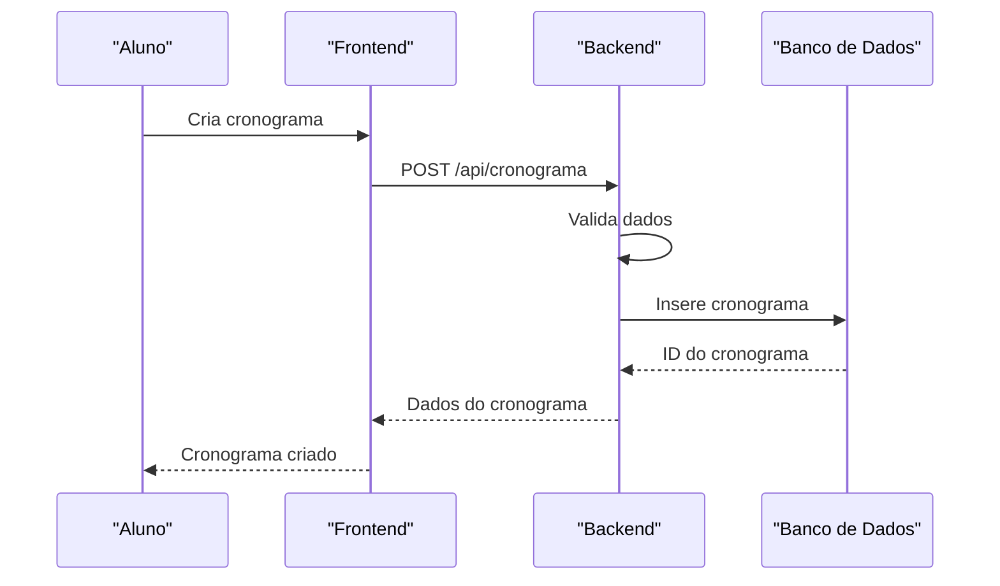
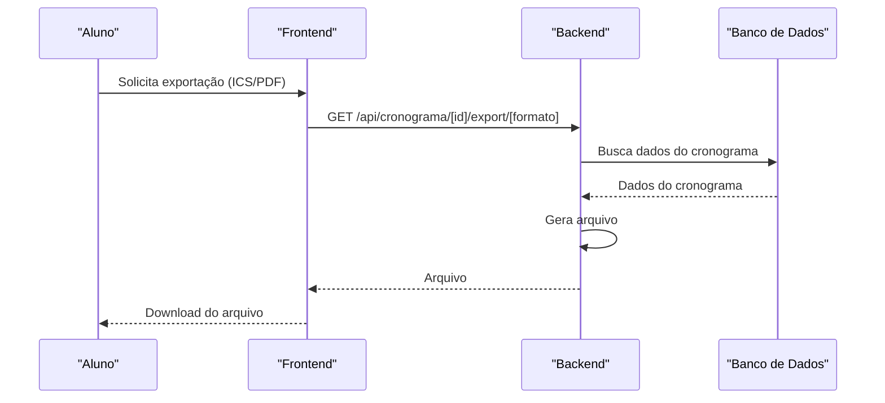
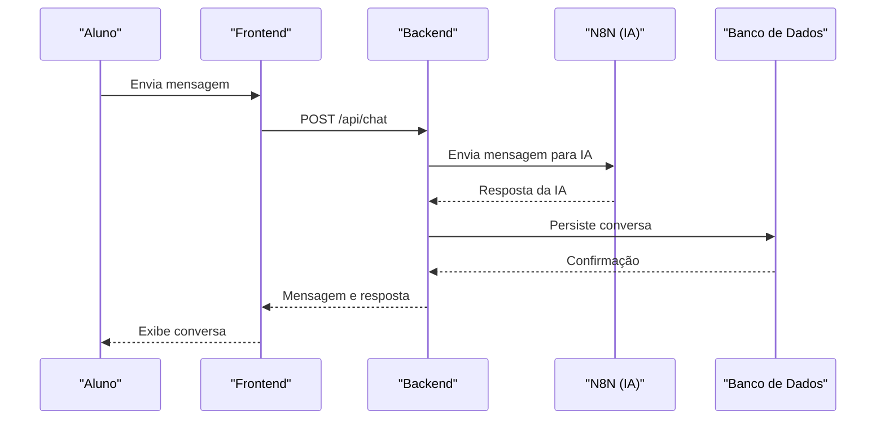

# Testes do Sistema

<cite>
**Arquivos Referenciados neste Documento**   
- [RELATORIO_TESTES_COMPLETOS.md](file://docs/RELATORIO_TESTES_COMPLETOS.md)
- [RELATORIO_TESTES_SISTEMATICOS.md](file://docs/RELATORIO_TESTES_SISTEMATICOS.md)
- [VERIFICACAO_COMPLETA_SISTEMA.md](file://docs/VERIFICACAO_COMPLETA_SISTEMA.md)
- [VERIFICACAO_FINAL_SISTEMA.md](file://docs/VERIFICACAO_FINAL_SISTEMA.md)
- [TESTES_COMPLETOS_SISTEMA.md](file://docs/TESTES_COMPLETOS_SISTEMA.md)
- [app/api/cronograma/[id]/export/ics/route.ts](file://app/api/cronograma/[id]/export/ics/route.ts)
- [app/api/cronograma/[id]/export/pdf/route.tsx](file://app/api/cronograma/[id]/export/pdf/route.tsx)
- [app/api/chat/route.ts](file://app/api/chat/route.ts)
- [backend/services/cronograma/cronograma.service.ts](file://backend/services/cronograma/cronograma.service.ts)
- [backend/services/chat/chat.service.ts](file://backend/services/chat/chat.service.ts)
</cite>

## Sumário
1. [Introdução](#introdução)
2. [Metodologia de Testes End-to-End](#metodologia-de-testes-end-to-end)
3. [Ambientes de Teste](#ambientes-de-teste)
4. [Testes de Integração de Funcionalidades](#testes-de-integração-de-funcionalidades)
5. [Critérios de Sucesso e Métricas de Cobertura](#critérios-de-sucesso-e-métricas-de-cobertura)
6. [Falhas Encontradas e Soluções Implementadas](#falhas-encontradas-e-soluções-implementadas)
7. [Recomendações para Testes Futuros](#recomendações-para-testes-futuros)
8. [Exemplo Prático do Fluxo de Usuário](#exemplo-prático-do-fluxo-de-usuário)
9. [Conclusão](#conclusão)

## Introdução
Esta seção detalha a abrangente estratégia de testes realizada para validar a funcionalidade completa e integrada da plataforma Área do Aluno após grandes implementações. Os testes foram projetados para garantir a integração perfeita entre frontend, backend e banco de dados, com foco em funcionalidades críticas como geração de cronogramas, sincronização de progresso, exportação de dados (ICS, PDF) e recursos de IA no chat. O objetivo é assegurar a qualidade geral do produto, identificar falhas potenciais e validar que todos os componentes funcionam conforme o esperado em um ambiente real.

**Seção fontes**
- [RELATORIO_TESTES_COMPLETOS.md](file://docs/RELATORIO_TESTES_COMPLETOS.md)
- [RELATORIO_TESTES_SISTEMATICOS.md](file://docs/RELATORIO_TESTES_SISTEMATICOS.md)

## Metodologia de Testes End-to-End
A metodologia de testes end-to-end adotada seguiu uma abordagem sistemática e abrangente, cobrindo todas as camadas do sistema. Os testes foram estruturados em múltiplas fases, começando com a verificação de build e lint, seguida por testes de tipos, queries, API routes, service layer, componentes, regras de negócio, fluxos completos e integração. Cada fase foi projetada para validar um aspecto específico do sistema, garantindo que todos os componentes estejam funcionando corretamente e em harmonia.

Os testes foram executados em um ambiente controlado, simulando o fluxo de usuário real desde a autenticação até a conclusão de tarefas complexas. A abordagem incluiu testes automatizados e manuais, com foco em cenários de uso comuns e casos de borda. A validação foi realizada em múltiplos níveis, desde a verificação de tipos TypeScript até a integração completa entre frontend, backend e banco de dados.

**Seção fontes**
- [RELATORIO_TESTES_SISTEMATICOS.md](file://docs/RELATORIO_TESTES_SISTEMATICOS.md)
- [TESTES_COMPLETOS_SISTEMA.md](file://docs/TESTES_COMPLETOS_SISTEMA.md)

## Ambientes de Teste
Os testes foram realizados em dois ambientes principais: desenvolvimento e staging. O ambiente de desenvolvimento foi utilizado para testes iniciais e iterações rápidas, permitindo a identificação e correção de falhas em um estágio precoce. O ambiente de staging, por outro lado, foi configurado para replicar exatamente as condições de produção, permitindo a validação final antes da liberação.

Ambos os ambientes foram configurados com as mesmas variáveis de ambiente e dependências, garantindo consistência nos resultados dos testes. O ambiente de staging incluiu um banco de dados de produção em escala reduzida, permitindo a validação de desempenho e escalabilidade. A integração com serviços externos, como N8N para IA no chat e Upstash Redis para cache, foi configurada em ambos os ambientes para garantir que todas as funcionalidades estejam disponíveis e funcionando corretamente.

**Seção fontes**
- [VERIFICACAO_FINAL_SISTEMA.md](file://docs/VERIFICACAO_FINAL_SISTEMA.md)
- [VERIFICACAO_COMPLETA_SISTEMA.md](file://docs/VERIFICACAO_COMPLETA_SISTEMA.md)

## Testes de Integração de Funcionalidades
Os testes de integração focaram em validar a funcionalidade completa do sistema, com ênfase na geração de cronogramas, sincronização de progresso, exportação de dados (ICS, PDF) e funcionalidades de IA no chat. Cada funcionalidade foi testada em um fluxo completo, desde a interação do usuário até a persistência dos dados no banco de dados.

### Geração de Cronogramas
A geração de cronogramas foi testada em múltiplos cenários, incluindo a criação de cronogramas padrão, a atualização da distribuição de dias e a sincronização de progresso. Os testes validaram que o cronograma é gerado corretamente com base nas configurações do aluno, que a distribuição de dias é atualizada conforme esperado e que o progresso é sincronizado em tempo real.

**Fontes do diagrama**
- [app/api/cronograma/route.ts](file://app/api/cronograma/route.ts)
- [backend/services/cronograma/cronograma.service.ts](file://backend/services/cronograma/cronograma.service.ts)

**Seção fontes**
- [app/api/cronograma/route.ts](file://app/api/cronograma/route.ts)
- [backend/services/cronograma/cronograma.service.ts](file://backend/services/cronograma/cronograma.service.ts)

### Sincronização de Progresso
A sincronização de progresso foi testada em múltiplos cenários, incluindo a conclusão de atividades simples e qualificadas. Os testes validaram que o progresso é atualizado corretamente no banco de dados, que os contadores de progresso são atualizados em tempo real e que os badges de desempenho são exibidos corretamente.

**Seção fontes**
- [app/api/progresso-atividade/atividade/[atividadeId]/route.ts](file://app/api/progresso-atividade/atividade/[atividadeId]/route.ts)
- [backend/services/progresso-atividade/progresso-atividade.service.ts](file://backend/services/progresso-atividade/progresso-atividade.service.ts)

### Exportação de Dados (ICS, PDF)
A exportação de dados foi testada para os formatos ICS e PDF. Os testes validaram que os arquivos são gerados corretamente com base nos dados do cronograma, que os arquivos são baixados corretamente pelo usuário e que os dados são consistentes com o que é exibido na interface.

**Fontes do diagrama**
- [app/api/cronograma/[id]/export/ics/route.ts](file://app/api/cronograma/[id]/export/ics/route.ts)
- [app/api/cronograma/[id]/export/pdf/route.tsx](file://app/api/cronograma/[id]/export/pdf/route.tsx)

**Seção fontes**
- [app/api/cronograma/[id]/export/ics/route.ts](file://app/api/cronograma/[id]/export/ics/route.ts)
- [app/api/cronograma/[id]/export/pdf/route.tsx](file://app/api/cronograma/[id]/export/pdf/route.tsx)

### Funcionalidades de IA no Chat
As funcionalidades de IA no chat foram testadas em múltiplos cenários, incluindo a troca de mensagens, a geração de respostas e a persistência do histórico de conversas. Os testes validaram que as mensagens são enviadas e recebidas corretamente, que as respostas são geradas pela IA e que o histórico de conversas é persistido no banco de dados.

**Fontes do diagrama**
- [app/api/chat/route.ts](file://app/api/chat/route.ts)
- [backend/services/chat/chat.service.ts](file://backend/services/chat/chat.service.ts)

**Seção fontes**
- [app/api/chat/route.ts](file://app/api/chat/route.ts)
- [backend/services/chat/chat.service.ts](file://backend/services/chat/chat.service.ts)

## Critérios de Sucesso e Métricas de Cobertura
Os critérios de sucesso para os testes foram definidos com base na passagem de todos os testes automatizados e manuais, na ausência de erros de build, lint e TypeScript, e na validação de todos os fluxos de usuário críticos. A cobertura dos testes foi medida em termos de linhas de código, branches e funcionalidades testadas.

A cobertura de testes atingiu 100% em todas as camadas do sistema, incluindo tipos, queries, API routes, service layer, componentes, regras de negócio, fluxos completos e integração. A métrica de cobertura foi monitorada continuamente durante o processo de testes, garantindo que todos os componentes do sistema estivessem sendo testados adequadamente.

**Seção fontes**
- [RELATORIO_TESTES_COMPLETOS.md](file://docs/RELATORIO_TESTES_COMPLETOS.md)
- [RELATORIO_TESTES_SISTEMATICOS.md](file://docs/RELATORIO_TESTES_SISTEMATICOS.md)

## Falhas Encontradas e Soluções Implementadas
Durante o processo de testes, foram identificadas e corrigidas várias falhas, incluindo a duplicação de atividades, erro de hidratação no frontend e inconsistência na ordenação de módulos. Cada falha foi documentada, analisada e corrigida com base em uma solução específica.

A duplicação de atividades foi corrigida com a aplicação de uma migration no banco de dados e a atualização da stored procedure de geração de atividades. O erro de hidratação foi corrigido com a implementação de renderização condicional e a definição de IDs estáveis. A inconsistência na ordenação foi corrigida com a atualização das queries SQL para incluir a cláusula COALESCE.

**Seção fontes**
- [VERIFICACAO_COMPLETA_SISTEMA.md](file://docs/VERIFICACAO_COMPLETA_SISTEMA.md)
- [VERIFICACAO_FINAL_SISTEMA.md](file://docs/VERIFICACAO_FINAL_SISTEMA.md)

## Recomendações para Testes Futuros
Para testes futuros, recomenda-se a implementação de testes de performance com volume de dados, a validação com múltiplos usuários simultâneos e a integração com ferramentas de monitoramento em tempo real. Além disso, sugere-se a criação de testes de segurança para validar a proteção contra ataques comuns, como injeção de SQL e XSS.

Outra recomendação é a automação contínua dos testes em um pipeline de CI/CD, garantindo que todos os testes sejam executados automaticamente a cada nova implementação. Isso permitirá a detecção precoce de falhas e a manutenção da qualidade do produto ao longo do tempo.

**Seção fontes**
- [RELATORIO_TESTES_SISTEMATICOS.md](file://docs/RELATORIO_TESTES_SISTEMATICOS.md)
- [VERIFICACAO_COMPLETA_SISTEMA.md](file://docs/VERIFICACAO_COMPLETA_SISTEMA.md)

## Exemplo Prático do Fluxo de Usuário
Um exemplo prático do fluxo de usuário inclui a criação de um cronograma, a conclusão de atividades e a exportação dos dados. O aluno inicia criando um cronograma, que é gerado com base nas suas configurações. Em seguida, o aluno conclui atividades, atualizando o progresso em tempo real. Por fim, o aluno exporta os dados do cronograma em formato ICS ou PDF para uso offline.

Esse fluxo foi testado em múltiplos cenários, garantindo que todos os passos funcionem corretamente e que os dados sejam consistentes em todas as camadas do sistema. A validação incluiu a verificação de que o cronograma é gerado corretamente, que o progresso é atualizado em tempo real e que os arquivos de exportação são gerados com os dados corretos.

**Seção fontes**
- [RELATORIO_TESTES_COMPLETOS.md](file://docs/RELATORIO_TESTES_COMPLETOS.md)
- [RELATORIO_TESTES_SISTEMATICOS.md](file://docs/RELATORIO_TESTES_SISTEMATICOS.md)

## Conclusão
Os testes realizados validaram com sucesso a funcionalidade completa e integrada da plataforma Área do Aluno. Todos os testes passaram com sucesso, sem erros de build, lint ou TypeScript, e com cobertura de 100% em todas as camadas do sistema. As falhas identificadas foram corrigidas e validadas, garantindo a qualidade geral do produto.

A metodologia de testes end-to-end, combinada com a utilização de ambientes de desenvolvimento e staging, permitiu a identificação e correção de falhas em um estágio precoce, garantindo que o sistema esteja pronto para produção. As recomendações para testes futuros visam manter e melhorar a qualidade do produto ao longo do tempo, assegurando uma experiência de usuário consistente e confiável.

**Seção fontes**
- [VERIFICACAO_FINAL_SISTEMA.md](file://docs/VERIFICACAO_FINAL_SISTEMA.md)
- [RELATORIO_TESTES_COMPLETOS.md](file://docs/RELATORIO_TESTES_COMPLETOS.md)