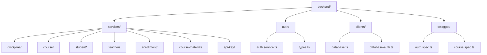
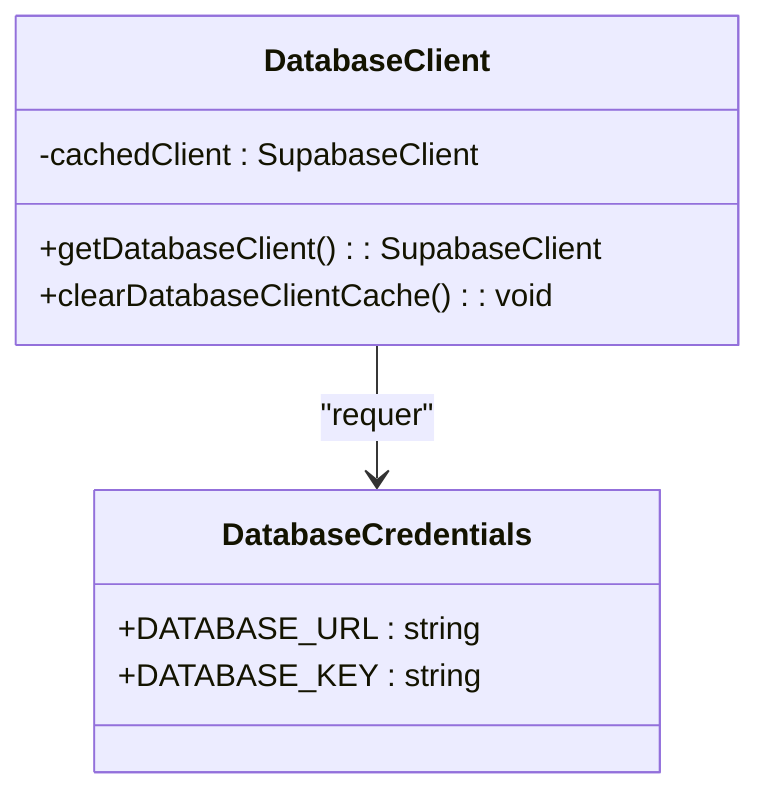
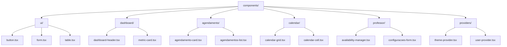
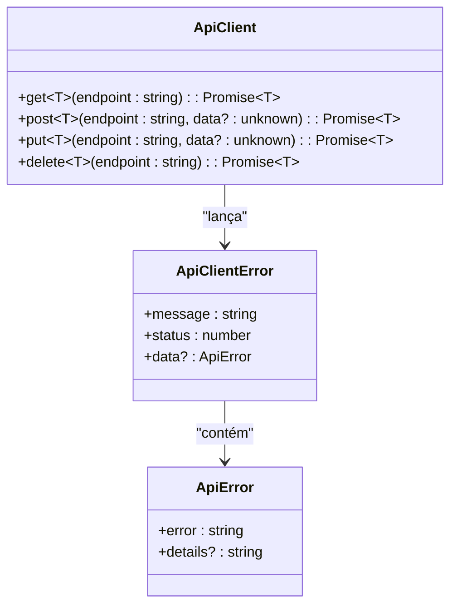
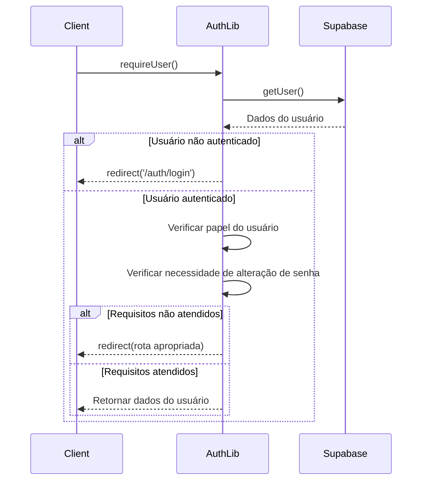
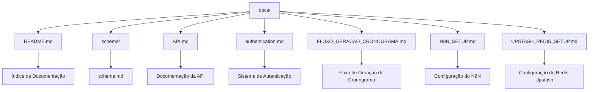

# Estrutura de Diretórios

<cite>
**Arquivos Referenciados neste Documento**  
- [app/layout.tsx](file://app/layout.tsx)
- [app/dashboard/layout.tsx](file://app/dashboard/layout.tsx)
- [backend/auth/auth.service.ts](file://backend/auth/auth.service.ts)
- [backend/clients/database.ts](file://backend/clients/database.ts)
- [lib/api-client.ts](file://lib/api-client.ts)
- [lib/auth.ts](file://lib/auth.ts)
- [lib/utils.ts](file://lib/utils.ts)
- [docs/README.md](file://docs/README.md)
- [supabase/config.toml](file://supabase/config.toml)
</cite>

## Sumário
1. [Introdução](#introdução)
2. [Diretório app/](#diretório-app)
3. [Diretório backend/](#diretório-backend)
4. [Diretório components/](#diretório-components)
5. [Diretório lib/](#diretório-lib)
6. [Diretório hooks/](#diretório-hooks)
7. [Diretório types/](#diretório-types)
8. [Diretório docs/](#diretório-docs)
9. [Diretório supabase/](#diretório-supabase)
10. [Diretório scripts/](#diretório-scripts)
11. [Mapa Mental da Estrutura](#mapa-mental-da-estrutura)
12. [Boas Práticas e Convenções](#boas-práticas-e-convenções)

## Introdução

Este documento apresenta uma análise detalhada da estrutura de diretórios do projeto Área do Aluno, um sistema completo de gerenciamento educacional com arquitetura modular baseada em princípios SOLID, KISS e YAGNI. A estrutura foi projetada para promover escalabilidade, manutenibilidade e clareza na separação de responsabilidades entre os diferentes aspectos do sistema.

A organização do projeto segue padrões modernos de desenvolvimento com Next.js 16, TypeScript 5 e Supabase, utilizando o App Router para roteamento, componentes React reutilizáveis e uma arquitetura backend modularizada. Cada diretório tem um propósito bem definido, contribuindo para um sistema coeso e bem estruturado.

**Seção fontes**
- [app/layout.tsx](file://app/layout.tsx#L1-L76)
- [README.md](file://README.md#L1-L318)

## Diretório app

O diretório `app/` representa a camada de apresentação da aplicação, implementada com o App Router do Next.js 16. Esta estrutura permite roteamento baseado em arquivos, renderização no servidor (SSR), e uma organização clara das rotas da aplicação.

### App Router e Estrutura de Rotas

O App Router do Next.js é o mecanismo central de roteamento da aplicação, onde cada subdiretório representa uma rota e arquivos especiais como `page.tsx`, `layout.tsx` e `route.ts` definem o comportamento da interface e da API. O arquivo `layout.tsx` na raiz do diretório define o layout comum para toda a aplicação, incluindo configurações de tema e metadados.

```mermaid
graph TD
A[app/] --> B[layout.tsx]
A --> C[page.tsx]
A --> D[auth/]
A --> E[(dashboard)/]
A --> F[api/]
B --> G["<html lang='pt-BR'>"]
B --> H[ThemeProvider]
C --> I[Página Inicial]
D --> J[Páginas de Autenticação]
E --> K[Rotas Protegidas]
F --> L[API Routes]
```

**Fontes do diagrama**
- [app/layout.tsx](file://app/layout.tsx#L1-L76)
- [app/page.tsx](file://app/page.tsx)

### Rotas Protegidas com (dashboard)

O diretório `(dashboard)` utiliza a funcionalidade de grupos do App Router para organizar rotas protegidas sem afetar a URL final. Este padrão permite agrupar todas as rotas do painel administrativo enquanto mantém URLs limpas como `/aluno`, `/professor`, etc. O layout do dashboard, definido em `dashboard/layout.tsx`, inclui componentes como `AppSidebar` e `UserProvider` para gerenciar a interface do painel.

```mermaid
graph TD
A[(dashboard)/] --> B[layout.tsx]
A --> C[aluno/]
A --> D[professor/]
A --> E[admin/]
A --> F[curso/]
A --> G[disciplina/]
B --> H[AppSidebar]
B --> I[UserProvider]
B --> J[DynamicBreadcrumb]
C --> K[Dashboard do Aluno]
D --> L[Dashboard do Professor]
E --> M[Área Administrativa]
```

**Fontes do diagrama**
- [app/dashboard/layout.tsx](file://app/dashboard/layout.tsx#L1-L41)
- [app/(dashboard)/aluno/page.tsx](file://app/(dashboard)/aluno/page.tsx)
- [app/(dashboard)/professor/page.tsx](file://app/(dashboard)/professor/page.tsx)

### Páginas de Autenticação

O diretório `auth/` contém todas as páginas relacionadas ao fluxo de autenticação do usuário, incluindo login, cadastro, recuperação de senha e atualização de senha. Essas páginas são acessíveis publicamente e fornecem a interface para que os usuários acessem o sistema.

**Exemplos representativos:**
- `auth/login/page.tsx`: Página de login com formulário de autenticação
- `auth/sign-up/page.tsx`: Página de cadastro de novos usuários
- `auth/forgot-password/page.tsx`: Página para recuperação de senha
- `auth/update-password/page.tsx`: Página para atualização de senha após login

**Seção fontes**
- [app/auth/login/page.tsx](file://app/auth/login/page.tsx)
- [app/auth/sign-up/page.tsx](file://app/auth/sign-up/page.tsx)

### API Routes

O diretório `api/` contém as rotas da API implementadas como Server Actions do Next.js. Cada subdiretório representa um recurso da API, seguindo uma estrutura RESTful. Essas rotas são acessadas via requisições HTTP e fornecem a interface entre o frontend e o backend.

**Exemplos representativos:**
- `api/auth/signin/route.ts`: Endpoint de autenticação
- `api/student/import/route.ts`: Endpoint para importação de alunos
- `api/cronograma/route.ts`: Endpoint para criação de cronogramas
- `api/chat/route.ts`: Endpoint para comunicação com o chat de IA

```mermaid
graph TD
A[api/] --> B[auth/]
A --> C[student/]
A --> D[teacher/]
A --> E[cronograma/]
A --> F[chat/]
B --> G[signin/route.ts]
B --> H[signup/route.ts]
C --> I[import/route.ts]
D --> J[[id]/route.ts]
E --> K[route.ts]
F --> L[route.ts]
```

**Fontes do diagrama**
- [app/api/auth/signin/route.ts](file://app/api/auth/signin/route.ts)
- [app/api/student/import/route.ts](file://app/api/student/import/route.ts)
- [app/api/cronograma/route.ts](file://app/api/cronograma/route.ts)

**Seção fontes**
- [app/api/](file://app/api/)

## Diretório backend

O diretório `backend/` contém a lógica de negócio da aplicação, implementada como uma arquitetura modularizada com serviços independentes. Esta separação permite que cada funcionalidade do sistema seja desenvolvida, testada e mantida de forma independente.

### Arquitetura Modular de Serviços

A arquitetura do backend segue um padrão de serviços modulares, onde cada funcionalidade principal do sistema é implementada como um serviço independente. Cada serviço possui sua própria estrutura com tipos, repositórios, serviços e erros específicos, promovendo baixo acoplamento e alta coesão.



**Fontes do diagrama**
- [backend/services/discipline/](file://backend/services/discipline/)
- [backend/services/course/](file://backend/services/course/)
- [backend/services/student/](file://backend/services/student/)

### Serviços Principais

Cada serviço no diretório `services/` implementa uma funcionalidade específica do sistema, seguindo uma estrutura consistente:

- `discipline/`: Gerenciamento de disciplinas acadêmicas
- `course/`: Gerenciamento de cursos e seus relacionamentos
- `student/`: Gerenciamento de alunos e suas matrículas
- `teacher/`: Gerenciamento de professores e suas atribuições
- `enrollment/`: Gerenciamento de matrículas de alunos em cursos
- `course-material/`: Gerenciamento de materiais didáticos
- `api-key/`: Gerenciamento de chaves de API para integrações

**Estrutura padrão de um serviço:**
```
service-name/
├── service-name.types.ts    # Tipos e DTOs
├── service-name.service.ts  # Lógica de negócio
├── service-name.repository.ts # Interface com o banco
├── errors.ts                # Erros específicos
└── index.ts                 # Exportações
```

**Seção fontes**
- [backend/services/discipline/](file://backend/services/discipline/)
- [backend/services/course/](file://backend/services/course/)
- [backend/services/student/](file://backend/services/student/)

### Autenticação

O módulo de autenticação no diretório `auth/` implementa o sistema de autenticação JWT para a aplicação. Ele fornece funcionalidades para cadastro, login, logout e verificação de sessão, integrando-se com o sistema de autenticação do Supabase.

```mermaid
classDiagram
class AuthService {
+signUp(input : SignUpInput) : Promise~AuthResponse~
+signIn(input : SignInInput) : Promise~AuthResponse~
+signOut() : Promise~void~
+getCurrentUser(accessToken : string) : Promise~AuthUser | null~
+refreshSession(refreshToken : string) : Promise~AuthResponse~
}
class AuthUser {
+id : string
+email : string
+role : UserRole
+isSuperAdmin : boolean
}
class AuthResponse {
+user : AuthUser
+session : Session
}
class Session {
+accessToken : string
+refreshToken : string
}
enum UserRole {
aluno
professor
superadmin
}
AuthService --> AuthUser : "cria"
AuthService --> AuthResponse : "retorna"
AuthResponse --> Session : "contém"
```

**Fontes do diagrama**
- [backend/auth/auth.service.ts](file://backend/auth/auth.service.ts#L1-L141)
- [backend/auth/types.ts](file://backend/auth/types.ts)

### Clientes de Banco

O diretório `clients/` contém os clientes de conexão com o banco de dados Supabase. O arquivo `database.ts` implementa um padrão de singleton para garantir que haja apenas uma instância do cliente de banco de dados em toda a aplicação, melhorando o desempenho e a eficiência.



**Fontes do diagrama**
- [backend/clients/database.ts](file://backend/clients/database.ts#L1-L43)

**Seção fontes**
- [backend/auth/auth.service.ts](file://backend/auth/auth.service.ts#L1-L141)
- [backend/clients/database.ts](file://backend/clients/database.ts#L1-L43)

## Diretório components

O diretório `components/` contém todos os componentes React reutilizáveis da aplicação, organizados por funcionalidade e tipo. Esta organização promove a reutilização de código e a consistência na interface do usuário.

### Organização de Componentes

Os componentes são organizados em subdiretórios baseados em sua funcionalidade ou tipo:

- `ui/`: Componentes de interface do usuário genéricos baseados no shadcn/ui
- `dashboard/`: Componentes específicos do painel de controle
- `agendamento/`: Componentes para gerenciamento de agendamentos
- `calendar/`: Componentes para visualização e interação com calendários
- `professor/`: Componentes específicos para funcionalidades de professores
- `providers/`: Providers do React para gerenciamento de estado global

### Componentes Principais

**Componentes de UI:**
- `button.tsx`: Botões estilizados
- `form.tsx`: Formulários com validação
- `table.tsx`: Tabelas de dados
- `card.tsx`: Cards para agrupamento de conteúdo
- `dialog.tsx`: Diálogos modais

**Componentes de Dashboard:**
- `dashboard-header.tsx`: Cabeçalho do painel
- `metric-card.tsx`: Cards para exibição de métricas
- `schedule-progress.tsx`: Visualização de progresso de cronogramas
- `subject-distribution.tsx`: Distribuição de disciplinas

**Componentes de Agendamento:**
- `agendamento-card.tsx`: Visualização de agendamentos individuais
- `agendamentos-list.tsx`: Lista de agendamentos
- `availability-manager.tsx`: Gerenciamento de disponibilidade

**Componentes de Provedores:**
- `theme-provider.tsx`: Gerenciamento de tema claro/escuro
- `user-provider.tsx`: Provedor de informações do usuário autenticado



**Fontes do diagrama**
- [components/ui/button.tsx](file://components/ui/button.tsx)
- [components/dashboard/metric-card.tsx](file://components/dashboard/metric-card.tsx)
- [components/agendamento/agendamento-card.tsx](file://components/agendamento/agendamento-card.tsx)

**Seção fontes**
- [components/](file://components/)

## Diretório lib

O diretório `lib/` contém utilitários, clientes de API e funções auxiliares que são utilizados em várias partes da aplicação. Estes módulos fornecem funcionalidades comuns que não se encaixam naturalmente em componentes ou serviços.

### Utilitários

O subdiretório `utils.ts` contém funções utilitárias para manipulação de classes CSS, integração com Tailwind CSS e outras operações comuns.

```typescript
export function cn(...inputs: ClassValue[]) {
  return twMerge(clsx(inputs))
}
```

Este utilitário `cn` combina classes CSS de forma segura, resolvendo conflitos entre classes do Tailwind CSS.

### Validações

O diretório contém arquivos de validação específicos para diferentes funcionalidades, como `agendamento-validations.ts`, que provavelmente contém validações para formulários de agendamento.

### Clientes de API

O arquivo `api-client.ts` implementa um cliente HTTP para comunicação com a API da aplicação. Ele gerencia automaticamente o token de autenticação JWT, tratamento de erros e logging em ambiente de desenvolvimento.



**Fontes do diagrama**
- [lib/api-client.ts](file://lib/api-client.ts#L1-L277)

### Autenticação e Autorização

O arquivo `auth.ts` contém funções para gerenciamento de autenticação no lado do servidor, incluindo `getAuthenticatedUser()` e `requireUser()`, que verificam a autenticação do usuário e redirecionam para páginas apropriadas quando necessário.



**Fontes do diagrama**
- [lib/auth.ts](file://lib/auth.ts#L1-L121)

**Seção fontes**
- [lib/utils.ts](file://lib/utils.ts#L1-L7)
- [lib/api-client.ts](file://lib/api-client.ts#L1-L277)
- [lib/auth.ts](file://lib/auth.ts#L1-L121)

## Diretório hooks

O diretório `hooks/` contém React Hooks personalizados que encapsulam lógica de estado e comportamento reutilizável. Estes hooks permitem que componentes funcionais acessem recursos do React e implementem lógica complexa de forma limpa e reutilizável.

### Hooks Principais

- `use-mobile.ts`: Hook para detectar se o dispositivo é móvel
- `use-study-timer.ts`: Hook para gerenciar temporizadores de estudo
- `use-swipe.ts`: Hook para detectar gestos de deslize
- `use-theme.ts`: Hook para gerenciar o tema da aplicação (claro/escuro)

Estes hooks seguem o padrão de hooks personalizados do React, permitindo que a lógica de estado seja compartilhada entre componentes sem a necessidade de renderização condicional complexa ou prop drilling.

**Seção fontes**
- [hooks/use-mobile.ts](file://hooks/use-mobile.ts)
- [hooks/use-study-timer.ts](file://hooks/use-study-timer.ts)

## Diretório types

O diretório `types/` contém definições de tipos TypeScript que são utilizadas em várias partes da aplicação. Estes tipos fornecem segurança de tipo em todo o sistema, garantindo que os dados sejam utilizados de forma consistente.

### Tipos Principais

- `dashboard.ts`: Tipos relacionados ao painel de controle
- `sessao-estudo.ts`: Tipos para gerenciamento de sessões de estudo
- `user.ts`: Tipos para representar usuários do sistema

A centralização dos tipos neste diretório permite que mudanças na estrutura de dados sejam feitas em um único local, reduzindo a possibilidade de erros de tipo em tempo de execução.

**Seção fontes**
- [types/user.ts](file://types/user.ts)
- [types/dashboard.ts](file://types/dashboard.ts)

## Diretório docs

O diretório `docs/` contém toda a documentação técnica do projeto, organizada por categorias para facilitar a navegação e a localização de informações específicas.

### Organização da Documentação Técnica

A documentação está organizada em categorias lógicas:

- **Início Rápido**: Documentação para configuração inicial do projeto
- **Autenticação e Segurança**: Detalhes sobre o sistema de autenticação
- **API e Backend**: Documentação da API e estrutura do backend
- **Chat e IA**: Informações sobre o sistema de chat assistido por IA
- **Infraestrutura**: Configurações de Redis, Supabase MCP, etc.
- **Fluxos e Funcionalidades**: Documentação de fluxos específicos como geração de cronogramas
- **Guias Técnicos**: Instruções detalhadas para tarefas específicas

O arquivo `README.md` dentro do diretório `docs/` serve como índice, fornecendo links rápidos para os documentos mais importantes e permitindo busca por funcionalidade.



**Fontes do diagrama**
- [docs/README.md](file://docs/README.md#L1-L104)
- [docs/API.md](file://docs/API.md)
- [docs/authentication.md](file://docs/authentication.md)

**Seção fontes**
- [docs/README.md](file://docs/README.md#L1-L104)

## Diretório supabase

O diretório `supabase/` contém recursos específicos do Supabase, incluindo migrations do banco de dados e funções de edge.

### Migrations

O subdiretório `migrations/` contém scripts SQL que definem a estrutura do banco de dados. Cada arquivo de migração é nomeado com um prefixo de data e uma descrição, garantindo que as migrações sejam aplicadas na ordem correta.

**Exemplos representativos:**
- `20250120_create_alunos.sql`: Criação da tabela de alunos
- `20250123_create_cronogramas.sql`: Criação da tabela de cronogramas
- `20250131_create_atividades_tables.sql`: Criação das tabelas de atividades
- `20251208_create_agendamentos.sql`: Criação da tabela de agendamentos

### Funções de Edge

O subdiretório `functions/` contém funções do Supabase que são executadas em edge, próximo ao usuário. Estas funções são implementadas em TypeScript e podem ser acionadas por eventos no banco de dados.

**Exemplos representativos:**
- `enviar-notificacao-agendamento/index.ts`: Envia notificações para agendamentos
- `gerar-cronograma/index.ts`: Gera cronogramas de estudo
- `processar-lembretes/index.ts`: Processa lembretes programados

### Configuração

O arquivo `config.toml` contém configurações específicas para as funções de edge, como a desabilitação da verificação JWT para funções específicas e a configuração do armazenamento.

```toml
[functions.gerar-cronograma]
verify_jwt = false

[storage]
enabled = false
```

Esta configuração desabilita a verificação JWT para a função de geração de cronograma, permitindo que ela seja chamada sem autenticação, e desabilita temporariamente o armazenamento para evitar erros de migração.

**Fontes do diagrama**
- [supabase/config.toml](file://supabase/config.toml#L1-L15)
- [supabase/functions/gerar-cronograma/index.ts](file://supabase/functions/gerar-cronograma/index.ts)

**Seção fontes**
- [supabase/migrations/](file://supabase/migrations/)
- [supabase/functions/](file://supabase/functions/)
- [supabase/config.toml](file://supabase/config.toml#L1-L15)

## Diretório scripts

O diretório `scripts/` contém scripts utilitários para tarefas de automação, configuração e manutenção do sistema.

### Scripts Principais

- `apply-rls-policies.js`: Aplica políticas de segurança em nível de linha (RLS) no Supabase
- `delete-all-students.sql`: Script SQL para deletar todos os alunos (provavelmente para testes)
- `delete-all-students.ts`: Versão TypeScript do script de deleção
- `setup-supabase-mcp.sh`: Script shell para configuração do Supabase MCP
- `setup-supabase-mcp.ps1`: Script PowerShell para configuração do Supabase MCP
- `test-chat-callback.sh`: Script para testar callbacks do chat
- `test-frente-c-mat.ts`: Script de teste para funcionalidades específicas

Estes scripts facilitam tarefas repetitivas de configuração e manutenção, garantindo que o ambiente de desenvolvimento e produção possa ser configurado de forma consistente.

**Seção fontes**
- [scripts/apply-rls-policies.js](file://scripts/apply-rls-policies.js)
- [scripts/setup-supabase-mcp.sh](file://scripts/setup-supabase-mcp.sh)

## Mapa Mental da Estrutura

```mermaid
mindmap
root((Área do Aluno))
app
layout.tsx
page.tsx
auth
(dashboard)
api
backend
services
discipline
course
student
teacher
enrollment
course-material
api-key
auth
clients
swagger
components
ui
dashboard
agendamento
calendar
professor
providers
lib
utils
api-client
auth
roles
hooks
use-mobile
use-study-timer
use-swipe
use-theme
types
user
dashboard
sessao-estudo
docs
README.md
API.md
authentication.md
schema
supabase
migrations
functions
config.toml
scripts
apply-rls-policies.js
setup-supabase-mcp.sh
```

**Fontes do diagrama**
- [app/](file://app/)
- [backend/](file://backend/)
- [components/](file://components/)
- [lib/](file://lib/)
- [hooks/](file://hooks/)
- [types/](file://types/)
- [docs/](file://docs/)
- [supabase/](file://supabase/)
- [scripts/](file://scripts/)

## Boas Práticas e Convenções

### Convenções de Nomenclatura

O projeto segue convenções de nomenclatura consistentes em todos os diretórios:

- **Diretórios e arquivos**: Usa kebab-case (ex: `agendamento-validations.ts`)
- **Classes e tipos**: Usa PascalCase (ex: `AuthService`, `AuthUser`)
- **Funções e variáveis**: Usa camelCase (ex: `getAuthenticatedUser`, `requireUser`)
- **Constantes**: Usa SCREAMING_SNAKE_CASE (quando aplicável)
- **Componentes React**: Usa PascalCase (ex: `DashboardHeader`, `AgendamentoCard`)

### Organização de Código

Para adicionar novos componentes ou serviços, siga estas diretrizes:

1. **Para novos componentes**:
   - Adicione ao diretório `components/` em um subdiretório apropriado
   - Se for um componente genérico de UI, coloque em `components/ui/`
   - Se for específico para uma funcionalidade, crie um subdiretório específico (ex: `components/flashcards/`)
   - Exporte o componente no arquivo `index.ts` do diretório para facilitar a importação

2. **Para novos serviços no backend**:
   - Adicione ao diretório `backend/services/` com um novo subdiretório
   - Siga a estrutura padrão: `service-name.types.ts`, `service-name.service.ts`, `service-name.repository.ts`, `errors.ts`, `index.ts`
   - Defina claramente os tipos e interfaces no arquivo `.types.ts`
   - Implemente a lógica de negócio no arquivo `.service.ts`
   - Implemente a interface com o banco no arquivo `.repository.ts`
   - Defina erros específicos do serviço no arquivo `errors.ts`
   - Exporte as funcionalidades principais no arquivo `index.ts`

3. **Para novas rotas API**:
   - Adicione ao diretório `app/api/` com um novo subdiretório
   - Siga a estrutura RESTful (ex: `app/api/student/[id]/route.ts`)
   - Implemente os métodos HTTP apropriados (GET, POST, PUT, DELETE)
   - Valide os dados de entrada e trate erros adequadamente
   - Utilize os serviços do backend para implementar a lógica de negócio

4. **Para novos tipos**:
   - Adicione ao diretório `types/` se for um tipo utilizado em múltiplos lugares
   - Se for específico para um módulo, considere colocar no diretório do módulo
   - Use interfaces para objetos que podem ser estendidos e types para uniões e tipos primitivos

Estas convenções garantem que o código permaneça consistente, previsível e fácil de manter à medida que o projeto cresce.

**Seção fontes**
- [README.md](file://README.md#L278-L289)
- [lib/utils.ts](file://lib/utils.ts)
- [backend/services/discipline/](file://backend/services/discipline/)