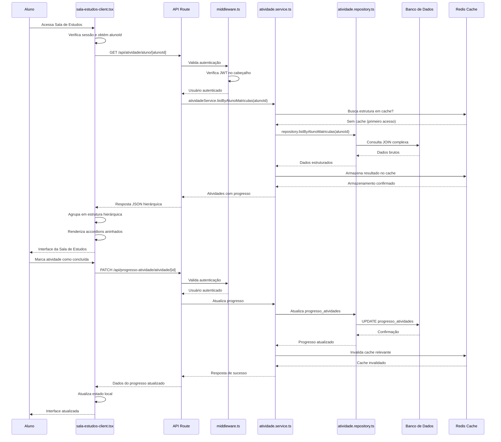

# Fluxo de Acesso à Sala de Estudos

<cite>
**Arquivos Referenciados neste Documento**  
- [sala-estudos-client.tsx](file://app/(dashboard)/aluno/sala-de-estudos/sala-estudos-client.tsx)
- [middleware.ts](file://backend/auth/middleware.ts)
- [atividade.service.ts](file://backend/services/atividade/atividade.service.ts)
- [atividade.repository.ts](file://backend/services/atividade/atividade.repository.ts)
- [types.ts](file://app/(dashboard)/aluno/sala-de-estudos/types.ts)
- [course-structure-cache.service.ts](file://backend/services/cache/course-structure-cache.service.ts)
</cite>

## Sumário
1. [Introdução](#introdução)
2. [Fluxo de Acesso do Aluno](#fluxo-de-acesso-do-aluno)
3. [Requisição no Frontend](#requisição-no-frontend)
4. [Validação de Autenticação no Middleware](#validação-de-autenticação-no-middleware)
5. [Processamento no Serviço Atividade](#processamento-no-serviço-atividade)
6. [Consulta ao Banco de Dados](#consulta-ao-banco-de-dados)
7. [Estrutura de Resposta Hierárquica](#estrutura-de-resposta-hierárquica)
8. [Uso de Cache com course-structure-cache.service.ts](#uso-de-cache-com-course-structure-cache.servicets)
9. [Cenários de Erro](#cenários-de-erro)
10. [Renderização dos Accordions e Atualização de Progresso](#renderização-dos-accordions-e-atualização-de-progresso)
11. [Diagrama de Sequência](#diagrama-de-sequência)

## Introdução
Este documento detalha o fluxo completo de acesso do aluno à Sala de Estudos, desde a requisição inicial no frontend até a renderização final da interface. O sistema organiza as atividades em uma estrutura hierárquica (curso > disciplina > frente > módulo > atividade) e utiliza mecanismos de cache para otimizar o desempenho. O documento aborda também a validação de autenticação, tratamento de erros e atualização de progresso.

## Fluxo de Acesso do Aluno
O acesso à Sala de Estudos inicia quando o aluno entra na página correspondente. O sistema então executa uma sequência de operações para carregar as atividades do aluno, organizadas hierarquicamente por curso, disciplina, frente, módulo e atividade. O fluxo envolve componentes do frontend, validação de autenticação, processamento no backend e consulta ao banco de dados.

**Section sources**
- [sala-estudos-client.tsx](file://app/(dashboard)/aluno/sala-de-estudos/sala-estudos-client.tsx)

## Requisição no Frontend
A requisição inicial é feita pelo componente `sala-estudos-client.tsx`, que é um componente React do lado do cliente. O componente utiliza o hook `useEffect` para buscar os dados do aluno e suas atividades assim que a página é carregada.

O processo começa com a verificação da sessão de autenticação do aluno usando `supabase.auth.getUser()`. Após a autenticação, o sistema determina o papel (role) do usuário e seu ID. Com base nisso, são carregados os cursos associados ao aluno, seguidos pelas disciplinas, frentes e módulos relacionados.

A requisição final às atividades é feita indiretamente através da API em `/api/atividade/aluno/[alunoId]`, mas o frontend realiza múltiplas consultas ao Supabase para construir a estrutura hierárquica completa.

**Section sources**
- [sala-estudos-client.tsx](file://app/(dashboard)/aluno/sala-de-estudos/sala-estudos-client.tsx)

## Validação de Autenticação no Middleware
A validação de autenticação é realizada pelo middleware localizado em `backend/auth/middleware.ts`. Este middleware é responsável por verificar a presença e validade do token JWT no cabeçalho de autorização da requisição.

O middleware tenta primeiro autenticar via JWT (Bearer token) e, caso falhe, tenta autenticar via API Key. A função `getAuthUser` extrai o token do cabeçalho `Authorization`, valida-o com o cliente Supabase e retorna um objeto `AuthUser` com as informações do usuário, incluindo seu papel (role) e se é superadmin.

O middleware fornece decoradores como `requireAuth`, `requireUserAuth`, `requireRole` e `requireSuperAdmin` que podem ser usados para proteger rotas específicas. Para a rota de atividades do aluno, o `requireUserAuth` é aplicado para garantir que apenas usuários autenticados possam acessar os dados.

**Section sources**
- [middleware.ts](file://backend/auth/middleware.ts)

## Processamento no Serviço Atividade
O processamento das atividades é gerenciado pelo serviço `atividade.service.ts`. Este serviço atua como camada intermediária entre o frontend e o repositório de dados, encapsulando a lógica de negócios relacionada às atividades.

O método principal para este fluxo é `listByAlunoMatriculas`, que recebe o `alunoId` e retorna todas as atividades do aluno com seu progresso e hierarquia completa. O serviço valida o `alunoId` e delega a consulta ao repositório.

O serviço também implementa cache para melhorar o desempenho. O método `listByModulo` utiliza o `activityCacheService` para buscar atividades em cache antes de consultar o banco de dados. Quando atividades são criadas, atualizadas ou deletadas, o cache correspondente é invalidado para garantir consistência.

**Section sources**
- [atividade.service.ts](file://backend/services/atividade/atividade.service.ts)

## Consulta ao Banco de Dados
A consulta ao banco de dados é realizada pelo repositório `atividade.repository.ts`. Este repositório contém os métodos que executam as consultas SQL diretamente no banco de dados Supabase.

O método `listByAlunoMatriculas` não é implementado diretamente no repositório, mas delega para um helper importado dinamicamente (`atividade.repository-helper`) para evitar dependências circulares. Esse helper realiza uma consulta complexa que junta múltiplas tabelas:

- `alunos_cursos` para encontrar os cursos do aluno
- `cursos_disciplinas` para encontrar as disciplinas de cada curso
- `frentes` para encontrar as frentes de cada disciplina
- `modulos` para encontrar os módulos de cada frente
- `atividades` para encontrar as atividades de cada módulo
- `progresso_atividades` para encontrar o progresso do aluno em cada atividade

As consultas são otimizadas com ordenação por `ordem_exibicao` e `created_at` para garantir uma apresentação consistente.

**Section sources**
- [atividade.repository.ts](file://backend/services/atividade/atividade.repository.ts)

## Estrutura de Resposta Hierárquica
Os dados são organizados em uma estrutura hierárquica complexa definida nos tipos em `types.ts`. A estrutura principal é uma árvore com os seguintes níveis:

- `CursoComDisciplinas`: representa um curso com uma lista de disciplinas
- `DisciplinaComFrentes`: representa uma disciplina com uma lista de frentes
- `FrenteComModulos`: representa uma frente com uma lista de módulos
- `ModuloComAtividades`: representa um módulo com uma lista de atividades
- `AtividadeComProgresso`: representa uma atividade com seu progresso

A interface `AtividadeComProgresso` inclui campos para o progresso do aluno, como `progressoStatus`, `progressoDataInicio`, `progressoDataConclusao`, além de campos de desempenho como `questoesTotais`, `questoesAcertos`, `dificuldadePercebida` e `anotacoesPessoais`.

Após buscar todos os dados, o frontend agrupa as atividades em `estruturaHierarquica` usando mapas para evitar duplicações e garantir a integridade da hierarquia.

**Section sources**
- [types.ts](file://app/(dashboard)/aluno/sala-de-estudos/types.ts)
- [sala-estudos-client.tsx](file://app/(dashboard)/aluno/sala-de-estudos/sala-estudos-client.tsx)

## Uso de Cache com course-structure-cache.service.ts
O sistema utiliza um mecanismo de cache para otimizar o desempenho, implementado em `course-structure-cache.service.ts`. Este serviço de cache armazena estruturas de curso, disciplina, frente e módulo para evitar consultas repetidas ao banco de dados.

O cache é baseado em Redis (Upstash) e utiliza chaves específicas para cada tipo de dado. Por exemplo, a estrutura de atividades por módulo é armazenada com uma chave como `activities:modulo:{id}`.

O serviço `activityCacheService` é injetado no `AtividadeService` e usado nos métodos `listByModulo` (para buscar em cache) e `create`, `update`, `delete` (para invalidar o cache). Quando uma atividade é modificada, o cache do módulo correspondente é invalidado com `invalidateModulo`.

O cache melhora significativamente o desempenho, especialmente para operações de leitura frequentes, reduzindo a carga no banco de dados e diminuindo a latência das respostas.

**Section sources**
- [course-structure-cache.service.ts](file://backend/services/cache/course-structure-cache.service.ts)
- [atividade.service.ts](file://backend/services/atividade/atividade.service.ts)

## Cenários de Erro
O sistema trata vários cenários de erro para garantir uma experiência de usuário robusta:

- **Aluno não autenticado**: Se o token JWT estiver ausente ou inválido, o middleware retorna status 401 Unauthorized.
- **Aluno não encontrado**: Se o `alunoId` não existir no banco de dados, o serviço retorna um erro apropriado.
- **Permissão negada**: Se um usuário tentar acessar dados de outro aluno, o sistema verifica as permissões com base no papel (role) do usuário.
- **Erro de banco de dados**: Qualquer erro na consulta ao banco de dados é capturado e convertido em uma mensagem de erro formatada.
- **Sessão expirada**: Se a sessão do aluno expirar durante a interação, o sistema detecta e exige novo login.

As mensagens de erro são formatadas pela função `formatSupabaseError` em `sala-estudos-client.tsx`, que extrai informações relevantes como código, mensagem, detalhes e hint para apresentar ao usuário de forma clara.

**Section sources**
- [sala-estudos-client.tsx](file://app/(dashboard)/aluno/sala-de-estudos/sala-estudos-client.tsx)
- [middleware.ts](file://backend/auth/middleware.ts)

## Renderização dos Accordions e Atualização de Progresso
A renderização da interface é feita no componente `sala-estudos-client.tsx` usando uma estrutura de accordions aninhados. Cada nível da hierarquia (curso, disciplina, frente, módulo) é representado por um accordion que pode ser expandido ou recolhido.

O componente `ModuloActivitiesAccordion` é usado para renderizar as atividades de cada módulo. Cada atividade é exibida com seu título, tipo e status de progresso, permitindo que o aluno marque como concluída.

A atualização de progresso é feita através de handlers como `handleStatusChange` e `handleStatusChangeWithDesempenho`. Esses handlers fazem requisições PATCH para a API em `/api/progresso-atividade/atividade/[id]`, enviando o novo status e, opcionalmente, dados de desempenho.

Após uma resposta bem-sucedida da API, o estado local é atualizado para refletir imediatamente a mudança, proporcionando feedback instantâneo ao usuário sem necessidade de recarregar a página.

**Section sources**
- [sala-estudos-client.tsx](file://app/(dashboard)/aluno/sala-de-estudos/sala-estudos-client.tsx)

**Diagram sources**
- [sala-estudos-client.tsx](file://app/(dashboard)/aluno/sala-de-estudos/sala-estudos-client.tsx)
- [middleware.ts](file://backend/auth/middleware.ts)
- [atividade.service.ts](file://backend/services/atividade/atividade.service.ts)
- [atividade.repository.ts](file://backend/services/atividade/atividade.repository.ts)
- [course-structure-cache.service.ts](file://backend/services/cache/course-structure-cache.service.ts)