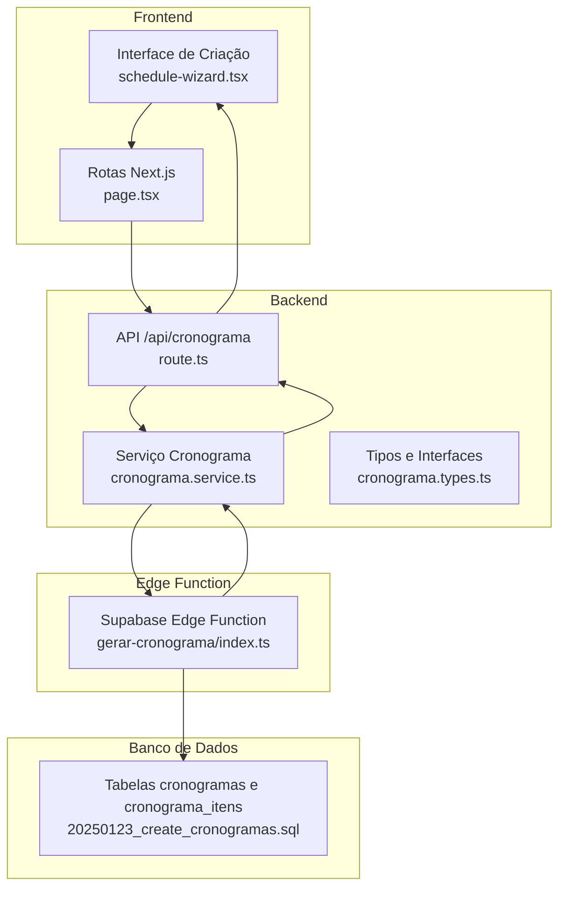
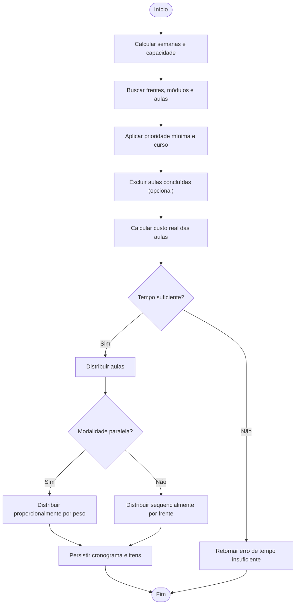
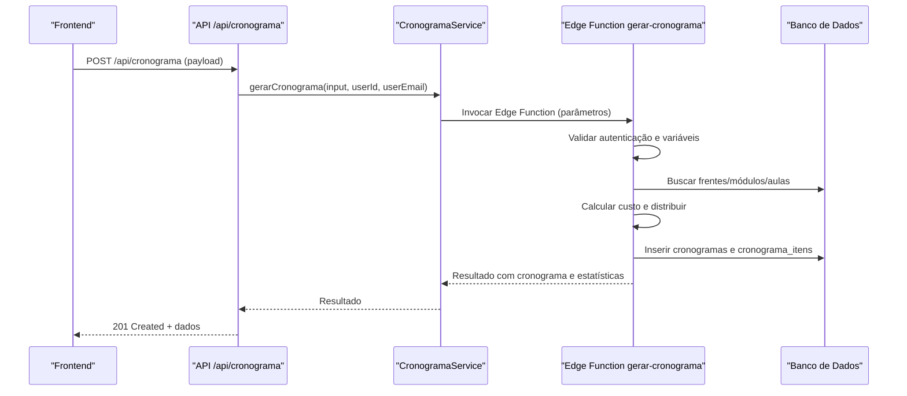
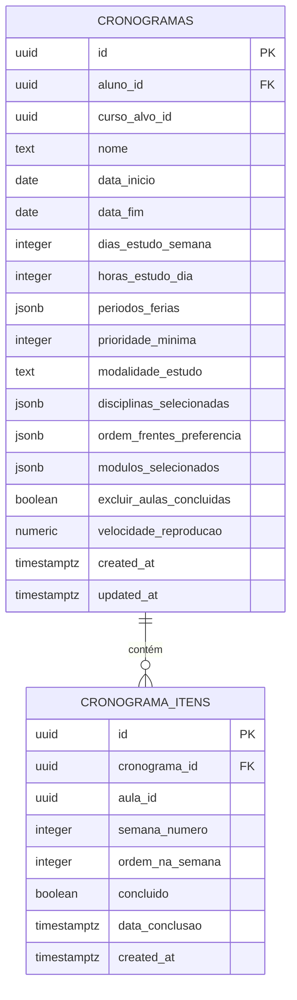

# Fluxo de Geração de Cronograma

<cite>
**Arquivos Referenciados Neste Documento**
- [page.tsx](file://app/(dashboard)/aluno/cronograma/novo/page.tsx)
- [schedule-wizard.tsx](file://components/schedule-wizard.tsx)
- [route.ts](file://app/api/cronograma/route.ts)
- [cronograma.service.ts](file://backend/services/cronograma/cronograma.service.ts)
- [index.ts](file://supabase/functions/gerar-cronograma/index.ts)
- [cronograma.types.ts](file://backend/services/cronograma/cronograma.types.ts)
- [20250123_create_cronogramas.sql](file://supabase/migrations/20250123_create_cronogramas.sql)
- [FLUXO_GERACAO_CRONOGRAMA.md](file://docs/FLUXO_GERACAO_CRONOGRAMA.md)
</cite>

## Sumário
Este documento descreve o fluxo completo de geração de cronograma, desde a interface do frontend até o backend e a Edge Function Supabase, incluindo validações, distribuição de dias, regras de atividades, persistência no banco de dados e tratamento de erros. Também apresenta exemplos de payload de entrada e saída, estratégias de retry e logs de exemplo.

## Introdução
O sistema permite que usuários (alunos) configurem um cronograma de estudos personalizado com base em disciplinas e módulos de um curso. O fluxo envolve:
- Interface de cadastro de preferências no frontend
- Validação e preparação do payload no backend
- Execução da lógica de geração na Edge Function Supabase
- Persistência no banco de dados e retorno assíncrono
- Atualização da UI com base no resultado

## Arquitetura Geral

**Diagrama fontes**
- [page.tsx](file://app/(dashboard)/aluno/cronograma/novo/page.tsx#L1-L11)
- [schedule-wizard.tsx](file://components/schedule-wizard.tsx#L848-L1070)
- [route.ts](file://app/api/cronograma/route.ts#L52-L115)
- [cronograma.service.ts](file://backend/services/cronograma/cronograma.service.ts#L51-L120)
- [index.ts](file://supabase/functions/gerar-cronograma/index.ts#L100-L120)
- [20250123_create_cronogramas.sql](file://supabase/migrations/20250123_create_cronogramas.sql#L6-L54)

**Seção fontes**
- [page.tsx](file://app/(dashboard)/aluno/cronograma/novo/page.tsx#L1-L11)
- [schedule-wizard.tsx](file://components/schedule-wizard.tsx#L848-L1070)
- [route.ts](file://app/api/cronograma/route.ts#L52-L115)
- [cronograma.service.ts](file://backend/services/cronograma/cronograma.service.ts#L51-L120)
- [index.ts](file://supabase/functions/gerar-cronograma/index.ts#L100-L120)
- [20250123_create_cronogramas.sql](file://supabase/migrations/20250123_create_cronogramas.sql#L6-L54)

## Fluxo Passo a Passo

### 1. Interface no Frontend (cronograma-novo-client)
- O usuário acessa a página de criação de cronograma.
- O componente de wizard coleta preferências: período, dias/semana, horas/dia, férias, disciplinas, módulos, modalidade, velocidade de reprodução, prioridade mínima, exclusão de aulas concluídas.
- O wizard monta o payload com base nos dados do formulário e envia para a API local.

**Seção fontes**
- [page.tsx](file://app/(dashboard)/aluno/cronograma/novo/page.tsx#L1-L11)
- [schedule-wizard.tsx](file://components/schedule-wizard.tsx#L848-L1070)

### 2. API POST /api/cronograma
- A rota recebe o payload, valida campos obrigatórios e aplica valores padrão.
- Chama o serviço de geração de cronograma com os dados do usuário autenticado.

**Seção fontes**
- [route.ts](file://app/api/cronograma/route.ts#L52-L115)

### 3. Validação e preparação no Serviço Cronograma
- Validação de campos obrigatórios e datas.
- Garante que o aluno_id corresponda ao usuário autenticado.
- Calcula semanas úteis, excluindo férias.
- Busca frentes, módulos e aulas com base nas disciplinas e módulos selecionados.
- Aplica prioridade mínima e filtros de curso.
- Exclui aulas concluídas se solicitado.
- Calcula custo real das aulas e verifica viabilidade de tempo.
- Distribui as aulas pelas semanas (paralelo ou sequencial).
- Persiste o cronograma e itens no banco de dados.

**Seção fontes**
- [cronograma.service.ts](file://backend/services/cronograma/cronograma.service.ts#L51-L120)
- [cronograma.service.ts](file://backend/services/cronograma/cronograma.service.ts#L385-L800)
- [cronograma.service.ts](file://backend/services/cronograma/cronograma.service.ts#L120-L258)

### 4. Edge Function Supabase 'gerar-cronograma'
- A Edge Function realiza o mesmo fluxo de geração, mas com acesso direto ao banco via client admin.
- Busca frentes, módulos e aulas com base nos parâmetros.
- Aplica prioridade mínima e curso.
- Ordena aulas e distribui conforme modalidade.
- Persiste cronograma e itens, retornando o resultado com estatísticas.

**Seção fontes**
- [index.ts](file://supabase/functions/gerar-cronograma/index.ts#L100-L120)
- [index.ts](file://supabase/functions/gerar-cronograma/index.ts#L363-L416)
- [index.ts](file://supabase/functions/gerar-cronograma/index.ts#L417-L671)
- [index.ts](file://supabase/functions/gerar-cronograma/index.ts#L672-L989)

### 5. Persistência no Banco de Dados
- Tabelas envolvidas: cronogramas e cronograma_itens.
- Persistência ocorre tanto no backend quanto na Edge Function (com client admin).
- Índices e políticas de segurança são configurados.

**Seção fontes**
- [20250123_create_cronogramas.sql](file://supabase/migrations/20250123_create_cronogramas.sql#L6-L54)
- [20250123_create_cronogramas.sql](file://supabase/migrations/20250123_create_cronogramas.sql#L55-L97)

### 6. Retorno Assíncrono e Atualização da UI
- A API retorna um status 201 com o cronograma criado e estatísticas.
- O frontend redireciona para a página do cronograma e exibe mensagens de erro ou sugestões de ajuste (tempo insuficiente).

**Seção fontes**
- [route.ts](file://app/api/cronograma/route.ts#L99-L111)
- [schedule-wizard.tsx](file://components/schedule-wizard.tsx#L940-L1070)

## Detalhamento da Lógica de Geração

### Análise de Carga e Cálculo de Capacidade
- O serviço calcula semanas úteis entre data_início e data_fim, descontando períodos de férias.
- A capacidade total é a soma de minutos disponíveis por semana útil.

**Seção fontes**
- [cronograma.service.ts](file://backend/services/cronograma/cronograma.service.ts#L340-L383)
- [index.ts](file://supabase/functions/gerar-cronograma/index.ts#L363-L416)

### Distribuição de Dias
- A distribuição leva em conta:
  - Modalidade: paralelo (proporcional ao custo) ou sequencial (completa uma frente antes de ir para a próxima).
  - Capacidade semanal disponível.
  - Ordem de prioridade das frentes (sequencial) ou pesos calculados (paralelo).

**Seção fontes**
- [cronograma.service.ts](file://backend/services/cronograma/cronograma.service.ts#L211-L237)
- [index.ts](file://supabase/functions/gerar-cronograma/index.ts#L672-L989)

### Aplicação de Regras de Atividades
- Filtros de prioridade mínima e exclusão de aulas concluídas.
- Validação de presença de aulas para cada frente.
- Ajuste de custo com base na velocidade de reprodução.

**Seção fontes**
- [cronograma.service.ts](file://backend/services/cronograma/cronograma.service.ts#L170-L209)
- [index.ts](file://supabase/functions/gerar-cronograma/index.ts#L570-L671)

### Persistência e Cache
- Persistência:
  - Backend: deleta cronograma anterior do aluno e insere o novo.
  - Edge Function: insere cronograma e itens em bulk.
- Cache:
  - O fluxo descrito não menciona cache específico para cronogramas. O repositório possui serviços de cache em outros módulos, mas não são utilizados no fluxo de geração de cronograma.

**Seção fontes**
- [cronograma.service.ts](file://backend/services/cronograma/cronograma.service.ts#L260-L297)
- [index.ts](file://supabase/functions/gerar-cronograma/index.ts#L823-L915)
- [20250123_create_cronogramas.sql](file://supabase/migrations/20250123_create_cronogramas.sql#L55-L97)

## Exemplos de Payload

### Entrada (frontend -> API)
- aluno_id: identificador do usuário autenticado
- data_inicio: data de início do cronograma
- data_fim: data de término do cronograma
- dias_semana: quantidade de dias por semana
- horas_dia: horas de estudo por dia
- ferias: array de objetos com início e fim
- disciplinas_ids: array de disciplinas selecionadas
- modulos_ids: array de módulos selecionados (opcional)
- prioridade_minima: inteiro entre 1 e 5
- modalidade: "paralelo" ou "sequencial"
- curso_alvo_id: identificador do curso (opcional)
- nome: nome do cronograma
- ordem_frentes_preferencia: array de nomes de frentes (sequencial)
- excluir_aulas_concluidas: boolean
- velocidade_reproducao: número entre 1.0 e 2.0

**Seção fontes**
- [schedule-wizard.tsx](file://components/schedule-wizard.tsx#L890-L908)
- [cronograma.types.ts](file://backend/services/cronograma/cronograma.types.ts#L6-L22)

### Saída (API -> frontend)
- success: boolean
- cronograma: objeto com dados do cronograma criado
- estatisticas: totais e resumos

**Seção fontes**
- [route.ts](file://app/api/cronograma/route.ts#L99-L111)
- [cronograma.types.ts](file://backend/services/cronograma/cronograma.types.ts#L95-L100)

## Tratamento de Falhas e Retries

### Erros no Backend
- Validações de campo e datas.
- Erros de tempo insuficiente com detalhes (horas necessárias, disponíveis, horas/dia sugeridas).
- Erros de conflito (409) ao tentar criar cronograma duplicado.

**Seção fontes**
- [route.ts](file://app/api/cronograma/route.ts#L10-L51)
- [cronograma.service.ts](file://backend/services/cronograma/cronograma.service.ts#L196-L208)

### Erros na Edge Function
- Validação de autenticação e variáveis de ambiente.
- Tratamento de erros de busca de frentes, módulos e aulas.
- Retorno com status 400/500 e detalhes.

**Seção fontes**
- [index.ts](file://supabase/functions/gerar-cronograma/index.ts#L100-L120)
- [index.ts](file://supabase/functions/gerar-cronograma/index.ts#L305-L361)
- [index.ts](file://supabase/functions/gerar-cronograma/index.ts#L417-L671)

### Estratégias de Retry
- O fluxo descrito não implementa retry automático. Recomenda-se:
  - Tornar a chamada assíncrona e monitorar o status.
  - Implementar backoff exponencial no frontend.
  - Registrar logs completos para diagnóstico.

[Sem fontes, pois esta seção apresenta recomendações gerais]

## Logs de Exemplo

### Backend
- Início da geração de cronograma com dados de entrada.
- Busca de frentes, módulos e aulas.
- Validação de viabilidade de tempo.
- Distribuição de itens.
- Persistência e retorno.

**Seção fontes**
- [cronograma.service.ts](file://backend/services/cronograma/cronograma.service.ts#L51-L120)
- [cronograma.service.ts](file://backend/services/cronograma/cronograma.service.ts#L385-L800)
- [cronograma.service.ts](file://backend/services/cronograma/cronograma.service.ts#L211-L258)

### Edge Function
- Início da requisição, validação de autenticação e variáveis de ambiente.
- Busca de frentes, módulos e aulas.
- Cálculo de custo e distribuição.
- Persistência e retorno.

**Seção fontes**
- [index.ts](file://supabase/functions/gerar-cronograma/index.ts#L100-L120)
- [index.ts](file://supabase/functions/gerar-cronograma/index.ts#L363-L416)
- [index.ts](file://supabase/functions/gerar-cronograma/index.ts#L417-L671)
- [index.ts](file://supabase/functions/gerar-cronograma/index.ts#L823-L915)

## Fluxo de Distribuição de Aulas (Paralelo vs Sequencial)

**Diagrama fontes**
- [cronograma.service.ts](file://backend/services/cronograma/cronograma.service.ts#L170-L237)
- [index.ts](file://supabase/functions/gerar-cronograma/index.ts#L672-L989)

## Sequência de Chamada (API -> Edge Function)

**Diagrama fontes**
- [route.ts](file://app/api/cronograma/route.ts#L52-L115)
- [cronograma.service.ts](file://backend/services/cronograma/cronograma.service.ts#L51-L120)
- [index.ts](file://supabase/functions/gerar-cronograma/index.ts#L100-L120)
- [index.ts](file://supabase/functions/gerar-cronograma/index.ts#L823-L915)

## Tabelas e Modelos de Dados

**Diagrama fontes**
- [20250123_create_cronogramas.sql](file://supabase/migrations/20250123_create_cronogramas.sql#L6-L54)

**Seção fontes**
- [20250123_create_cronogramas.sql](file://supabase/migrations/20250123_create_cronogramas.sql#L6-L54)

## Considerações de Desempenho
- O backend e a Edge Function realizam buscas com filtros de prioridade e curso, o que pode impactar desempenho dependendo do volume de dados.
- Recomenda-se:
  - Indexação adequada nas colunas usadas em filtros (aulas.prioridade, aulas.modulo_id, cronogramas.aluno_id).
  - Limitar o escopo de disciplinas e módulos selecionados.
  - Evitar grandes volumes de aulas não necessárias (prioridade mínima e exclusão de concluídas).

[Sem fontes, pois esta seção fornece orientações gerais]

## Guia de Depuração

### Problemas Comuns e Soluções
- Módulos da frente C não estão sendo selecionados no frontend:
  - Verificar logs de diagnóstico de frentes e módulos.
  - Confirmar que a frente C possui módulos e que todos são incluídos.
- Módulos da frente C não estão sendo enviados para API:
  - Verificar payload enviado e arrays de módulos.
- Módulos da frente C não pertencem ao curso selecionado:
  - Verificar curso_id nas frentes e módulos.
- Aulas da frente C não têm prioridade suficiente:
  - Ajustar prioridade mínima ou prioridade das aulas.
- Filtro de curso_id está excluindo aulas:
  - Verificar o filtro de curso_id nas aulas.

**Seção fontes**
- [FLUXO_GERACAO_CRONOGRAMA.md](file://docs/FLUXO_GERACAO_CRONOGRAMA.md#L1-L317)

## Conclusão
O fluxo de geração de cronograma combina uma interface intuitiva no frontend com validações rigorosas no backend e Edge Function. A distribuição de aulas considera prioridades, capacidade de tempo e modalidade, persistindo os dados em tabelas bem definidas. Em caso de falhas, o sistema retorna mensagens claras e detalhes para diagnóstico e ajuste.