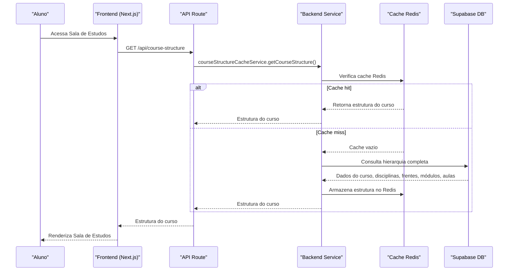
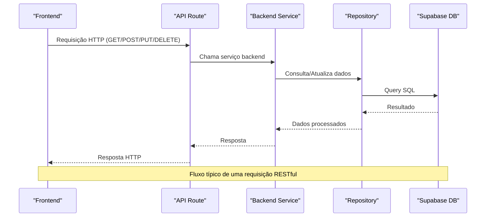
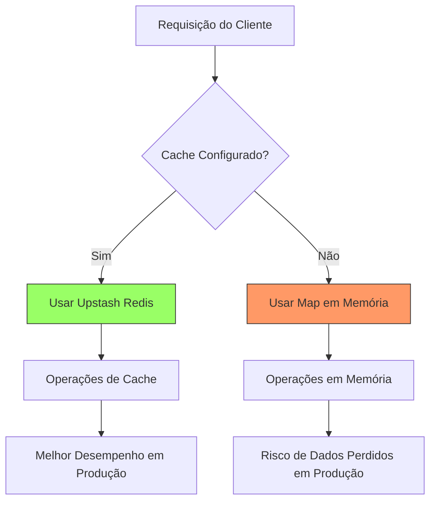
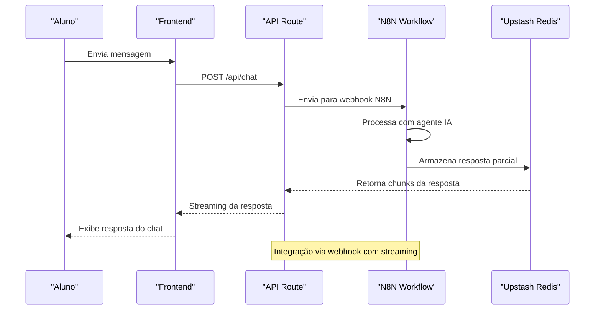
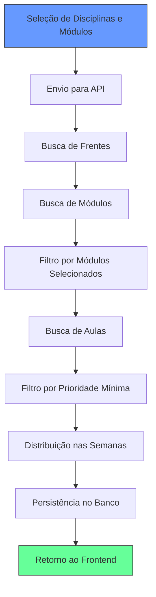
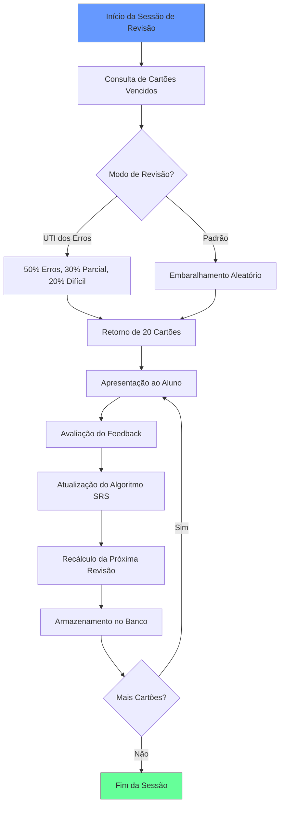

# Fluxos de Dados e Integração

<cite>
**Arquivos Referenciados neste Documento**   
- [app/api/chat/route.ts](file://app/api/chat/route.ts)
- [app/api/conversations/route.ts](file://app/api/conversations/route.ts)
- [app/api/course-structure/route.ts](file://app/api/course-structure/route.ts)
- [backend/services/cache/course-structure-cache.service.ts](file://backend/services/cache/course-structure-cache.service.ts)
- [backend/services/cache/user-profile-cache.service.ts](file://backend/services/cache/user-profile-cache.service.ts)
- [backend/services/cache/activity-cache.service.ts](file://backend/services/cache/activity-cache.service.ts)
- [docs/UPSTASH_REDIS_SETUP.md](file://docs/UPSTASH_REDIS_SETUP.md)
- [docs/N8N_SETUP.md](file://docs/N8N_SETUP.md)
- [docs/API.md](file://docs/API.md)
- [docs/FLUXO_GERACAO_CRONOGRAMA.md](file://docs/FLUXO_GERAÇÃO_CRONOGRAMA.md)
- [docs/ANALISE_REVISAO_INTELIGENTE_FLASHCARDS.md](file://docs/ANALISE_REVISAO_INTELIGENTE_FLASHCARDS.md)
</cite>

## Sumário
1. [Introdução](#introdução)
2. [Fluxo de Acesso à Sala de Estudos](#fluxo-de-acesso-à-sala-de-estudos)
3. [Integração Frontend-Backend via API RESTful](#integração-frontend-backend-via-api-restful)
4. [Uso de Cache Distribuído com Upstash Redis](#uso-de-cache-distribuído-com-upstash-redis)
5. [Integração com N8N para Chat com IA](#integração-com-n8n-para-chat-com-ia)
6. [Fluxos Específicos do Sistema](#fluxos-específicos-do-sistema)
7. [Tratamento de Erros, Retry e Fallback](#tratamento-de-erros-retry-e-fallback)
8. [Considerações de Desempenho e Latência](#considerações-de-desempenho-e-latência)
9. [Conclusão](#conclusão)

## Introdução
Este documento detalha os fluxos de dados e integração no sistema Área do Aluno, com foco no acesso do aluno à Sala de Estudos. O sistema é uma plataforma educacional completa com arquitetura API-First, modularizada e baseada em princípios SOLID, KISS e YAGNI. A arquitetura combina Next.js 16 com Supabase como banco de dados PostgreSQL e autenticação, além de integrações com Upstash Redis para cache distribuído e N8N para automação de workflows com IA.

O sistema suporta três tipos de usuários: Aluno, Professor e Superadmin, cada um com diferentes níveis de acesso e permissões. A integração entre frontend e backend é realizada através de uma API RESTful robusta que suporta autenticação via JWT para interfaces de usuário e API Keys para requisições diretas de aplicações externas.

**Section sources**
- [README.md](file://README.md#L3-L318)

## Fluxo de Acesso à Sala de Estudos
O fluxo de acesso do aluno à Sala de Estudos começa com a chamada frontend e percorre toda a stack até o banco de dados. Quando um aluno acessa a Sala de Estudos, o frontend realiza uma chamada à API Route específica que coordena a recuperação de dados do backend e do banco de dados.

O processo inicia-se quando o aluno faz login no sistema e navega para a Sala de Estudos. O frontend, construído com Next.js 16 e React 19, utiliza o App Router para gerenciar as rotas. Ao acessar a rota `/sala-de-estudos`, o componente `sala-estudos-client.tsx` é carregado e realiza chamadas à API para obter os dados necessários.

A API Route correspondente coordena a recuperação de dados do backend, que por sua vez consulta o banco de dados Supabase. Os dados são estruturados em uma hierarquia de Cursos → Disciplinas → Frentes → Módulos → Aulas, que é então retornada ao frontend para renderização.

**Diagram sources**
- [app/api/course-structure/route.ts](file://app/api/course-structure/route.ts)
- [backend/services/cache/course-structure-cache.service.ts](file://backend/services/cache/course-structure-cache.service.ts)

**Section sources**
- [app/(dashboard)/aluno/sala-de-estudos/page.tsx](file://app/(dashboard)/aluno/sala-de-estudos/page.tsx)
- [app/(dashboard)/aluno/sala-de-estudos/sala-estudos-client.tsx](file://app/(dashboard)/aluno/sala-de-estudos/sala-estudos-client.tsx)

## Integração Frontend-Backend via API RESTful
A integração entre frontend e backend é realizada através de uma API RESTful bem definida que segue os princípios de API-First. A API suporta duas formas de autenticação: JWT para interfaces de usuário e API Keys para requisições diretas de aplicações externas.

A API está organizada em rotas Next.js API Routes, com endpoints bem definidos para cada funcionalidade do sistema. Os principais endpoints incluem autenticação, gerenciamento de usuários, cursos, disciplinas, materiais, cronogramas e chat com IA.

A comunicação entre frontend e backend utiliza padrões HTTP convencionais, com códigos de status apropriados para diferentes cenários. O formato de resposta segue um padrão consistente, com sucesso retornando um objeto `data` e erros retornando um objeto `error`.

**Diagram sources**
- [docs/API.md](file://docs/API.md)
- [app/api/auth/me/route.ts](file://app/api/auth/me/route.ts)

**Section sources**
- [docs/API.md](file://docs/API.md)
- [app/api](file://app/api)

## Uso de Cache Distribuído com Upstash Redis
O sistema utiliza Upstash Redis como cache distribuído para melhorar o desempenho e reduzir a latência em operações frequentes. O cache é especialmente importante em ambientes serverless como Vercel, onde cada requisição pode ser executada em uma instância diferente.

O cache é implementado em vários níveis, com diferentes TTLs (Time To Live) dependendo da natureza dos dados. A estrutura de cursos e perfis utiliza cache com TTLs específicos para otimizar o desempenho das operações mais frequentes.

A configuração do Upstash Redis é essencial para o funcionamento correto do sistema em produção, pois evita problemas com armazenamento em memória que não funcionam em ambientes serverless. O sistema verifica a presença das variáveis de ambiente `UPSTASH_REDIS_REST_URL` e `UPSTASH_REDIS_REST_TOKEN` para determinar se o cache está configurado.

**Diagram sources**
- [docs/UPSTASH_REDIS_SETUP.md](file://docs/UPSTASH_REDIS_SETUP.md)
- [backend/services/cache/cache.service.ts](file://backend/services/cache/cache.service.ts)

**Section sources**
- [docs/UPSTASH_REDIS_SETUP.md](file://docs/UPSTASH_REDIS_SETUP.md)
- [app/api/cache/stats/route.ts](file://app/api/cache/stats/route.ts)

## Integração com N8N para Chat com IA
A integração com N8N permite a implementação de um chat com IA que processa mensagens dos alunos e retorna respostas inteligentes. A arquitetura de integração é simplificada, com o frontend enviando mensagens para a API Route, que por sua vez encaminha para o webhook do N8N.

O N8N processa a mensagem com um agente de IA e retorna a resposta diretamente para a API Route, que então envia a resposta de volta ao frontend. O uso de Upstash Redis é crucial nesta integração, pois permite o armazenamento temporário de respostas do agente para streaming, compartilhando dados entre diferentes instâncias serverless.

O fluxo de integração inclui validação de requisições, tratamento de anexos e manutenção do histórico de conversas. O sistema suporta tanto mensagens de texto quanto anexos, como documentos PDF, que são processados pelo agente de IA.

**Diagram sources**
- [docs/N8N_SETUP.md](file://docs/N8N_SETUP.md)
- [app/api/chat/route.ts](file://app/api/chat/route.ts)

**Section sources**
- [docs/N8N_SETUP.md](file://docs/N8N_SETUP.md)
- [app/api/chat/route.ts](file://app/api/chat/route.ts)

## Fluxos Específicos do Sistema
O sistema implementa vários fluxos específicos que são essenciais para a experiência do aluno. Estes incluem a geração de cronogramas, revisão de flashcards e marcação de progresso, cada um com sua própria lógica de negócio e integração com o backend.

### Geração de Cronograma
O fluxo de geração de cronograma começa com o frontend coletando as preferências do aluno, como disciplinas, módulos, horas diárias e dias da semana. Essas informações são enviadas para a API, que coordena a criação do cronograma no backend.

O serviço de cronograma busca as frentes das disciplinas selecionadas, filtra pelos módulos selecionados, busca as aulas dos módulos filtrados e distribui as aulas nas semanas do cronograma. O cronograma gerado é então persistido no banco de dados e retornado ao frontend.

**Diagram sources**
- [docs/FLUXO_GERACAO_CRONOGRAMA.md](file://docs/FLUXO_GERACAO_CRONOGRAMA.md)
- [backend/services/cronograma/cronograma.service.ts](file://backend/services/cronograma/cronograma.service.ts)

**Section sources**
- [docs/FLUXO_GERACAO_CRONOGRAMA.md](file://docs/FLUXO_GERACAO_CRONOGRAMA.md)
- [components/schedule-wizard.tsx](file://components/schedule-wizard.tsx)

### Revisão de Flashcards
O sistema de flashcards utiliza um algoritmo de Repetição Espaçada (SRS) baseado no algoritmo SM-2 para otimizar a revisão de conteúdos. A estrutura de persistência já suporta os campos necessários para um algoritmo SM-2 funcional, incluindo facilidade, intervalo, data da próxima revisão e número de revisões.

O algoritmo ajusta o intervalo de revisão com base no feedback do aluno, aumentando o intervalo para respostas corretas e reduzindo para respostas incorretas. O sistema também implementa estratégias para priorizar cartões com erros recentes, garantindo que os alunos se concentrem nas áreas que precisam de mais atenção.

**Diagram sources**
- [docs/ANALISE_REVISAO_INTELIGENTE_FLASHCARDS.md](file://docs/ANALISE_REVISAO_INTELIGENTE_FLASHCARDS.md)
- [backend/services/flashcards/flashcards.service.ts](file://backend/services/flashcards/flashcards.service.ts)

**Section sources**
- [docs/ANALISE_REVISAO_INTELIGENTE_FLASHCARDS.md](file://docs/ANALISE_REVISAO_INTELIGENTE_FLASHCARDS.md)
- [app/(dashboard)/aluno/flashcards/page.tsx](file://app/(dashboard)/aluno/flashcards/page.tsx)

### Marcação de Progresso
O fluxo de marcação de progresso permite que os alunos registrem seu avanço em atividades e aulas. Quando um aluno conclui uma atividade, o frontend envia uma requisição para a API de progresso, que atualiza o status no banco de dados.

O sistema mantém um registro detalhado do progresso do aluno, incluindo atividades concluídas, tempo de estudo e desempenho em avaliações. Esses dados são utilizados para gerar relatórios e insights sobre o desempenho do aluno ao longo do tempo.

**Section sources**
- [app/api/progresso-atividade/route.ts](file://app/api/progresso-atividade/route.ts)
- [backend/services/progresso-atividade/progresso-atividade.service.ts](file://backend/services/progresso-atividade/progresso-atividade.service.ts)

## Tratamento de Erros, Retry e Fallback
O sistema implementa estratégias robustas de tratamento de erros, retry e fallback para garantir a resiliência e disponibilidade dos serviços. Cada camada do sistema possui mecanismos específicos para lidar com falhas e garantir a continuidade do serviço.

No frontend, os erros são tratados com mensagens amigáveis para o usuário, enquanto no backend são implementados logs detalhados para facilitar a depuração. A API RESTful retorna códigos de status HTTP apropriados para diferentes tipos de erros, permitindo que o frontend tome decisões informadas sobre como proceder.

Para operações críticas, o sistema implementa mecanismos de retry com backoff exponencial, evitando sobrecarga no backend em caso de falhas temporárias. O cache também atua como um mecanismo de fallback, permitindo que o sistema continue funcionando com dados potencialmente desatualizados em caso de falha no banco de dados.

**Section sources**
- [app/api/chat/route.ts](file://app/api/chat/route.ts#L37-L65)
- [backend/services/chat/chat.service.ts](file://backend/services/chat/chat.service.ts)

## Considerações de Desempenho e Latência
O sistema foi projetado com foco em desempenho e baixa latência, especialmente importante para uma aplicação educacional onde a experiência do usuário é crítica. Várias estratégias são empregadas para otimizar o desempenho, incluindo cache distribuído, otimização de consultas e arquitetura serverless.

O uso de Upstash Redis como cache distribuído reduz significativamente a latência em operações frequentes, como a recuperação da estrutura de cursos e perfis de usuários. O cache é configurado com TTLs apropriados para cada tipo de dado, equilibrando a atualização de dados com o desempenho.

A arquitetura serverless do Next.js 16 em conjunto com Vercel permite escalabilidade automática e baixa latência global, com edge functions que executam código próximo ao usuário. O sistema também implementa técnicas de pré-carregamento e lazy loading para otimizar o tempo de carregamento das páginas.

**Section sources**
- [backend/services/cache](file://backend/services/cache)
- [app/api](file://app/api)

## Conclusão
O sistema Área do Aluno apresenta uma arquitetura bem projetada e integrada que combina tecnologias modernas para fornecer uma experiência educacional completa e eficiente. A integração entre frontend e backend via API RESTful bem definida, o uso de cache distribuído com Upstash Redis e a integração com N8N para chat com IA demonstram um sistema robusto e escalável.

Os fluxos de dados são otimizados para desempenho e baixa latência, com estratégias de cache, tratamento de erros e fallback que garantem a resiliência do sistema. A implementação de funcionalidades específicas como geração de cronogramas, revisão de flashcards e marcação de progresso demonstra a capacidade do sistema de atender às necessidades complexas de uma plataforma educacional.

A documentação detalhada dos fluxos de dados e integração fornece uma base sólida para a manutenção e evolução contínua do sistema, garantindo que novos desenvolvedores possam entender rapidamente a arquitetura e contribuir efetivamente para o projeto.