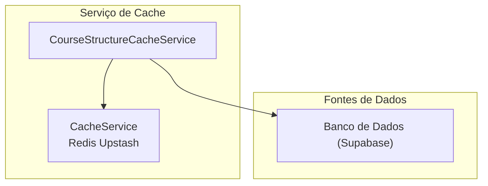
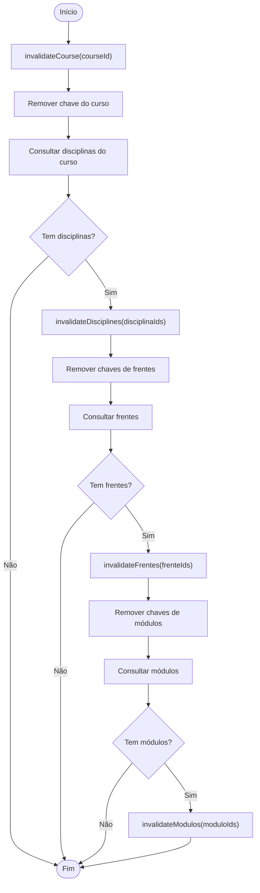
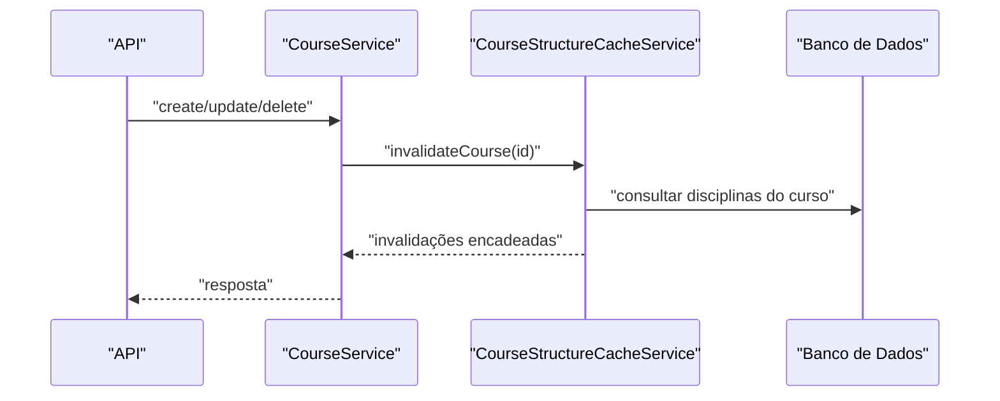
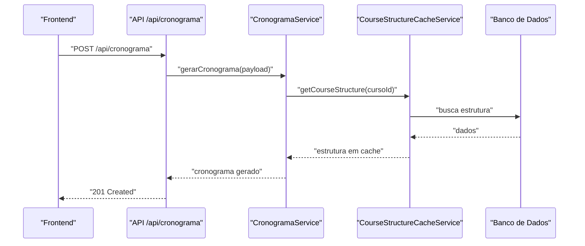

# Cache de Estrutura de Curso

<cite>
**Arquivo referenciados neste documento**
- [course-structure-cache.service.ts](file://backend/services/cache/course-structure-cache.service.ts)
- [cache.service.ts](file://backend/services/cache/cache.service.ts)
- [index.ts](file://backend/services/cache/index.ts)
- [course.service.ts](file://backend/services/course/course.service.ts)
- [discipline.service.ts](file://backend/services/discipline/discipline.service.ts)
- [cronograma.service.ts](file://backend/services/cronograma/cronograma.service.ts)
- [route.ts](file://app/api/cronograma/route.ts)
- [index.ts](file://supabase/functions/gerar-cronograma/index.ts)
- [FLUXO_GERACAO_CRONOGRAMA.md](file://docs/FLUXO_GERACAO_CRONOGRAMA.md)
</cite>

## Sumário
- Apresentação do serviço de cache de estrutura de curso
- Objetivo e escopo do cache
- Métodos principais: getCourseStructure, getDisciplineFrentes, getFrenteModulos, getModuloAulas
- Método de invalidação: invalidateCourse, invalidateDisciplines, invalidateFrentes, invalidateModulos, invalidateAula
- Formato de chave Redis e TTL
- Integração com CourseService e disciplinaService
- Exemplo de uso no fluxo de geração de cronograma
- Impacto no desempenho da Sala de Estudos

## Introdução
O serviço CourseStructureCacheService armazena em cache hierarquias completas de cursos (Cursos → Disciplinas → Frentes → Módulos → Aulas) para evitar consultas repetidas ao banco de dados. Ele utiliza um cache genérico Redis (Upstash) com TTL de 1 hora e oferece métodos para buscar e invalidar as estruturas de forma seletiva, garantindo que as alterações na estrutura sejam refletidas imediatamente.

## Estrutura de Dados e Hierarquia
O cache armazena estruturas aninhadas com os seguintes tipos:

- Curso: identificador e nome
- Disciplina: identificador, nome e lista de frentes
- Frente: identificador, nome e lista de módulos
- Módulo: identificador, nome, número e lista de aulas
- Aula: identificador, nome, número, tempo estimado e prioridade

Essa estrutura permite que o frontend e serviços consumam rapidamente toda a hierarquia de um curso ou partes dela (disciplina, frente, módulo) com baixa latência.

**Seção fonte**
- file://backend/services/cache/course-structure-cache.service.ts#L11-L42

## Arquitetura e Componentes
O serviço de cache de estrutura depende de um serviço genérico de cache Redis (Upstash) e de um cliente de acesso ao banco de dados. Ele expõe métodos públicos para obter estruturas e invalidar chaves associadas a alterações.

**Diagrama fonte**
- [cache.service.ts](file://backend/services/cache/cache.service.ts#L1-L189)
- [course-structure-cache.service.ts](file://backend/services/cache/course-structure-cache.service.ts#L1-L309)

**Seção fonte**
- file://backend/services/cache/cache.service.ts#L1-L189
- file://backend/services/cache/course-structure-cache.service.ts#L1-L309
- file://backend/services/cache/index.ts#L1-L10

## Métodos do CourseStructureCacheService

### Obter estrutura de um curso
- Método público: getCourseStructure(courseId)
- Chave Redis: cache:curso:{courseId}:estrutura
- TTL: 3600 segundos (1 hora)
- Funcionamento: cache-aside com getOrSet

**Seção fonte**
- file://backend/services/cache/course-structure-cache.service.ts#L48-L56

### Obter frentes de uma disciplina
- Método público: getDisciplineFrentes(disciplinaId)
- Chave Redis: cache:disciplina:{disciplinaId}:frentes
- TTL: 3600 segundos (1 hora)

**Seção fonte**
- file://backend/services/cache/course-structure-cache.service.ts#L61-L69

### Obter módulos de uma frente
- Método público: getFrenteModulos(frenteId)
- Chave Redis: cache:frente:{frenteId}:modulos
- TTL: 3600 segundos (1 hora)

**Seção fonte**
- file://backend/services/cache/course-structure-cache.service.ts#L74-L82

### Obter aulas de um módulo
- Método público: getModuloAulas(moduloId)
- Chave Redis: cache:modulo:{moduloId}:aulas
- TTL: 3600 segundos (1 hora)

**Seção fonte**
- file://backend/services/cache/course-structure-cache.service.ts#L87-L95

## Invalidação de Cache

O cache é invalidado manualmente quando há alterações na estrutura. As funções de invalidação seguem a hierarquia e invalidam chaves específicas:

- invalidateCourse(courseId): remove a chave do curso e busca disciplinas associadas para invalidar também
- invalidateDisciplines(disciplinaIds[]): remove chaves de frentes e busca frentes associadas
- invalidateFrentes(frenteIds[]): remove chaves de módulos e busca módulos associados
- invalidateModulos(moduloIds[]): remove chaves de aulas
- invalidateAula(aulaId): remove a chave do módulo associado à aula

**Diagrama fonte**
- [course-structure-cache.service.ts](file://backend/services/cache/course-structure-cache.service.ts#L99-L162)

**Seção fonte**
- file://backend/services/cache/course-structure-cache.service.ts#L99-L162

## Formato de Chave Redis e TTL
- Chaves Redis:
  - cache:curso:{courseId}:estrutura
  - cache:disciplina:{disciplinaId}:frentes
  - cache:frente:{frenteId}:modulos
  - cache:modulo:{moduloId}:aulas
- TTL: 3600 segundos (1 hora)

Essas chaves são usadas pelo método getOrSet do CacheService, que realiza cache-aside.

**Seção fonte**
- file://backend/services/cache/course-structure-cache.service.ts#L48-L56
- file://backend/services/cache/cache.service.ts#L161-L177

## Integração com CourseService e DisciplineService

- CourseService:
  - Após criação, atualização e exclusão de cursos, o serviço invalida o cache de estrutura do curso afetado.
  - Isso garante que as próximas consultas busquem dados atualizados.

- DisciplineService:
  - Após criação, atualização e exclusão de disciplinas, o serviço invalida o cache de frentes da(s) disciplina(s) afetada(s).

**Diagrama fonte**
- [course.service.ts](file://backend/services/course/course.service.ts#L74-L79)
- [course.service.ts](file://backend/services/course/course.service.ts#L156-L161)
- [course.service.ts](file://backend/services/course/course.service.ts#L167-L170)
- [course-structure-cache.service.ts](file://backend/services/cache/course-structure-cache.service.ts#L99-L162)

**Seção fonte**
- file://backend/services/course/course.service.ts#L74-L79
- file://backend/services/course/course.service.ts#L156-L161
- file://backend/services/course/course.service.ts#L167-L170
- file://backend/services/discipline/discipline.service.ts#L35-L38
- file://backend/services/discipline/discipline.service.ts#L55-L58
- file://backend/services/discipline/discipline.service.ts#L70-L73

## Exemplo de Uso no Fluxo de Geração de Cronograma

Embora o fluxo principal de geração de cronograma seja executado em Edge Functions (Supabase), o serviço de cache de estrutura pode ser usado em outros contextos (como backend Next.js) para otimizar consultas de estrutura de cursos.

- No backend Next.js, o serviço de cronograma pode chamar o método getCourseStructure(courseId) para carregar a hierarquia de um curso antes de distribuir as aulas.
- Na API REST, o endpoint POST de cronograma recebe o payload e delega o processamento ao serviço de cronograma.

**Diagrama fonte**
- [route.ts](file://app/api/cronograma/route.ts#L77-L114)
- [cronograma.service.ts](file://backend/services/cronograma/cronograma.service.ts#L51-L1484)
- [course-structure-cache.service.ts](file://backend/services/cache/course-structure-cache.service.ts#L48-L56)

**Seção fonte**
- file://app/api/cronograma/route.ts#L77-L114
- file://backend/services/cronograma/cronograma.service.ts#L51-L1484
- file://docs/FLUXO_GERACAO_CRONOGRAMA.md#L1-L49

## Cenários de Invalidação Após Atualizações

- Criação/Atualização/Exclusão de cursos:
  - O CourseService invalida o cache do curso e encadeia invalidações pelas disciplinas, frentes e módulos associados.
- Criação/Atualização/Exclusão de disciplinas:
  - O DisciplineService invalida o cache de frentes das disciplinas afetadas e encadeia invalidações pelas frentes e módulos associados.
- Criação/Atualização/Exclusão de aulas:
  - O CourseStructureCacheService invalida o cache do módulo associado à aula.

Essas invalidações garantem que as consultas subsequentes busquem dados atualizados, evitando inconsistências.

**Seção fonte**
- file://backend/services/course/course.service.ts#L74-L79
- file://backend/services/course/course.service.ts#L156-L161
- file://backend/services/course/course.service.ts#L167-L170
- file://backend/services/discipline/discipline.service.ts#L35-L38
- file://backend/services/discipline/discipline.service.ts#L55-L58
- file://backend/services/discipline/discipline.service.ts#L70-L73
- file://backend/services/cache/course-structure-cache.service.ts#L164-L178

## Impacto no Desempenho da Sala de Estudos

- Redução de consultas ao banco:
  - Ao usar cache-aside com TTL de 1 hora, o sistema evita múltiplas leituras da hierarquia de cursos, disciplinas, frentes e módulos.
- Melhora de latência:
  - Consultas rápidas ao Redis melhoram a experiência do usuário ao carregar informações da Sala de Estudos.
- Monitoramento de cache:
  - O CacheService registra hits, misses, sets, deletes e erros, permitindo análise de desempenho e ajustes.

**Seção fonte**
- file://backend/services/cache/cache.service.ts#L42-L106
- file://backend/services/cache/cache.service.ts#L108-L178

## Conclusão
O CourseStructureCacheService oferece uma solução eficaz para manter em cache a hierarquia completa de cursos, disciplinas, frentes e módulos com TTL de 1 hora. Ele é integrado ao CourseService e DisciplineService para invalidar automaticamente as chaves quando há alterações, garantindo consistência. Embora o fluxo principal de geração de cronograma ocorra em Edge Functions, o serviço pode ser utilizado em outros contextos do backend para otimizar consultas e melhorar o desempenho da Sala de Estudos.