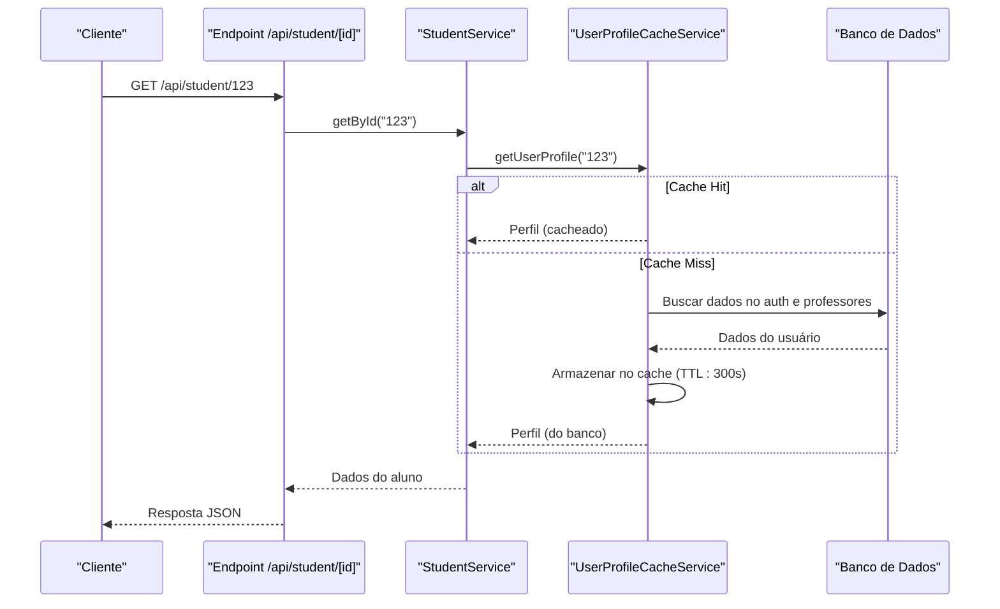

# Cache de Perfil de Usuário

<cite>
**Arquivos Referenciados neste Documento**   
- [user-profile-cache.service.ts](file://backend/services/cache/user-profile-cache.service.ts)
- [cache.service.ts](file://backend/services/cache/cache.service.ts)
- [student.service.ts](file://backend/services/student/student.service.ts)
- [teacher.service.ts](file://backend/services/teacher/teacher.service.ts)
- [route.ts](file://app/api/student/[id]/route.ts)
</cite>

## Sumário
1. [Introdução](#introdução)
2. [Estrutura e Funcionalidade do UserProfileCacheService](#estrutura-e-funcionalidade-do-userprofilecacheservice)
3. [Métodos Principais](#métodos-principais)
4. [Padrão de Chave e TTL](#padrão-de-chave-e-ttl)
5. [Integração com StudentService e TeacherService](#integração-com-studentservice-e-teacherservice)
6. [Exemplo de Uso no Endpoint /api/student/[id]](#exemplo-de-uso-no-endpoint-apisstudentid)
7. [Consistência de Dados e Fallback para Banco de Dados](#consistência-de-dados-e-fallback-para-banco-de-dados)

## Introdução

O serviço `UserProfileCacheService` é responsável por armazenar em cache dados frequentemente acessados de usuários (alunos e professores), como nome, papel (role) e URL do avatar, visando acelerar o carregamento do dashboard e melhorar a performance geral da aplicação. Este documento detalha seu funcionamento, métodos, padrões de chave, tempo de vida (TTL) e integração com outros serviços.

## Estrutura e Funcionalidade do UserProfileCacheService

O `UserProfileCacheService` é uma classe que encapsula a lógica de acesso e armazenamento de perfis de usuário em um cache Redis (Upstash). Ele utiliza o `cacheService` como camada de abstração para operações de cache, garantindo fallback para o banco de dados em caso de cache miss. O serviço é exportado como um singleton (`userProfileCacheService`), permitindo acesso global e consistente.

**Fontes da Seção**
- [user-profile-cache.service.ts](file://backend/services/cache/user-profile-cache.service.ts#L1-L83)

## Métodos Principais

### getProfile (getUserProfile)

O método `getUserProfile` é responsável por obter o perfil de um usuário. Ele utiliza o padrão *cache-aside*, onde primeiro verifica a existência dos dados no cache. Em caso de cache hit, retorna os dados diretamente. Em caso de cache miss, busca os dados no banco de dados, armazena-os no cache com o TTL definido e retorna os dados.

### updateProfile

O serviço não possui um método `updateProfile` explícito. A atualização do perfil é feita indiretamente através da invalidação do cache. Quando um perfil é atualizado nos serviços `StudentService` ou `TeacherService`, eles devem chamar o método `invalidateUserProfile` para garantir que a próxima leitura busque os dados atualizados do banco.

### clear (invalidateUserProfile)

O método `invalidateUserProfile` remove a entrada de cache correspondente a um usuário específico. Isso é crucial para manter a consistência dos dados, garantindo que alterações feitas no banco de dados sejam refletidas nas próximas leituras.

**Fontes da Seção**
- [user-profile-cache.service.ts](file://backend/services/cache/user-profile-cache.service.ts#L23-L38)

## Padrão de Chave e TTL

O padrão de chave utilizado pelo serviço é `cache:user:{id}:perfil`, onde `{id}` é o identificador único do usuário. Esse padrão é claro, específico e evita colisões.

O tempo de vida (TTL) definido para as entradas de cache é de **300 segundos (5 minutos)**, conforme especificado no comentário do código e no parâmetro da função `getOrSet`. Este valor representa um equilíbrio entre performance e atualização de dados.

**Fontes da Seção**
- [user-profile-cache.service.ts](file://backend/services/cache/user-profile-cache.service.ts#L24-L30)

## Integração com StudentService e TeacherService

O `UserProfileCacheService` é consumido indiretamente pelos serviços `StudentService` e `TeacherService`. Quando um perfil de aluno ou professor é atualizado, esses serviços devem chamar `userProfileCacheService.invalidateUserProfile(userId)` para invalidar a entrada de cache. Isso garante que a próxima requisição para obter o perfil do usuário resulte em um cache miss e uma nova leitura do banco de dados, mantendo a consistência.

**Fontes da Seção**
- [user-profile-cache.service.ts](file://backend/services/cache/user-profile-cache.service.ts#L36-L38)
- [student.service.ts](file://backend/services/student/student.service.ts)
- [teacher.service.ts](file://backend/services/teacher/teacher.service.ts)

## Exemplo de Uso no Endpoint /api/student/[id]

O endpoint `GET /api/student/[id]` demonstra o uso indireto do cache de perfil. Ao receber uma requisição, ele chama `studentService.getById(id)`. Embora o código do endpoint não chame diretamente o `UserProfileCacheService`, a obtenção de dados do usuário autenticado (como email e role) durante o processo de serialização ou autenticação pode envolver operações que utilizam o cache de perfil, especialmente se houver uma chamada para `getUserProfile` em algum ponto do fluxo de autenticação ou autorização.

**Fontes do Diagrama**
- [user-profile-cache.service.ts](file://backend/services/cache/user-profile-cache.service.ts#L23-L30)
- [route.ts](file://app/api/student/[id]/route.ts#L52-L58)

**Fontes da Seção**
- [route.ts](file://app/api/student/[id]/route.ts#L52-L58)

## Consistência de Dados e Fallback para Banco de Dados

A consistência dos dados é mantida principalmente através da invalidação do cache (`invalidateUserProfile`) após atualizações. O mecanismo de fallback é garantido pelo método `getOrSet` do `cacheService`. Se o dado não estiver presente no cache (cache miss), o serviço executa a função fornecida (`fetchUserProfileFromDB`) para buscar os dados diretamente do banco de dados, armazena-os no cache e os retorna. Isso assegura que a aplicação sempre tenha acesso aos dados mais recentes, mesmo em caso de falha no cache.

**Fontes da Seção**
- [user-profile-cache.service.ts](file://backend/services/cache/user-profile-cache.service.ts#L26-L30)
- [cache.service.ts](file://backend/services/cache/cache.service.ts#L166-L176)