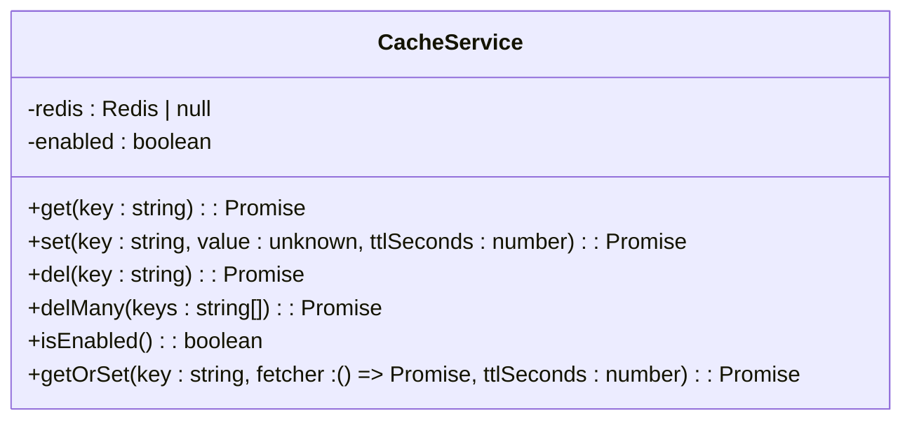
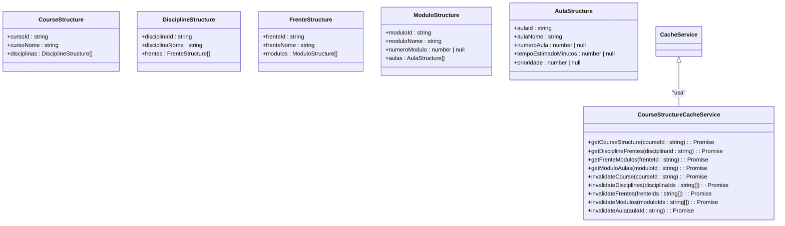
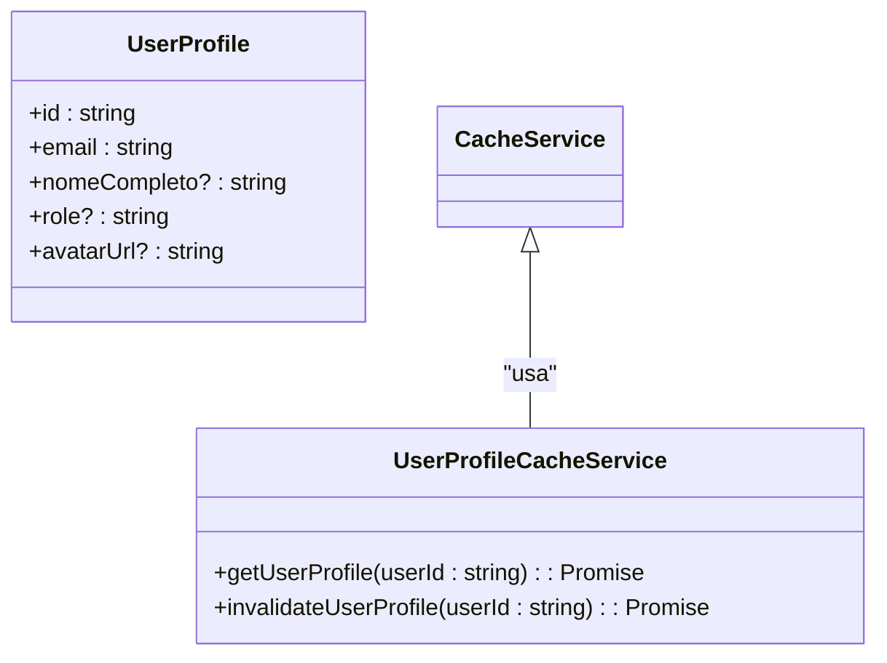
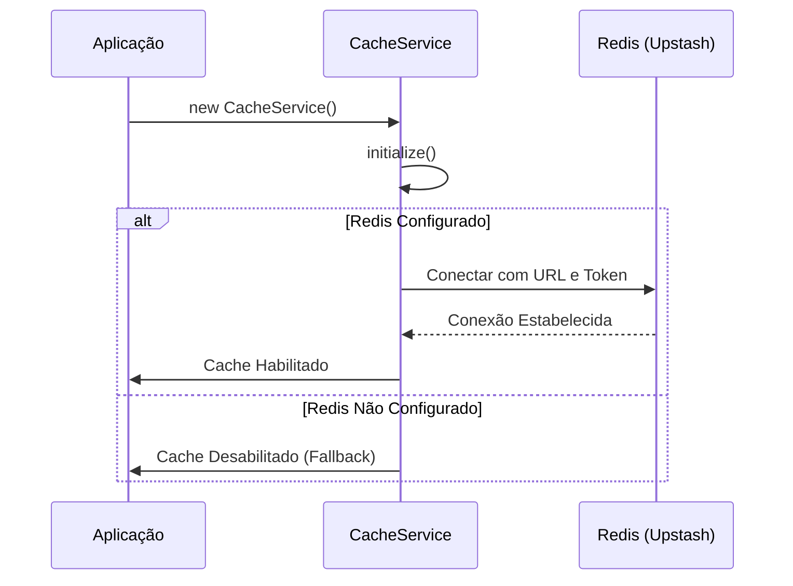

# Integração com Cache Distribuído (Redis)

<cite>
**Arquivos Referenciados neste Documento**   
- [cache.service.ts](file://backend/services/cache/cache.service.ts)
- [course-structure-cache.service.ts](file://backend/services/cache/course-structure-cache.service.ts)
- [user-profile-cache.service.ts](file://backend/services/cache/user-profile-cache.service.ts)
- [activity-cache.service.ts](file://backend/services/cache/activity-cache.service.ts)
- [cache-monitor.service.ts](file://backend/services/cache/cache-monitor.service.ts)
- [response-store.ts](file://backend/services/cache/response-store.ts)
- [IMPLEMENTACAO_CACHE_COMPLETA.md](file://docs/IMPLEMENTACAO_CACHE_COMPLETA.md)
- [CHECKLIST_CACHE_IMPLEMENTACAO.md](file://docs/CHECKLIST_CACHE_IMPLEMENTACAO.md)
- [OPORTUNIDADES_CACHE_REDIS.md](file://docs/OPORTUNIDADES_CACHE_REDIS.md)
</cite>

## Sumário
1. [Introdução](#introdução)
2. [Objetivo do Cache](#objetivo-do-cache)
3. [Serviços de Cache Principais](#serviços-de-cache-principais)
4. [Padrões de Chave e TTLs](#padrões-de-chave-e-ttls)
5. [Estratégias de Inicialização e Uso](#estratégias-de-inicialização-e-uso)
6. [Monitoramento e Fallback](#monitoramento-e-fallback)
7. [Métricas de Desempenho](#métricas-de-desempenho)
8. [Conclusão](#conclusão)

## Introdução

Este documento detalha a arquitetura de integração com o cache distribuído Redis (Upstash) no sistema Área do Aluno. A implementação tem como objetivo otimizar o desempenho de estruturas de cursos, perfis de usuário e dados frequentemente acessados, reduzindo significativamente a latência e o número de consultas ao banco de dados. O sistema utiliza um serviço genérico de cache com fallback gracioso e monitoramento integrado.

**Section sources**
- [IMPLEMENTACAO_CACHE_COMPLETA.md](file://docs/IMPLEMENTACAO_CACHE_COMPLETA.md#L1-L187)
- [OPORTUNIDADES_CACHE_REDIS.md](file://docs/OPORTUNIDADES_CACHE_REDIS.md#L1-L471)

## Objetivo do Cache

O cache distribuído foi implementado para otimizar o desempenho de dados frequentemente acessados e que mudam raramente. Os principais objetivos incluem:

- **Redução de latência**: Acesso a dados em milissegundos ao invés de centenas de milissegundos.
- **Redução de consultas ao banco**: Minimização de operações no Supabase, especialmente em queries complexas com múltiplos JOINs.
- **Melhoria da experiência do usuário**: Carregamento mais rápido de páginas como Sala de Estudos, Cronograma e Biblioteca.
- **Escalabilidade**: Suporte a maior número de usuários simultâneos sem degradação de performance.

Os dados priorizados para cache incluem estruturas hierárquicas de cursos, perfis de usuário, materiais de curso, flashcards e metadados de conversas.

**Section sources**
- [OPORTUNIDADES_CACHE_REDIS.md](file://docs/OPORTUNIDADES_CACHE_REDIS.md#L5-L471)
- [IMPLEMENTACAO_CACHE_COMPLETA.md](file://docs/IMPLEMENTACAO_CACHE_COMPLETA.md#L1-L187)

## Serviços de Cache Principais

### CacheService (Genérico)

O `CacheService` é o serviço base que fornece uma interface simples para operações de cache usando Redis (Upstash). Ele suporta fallback gracioso quando o Redis não está configurado, garantindo que o sistema funcione mesmo sem cache.



**Diagram sources**
- [cache.service.ts](file://backend/services/cache/cache.service.ts#L10-L189)

**Section sources**
- [cache.service.ts](file://backend/services/cache/cache.service.ts#L1-L189)

### CourseStructureCacheService (Específico para Hierarquia Educacional)

Este serviço gerencia o cache da estrutura hierárquica: Cursos → Disciplinas → Frentes → Módulos → Aulas. Utiliza invalidação em cascata para garantir consistência quando estruturas mudam.



**Diagram sources**
- [course-structure-cache.service.ts](file://backend/services/cache/course-structure-cache.service.ts#L44-L310)

**Section sources**
- [course-structure-cache.service.ts](file://backend/services/cache/course-structure-cache.service.ts#L1-L310)

### UserProfileCacheService

Este serviço gerencia o cache de dados de perfil de usuário, como nome, role e avatar. Os dados são atualizados a cada 5 minutos.



**Diagram sources**
- [user-profile-cache.service.ts](file://backend/services/cache/user-profile-cache.service.ts#L19-L76)

**Section sources**
- [user-profile-cache.service.ts](file://backend/services/cache/user-profile-cache.service.ts#L1-L84)

## Padrões de Chave e TTLs

### Estrutura de Chaves Redis

As chaves seguem um padrão claro e hierárquico para facilitar a identificação e invalidação:

```
# Estrutura Hierárquica
cache:curso:{cursoId}:estrutura          # TTL: 1h
cache:disciplina:{disciplinaId}:frentes  # TTL: 1h
cache:frente:{frenteId}:modulos           # TTL: 1h
cache:modulo:{moduloId}:aulas             # TTL: 1h

# Materiais
cache:curso:{cursoId}:materiais           # TTL: 30min

# Flashcards
cache:flashcards:disciplina:{disciplinaId}:page:{page}:limit:{limit}:order:{orderBy}:{orderDirection}  # TTL: 15min

# Atividades
cache:modulo:{moduloId}:atividades        # TTL: 30min

# Usuário
cache:user:{userId}:perfil                # TTL: 5min
cache:user:{userId}:conversas             # TTL: 5min
```

### TTLs (Time to Live)

- **Estrutura Hierárquica**: 1 hora (3600 segundos)
- **Materiais de Curso**: 30 minutos (1800 segundos)
- **Flashcards**: 15 minutos (900 segundos)
- **Atividades**: 30 minutos (1800 segundos)
- **Perfil de Usuário**: 5 minutos (300 segundos)

**Section sources**
- [IMPLEMENTACAO_CACHE_COMPLETA.md](file://docs/IMPLEMENTACAO_CACHE_COMPLETA.md#L67-L93)
- [OPORTUNIDADES_CACHE_REDIS.md](file://docs/OPORTUNIDADES_CACHE_REDIS.md#L218-L248)

## Estratégias de Inicialização e Uso

### Inicialização no Servidor

O cache é inicializado automaticamente quando o serviço é instanciado, verificando as variáveis de ambiente `UPSTASH_REDIS_REST_URL` e `UPSTASH_REDIS_REST_TOKEN`. Se não configuradas, o sistema opera sem cache (fallback gracioso).



**Diagram sources**
- [cache.service.ts](file://backend/services/cache/cache.service.ts#L18-L40)

**Section sources**
- [cache.service.ts](file://backend/services/cache/cache.service.ts#L1-L189)

### Exemplos de Uso (get/set)

```typescript
// Obter estrutura de curso (com cache)
const structure = await courseStructureCacheService.getCourseStructure('123');

// Armazenar perfil de usuário
await userProfileCacheService.getUserProfile('user-456');

// Invalidar cache de curso
await courseStructureCacheService.invalidateCourse('123');
```

**Section sources**
- [course-structure-cache.service.ts](file://backend/services/cache/course-structure-cache.service.ts#L48-L56)
- [user-profile-cache.service.ts](file://backend/services/cache/user-profile-cache.service.ts#L23-L31)

## Monitoramento e Fallback

### CacheMonitorService

O sistema inclui um monitoramento integrado que rastreia hits, misses, sets, deletes e erros, calculando automaticamente a taxa de acerto (hit rate).

```mermaid
classDiagram
class CacheMonitorService {
-stats : CacheStats
+recordHit() : void
+recordMiss() : void
+recordSet() : void
+recordDel() : void
+recordError() : void
+getStats() : CacheStats & { hitRate : number; totalOperations : number }
+reset() : void
+logStats() : void
}
class CacheStats {
+hits : number
+misses : number
+sets : number
+dels : number
+errors : number
}
```

**Diagram sources**
- [cache-monitor.service.ts](file://backend/services/cache/cache-monitor.service.ts#L15-L106)

**Section sources**
- [cache-monitor.service.ts](file://backend/services/cache/cache-monitor.service.ts#L1-L114)

### Estratégias de Fallback

- **Redis não configurado**: Todas as operações de cache retornam `null`, e o sistema busca diretamente do banco.
- **Erro de conexão**: O sistema continua funcionando, registrando erros mas não interrompendo operações.
- **Fallback para memória**: Em ambientes locais, o `response-store` usa um Map em memória como fallback.

**Section sources**
- [cache.service.ts](file://backend/services/cache/cache.service.ts#L22-L39)
- [response-store.ts](file://backend/services/cache/response-store.ts#L30-L58)

## Métricas de Desempenho

### Redução de Queries

| Área | Redução Estimada |
|------|------------------|
| Estrutura Hierárquica | 80-100% |
| Materiais | 100% |
| Flashcards | 50-100% |
| Atividades | 50-66% |
| Conversas | 100% |
| Sessões | 90% |

### Melhoria de Performance

| Área | Tempo Antes | Tempo Depois | Melhoria |
|------|-------------|--------------|----------|
| Estrutura Hierárquica | 200-500ms | <10ms | 95-98% |
| Materiais | 100-200ms | <5ms | 95-97% |
| Flashcards | 150-300ms | <10ms | 93-97% |
| Atividades | 200-400ms | 50-100ms | 50-75% |
| Conversas | 100-200ms | <5ms | 95-97% |

**Section sources**
- [IMPLEMENTACAO_CACHE_COMPLETA.md](file://docs/IMPLEMENTACAO_CACHE_COMPLETA.md#L130-L146)

## Conclusão

A integração com o cache distribuído Redis (Upstash) traz benefícios significativos de performance e escalabilidade ao sistema Área do Aluno. A arquitetura implementada é robusta, com fallback gracioso, monitoramento integrado e estratégias de invalidação inteligente. As métricas esperadas indicam reduções substanciais de latência e consultas ao banco, melhorando diretamente a experiência do usuário.

**Section sources**
- [IMPLEMENTACAO_CACHE_COMPLETA.md](file://docs/IMPLEMENTACAO_CACHE_COMPLETA.md#L71-L187)
- [CHECKLIST_CACHE_IMPLEMENTACAO.md](file://docs/CHECKLIST_CACHE_IMPLEMENTACAO.md#L56-L75)