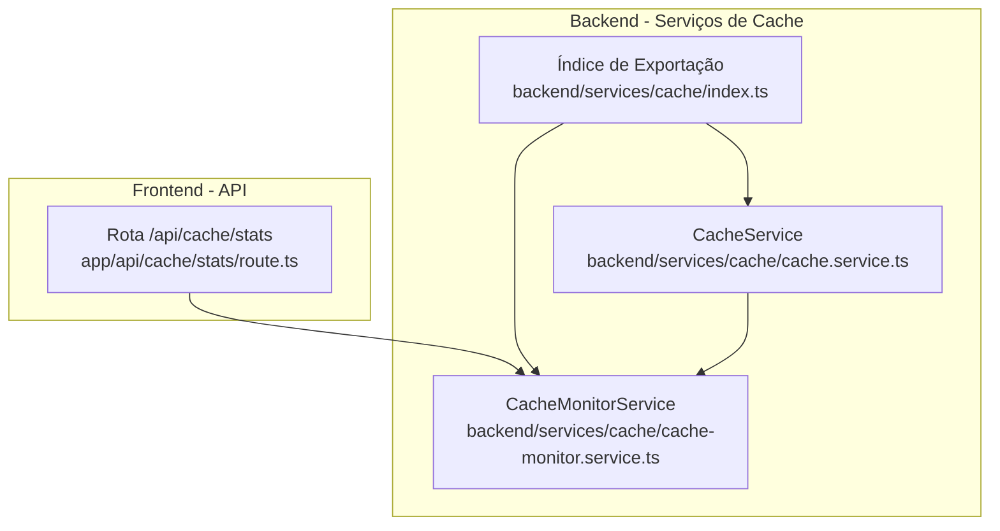
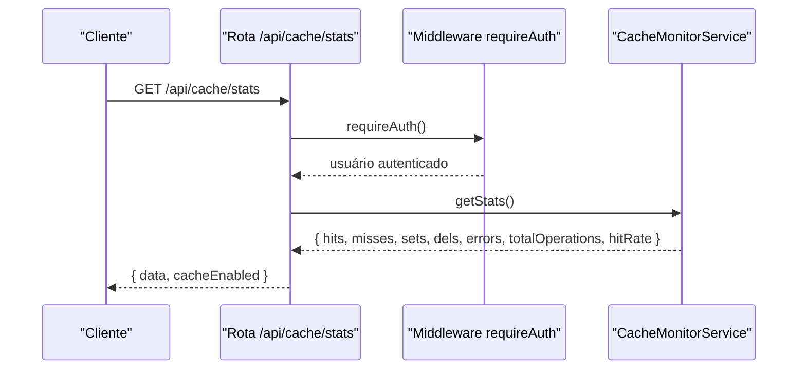
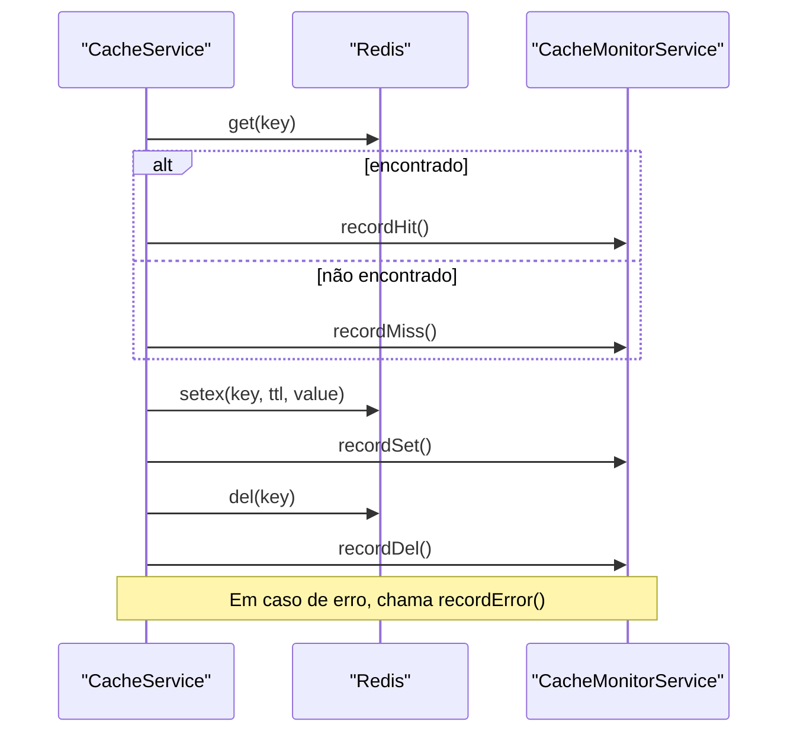

# Monitoramento e Estatísticas de Cache

<cite>
**Arquivos Referenciados neste Documento**
- [cache-monitor.service.ts](file://backend/services/cache/cache-monitor.service.ts)
- [cache.service.ts](file://backend/services/cache/cache.service.ts)
- [route.ts](file://app/api/cache/stats/route.ts)
- [index.ts](file://backend/services/cache/index.ts)
- [CHECKLIST_CACHE_IMPLEMENTACAO.md](file://docs/CHECKLIST_CACHE_IMPLEMENTACAO.md)
</cite>

## Sumário
Este documento apresenta o CacheMonitorService, responsável por coletar métricas de desempenho do cache (hits, misses, sets, deletes, erros) e expor estatísticas via endpoint /api/cache/stats. Ele detalha os métodos recordHit, recordMiss, recordSet, recordDel, recordError e getStats, mostra como o CacheService integra-se com o monitoramento e como essas métricas ajudam a identificar gargalos e ajustar TTLs, promovendo manutenção proativa do sistema.

## Introdução
O CacheMonitorService é um componente central do sistema de cache que registra eventos de operações de leitura, escrita, exclusão e erros no cache. Ele calcula taxas de acerto (hit rate) e fornece um conjunto de métricas que podem ser expostas ao dashboard de administração. Essas informações são fundamentais para otimizar o desempenho do sistema, detectar gargalos e tomar decisões informadas sobre TTLs e estratégias de invalidação.

## Estrutura do Projeto Relacionada
O monitoramento está localizado no backend, dentro do pacote de serviços de cache. Ele é consumido pela rota de API que expõe as estatísticas somente para superadmins.

**Diagrama fonte**
- [cache-monitor.service.ts](file://backend/services/cache/cache-monitor.service.ts#L1-L116)
- [cache.service.ts](file://backend/services/cache/cache.service.ts#L1-L191)
- [route.ts](file://app/api/cache/stats/route.ts#L1-L42)
- [index.ts](file://backend/services/cache/index.ts#L1-L11)

**Seção fonte**
- [cache-monitor.service.ts](file://backend/services/cache/cache-monitor.service.ts#L1-L116)
- [cache.service.ts](file://backend/services/cache/cache.service.ts#L1-L191)
- [route.ts](file://app/api/cache/stats/route.ts#L1-L42)
- [index.ts](file://backend/services/cache/index.ts#L1-L11)

## Componentes-Chave

### CacheMonitorService
Responsável pelo registro de eventos e cálculo de métricas.

- Propriedades:
  - hits: número de acertos
  - misses: número de falhas
  - sets: número de inserções
  - dels: número de exclusões
  - errors: número de erros

- Métodos:
  - recordHit(): incrementa hits
  - recordMiss(): incrementa misses
  - recordSet(): incrementa sets
  - recordDel(): incrementa dels
  - recordError(): incrementa errors
  - getStats(): retorna hits, misses, sets, dels, errors, totalOperations e hitRate
  - reset(): reinicia contadores
  - logStats(): imprime estatísticas no console

**Seção fonte**
- [cache-monitor.service.ts](file://backend/services/cache/cache-monitor.service.ts#L1-L116)

### CacheService
Serviço principal de cache que interage com Redis e dispara eventos para o monitor.

- Operações:
  - get(key): lê do cache, registra hit/miss/erro
  - set(key, value, ttlSeconds): insere com TTL, registra set/erro
  - del(key): remove chave, registra del/erro
  - delMany(keys): remove múltiplas chaves
  - getOrSet(key, fetcher, ttlSeconds): padrão cache-aside

- Integração com CacheMonitorService:
  - Em cada operação bem-sucedida, o CacheService chama os métodos correspondentes do CacheMonitorService (recordHit, recordMiss, recordSet, recordDel).
  - Em caso de erro, chama recordError.

**Seção fonte**
- [cache.service.ts](file://backend/services/cache/cache.service.ts#L1-L191)

### Endpoint /api/cache/stats
Expõe as métricas de cache via API somente para superadmins.

- Requisição:
  - Método: GET
  - Autenticação: requireAuth
  - Permissão: somente superadmin

- Resposta:
  - data: objeto com hits, misses, sets, dels, errors, totalOperations e hitRate
  - cacheEnabled: booleano indicando se houve operações registradas

- Exceções:
  - 403: acesso negado se o usuário não for superadmin
  - 500: erro interno

**Seção fonte**
- [route.ts](file://app/api/cache/stats/route.ts#L1-L42)

## Fluxo de Coleta de Métricas

**Diagrama fonte**
- [route.ts](file://app/api/cache/stats/route.ts#L1-L42)
- [cache-monitor.service.ts](file://backend/services/cache/cache-monitor.service.ts#L61-L72)

## Integração com CacheService

**Diagrama fonte**
- [cache.service.ts](file://backend/services/cache/cache.service.ts#L45-L132)
- [cache-monitor.service.ts](file://backend/services/cache/cache-monitor.service.ts#L24-L57)

## Uso das Métricas para Identificação de Gargalos e Ajuste de TTLs

- Taxa de Acerto (hitRate):
  - Valores altos indicam bom aproveitamento do cache.
  - Valores baixos sugerem necessidade de revisar estratégias de cache, TTLs e invalidações.

- Total de Operações:
  - Indicador de volume de acesso ao cache. Se crescente, pode ser necessário ajustar TTLs e revisar políticas de invalidação.

- Sets e Dels:
  - Alta frequência de sets pode indicar TTLs muito curtos, forçando recargas frequentes.
  - Alta frequência de dels pode indicar invalidações muito agressivas.

- Erros:
  - Persistência de erros pode apontar problemas de conectividade com Redis, configuração inválida ou sobrecarga.

- Ajustes práticos:
  - Aumentar TTLs para dados estáticos e com alta taxa de acerto.
  - Reduzir TTLs para dados sensíveis a mudanças frequentes.
  - Revisar estratégias de invalidação para evitar misses constantes.
  - Monitorar hits e misses ao longo do tempo para detectar picos e padrões sazonais.

[Sem fonte, pois esta seção apresenta orientações gerais baseadas nas métricas descritas]

## Exemplo de Integração com CacheService

Para integrar o CacheMonitorService com o CacheService, basta chamar os métodos de registro em cada operação bem-sucedida ou com erro, conforme implementado no CacheService. O CacheMonitorService é exportado pelo índice de cache e pode ser importado diretamente nos locais onde o CacheService opera.

- Importação e uso:
  - O CacheService importa dinamicamente o CacheMonitorService apenas no servidor e chama os métodos apropriados após operações de cache.
  - O endpoint /api/cache/stats consome o CacheMonitorService.getStats() para retornar as métricas.

**Seção fonte**
- [cache.service.ts](file://backend/services/cache/cache.service.ts#L45-L132)
- [index.ts](file://backend/services/cache/index.ts#L1-L11)
- [route.ts](file://app/api/cache/stats/route.ts#L1-L42)

## Melhores Práticas e Manutenção Proativa

- Configuração de ambiente:
  - Certifique-se de que as variáveis de ambiente do Redis estejam corretamente configuradas para habilitar o cache.
  - A falta de configuração faz com que o CacheService funcione sem cache, mas ainda assim registre erros no monitor.

- Monitoramento contínuo:
  - Utilize o endpoint /api/cache/stats periodicamente no dashboard de administração.
  - Registre logs com logStats() durante depurações para análise detalhada.

- Documentação de implementação:
  - A checklist de implementação de cache confirma que o monitoramento está completo e integrado.

**Seção fonte**
- [cache.service.ts](file://backend/services/cache/cache.service.ts#L18-L39)
- [CHECKLIST_CACHE_IMPLEMENTACAO.md](file://docs/CHECKLIST_CACHE_IMPLEMENTACAO.md#L1-L42)

## Conclusão
O CacheMonitorService oferece uma base sólida para monitorar o desempenho do cache, com métricas claras e fáceis de interpretar. Integrado ao CacheService e exposto via endpoint protegido, ele permite uma manutenção proativa, ajudando a identificar gargalos e otimizar TTLs e estratégias de cache com base em dados concretos.

[Sem fonte, pois esta seção resume informações anteriores]