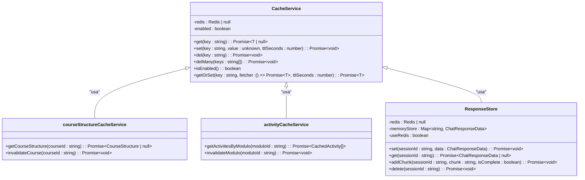
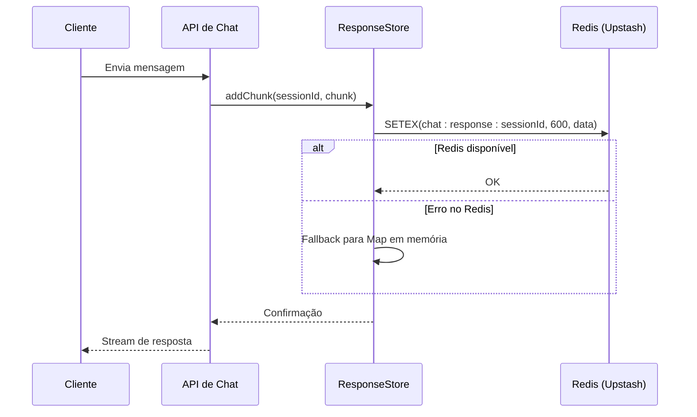
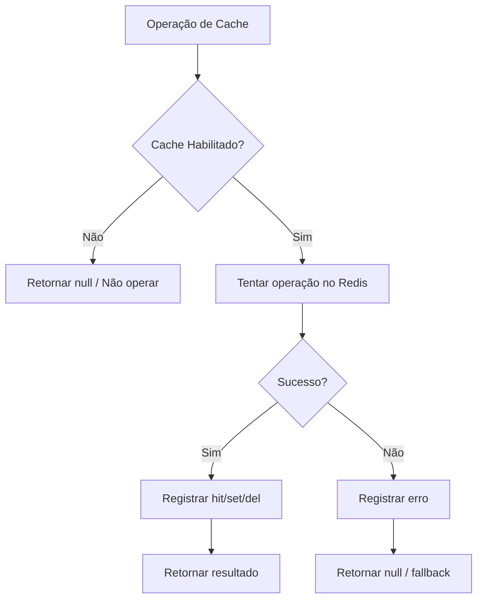

# Serviço Genérico de Cache

<cite>
**Arquivos Referenciados neste Documento**  
- [cache.service.ts](file://backend/services/cache/cache.service.ts)
- [response-store.ts](file://backend/services/cache/response-store.ts)
- [server.ts](file://lib/server.ts)
- [cache-monitor.service.ts](file://backend/services/cache/cache-monitor.service.ts)
- [course-structure-cache.service.ts](file://backend/services/cache/course-structure-cache.service.ts)
- [activity-cache.service.ts](file://backend/services/cache/activity-cache.service.ts)
- [chat/route.ts](file://app/api/chat/route.ts)
- [cache/stats/route.ts](file://app/api/cache/stats/route.ts)
</cite>

## Sumário
1. [Introdução](#introdução)
2. [Arquitetura e Função do CacheService](#arquitetura-e-função-do-cacheservice)
3. [Métodos Principais do CacheService](#métodos-principais-do-cacheservice)
4. [Configuração de Conexão no server.ts](#configuração-de-conexão-no-serverts)
5. [Uso do ResponseStore para Serialização](#uso-do-responsestore-para-serialização)
6. [Tratamento de Erros e Monitoramento](#tratamento-de-erros-e-monitoramento)
7. [Exemplo de Uso: Armazenamento de Resposta de API](#exemplo-de-uso-armazenamento-de-resposta-de-api)
8. [Estratégias de Retry, Timeouts e Falhas de Conexão](#estratégias-de-retry-timeouts-e-falhas-de-conexão)
9. [Conclusão](#conclusão)

## Introdução

O serviço de cache é um componente central na otimização de desempenho e escalabilidade do sistema. Ele atua como uma camada de abstração genérica sobre o Upstash Redis, permitindo que diversos serviços especializados armazenem e recuperem dados de forma eficiente. Este documento detalha a arquitetura, funcionalidades e padrões de uso do `CacheService`, com foco em sua integração com outros serviços, estratégias de serialização, tratamento de erros e monitoramento.

**Seção fontes**  
- [cache.service.ts](file://backend/services/cache/cache.service.ts#L1-L189)
- [response-store.ts](file://backend/services/cache/response-store.ts#L1-L233)

## Arquitetura e Função do CacheService

O `CacheService` é implementado como uma classe singleton que encapsula a lógica de conexão e operações com o Redis via Upstash. Ele fornece uma interface simples e segura para operações de cache, com fallback automático quando o Redis não está configurado. O serviço é projetado para ser consumido por outros serviços especializados, como `courseStructureCacheService`, `activityCacheService` e `userProfileCacheService`, que utilizam o `CacheService` como base para suas operações de cache específicas.

A inicialização do serviço ocorre no construtor, onde ele verifica a presença das variáveis de ambiente `UPSTASH_REDIS_REST_URL` e `UPSTASH_REDIS_REST_TOKEN`. Caso estas estejam presentes, uma conexão com o Redis é estabelecida. Em caso de falha ou ausência das variáveis, o cache é desabilitado de forma graciosa, permitindo que o sistema continue funcionando sem cache, embora com desempenho potencialmente reduzido.



**Fontes do diagrama**  
- [cache.service.ts](file://backend/services/cache/cache.service.ts#L10-L189)
- [response-store.ts](file://backend/services/cache/response-store.ts#L20-L232)
- [course-structure-cache.service.ts](file://backend/services/cache/course-structure-cache.service.ts#L44-L179)
- [activity-cache.service.ts](file://backend/services/cache/activity-cache.service.ts#L39-L67)

**Seção fontes**  
- [cache.service.ts](file://backend/services/cache/cache.service.ts#L1-L189)
- [index.ts](file://backend/services/cache/index.ts#L1-L11)

## Métodos Principais do CacheService

O `CacheService` oferece uma API completa para operações de cache, incluindo leitura, escrita, exclusão e recuperação com fallback. Os métodos principais são:

- **get(key: string)**: Recupera um valor do cache. Retorna `null` se a chave não existir ou se o cache estiver desabilitado.
- **set(key: string, value: unknown, ttlSeconds: number)**: Armazena um valor no cache com um tempo de vida (TTL) especificado em segundos. O padrão é 3600 segundos (1 hora).
- **del(key: string)**: Remove uma chave específica do cache.
- **delMany(keys: string[])**: Remove múltiplas chaves do cache em uma única operação.
- **getOrSet(key: string, fetcher: () => Promise~T~, ttlSeconds: number)**: Implementa o padrão *cache-aside*. Tenta recuperar do cache; se não existir, executa a função `fetcher` para obter os dados, armazena no cache e retorna o valor.

Esses métodos são utilizados por serviços especializados para otimizar o acesso a dados frequentemente consultados, como estruturas de cursos, atividades e perfis de usuários.

**Seção fontes**  
- [cache.service.ts](file://backend/services/cache/cache.service.ts#L45-L177)

## Configuração de Conexão no server.ts

Embora o `CacheService` seja responsável pela conexão com o Redis, a configuração do ambiente é feita através das variáveis de ambiente no sistema. O arquivo `server.ts` não contém a lógica de conexão com o cache, mas sim com o Supabase, demonstrando a separação de responsabilidades entre serviços. A configuração do Redis é centralizada no `CacheService`, que lê as variáveis de ambiente `UPSTASH_REDIS_REST_URL` e `UPSTASH_REDIS_REST_TOKEN` durante a inicialização.

A ausência dessas variáveis resulta em um fallback seguro, onde o sistema opera sem cache, registrando avisos no console para alertar sobre a desativação do cache. Isso garante que o sistema permaneça funcional mesmo em ambientes de desenvolvimento ou quando o Redis não está disponível.

**Seção fontes**  
- [server.ts](file://lib/server.ts#L1-L34)
- [cache.service.ts](file://backend/services/cache/cache.service.ts#L18-L39)

## Uso do ResponseStore para Serialização

O `ResponseStore` é um serviço especializado que gerencia o armazenamento temporário de respostas do chat, utilizando o `CacheService` como camada de persistência. Ele suporta tanto o Redis quanto um `Map` em memória como fallback, sendo crucial para a funcionalidade de streaming de respostas do agente de chat.

O `ResponseStore` serializa dados do tipo `ChatResponseData`, que inclui chunks de texto, status de conclusão e timestamp. Ele utiliza chaves no formato `chat:response:${sessionId}` para armazenar respostas associadas a uma sessão específica. Em ambientes serverless, o uso do Redis é essencial, pois o `Map` em memória não é compartilhado entre instâncias.



**Fontes do diagrama**  
- [response-store.ts](file://backend/services/cache/response-store.ts#L64-L81)
- [chat/route.ts](file://app/api/chat/route.ts#L192-L197)

**Seção fontes**  
- [response-store.ts](file://backend/services/cache/response-store.ts#L1-L233)

## Tratamento de Erros e Monitoramento

O `CacheService` implementa um tratamento robusto de erros, registrando mensagens detalhadas no console em caso de falhas nas operações de leitura, escrita ou exclusão. Além disso, ele integra-se com o `cacheMonitorService` para rastrear métricas como hits, misses, sets, deletes e erros, permitindo o monitoramento do desempenho do cache em tempo real.

O `cacheMonitorService` coleta estatísticas que podem ser acessadas via API em `/api/cache/stats`, disponível apenas para usuários com papel de superadmin. Isso permite uma análise detalhada da eficácia do cache, ajudando a identificar padrões de acesso e otimizar o uso de recursos.



**Fontes do diagrama**  
- [cache.service.ts](file://backend/services/cache/cache.service.ts#L46-L76)
- [cache-monitor.service.ts](file://backend/services/cache/cache-monitor.service.ts#L27-L57)

**Seção fontes**  
- [cache.service.ts](file://backend/services/cache/cache.service.ts#L68-L76)
- [cache-monitor.service.ts](file://backend/services/cache/cache-monitor.service.ts#L1-L114)
- [cache/stats/route.ts](file://app/api/cache/stats/route.ts#L1-L40)

## Exemplo de Uso: Armazenamento de Resposta de API

Um exemplo prático do uso do `CacheService` é o armazenamento da estrutura de um curso. Ao invés de consultar o banco de dados em cada requisição, o sistema primeiro verifica o cache. Se a estrutura estiver presente (hit), ela é retornada imediatamente. Caso contrário (miss), a estrutura é buscada no banco, armazenada no cache com um TTL de 3600 segundos e então retornada.

```typescript
// Exemplo de uso do getOrSet
const cacheKey = `cache:curso:${courseId}:estrutura`;
const structure = await cacheService.getOrSet(
  cacheKey,
  () => fetchFromDatabase(courseId),
  3600
);
```

Este padrão reduz significativamente a carga no banco de dados e melhora o tempo de resposta da API.

**Seção fontes**  
- [course-structure-cache.service.ts](file://backend/services/cache/course-structure-cache.service.ts#L50-L55)

## Estratégias de Retry, Timeouts e Falhas de Conexão

O `CacheService` não implementa retry automático ou timeouts explícitos, confiando na biblioteca `@upstash/redis` para lidar com esses aspectos. Em caso de falha na conexão com o Redis, o serviço registra o erro e retorna `null`, permitindo que a aplicação continue com o fluxo de fallback. Essa abordagem garante resiliência, evitando que falhas no cache derrubem o sistema.

A ausência de retry é uma escolha de design para manter a simplicidade e evitar atrasos indesejados nas respostas. O foco está em fornecer um fallback gracioso, onde a ausência de cache não compromete a funcionalidade principal da aplicação.

**Seção fontes**  
- [cache.service.ts](file://backend/services/cache/cache.service.ts#L24-L34)
- [response-store.ts](file://backend/services/cache/response-store.ts#L36-L47)

## Conclusão

O `CacheService` é uma peça fundamental na arquitetura do sistema, proporcionando uma camada de abstração eficiente e resiliente sobre o Upstash Redis. Sua integração com serviços especializados, como o `ResponseStore`, demonstra sua versatilidade e importância para o desempenho e escalabilidade da aplicação. O tratamento de erros robusto e o monitoramento integrado garantem que o cache seja uma ferramenta confiável e observável, essencial para a operação em produção.